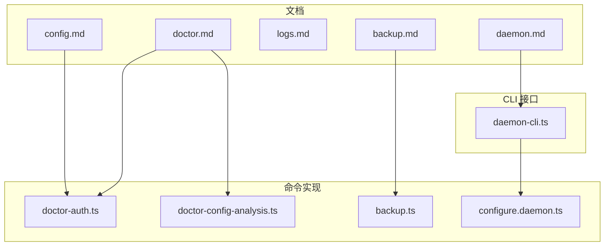
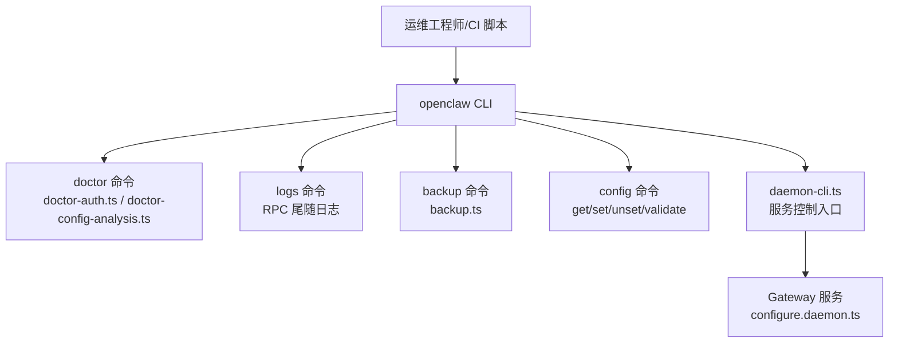
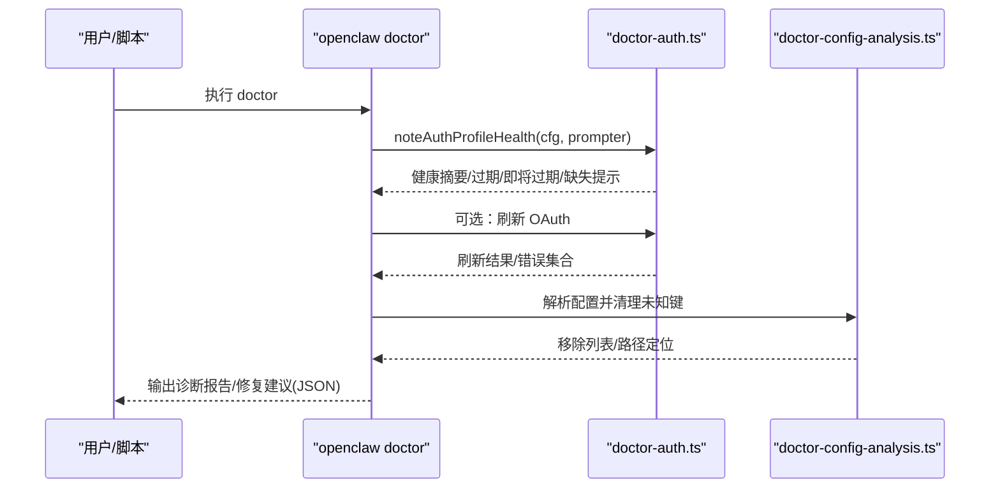
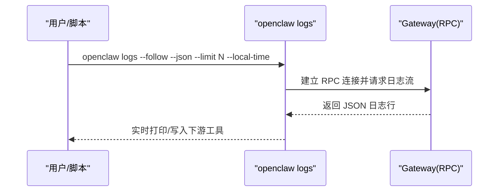
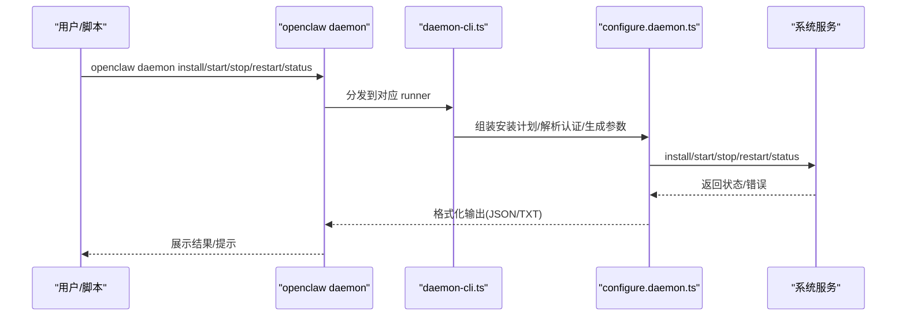
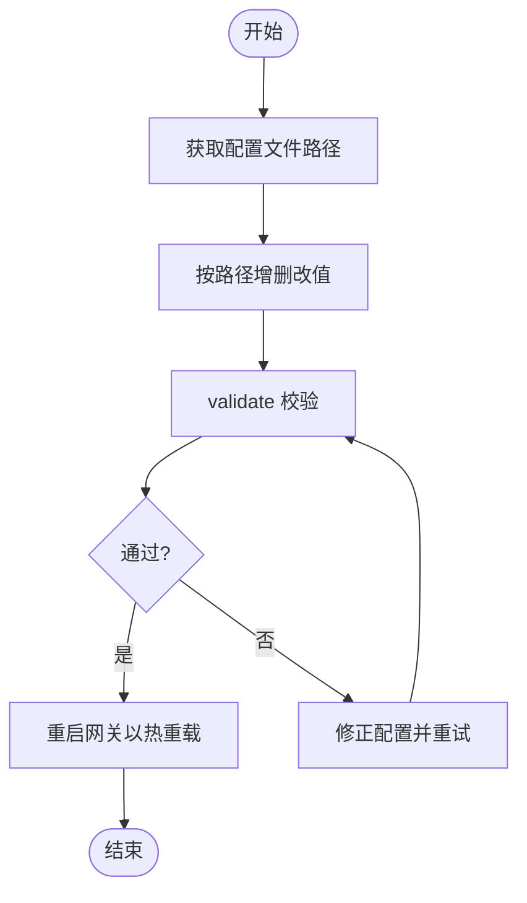
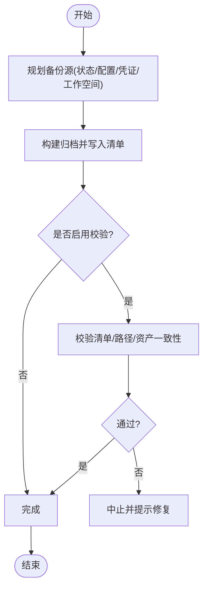
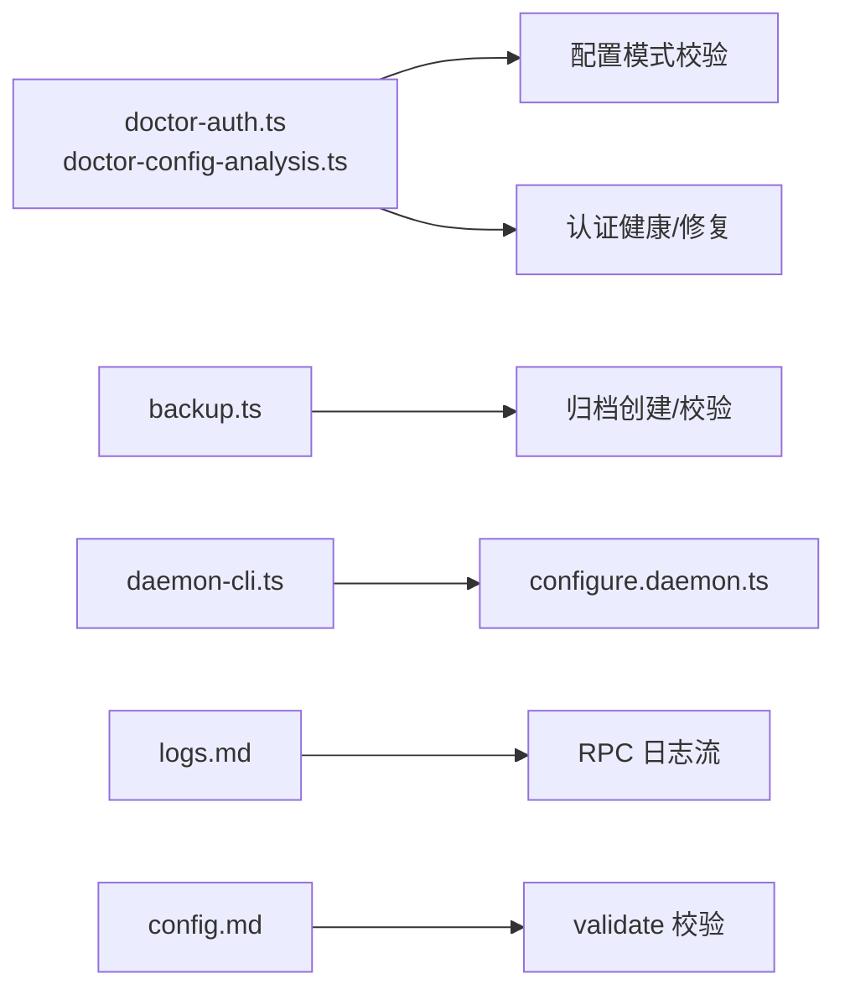

# 运维工具

<cite>
**本文引用的文件**
- [docs/cli/doctor.md](file://docs/cli/doctor.md)
- [docs/cli/daemon.md](file://docs/cli/daemon.md)
- [docs/cli/logs.md](file://docs/cli/logs.md)
- [docs/cli/backup.md](file://docs/cli/backup.md)
- [docs/cli/config.md](file://docs/cli/config.md)
- [src/commands/doctor-auth.ts](file://src/commands/doctor-auth.ts)
- [src/commands/doctor-config-analysis.ts](file://src/commands/doctor-config-analysis.ts)
- [src/cli/daemon-cli.ts](file://src/cli/daemon-cli.ts)
- [src/commands/backup.ts](file://src/commands/backup.ts)
- [src/commands/configure.daemon.ts](file://src/commands/configure.daemon.ts)
</cite>

## 目录
1. [简介](#简介)
2. [项目结构](#项目结构)
3. [核心组件](#核心组件)
4. [架构总览](#架构总览)
5. [详细组件分析](#详细组件分析)
6. [依赖分析](#依赖分析)
7. [性能考虑](#性能考虑)
8. [故障排查指南](#故障排查指南)
9. [结论](#结论)
10. [附录](#附录)

## 简介
本文件面向 OpenClaw 的运维与平台工程团队，系统化梳理并说明以下运维工具链：
- doctor 健康检查与引导式修复：系统诊断、配置分析、认证健康、问题提示与修复建议
- 日志分析工具：远程日志抓取、JSON 输出、时间本地化与过滤思路
- 守护进程（Gateway）管理：安装、启动、停止、重启、卸载与状态探测
- 配置管理工具：非交互读写、路径表达式、严格解析、校验与变更提示
- 备份与恢复：归档创建、预览、校验、完整性验证与恢复流程
- 批量操作与自动化：命令行组合、脚本化与 CI/CD 集成建议

## 项目结构
围绕运维工具的相关文档与实现主要分布在：
- 文档层：docs/cli 下的 doctor、daemon、logs、backup、config 等子文档
- 命令层：src/commands 下的 doctor-auth、doctor-config-analysis、backup、configure.daemon 等
- CLI 接口层：src/cli 下的 daemon-cli 汇聚服务控制入口

**图表来源**
- [docs/cli/doctor.md](file://docs/cli/doctor.md)
- [docs/cli/daemon.md](file://docs/cli/daemon.md)
- [docs/cli/logs.md](file://docs/cli/logs.md)
- [docs/cli/backup.md](file://docs/cli/backup.md)
- [docs/cli/config.md](file://docs/cli/config.md)
- [src/commands/doctor-auth.ts](file://src/commands/doctor-auth.ts)
- [src/commands/doctor-config-analysis.ts](file://src/commands/doctor-config-analysis.ts)
- [src/commands/backup.ts](file://src/commands/backup.ts)
- [src/commands/configure.daemon.ts](file://src/commands/configure.daemon.ts)
- [src/cli/daemon-cli.ts](file://src/cli/daemon-cli.ts)

**章节来源**
- [docs/cli/doctor.md](file://docs/cli/doctor.md)
- [docs/cli/daemon.md](file://docs/cli/daemon.md)
- [docs/cli/logs.md](file://docs/cli/logs.md)
- [docs/cli/backup.md](file://docs/cli/backup.md)
- [docs/cli/config.md](file://docs/cli/config.md)

## 核心组件
- doctor 命令：提供健康检查、认证状态提示、配置键清理、沙箱与内存搜索准备等能力，并支持交互式修复
- 守护进程管理：通过 openclaw daemon 或 openclaw gateway 提供安装、启动、停止、重启、卸载与状态探测
- 日志工具：openclaw logs 支持远程 RPC 尾随日志、JSON 输出与本地时间显示
- 配置工具：openclaw config 支持 get/set/unset/validate、路径表达式与严格解析
- 备份工具：openclaw backup 支持创建归档、预览、校验与恢复前检查

**章节来源**
- [docs/cli/doctor.md](file://docs/cli/doctor.md)
- [docs/cli/daemon.md](file://docs/cli/daemon.md)
- [docs/cli/logs.md](file://docs/cli/logs.md)
- [docs/cli/config.md](file://docs/cli/config.md)
- [docs/cli/backup.md](file://docs/cli/backup.md)

## 架构总览
运维工具整体以“文档规范 + 命令实现 + CLI 接口”三层协同：
- 文档层定义行为与用法（示例、参数、注意事项）
- 命令层实现具体逻辑（doctor 认证与配置分析、备份创建、守护进程安装）
- CLI 接口层统一暴露服务控制命令

**图表来源**
- [src/commands/doctor-auth.ts](file://src/commands/doctor-auth.ts)
- [src/commands/doctor-config-analysis.ts](file://src/commands/doctor-config-analysis.ts)
- [src/commands/backup.ts](file://src/commands/backup.ts)
- [src/cli/daemon-cli.ts](file://src/cli/daemon-cli.ts)
- [src/commands/configure.daemon.ts](file://src/commands/configure.daemon.ts)

## 详细组件分析

### doctor 命令：系统诊断、配置分析与修复建议
- 主要职责
  - 认证健康检查与修复：识别过期/即将过期/缺失凭据，提示刷新或重新配置；处理已弃用 CLI 凭据档案并可交互移除
  - 配置分析：基于模式校验识别未知键并安全剔除；检测 include 路径越界风险；提示模型提供商覆盖项影响
  - 环境与运行条件检查：如沙箱模式与容器可用性、会话目录孤儿转储、计划任务兼容性等
- 关键流程
  - 认证健康提示与修复：构建健康摘要，筛选需要刷新的 OAuth，逐个尝试解析 API Key，汇总错误并给出建议
  - 配置键清理：对配置进行模式解析，定位 unrecognized_keys 并在副本上删除未知字段，记录移除列表
  - include 路径约束：若发现 include 路径逃逸或越界，提示将共享文件迁移至配置根目录下并更新相对路径
- 交互与输出
  - 在 TTY 且非非交互模式时触发交互确认；支持 JSON 输出用于工具链集成
  - 对高信号警告（如沙箱不可用）提供明确修复建议（例如关闭沙箱或安装容器运行时）

**图表来源**
- [src/commands/doctor-auth.ts](file://src/commands/doctor-auth.ts)
- [src/commands/doctor-config-analysis.ts](file://src/commands/doctor-config-analysis.ts)

**章节来源**
- [docs/cli/doctor.md](file://docs/cli/doctor.md)
- [src/commands/doctor-auth.ts](file://src/commands/doctor-auth.ts)
- [src/commands/doctor-config-analysis.ts](file://src/commands/doctor-config-analysis.ts)

### 日志分析工具：远程尾随、JSON 输出与过滤技巧
- 功能要点
  - 通过 RPC 远程尾随 Gateway 文件日志，无需 SSH 即可查看
  - 支持 JSON 行输出，便于后续管道处理与可视化
  - 支持限制条数、本地时间显示、跟随模式等
- 使用建议
  - 在远程环境或 CI 中优先使用 JSON 输出配合日志收集器
  - 结合 limit 参数控制单次输出规模，避免大流量日志阻塞
  - 使用本地时间渲染便于跨时区排障

**图表来源**
- [docs/cli/logs.md](file://docs/cli/logs.md)

**章节来源**
- [docs/cli/logs.md](file://docs/cli/logs.md)

### 守护进程管理：安装、启动、停止、重启与状态监控
- 命令映射
  - openclaw daemon status/install/start/stop/restart/uninstall 映射到 openclaw gateway 的服务控制表面
- 关键行为
  - 安装阶段：解析认证配置、生成启动参数与工作目录、注入环境变量、执行安装
  - 状态探测：支持令牌/密码解析、超时控制、深度探测与 JSON 输出
  - Linux systemd：同时检查 Environment 与 EnvironmentFile，确保令牌漂移检测准确
  - 交互提示：在未解析的 SecretRef 场景下阻止安装，需显式设置认证模式
- 生命周期
  - 通过 CLI 入口统一调度，最终落地到平台服务（launchd/systemd/schtasks）

**图表来源**
- [docs/cli/daemon.md](file://docs/cli/daemon.md)
- [src/cli/daemon-cli.ts](file://src/cli/daemon-cli.ts)
- [src/commands/configure.daemon.ts](file://src/commands/configure.daemon.ts)

**章节来源**
- [docs/cli/daemon.md](file://docs/cli/daemon.md)
- [src/cli/daemon-cli.ts](file://src/cli/daemon-cli.ts)
- [src/commands/configure.daemon.ts](file://src/commands/configure.daemon.ts)

### 配置管理工具：验证、热重载与版本控制
- 子命令与能力
  - file：打印当前生效配置文件路径（支持环境变量覆盖）
  - get/set/unset：按点号或方括号路径访问与修改值；支持严格 JSON5 解析
  - validate：在不启动网关的前提下按模式校验配置
- 路径与值
  - 路径支持点号与数组索引；值解析优先 JSON5，否则按字符串处理
  - 严格模式要求 JSON5 解析，便于自动化校验
- 版本控制与热重载
  - 建议在变更后重启网关以应用新配置
  - 建议结合外部版本控制系统记录配置变更历史，配合备份工具进行回滚

**图表来源**
- [docs/cli/config.md](file://docs/cli/config.md)

**章节来源**
- [docs/cli/config.md](file://docs/cli/config.md)

### 备份与恢复工具：归档创建、预览与完整性验证
- 归档内容
  - 默认包含状态目录、活动配置文件、OAuth/凭证目录，以及根据配置发现的工作空间（可选）
  - 支持仅备份配置文件或禁用工作空间备份以减小体积
- 创建与校验
  - 支持 dry-run + JSON 输出用于预览；支持创建后立即校验
  - 校验逻辑：校验清单存在且唯一、拒绝路径穿越、逐项核对清单内资产
- 恢复流程建议
  - 在无效配置场景下可先禁用工作空间备份以获得最小可用归档
  - 使用仅配置模式在配置损坏时仍可提取配置文件

**图表来源**
- [docs/cli/backup.md](file://docs/cli/backup.md)
- [src/commands/backup.ts](file://src/commands/backup.ts)

**章节来源**
- [docs/cli/backup.md](file://docs/cli/backup.md)
- [src/commands/backup.ts](file://src/commands/backup.ts)

## 依赖分析
- 组件耦合
  - doctor 命令依赖认证健康模块与配置分析模块，二者均以“提示+交互确认”的方式驱动修复
  - 守护进程管理通过 CLI 接口统一分发，最终调用服务安装与生命周期控制
  - 备份工具依赖底层归档创建与校验实现，支持与 doctor 的“无效配置”场景联动
- 外部依赖与集成点
  - 守护进程安装涉及系统服务（launchd/systemd/schtasks），不同平台差异较大
  - 日志工具通过 RPC 与网关通信，适合远程与 CI 环境
  - 配置工具与外部版本控制系统配合，形成可审计的变更轨迹

**图表来源**
- [src/commands/doctor-auth.ts](file://src/commands/doctor-auth.ts)
- [src/commands/doctor-config-analysis.ts](file://src/commands/doctor-config-analysis.ts)
- [src/commands/backup.ts](file://src/commands/backup.ts)
- [src/cli/daemon-cli.ts](file://src/cli/daemon-cli.ts)
- [src/commands/configure.daemon.ts](file://src/commands/configure.daemon.ts)
- [docs/cli/logs.md](file://docs/cli/logs.md)
- [docs/cli/config.md](file://docs/cli/config.md)

**章节来源**
- [src/commands/doctor-auth.ts](file://src/commands/doctor-auth.ts)
- [src/commands/doctor-config-analysis.ts](file://src/commands/doctor-config-analysis.ts)
- [src/commands/backup.ts](file://src/commands/backup.ts)
- [src/cli/daemon-cli.ts](file://src/cli/daemon-cli.ts)
- [src/commands/configure.daemon.ts](file://src/commands/configure.daemon.ts)
- [docs/cli/logs.md](file://docs/cli/logs.md)
- [docs/cli/config.md](file://docs/cli/config.md)

## 性能考虑
- doctor
  - 未知键清理与会话孤儿扫描可能产生额外 IO；建议在低峰时段运行
  - 认证刷新可能触发外部服务请求，注意限速与重试策略
- 备份
  - 大型工作空间是体积的主要来源；可通过仅备份配置或禁用工作空间降低体积
  - 校验阶段需要二次扫描压缩包，建议在本地 SSD 或临时盘执行
- 日志
  - JSON 输出与本地时间渲染开销极低；限制条数与使用本地时间可减少干扰
- 守护进程
  - 安装阶段的环境解析与令牌校验可能受系统服务状态影响；建议在稳定网络与正确权限下执行

## 故障排查指南
- doctor
  - 若出现“高信号警告”（如沙箱不可用），按提示安装容器运行时或关闭沙箱模式
  - 对 include 路径越界问题，将共享文件迁移至配置根目录并更新为相对路径
  - 对认证问题，优先刷新 OAuth，必要时重新配置凭据
- 守护进程
  - 安装被阻止：检查令牌/密码 SecretRef 是否可解析，或显式设置认证模式
  - 状态探测失败：确认鉴权参数与超时设置，必要时使用深度探测
- 日志
  - 远程无法看到日志：检查 RPC 连接与鉴权参数；使用 JSON 输出便于定位
- 备份
  - 无效配置导致备份失败：先禁用工作空间备份或仅备份配置，再逐步修复配置
  - 校验失败：检查归档完整性与清单一致性，避免路径穿越

**章节来源**
- [docs/cli/doctor.md](file://docs/cli/doctor.md)
- [docs/cli/daemon.md](file://docs/cli/daemon.md)
- [docs/cli/logs.md](file://docs/cli/logs.md)
- [docs/cli/backup.md](file://docs/cli/backup.md)

## 结论
OpenClaw 的运维工具集以清晰的文档规范与稳健的命令实现相结合，覆盖了从诊断、日志、配置到备份与服务管理的全链路运维需求。通过合理使用 doctor 的引导式修复、logs 的远程日志流、config 的严格校验、backup 的完整性校验与 daemon 的服务控制，可以显著提升系统的可观测性、可维护性与可恢复性。

## 附录
- 批量操作与自动化建议
  - 将 doctor、logs、backup、config、daemon 的常用组合封装为脚本，结合 CI/CD 触发
  - 使用 JSON 输出与限制条数参数，便于流水线解析与告警
  - 在 Linux 上安装后启用用户会话持久化（lingering），避免服务在注销后被 systemd 停止