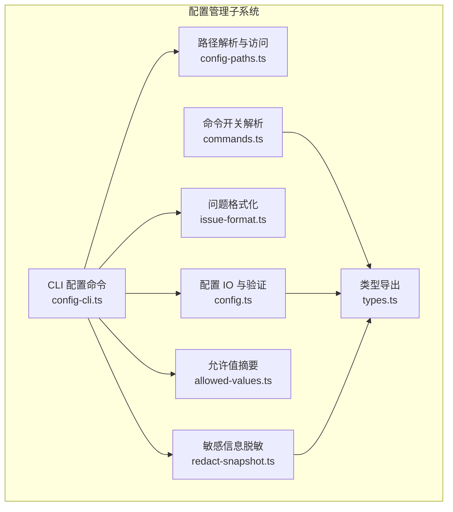
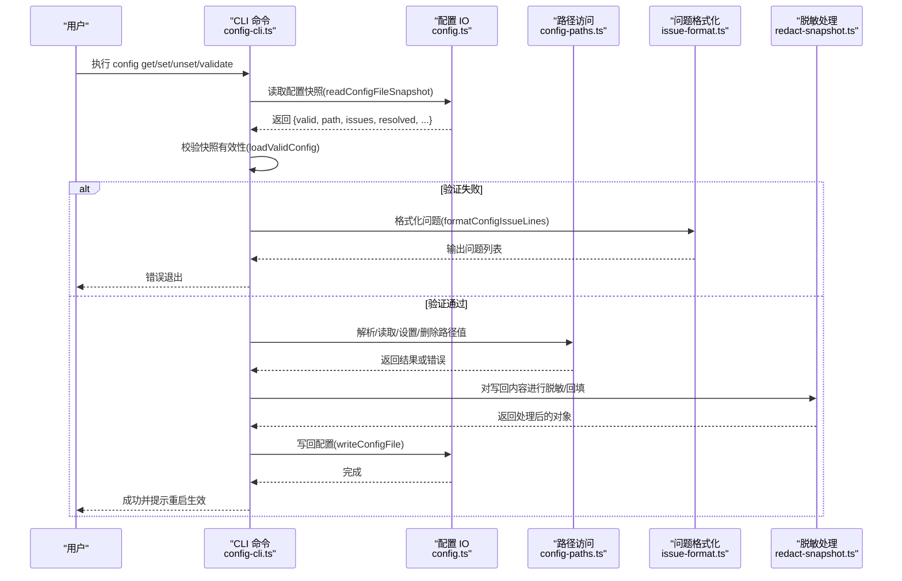
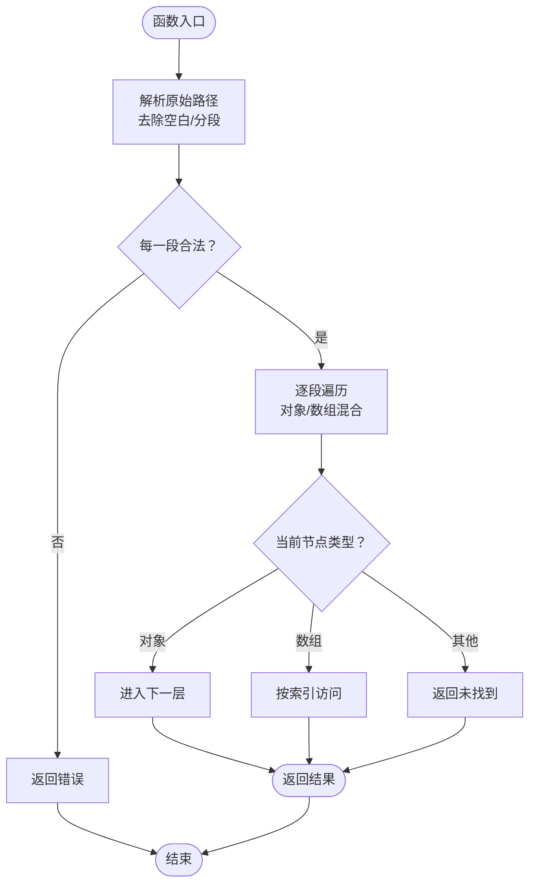
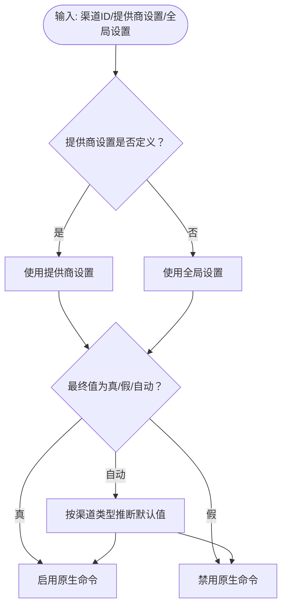
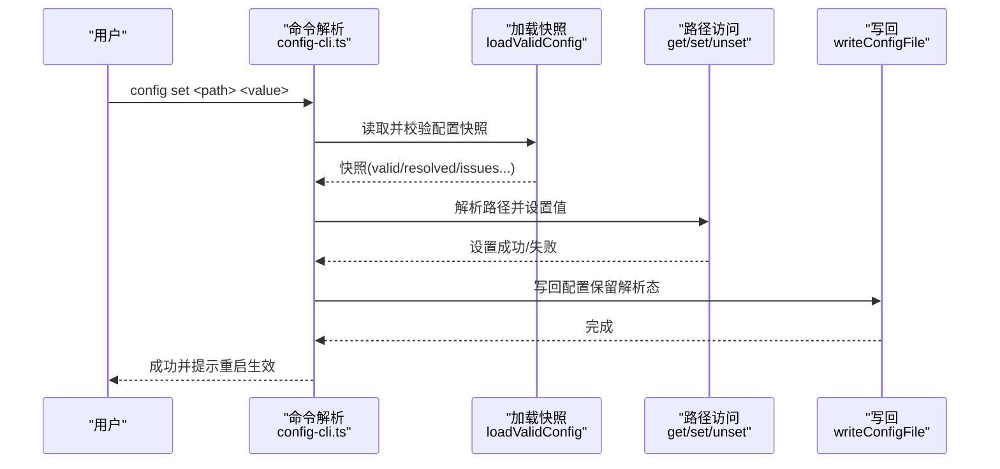
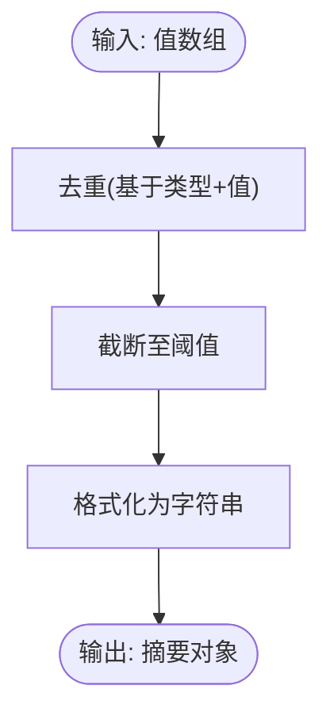
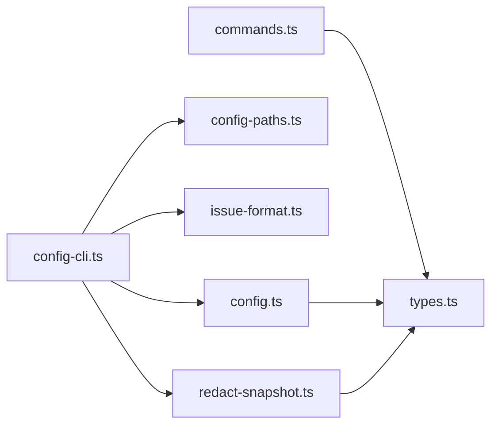

# 配置管理工具

<cite>
**本文引用的文件**
- [src/config/config-paths.ts](file://src/config/config-paths.ts)
- [src/config/commands.ts](file://src/config/commands.ts)
- [src/cli/config-cli.ts](file://src/cli/config-cli.ts)
- [src/config/allowed-values.ts](file://src/config/allowed-values.ts)
- [src/config/types.ts](file://src/config/types.ts)
- [src/config/config.ts](file://src/config/config.ts)
- [src/config/issue-format.ts](file://src/config/issue-format.ts)
- [src/config/redact-snapshot.ts](file://src/config/redact-snapshot.ts)
</cite>

## 目录
1. [简介](#简介)
2. [项目结构](#项目结构)
3. [核心组件](#核心组件)
4. [架构总览](#架构总览)
5. [详细组件分析](#详细组件分析)
6. [依赖关系分析](#依赖关系分析)
7. [性能考量](#性能考量)
8. [故障排查指南](#故障排查指南)
9. [结论](#结论)
10. [附录](#附录)

## 简介
本文件面向 OpenClaw 的配置管理工具，系统化阐述配置文件结构、验证规则、热重载机制、命令行操作（查看、修改、验证、备份）、配置模式验证流程（模式匹配、默认值注入、兼容性检查）、迁移与升级策略、安全与性能最佳实践，以及常见问题诊断与解决路径。目标是帮助开发者与运维人员以一致、可审计的方式管理配置。

## 项目结构
OpenClaw 将配置管理拆分为多个职责清晰的模块：
- 路径解析与访问：支持点号与方括号路径，数组索引与对象键的混合定位。
- 命令开关解析：根据渠道类型与全局/提供商设置解析原生命令启用状态。
- CLI 配置命令：提供非交互式配置工具（get/set/unset/file/validate），并内置校验与提示。
- 允许值摘要：对错误信息中的允许值集合进行去重、截断与格式化提示。
- 类型导出：集中导出各类配置类型定义，便于上层消费。
- 配置 IO 与验证：封装配置读写、快照、哈希、迁移与验证。
- 问题格式化：统一配置校验问题的输出格式，支持根路径归一化与允许值提示拼接。
- 敏感信息脱敏：在读取、写入与响应中对敏感字段进行脱敏与回填，确保安全。

图表来源
- [src/config/config-paths.ts:1-83](file://src/config/config-paths.ts#L1-L83)
- [src/config/commands.ts:1-91](file://src/config/commands.ts#L1-L91)
- [src/cli/config-cli.ts:1-477](file://src/cli/config-cli.ts#L1-L477)
- [src/config/allowed-values.ts:1-99](file://src/config/allowed-values.ts#L1-L99)
- [src/config/types.ts:1-36](file://src/config/types.ts#L1-L36)
- [src/config/config.ts:1-29](file://src/config/config.ts#L1-L29)
- [src/config/issue-format.ts:1-69](file://src/config/issue-format.ts#L1-L69)
- [src/config/redact-snapshot.ts:1-689](file://src/config/redact-snapshot.ts#L1-L689)

章节来源
- [src/config/config-paths.ts:1-83](file://src/config/config-paths.ts#L1-L83)
- [src/config/commands.ts:1-91](file://src/config/commands.ts#L1-L91)
- [src/cli/config-cli.ts:1-477](file://src/cli/config-cli.ts#L1-L477)
- [src/config/allowed-values.ts:1-99](file://src/config/allowed-values.ts#L1-L99)
- [src/config/types.ts:1-36](file://src/config/types.ts#L1-L36)
- [src/config/config.ts:1-29](file://src/config/config.ts#L1-L29)
- [src/config/issue-format.ts:1-69](file://src/config/issue-format.ts#L1-L69)
- [src/config/redact-snapshot.ts:1-689](file://src/config/redact-snapshot.ts#L1-L689)

## 核心组件
- 路径解析与访问：提供解析、读取、设置、删除配置值的能力，支持点号与方括号语法、数组索引与对象键混合路径，并对非法路径段进行阻断。
- 命令开关解析：根据渠道 ID 与全局/提供商设置解析原生命令启用状态，支持显式开启/关闭与自动推断。
- CLI 配置命令：封装配置查看、设置、删除、打印路径、验证等能力；在写入前使用“已解析但未合并运行时默认值”的快照，避免默认值污染用户配置。
- 允许值摘要：对校验错误中的允许值集合进行去重、截断与格式化，增强可读性。
- 类型导出：集中导出各类配置类型，便于上层消费与校验。
- 配置 IO 与验证：封装配置读写、快照、哈希、迁移与验证。
- 问题格式化：统一配置校验问题的输出格式，支持根路径归一化与允许值提示拼接。
- 敏感信息脱敏：在读取、写入与响应中对敏感字段进行脱敏与回填，确保安全。

章节来源
- [src/config/config-paths.ts:1-83](file://src/config/config-paths.ts#L1-L83)
- [src/config/commands.ts:1-91](file://src/config/commands.ts#L1-L91)
- [src/cli/config-cli.ts:1-477](file://src/cli/config-cli.ts#L1-L477)
- [src/config/allowed-values.ts:1-99](file://src/config/allowed-values.ts#L1-L99)
- [src/config/types.ts:1-36](file://src/config/types.ts#L1-L36)
- [src/config/config.ts:1-29](file://src/config/config.ts#L1-L29)
- [src/config/issue-format.ts:1-69](file://src/config/issue-format.ts#L1-L69)
- [src/config/redact-snapshot.ts:1-689](file://src/config/redact-snapshot.ts#L1-L689)

## 架构总览
配置管理工具围绕“读取—校验—应用—写回”闭环工作，CLI 作为入口，调用配置 IO 模块加载有效快照，执行路径解析与访问，结合问题格式化与敏感信息脱敏，最终写回配置文件并提示重启生效。

图表来源
- [src/cli/config-cli.ts:232-393](file://src/cli/config-cli.ts#L232-L393)
- [src/config/config.ts:1-29](file://src/config/config.ts#L1-L29)
- [src/config/config-paths.ts:1-83](file://src/config/config-paths.ts#L1-L83)
- [src/config/issue-format.ts:1-69](file://src/config/issue-format.ts#L1-L69)
- [src/config/redact-snapshot.ts:1-689](file://src/config/redact-snapshot.ts#L1-L689)

## 详细组件分析

### 组件 A：路径解析与访问（config-paths.ts）
- 功能要点
  - 支持点号与方括号路径，自动去除空段与空白。
  - 对路径段进行安全检查，阻断危险关键字。
  - 提供读取、设置、删除配置值的通用实现，支持嵌套对象与数组索引。
- 复杂度与性能
  - 时间复杂度：O(L)，L 为路径长度；空间复杂度：O(1)（不计递归栈）。
  - 适合频繁访问的场景，建议在 CLI 中复用该模块。
- 错误处理
  - 非法路径段、越界数组索引、类型不匹配等情况会返回错误或失败标记。

图表来源
- [src/config/config-paths.ts:31-82](file://src/config/config-paths.ts#L31-L82)

章节来源
- [src/config/config-paths.ts:1-83](file://src/config/config-paths.ts#L1-L83)

### 组件 B：命令开关解析（commands.ts）
- 功能要点
  - 根据渠道 ID 与全局/提供商设置解析原生命令启用状态。
  - 支持显式开启/关闭与自动推断，默认值由渠道类型决定。
  - 提供便捷查询接口，判断命令标志是否启用或是否被显式禁用。
- 设计模式
  - 条件解析与优先级：提供商设置优先于全局设置，否则采用自动默认值。
- 性能与复杂度
  - O(1) 查询，常数开销极低，适合在运行时频繁查询。

图表来源
- [src/config/commands.ts:24-68](file://src/config/commands.ts#L24-L68)

章节来源
- [src/config/commands.ts:1-91](file://src/config/commands.ts#L1-L91)

### 组件 C：CLI 配置命令（config-cli.ts）
- 功能要点
  - 支持 get、set、unset、file、validate 子命令。
  - set/unset 基于“已解析但未合并运行时默认值”的快照写回，避免默认值污染用户配置。
  - 自动注入 Ollama 提供商基础配置（当设置 apiKey 且不存在时）。
  - 输出 JSON 或人类可读格式，配合 doctor 提示修复。
- 关键流程
  - 加载有效配置快照（loadValidConfig）。
  - 路径解析与访问（parsePath/getAtPath/setAtPath/unsetAtPath）。
  - 写回配置（writeConfigFile），提示重启生效。

图表来源
- [src/cli/config-cli.ts:279-452](file://src/cli/config-cli.ts#L279-L452)

章节来源
- [src/cli/config-cli.ts:1-477](file://src/cli/config-cli.ts#L1-L477)

### 组件 D：允许值摘要（allowed-values.ts）
- 功能要点
  - 对校验错误中的允许值集合进行去重、截断与格式化。
  - 在错误消息中追加“允许值”提示，提升可读性。
- 性能与复杂度
  - 去重与格式化为线性时间，适合在错误输出阶段调用。

图表来源
- [src/config/allowed-values.ts:54-99](file://src/config/allowed-values.ts#L54-L99)

章节来源
- [src/config/allowed-values.ts:1-99](file://src/config/allowed-values.ts#L1-L99)

### 组件 E：类型导出（types.ts）
- 功能要点
  - 集中导出各类配置类型定义，便于上层消费与校验。
- 使用建议
  - 在编写校验器与 CLI 参数解析时，优先使用此处导出的类型，保证一致性。

章节来源
- [src/config/types.ts:1-36](file://src/config/types.ts#L1-L36)

### 组件 F：配置 IO 与验证（config.ts）
- 功能要点
  - 导出配置读写、快照、哈希、迁移与验证等能力。
  - 提供迁移旧配置的入口（migrateLegacyConfig）。
- 与 CLI 的协作
  - CLI 通过 readConfigFileSnapshot 获取快照，validateConfigObject 进行校验，writeConfigFile 写回。

章节来源
- [src/config/config.ts:1-29](file://src/config/config.ts#L1-L29)

### 组件 G：问题格式化（issue-format.ts）
- 功能要点
  - 规范化路径显示（根路径归一化）。
  - 统一错误行格式，支持允许值字段的条件保留。
- 与 CLI 的协作
  - CLI 在 validate 子命令中调用 formatConfigIssueLines 输出问题列表。

章节来源
- [src/config/issue-format.ts:1-69](file://src/config/issue-format.ts#L1-L69)

### 组件 H：敏感信息脱敏（redact-snapshot.ts）
- 功能要点
  - 在读取、写入与响应中对敏感字段进行脱敏与回填，确保安全。
  - 支持基于 Schema 的精确脱敏与基于路径模式的猜测脱敏。
  - 提供 REDACTED_SENTINEL 作为占位符，保障 Web UI 回填安全。
- 与 CLI 的协作
  - CLI 在 get 子命令中对输出进行脱敏；在 set/unset 写回前进行回填恢复。

章节来源
- [src/config/redact-snapshot.ts:1-689](file://src/config/redact-snapshot.ts#L1-L689)

## 依赖关系分析
- CLI 命令依赖配置 IO、路径访问、问题格式化与脱敏模块。
- 命令开关解析依赖渠道类型与全局/提供商设置。
- 配置 IO 依赖类型定义与验证模块。
- 脱敏模块依赖 Schema 提示与原始文本处理。

图表来源
- [src/cli/config-cli.ts:1-477](file://src/cli/config-cli.ts#L1-L477)
- [src/config/config.ts:1-29](file://src/config/config.ts#L1-L29)
- [src/config/config-paths.ts:1-83](file://src/config/config-paths.ts#L1-L83)
- [src/config/issue-format.ts:1-69](file://src/config/issue-format.ts#L1-L69)
- [src/config/redact-snapshot.ts:1-689](file://src/config/redact-snapshot.ts#L1-L689)
- [src/config/commands.ts:1-91](file://src/config/commands.ts#L1-L91)
- [src/config/types.ts:1-36](file://src/config/types.ts#L1-L36)

章节来源
- [src/cli/config-cli.ts:1-477](file://src/cli/config-cli.ts#L1-L477)
- [src/config/config.ts:1-29](file://src/config/config.ts#L1-L29)
- [src/config/config-paths.ts:1-83](file://src/config/config-paths.ts#L1-L83)
- [src/config/issue-format.ts:1-69](file://src/config/issue-format.ts#L1-L69)
- [src/config/redact-snapshot.ts:1-689](file://src/config/redact-snapshot.ts#L1-L689)
- [src/config/commands.ts:1-91](file://src/config/commands.ts#L1-L91)
- [src/config/types.ts:1-36](file://src/config/types.ts#L1-L36)

## 性能考量
- 路径访问为 O(L) 线性遍历，建议在高频场景中缓存解析结果或批量操作。
- 允许值摘要与问题格式化为线性处理，开销较小。
- 脱敏与回填涉及深度遍历，建议仅在必要时触发（如输出或写回）。
- CLI 在写回时使用“已解析但未合并运行时默认值”的快照，避免重复计算与默认值污染。

## 故障排查指南
- 配置无效或校验失败
  - 使用 validate 子命令查看具体问题与路径。
  - 参考 doctor 提示修复；若存在允许值，结合 allowed-values 的摘要信息定位。
- 路径错误
  - 确认路径使用点号或方括号语法，避免非法段与越界索引。
  - 使用 file 子命令确认当前生效配置文件路径。
- 写回后未生效
  - CLI 明确提示需重启网关以应用更改；检查进程状态。
- 敏感信息泄露风险
  - get 输出已脱敏；set/unset 写回前会进行回填恢复，确保凭据不丢失。
- Ollama 配置异常
  - 当设置 apiKey 时，CLI 会自动注入默认提供商配置；若仍失败，请手动检查 baseUrl 与模型列表。

章节来源
- [src/cli/config-cli.ts:344-393](file://src/cli/config-cli.ts#L344-L393)
- [src/config/issue-format.ts:1-69](file://src/config/issue-format.ts#L1-L69)
- [src/config/allowed-values.ts:1-99](file://src/config/allowed-values.ts#L1-L99)
- [src/config/redact-snapshot.ts:1-689](file://src/config/redact-snapshot.ts#L1-L689)

## 结论
OpenClaw 的配置管理工具通过清晰的模块划分与严格的边界约束，实现了安全、可审计、可扩展的配置生命周期管理。CLI 提供了强大的非交互式操作能力，结合路径解析、问题格式化与脱敏机制，能够高效地完成配置查看、修改、验证与备份。遵循本文的最佳实践与排障建议，可在生产环境中稳定地维护配置。

## 附录

### 配置命令速查
- 查看配置：config get <路径> [--json]
- 修改配置：config set <路径> <值> [--strict-json]
- 删除配置：config unset <路径>
- 打印配置文件路径：config file
- 验证配置：config validate [--json]

章节来源
- [src/cli/config-cli.ts:395-476](file://src/cli/config-cli.ts#L395-L476)

### 配置模式验证流程
- 模式匹配：CLI 读取快照并进行校验，输出规范化的问题列表。
- 默认值注入：写回时使用“已解析但未合并运行时默认值”的快照，避免默认值污染用户配置。
- 兼容性检查：通过 validate 子命令与 doctor 提示进行兼容性评估与修复。

章节来源
- [src/cli/config-cli.ts:344-393](file://src/cli/config-cli.ts#L344-L393)
- [src/config/issue-format.ts:1-69](file://src/config/issue-format.ts#L1-L69)

### 配置迁移与升级
- 旧配置迁移：通过 migrateLegacyConfig 进行旧版配置到新版的转换。
- 升级建议：升级前先 validate 并备份配置文件；升级后再次 validate 并按需调整新增字段。

章节来源
- [src/config/config.ts:18-18](file://src/config/config.ts#L18-L18)

### 安全与最佳实践
- 安全性
  - 使用脱敏输出与回填，避免凭据泄露。
  - 严格限制路径段，阻断危险关键字。
- 性能优化
  - 避免在高频路径上重复解析；批量操作时减少 IO 次数。
- 故障预防
  - 修改前先 validate；修改后提示重启生效；定期备份配置文件。

章节来源
- [src/config/redact-snapshot.ts:1-689](file://src/config/redact-snapshot.ts#L1-L689)
- [src/config/config-paths.ts:1-83](file://src/config/config-paths.ts#L1-L83)
- [src/cli/config-cli.ts:310-331](file://src/cli/config-cli.ts#L310-L331)