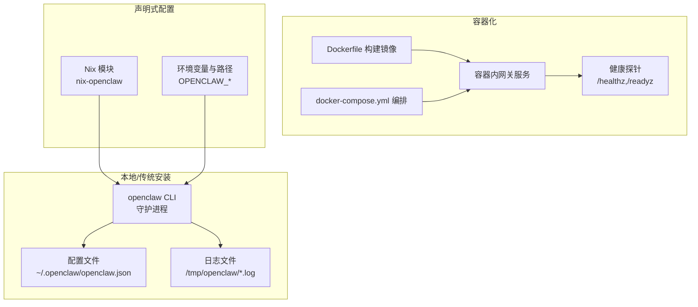
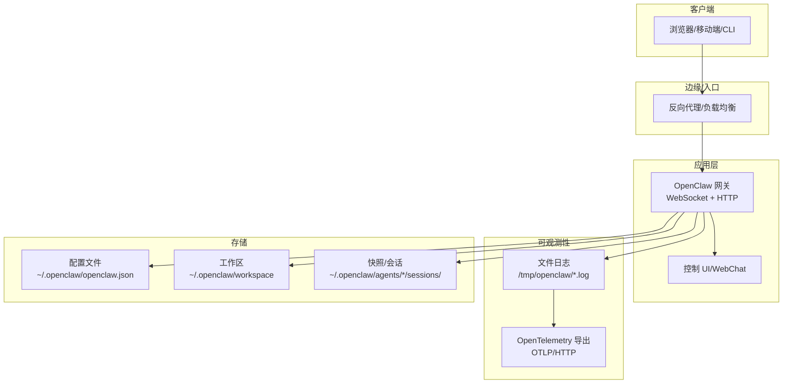
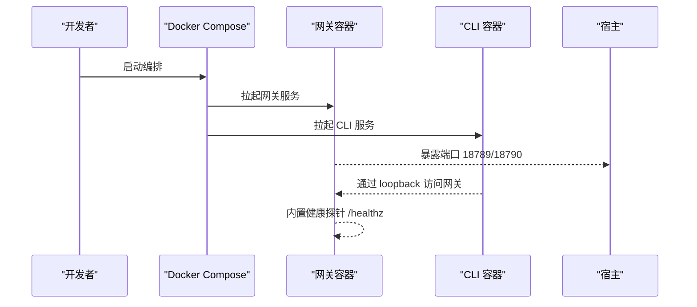
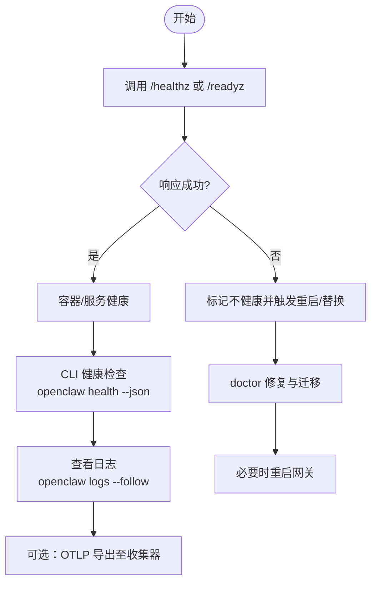
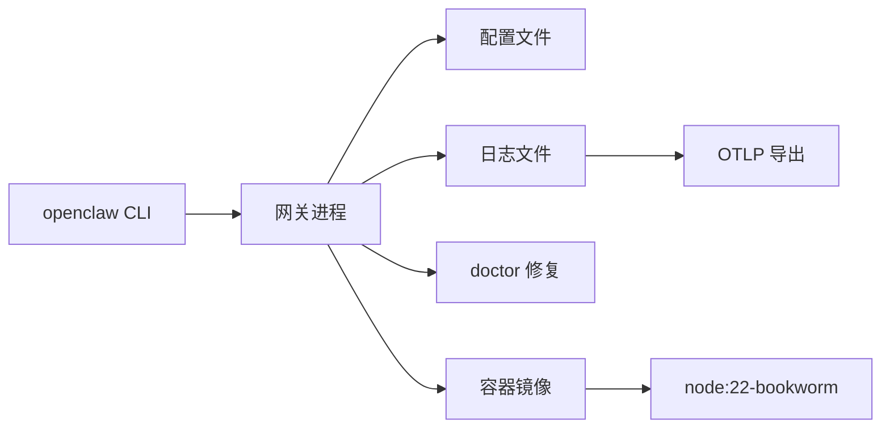

# 部署和运维

<cite>
**本文引用的文件**
- [README.md](file://README.md)
- [Dockerfile](file://Dockerfile)
- [docker-compose.yml](file://docker-compose.yml)
- [docs/install/docker.md](file://docs/install/docker.md)
- [docs/install/nix.md](file://docs/install/nix.md)
- [docs/install/index.md](file://docs/install/index.md)
- [docs/gateway/health.md](file://docs/gateway/health.md)
- [docs/gateway/doctor.md](file://docs/gateway/doctor.md)
- [docs/cli/doctor.md](file://docs/cli/doctor.md)
- [docs/logging.md](file://docs/logging.md)
- [docs/gateway/configuration.md](file://docs/gateway/configuration.md)
- [docs/gateway/configuration-reference.md](file://docs/gateway/configuration-reference.md)
</cite>

## 目录
1. [简介](#简介)
2. [项目结构](#项目结构)
3. [核心组件](#核心组件)
4. [架构总览](#架构总览)
5. [详细组件分析](#详细组件分析)
6. [依赖关系分析](#依赖关系分析)
7. [性能考量](#性能考量)
8. [故障排查指南](#故障排查指南)
9. [结论](#结论)
10. [附录](#附录)

## 简介
本文件面向 OpenClaw 的生产部署与运维，覆盖以下主题：
- 多种部署方式：Docker 容器化、Nix 声明式配置、传统安装（npm/pnpm/bun）与云平台部署
- 监控与健康检查：健康状态检测、探针端点、日志与可观测性（含 OpenTelemetry 导出）
- 运维工具：doctor 命令、日志分析、故障诊断
- 配置管理最佳实践：环境变量、配置文件、密钥管理（SecretRef）
- 备份与恢复：数据迁移、版本升级与回滚流程
- 性能优化：资源分配、缓存策略、负载均衡
- 高可用部署：架构设计与实施建议
- 不同部署环境的注意事项

## 项目结构
OpenClaw 提供多种运行形态与运维入口：
- CLI 与守护进程：通过 openclaw 命令启动网关、执行诊断与运维操作
- 容器镜像与编排：Dockerfile 与 docker-compose.yml 支持容器化部署
- 文档与指南：安装、配置、健康检查、日志与 doctor 等运维文档
- 平台与云部署：Fly、Render 等平台部署参考文档

图示来源
- [Dockerfile:224-230](file://Dockerfile#L224-L230)
- [docker-compose.yml:38-49](file://docker-compose.yml#L38-L49)
- [docs/install/docker.md:469-489](file://docs/install/docker.md#L469-L489)
- [docs/install/nix.md:46-82](file://docs/install/nix.md#L46-L82)

章节来源
- [README.md:1-50](file://README.md#L1-L50)
- [docs/install/index.md:14-33](file://docs/install/index.md#L14-L33)

## 核心组件
- 网关（Gateway）：WebSocket 控制平面，承载会话、通道、工具与事件；提供健康探针与控制 UI
- CLI：运维与自动化入口，支持 doctor、status、logs、health 等命令
- 日志系统：文件日志（JSONL）与控制 UI 实时尾随；可导出到 OpenTelemetry
- 配置系统：JSON5 配置、环境变量注入、SecretRef 密钥管理
- 容器与编排：Dockerfile、docker-compose、健康检查探针
- Nix 模块：声明式安装与运行时行为控制

章节来源
- [docs/gateway/health.md:8-36](file://docs/gateway/health.md#L8-L36)
- [docs/logging.md:10-353](file://docs/logging.md#L10-L353)
- [docs/gateway/configuration.md:10-74](file://docs/gateway/configuration.md#L10-L74)
- [Dockerfile:224-230](file://Dockerfile#L224-L230)
- [docker-compose.yml:38-49](file://docker-compose.yml#L38-L49)
- [docs/install/nix.md:46-82](file://docs/install/nix.md#L46-L82)

## 架构总览
下图展示生产环境常见拓扑：容器化或传统安装，结合健康检查、日志与可观测性。

图示来源
- [docs/logging.md:20-37](file://docs/logging.md#L20-L37)
- [docs/gateway/health.md:12-20](file://docs/gateway/health.md#L12-L20)
- [docs/gateway/configuration.md:12-24](file://docs/gateway/configuration.md#L12-L24)

## 详细组件分析

### Docker 容器化部署
- 镜像构建：多阶段构建，支持 slim 变体与扩展依赖预装；内置 HEALTHCHECK 探针
- 编排：docker-compose 同时运行网关与 CLI 服务，持久化配置与工作区目录
- 端口与绑定：默认 loopback 绑定，桥接网络下需将端口映射到宿主；可切换为 lan 绑定并设置认证
- 浏览器与沙箱：可选在镜像中预装 Chromium 与 Docker CLI，以支持浏览器工具与 per-session 沙箱

图示来源
- [Dockerfile:224-230](file://Dockerfile#L224-L230)
- [docker-compose.yml:23-37](file://docker-compose.yml#L23-L37)
- [docs/install/docker.md:469-489](file://docs/install/docker.md#L469-L489)

章节来源
- [Dockerfile:1-231](file://Dockerfile#L1-L231)
- [docker-compose.yml:1-77](file://docker-compose.yml#L1-77)
- [docs/install/docker.md:35-205](file://docs/install/docker.md#L35-L205)

### Nix 声明式安装
- 使用 nix-openclaw 模块进行安装与管理，支持自动服务安装、权限与路径控制
- Nix 模式下禁用自安装与自我变异，确保可重现与可回滚
- 通过 OPENCLAW_* 环境变量与路径控制，避免写入不可变存储

章节来源
- [docs/install/nix.md:10-99](file://docs/install/nix.md#L10-L99)

### 传统安装（npm/pnpm/bun）
- 安装脚本一键安装 Node、全局 CLI，并引导首次向导
- 支持 npm/pnpm/bun，推荐 pnpm 用于源码构建
- 支持从源码构建并链接 CLI，便于开发调试

章节来源
- [docs/install/index.md:34-141](file://docs/install/index.md#L34-L141)

### 健康检查与监控
- 内置探针：/healthz（存活）、/readyz（就绪），支持别名 /health、/ready
- CLI 健康命令：status、health、logs，支持深诊断与通道状态检查
- 日志：文件 JSONL 日志与控制 UI 实时尾随；支持 JSON/紧凑/纯文本输出模式
- 诊断与 OTel：可启用诊断事件与 OTLP/HTTP 导出，采集指标、追踪与日志

图示来源
- [Dockerfile:224-230](file://Dockerfile#L224-L230)
- [docs/gateway/health.md:12-36](file://docs/gateway/health.md#L12-L36)
- [docs/logging.md:40-81](file://docs/logging.md#L40-L81)
- [docs/gateway/doctor.md:14-50](file://docs/gateway/doctor.md#L14-L50)

章节来源
- [docs/gateway/health.md:8-36](file://docs/gateway/health.md#L8-L36)
- [docs/logging.md:10-120](file://docs/logging.md#L10-L120)
- [docs/gateway/doctor.md:59-85](file://docs/gateway/doctor.md#L59-L85)

### doctor 命令与运维工具
- 自动修复与迁移：配置归一化、历史状态迁移、服务清理、安全警告、端口冲突诊断
- 交互与非交互：支持 --yes、--repair、--non-interactive、--deep 等参数
- 生成网关令牌：在本地 token 模式下生成或校验令牌
- 通道状态与服务审计：对通道连通性与 supervisor 配置进行扫描与修复

章节来源
- [docs/gateway/doctor.md:14-331](file://docs/gateway/doctor.md#L14-L331)
- [docs/cli/doctor.md:18-46](file://docs/cli/doctor.md#L18-L46)

### 配置管理最佳实践
- 配置格式：JSON5，严格校验，未知键会导致启动失败
- 环境变量：支持 .env 与全局 ~/.openclaw/.env，支持 Shell 环境导入与值替换
- SecretRef：对敏感字段（如 API Key、服务账号）使用 SecretRef，支持 env/file/exec 三种来源
- 热重载：大部分配置变更无需重启即时生效；端口/鉴权等关键项需要重启
- 分割配置：使用 $include 将大配置拆分为多文件，支持数组合并与嵌套 include

章节来源
- [docs/gateway/configuration.md:12-74](file://docs/gateway/configuration.md#L12-L74)
- [docs/gateway/configuration.md:449-539](file://docs/gateway/configuration.md#L449-L539)
- [docs/gateway/configuration-reference.md:1-100](file://docs/gateway/configuration-reference.md#L1-L100)

### 备份与恢复策略
- 数据位置：配置 ~/.openclaw/openclaw.json；工作区 ~/.openclaw/workspace；会话与快照 ~/.openclaw/agents/*/sessions/
- 迁移与回滚：doctor 自动迁移旧布局；Nix 模式支持快速回滚（home-manager switch --rollback）
- 升级流程：更新渠道后运行 doctor，必要时执行迁移与修复
- 恢复要点：停止网关，备份上述目录，按需修改配置，启动后验证健康与通道连通性

章节来源
- [docs/gateway/doctor.md:144-161](file://docs/gateway/doctor.md#L144-L161)
- [docs/install/nix.md:40-43](file://docs/install/nix.md#L40-L43)
- [docs/install/index.md:206-219](file://docs/install/index.md#L206-L219)

### 性能优化指南
- 资源分配：容器镜像默认非 root 用户运行，减少攻击面；根据负载调整 CPU/内存限制
- 缓存策略：持久化 /home/node 目录以保留 Playwright 下载与工具缓存；合理设置日志级别与轮转
- 负载均衡：通过反向代理分发请求；容器化部署时注意端口映射与绑定模式
- 通道与媒体：根据通道最大媒体大小与历史限制调整，避免过大的会话与转录文件

章节来源
- [docs/install/docker.md:350-391](file://docs/install/docker.md#L350-L391)
- [docs/logging.md:116-141](file://docs/logging.md#L116-L141)
- [docs/gateway/configuration-reference.md:92-125](file://docs/gateway/configuration-reference.md#L92-L125)

### 高可用部署的架构设计与实施建议
- 多实例与共享存储：将配置与工作区挂载到共享存储，确保实例间一致性
- 健康检查与自动恢复：利用内置 HEALTHCHECK 与编排系统的重启策略
- 限流与熔断：对控制面 RPC（如 config.apply/patch）进行速率限制，避免抖动
- 观测性：开启诊断事件与 OTLP 导出，统一采集指标、追踪与日志

章节来源
- [Dockerfile:224-230](file://Dockerfile#L224-L230)
- [docs/logging.md:142-267](file://docs/logging.md#L142-L267)

### 不同部署环境的特殊考虑与注意事项
- Docker 桥接网络：loopback 绑定会使宿主机无法直接访问，需映射端口或改为 lan 绑定并设置认证
- Nix 模式：禁用自安装与自我变异，确保可重现；macOS GUI 应用需显式启用 Nix 模式
- 云平台：Fly、Render 等平台部署参考文档；优先使用干净基础镜像，再通过脚本安装
- 权限与路径：容器内 node 用户 UID 1000；宿主挂载目录需正确归属，避免 EACCES

章节来源
- [docs/install/docker.md:508-538](file://docs/install/docker.md#L508-L538)
- [docs/install/nix.md:46-82](file://docs/install/nix.md#L46-L82)
- [docs/install/index.md:20-33](file://docs/install/index.md#L20-L33)

## 依赖关系分析
- CLI 依赖于网关运行时；doctor 依赖配置与状态目录；日志与 OTLP 导出依赖诊断开关
- 容器镜像依赖 Node 22 基础镜像；可选安装 Chromium 与 Docker CLI 以支持浏览器与沙箱
- Nix 模式下，配置与状态路径需指向可写位置，避免写入不可变存储

图示来源
- [docs/logging.md:142-267](file://docs/logging.md#L142-L267)
- [Dockerfile:93-116](file://Dockerfile#L93-L116)

章节来源
- [docs/gateway/configuration.md:389-447](file://docs/gateway/configuration.md#L389-L447)
- [docs/gateway/doctor.md:59-85](file://docs/gateway/doctor.md#L59-L85)

## 性能考量
- 日志级别与输出：通过 OPENCLAW_LOG_LEVEL 或 --log-level 调整，避免在生产中使用过高的冗余级别
- 诊断事件采样：OTLP 导出支持采样率与刷新间隔，降低高吞吐场景的开销
- 文件轮转与磁盘增长热点：关注 media/ 与 sessions/ 目录，定期清理与归档
- 端口与绑定：在容器化环境中谨慎选择绑定模式，避免不必要的网络暴露

章节来源
- [docs/logging.md:116-141](file://docs/logging.md#L116-L141)
- [docs/logging.md:268-331](file://docs/logging.md#L268-L331)
- [docs/install/docker.md:508-538](file://docs/install/docker.md#L508-L538)

## 故障排查指南
- 快速诊断：status、health、logs；查看 /tmp/openclaw/*.log；确认通道凭据与允许列表
- doctor 修复：--yes/--repair/--deep；迁移历史状态与服务；检查端口占用与权限
- 容器健康：/healthz 与 /readyz；HEALTHCHECK；必要时进入容器执行健康命令
- macOS 环境变量覆盖：launchctl getenv/unsetenv 清理遗留环境变量导致的“未授权”错误

章节来源
- [docs/gateway/health.md:12-36](file://docs/gateway/health.md#L12-L36)
- [docs/cli/doctor.md:26-46](file://docs/cli/doctor.md#L26-L46)
- [docs/gateway/doctor.md:20-50](file://docs/gateway/doctor.md#L20-L50)
- [Dockerfile:224-230](file://Dockerfile#L224-L230)

## 结论
OpenClaw 提供了灵活的部署与运维能力：既可通过传统安装获得最小化控制，也可借助 Docker 与 Nix 实现可重复与可回滚的生产级部署。结合内置健康检查、日志与诊断导出，以及 doctor 的自动化修复与迁移，能够有效支撑中小规模到中等规模的生产环境。对于更高可用与弹性需求，建议配合反向代理、共享存储与可观测性体系，形成完整的运维闭环。

## 附录
- 参考文档与页面：安装、配置、健康检查、日志、doctor、Nix、Docker 等
- 关键命令与端点：openclaw doctor、openclaw health、openclaw logs、/healthz、/readyz
- 环境变量与路径：OPENCLAW_*、OPENCLAW_STATE_DIR、OPENCLAW_CONFIG_PATH、OPENCLAW_LOG_LEVEL

章节来源
- [README.md:442-449](file://README.md#L442-L449)
- [docs/install/index.md:163-179](file://docs/install/index.md#L163-L179)
- [docs/logging.md:20-37](file://docs/logging.md#L20-L37)
- [docs/gateway/health.md:12-20](file://docs/gateway/health.md#L12-L20)
- [docs/gateway/doctor.md:14-50](file://docs/gateway/doctor.md#L14-L50)