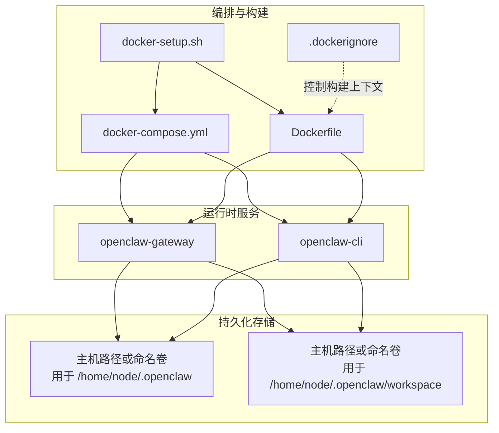
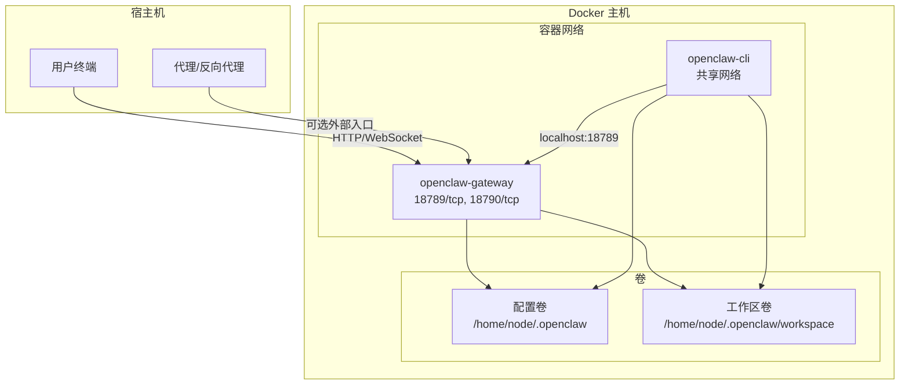
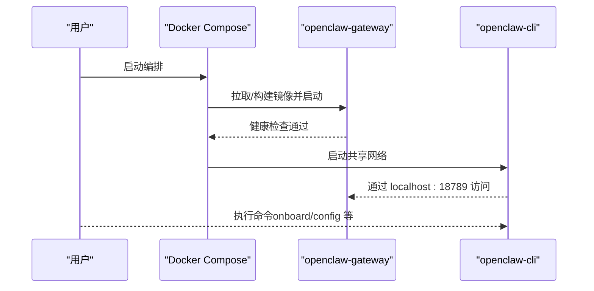
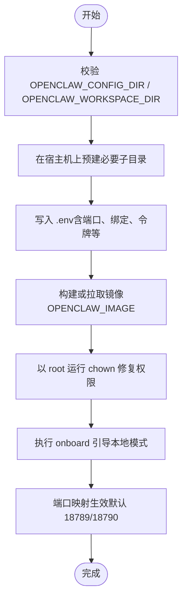
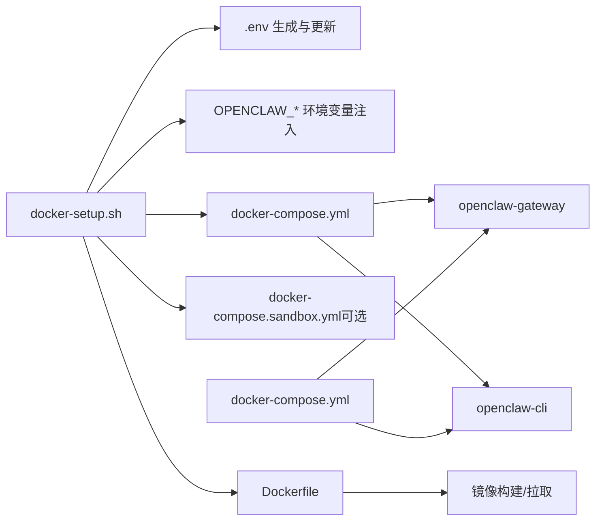

# Docker Compose 配置

<cite>
**本文引用的文件**
- [docker-compose.yml](file://docker-compose.yml)
- [Dockerfile](file://Dockerfile)
- [.dockerignore](file://.dockerignore)
- [docker-setup.sh](file://docker-setup.sh)
- [openclaw.podman.env](file://openclaw.podman.env)
- [src/config/config.env-vars.test.ts](file://src/config/config.env-vars.test.ts)
</cite>

## 目录
1. [简介](#简介)
2. [项目结构](#项目结构)
3. [核心组件](#核心组件)
4. [架构总览](#架构总览)
5. [详细组件分析](#详细组件分析)
6. [依赖关系分析](#依赖关系分析)
7. [性能考量](#性能考量)
8. [故障排查指南](#故障排查指南)
9. [结论](#结论)
10. [附录](#附录)

## 简介
本文件面向使用 Docker Compose 编排 OpenClaw 的用户与运维人员，系统性阐述服务定义、网络与卷挂载策略、容器间通信、端口映射与环境变量传递机制，并提供配置模板与参数说明（含可选挂载、持久化卷、系统包安装等）。同时覆盖容器生命周期管理、重启策略与健康检查配置，以及生产环境部署最佳实践与安全建议。文档重点解释以下关键环境变量的作用与用法：OPENCLAW_IMAGE、OPENCLAW_DOCKER_APT_PACKAGES、OPENCLAW_EXTENSIONS 等。

## 项目结构
OpenClaw 在仓库根目录提供了编排入口与构建脚本：
- docker-compose.yml：定义 openclaw-gateway 与 openclaw-cli 两个服务，声明卷挂载、端口映射、健康检查与重启策略。
- Dockerfile：多阶段构建镜像，支持可选安装系统包、浏览器与 Docker CLI，以及扩展模块选择。
- .dockerignore：控制构建上下文，避免不必要的文件进入镜像层。
- docker-setup.sh：自动化脚本，负责生成 .env、写入额外挂载、按需启用沙箱、拉取/构建镜像、初始化权限与引导配置。
- openclaw.podman.env：Podman 环境示例，便于对比与迁移。
- src/config/config.env-vars.test.ts：验证配置环境变量加载与安全过滤的行为。

图表来源
- [docker-compose.yml:1-77](file://docker-compose.yml#L1-L77)
- [Dockerfile:1-231](file://Dockerfile#L1-L231)
- [docker-setup.sh:1-598](file://docker-setup.sh#L1-L598)
- [.dockerignore:1-65](file://.dockerignore#L1-L65)

章节来源
- [docker-compose.yml:1-77](file://docker-compose.yml#L1-L77)
- [Dockerfile:1-231](file://Dockerfile#L1-L231)
- [.dockerignore:1-65](file://.dockerignore#L1-L65)
- [docker-setup.sh:1-598](file://docker-setup.sh#L1-L598)

## 核心组件
- openclaw-gateway
  - 基于 OPENCLAW_IMAGE 指定的镜像，默认值为 openclaw:local。
  - 环境变量：HOME、TERM、OPENCLAW_GATEWAY_TOKEN、OPENCLAW_ALLOW_INSECURE_PRIVATE_WS、CLAUDE_* 系列。
  - 卷挂载：将主机上的配置目录与工作区目录挂载到容器内用户主目录下的对应路径。
  - 端口映射：默认将宿主机 18789 映射到容器 18789；桥接端口 18790 可按需映射。
  - 初始化与重启：init: true；restart: unless-stopped。
  - 健康检查：通过执行一个 Node 脚本轮询本地健康端点，周期、超时、重试与启动期均有配置。
  - 命令行：以 openclaw.mjs 启动网关，绑定模式由 OPENCLAW_GATEWAY_BIND 决定（默认 lan）。
- openclaw-cli
  - 共享 openclaw-gateway 的网络命名空间（network_mode: service:openclaw-gateway），实现零额外网络开销的内部通信。
  - 安全加固：cap_drop、security_opt、no-new-privileges。
  - 环境变量：与网关一致的 HOME、TERM、OPENCLAW_* 令牌与 Claude 凭据，另设置 BROWSER=echo 以避免交互式浏览器行为。
  - 卷挂载：与网关相同的配置与工作区挂载。
  - 生命周期：stdin_open、tty、init: true；entrypoint 指向 openclaw.mjs；依赖 openclaw-gateway。

章节来源
- [docker-compose.yml:1-77](file://docker-compose.yml#L1-L77)

## 架构总览
下图展示容器间通信、端口暴露与数据持久化的关系：

图表来源
- [docker-compose.yml:1-77](file://docker-compose.yml#L1-L77)

## 详细组件分析

### 服务定义与生命周期
- openclaw-gateway
  - 使用 OPENCLAW_IMAGE 指定镜像；未显式设置时回退至 openclaw:local。
  - 通过 HEALTHCHECK 与 CMD/ENTRYPOINT 组合实现自检与启动。
  - restart: unless-stopped 确保非人为停止时自动恢复。
- openclaw-cli
  - 通过 network_mode: service:openclaw-gateway 与网关共享网络栈，无需额外端口映射即可访问网关。
  - 以 openclaw.mjs 作为入口，结合 depends_on 确保启动顺序。

图表来源
- [docker-compose.yml:1-77](file://docker-compose.yml#L1-L77)

章节来源
- [docker-compose.yml:1-77](file://docker-compose.yml#L1-L77)

### 网络配置与容器间通信
- openclaw-cli 通过 network_mode: service:openclaw-gateway 共享网卡，内部通信仅限 127.0.0.1:18789（默认）。
- 外部访问需要宿主机端口映射：OPENCLAW_GATEWAY_PORT 默认 18789 映射到容器 18789；OPENCLAW_BRIDGE_PORT 默认 18790 映射到容器 18790。
- 若需从宿主机以外设备访问，应将 OPENCLAW_GATEWAY_BIND 设为 "lan" 并配置认证令牌。

章节来源
- [docker-compose.yml:23-25](file://docker-compose.yml#L23-L25)
- [docker-compose.yml:34-36](file://docker-compose.yml#L34-L36)

### 卷挂载策略与持久化
- 配置卷：将主机目录挂载到 /home/node/.openclaw，用于保存配置、密钥与状态。
- 工作区卷：将主机目录挂载到 /home/node/.openclaw/workspace，用于存放会话、日志与中间产物。
- 支持命名卷：docker-setup.sh 提供 HOME_VOLUME_NAME 参数，允许使用命名卷替代路径挂载。
- 权限修复：docker-setup.sh 在启动前以 root 身份运行一次 chown，确保容器内的 node 用户可写。

图表来源
- [docker-setup.sh:206-444](file://docker-setup.sh#L206-L444)

章节来源
- [docker-compose.yml:12-14](file://docker-compose.yml#L12-L14)
- [docker-setup.sh:206-444](file://docker-setup.sh#L206-L444)

### 环境变量传递机制
- compose 层：通过 environment 字段直接注入 HOME、TERM、OPENCLAW_*、CLAUDE_* 等。
- 镜像层：Dockerfile 中对 OPENCLAW_DOCKER_APT_PACKAGES、OPENCLAW_EXTENSIONS、OPENCLAW_INSTALL_BROWSER、OPENCLAW_INSTALL_DOCKER_CLI 等进行条件安装与配置。
- 运行时加载：src/config/config.env-vars.test.ts 展示了配置中环境变量的解析与安全过滤逻辑（例如禁止覆盖 HOME、SHELL 等关键变量）。

章节来源
- [docker-compose.yml:4-11](file://docker-compose.yml#L4-L11)
- [Dockerfile:147-207](file://Dockerfile#L147-L207)
- [src/config/config.env-vars.test.ts:46-82](file://src/config/config.env-vars.test.ts#L46-L82)

### 健康检查与重启策略
- openclaw-gateway 的 HEALTHCHECK 使用 Node 脚本轮询 http://127.0.0.1:18789/healthz，间隔、超时、重试与启动期均有明确配置。
- restart: unless-stopped 确保异常退出后自动重启，但手动停止不会被重启。

章节来源
- [docker-compose.yml:38-49](file://docker-compose.yml#L38-L49)

### 关键环境变量详解
- OPENCLAW_IMAGE
  - 作用：指定镜像名称（默认 openclaw:local），可替换为远程私有镜像。
  - 用法：docker compose 或 docker-setup.sh 会据此决定构建或拉取。
- OPENCLAW_DOCKER_APT_PACKAGES
  - 作用：在运行时安装额外系统包（如 Python、wget 等），适合技能或扩展需要系统工具的场景。
  - 用法：构建时通过 --build-arg 传入，或在 docker-setup.sh 中设置后触发构建。
- OPENCLAW_EXTENSIONS
  - 作用：在构建阶段选择性引入扩展的 package.json，减少无关变更导致的缓存失效。
  - 用法：构建时通过 --build-arg 传入，或在 docker-setup.sh 中设置后触发构建。
- OPENCLAW_EXTRA_MOUNTS
  - 作用：以逗号分隔的挂载规范列表（source:target[:options]），用于追加额外卷。
  - 用法：docker-setup.sh 会校验格式并写入额外 compose 文件。
- OPENCLAW_HOME_VOLUME
  - 作用：使用命名卷替代路径挂载，简化跨平台与权限管理。
  - 用法：docker-setup.sh 校验命名卷合法性并在额外 compose 中声明。
- OPENCLAW_SANDBOX
  - 作用：启用沙箱隔离（需要 Docker CLI），可选是否挂载宿主机 docker.sock。
  - 用法：docker-setup.sh 检测并按需构建沙箱镜像、写入沙箱 compose 覆盖文件。
- OPENCLAW_GATEWAY_TOKEN
  - 作用：网关访问令牌，docker-setup.sh 支持从配置或 .env 自动读取，否则随机生成。
  - 用法：docker compose 启动后可通过 CLI 设置/读取配置。
- OPENCLAW_GATEWAY_BIND
  - 作用：网关绑定模式（默认 lan），影响对外可达性与控制 UI 允许来源。
  - 用法：docker-setup.sh 将其写入 .env 并同步到网关配置。

章节来源
- [docker-compose.yml:3-36](file://docker-compose.yml#L3-L36)
- [Dockerfile:147-207](file://Dockerfile#L147-L207)
- [docker-setup.sh:214-226](file://docker-setup.sh#L214-L226)
- [docker-setup.sh:395-411](file://docker-setup.sh#L395-L411)
- [src/config/config.env-vars.test.ts:46-82](file://src/config/config.env-vars.test.ts#L46-L82)

## 依赖关系分析
- docker-compose.yml 依赖 Dockerfile 的构建产物（镜像）。
- docker-setup.sh 作为编排前置脚本，负责：
  - 生成 .env 并注入上述关键环境变量。
  - 根据 OPENCLAW_EXTRA_MOUNTS 与 OPENCLAW_HOME_VOLUME 动态生成额外 compose 文件。
  - 按需启用沙箱（写入 docker-compose.sandbox.yml）。
  - 拉取/构建镜像、修复权限、引导 onboard、设置网关模式与绑定。
- .dockerignore 控制构建上下文，避免无关文件进入镜像层，提升构建效率与安全性。

图表来源
- [docker-setup.sh:258-428](file://docker-setup.sh#L258-L428)
- [docker-compose.yml:1-77](file://docker-compose.yml#L1-L77)
- [Dockerfile:1-231](file://Dockerfile#L1-L231)

章节来源
- [docker-setup.sh:258-428](file://docker-setup.sh#L258-L428)
- [docker-compose.yml:1-77](file://docker-compose.yml#L1-L77)
- [.dockerignore:1-65](file://.dockerignore#L1-L65)

## 性能考量
- 构建上下文优化：.dockerignore 排除大量非必需目录与缓存，显著降低构建时间与镜像体积。
- 多阶段构建：先构建再裁剪开发依赖，最终镜像仅包含运行所需内容。
- 可选安装：
  - OPENCLAW_INSTALL_BROWSER：预装浏览器与 Playwright，避免容器启动时的动态下载，减少冷启动延迟。
  - OPENCLAW_DOCKER_APT_PACKAGES：仅安装必要系统包，避免冗余依赖。
- 运行时权限：以非 root 用户运行，降低逃逸风险，同时不影响持久化卷写入（配合 docker-setup.sh 的 chown 步骤）。

章节来源
- [.dockerignore:1-65](file://.dockerignore#L1-L65)
- [Dockerfile:86-91](file://Dockerfile#L86-L91)
- [Dockerfile:147-207](file://Dockerfile#L147-L207)
- [docker-setup.sh:430-444](file://docker-setup.sh#L430-L444)

## 故障排查指南
- 端口冲突
  - 症状：容器启动失败或端口占用。
  - 处理：调整 OPENCLAW_GATEWAY_PORT 与 OPENCLAW_BRIDGE_PORT，或释放宿主机端口。
- 权限问题（EACCES）
  - 症状：容器无法在挂载目录创建文件。
  - 处理：执行 docker-setup.sh 的权限修复步骤，或确保宿主机目录由 root 创建并 chown node:node。
- 网关不可达
  - 症状：宿主机外无法访问网关。
  - 处理：将 OPENCLAW_GATEWAY_BIND 设为 "lan"，并配置 OPENCLAW_GATEWAY_TOKEN；如需从代理后访问，确保反向代理正确转发。
- 沙箱未生效
  - 症状：agents.defaults.sandbox 未启用或报错。
  - 处理：确认已设置 OPENCLAW_SANDBOX=1，且镜像包含 Docker CLI；docker-setup.sh 会在满足前提后写入 docker-compose.sandbox.yml 并重启网关。
- 环境变量覆盖冲突
  - 症状：某些环境变量未按预期生效。
  - 处理：参考 src/config/config.env-vars.test.ts 的安全过滤逻辑，避免在配置中覆盖 HOME、SHELL、ZDOTDIR 等关键变量。

章节来源
- [docker-setup.sh:430-444](file://docker-setup.sh#L430-L444)
- [docker-compose.yml:23-25](file://docker-compose.yml#L23-L25)
- [docker-compose.yml:34-36](file://docker-compose.yml#L34-L36)
- [docker-compose.yml:15-22](file://docker-compose.yml#L15-L22)
- [src/config/config.env-vars.test.ts:46-82](file://src/config/config.env-vars.test.ts#L46-L82)

## 结论
通过 docker-compose.yml 与 docker-setup.sh 的协同，OpenClaw 实现了简洁、可扩展且安全的容器化部署。关键在于：
- 明确的服务边界与共享网络设计，使 CLI 与网关高效协作；
- 可插拔的卷挂载策略与命名卷支持，兼顾易用性与可移植性；
- 健壮的环境变量体系与安全过滤，保障运行时一致性与安全性；
- 可选的系统包安装与浏览器预装，平衡功能与性能；
- 生产级的健康检查与重启策略，提升可用性。

## 附录

### 配置模板与参数说明
- 基础编排参数
  - OPENCLAW_IMAGE：镜像名（默认 openclaw:local）
  - OPENCLAW_GATEWAY_PORT：宿主机网关端口（默认 18789）
  - OPENCLAW_BRIDGE_PORT：宿主机桥接端口（默认 18790）
  - OPENCLAW_GATEWAY_BIND：网关绑定模式（默认 lan）
  - OPENCLAW_GATEWAY_TOKEN：网关访问令牌（可从配置或 .env 读取）
  - OPENCLAW_CONFIG_DIR：宿主机配置目录（默认 $HOME/.openclaw）
  - OPENCLAW_WORKSPACE_DIR：宿主机工作区目录（默认 $HOME/.openclaw/workspace）
  - OPENCLAW_HOME_VOLUME：命名卷名（可选）
  - OPENCLAW_EXTRA_MOUNTS：额外挂载列表（source:target[:options]，逗号分隔）
  - OPENCLAW_DOCKER_APT_PACKAGES：运行时安装的系统包列表
  - OPENCLAW_EXTENSIONS：构建时引入的扩展集合
  - OPENCLAW_SANDBOX：启用沙箱（1 开启，0 关闭）
  - OPENCLAW_DOCKER_SOCKET：宿主机 docker.sock 路径（沙箱启用时）
  - OPENCLAW_ALLOW_INSECURE_PRIVATE_WS：允许不安全私有 WebSocket（按需）

- 环境变量来源
  - compose 层：environment 字段
  - 镜像层：Dockerfile 构建参数
  - 运行时：docker-setup.sh 注入 .env 并在 compose 中生效

章节来源
- [docker-compose.yml:3-11](file://docker-compose.yml#L3-L11)
- [docker-compose.yml:23-25](file://docker-compose.yml#L23-L25)
- [docker-compose.yml:34-36](file://docker-compose.yml#L34-L36)
- [Dockerfile:147-207](file://Dockerfile#L147-L207)
- [docker-setup.sh:214-226](file://docker-setup.sh#L214-L226)
- [docker-setup.sh:395-411](file://docker-setup.sh#L395-L411)

### 生产环境最佳实践与安全建议
- 网络与访问
  - 将 OPENCLAW_GATEWAY_BIND 设为 "lan" 并配置 OPENCLAW_GATEWAY_TOKEN，避免明文暴露。
  - 如需公网访问，建议通过反向代理统一入口与 TLS 终止。
- 持久化与备份
  - 使用独立卷或命名卷保存 /home/node/.openclaw 与 /home/node/.openclaw/workspace，定期备份。
  - 对敏感凭据（如 Claude Cookie/SessionKey）使用机密管理工具或只读挂载。
- 安全加固
  - 保持镜像与系统包更新，避免过时漏洞。
  - 限制容器能力（cap_drop）、禁用新特权（no-new-privileges），最小权限原则。
  - 不在生产开启沙箱除非确有需求；若启用，严格控制 docker.sock 挂载范围与组加入。
- 可观测性
  - 启用健康检查与日志采集，设置告警阈值。
  - 使用 compose 日志与容器指标监控网关与 CLI 的运行状态。

[本节为通用指导，不直接分析具体文件]