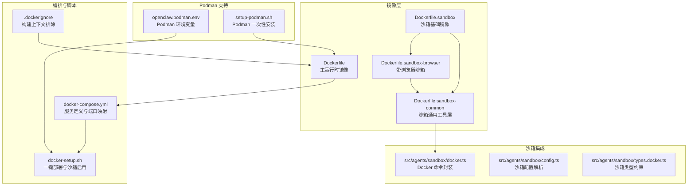
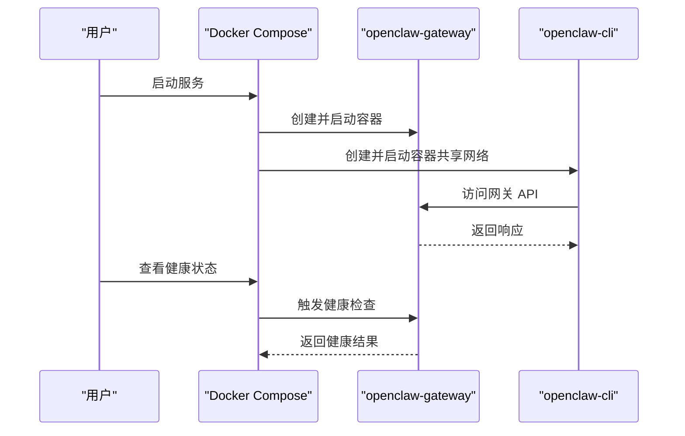
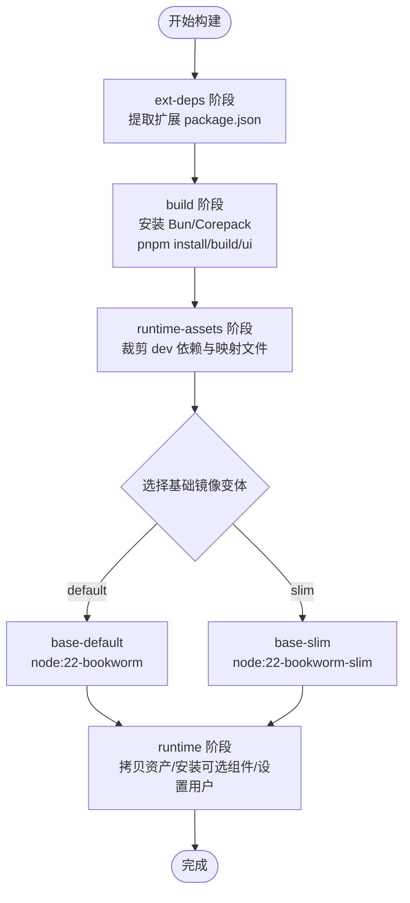
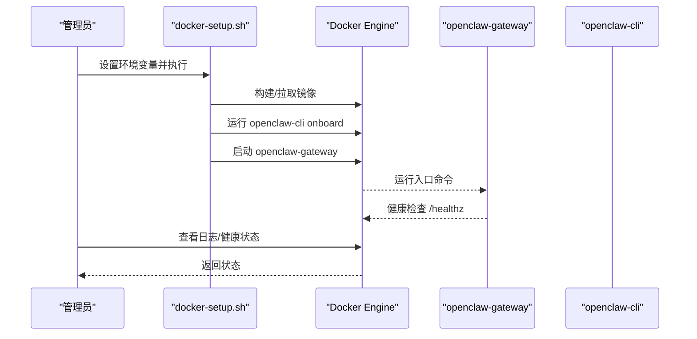
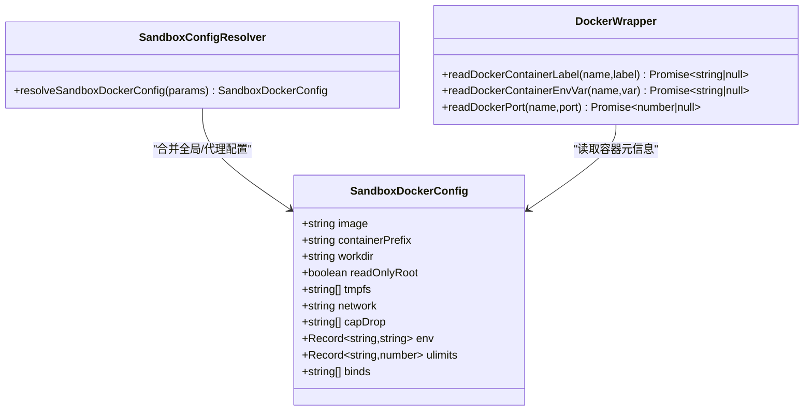
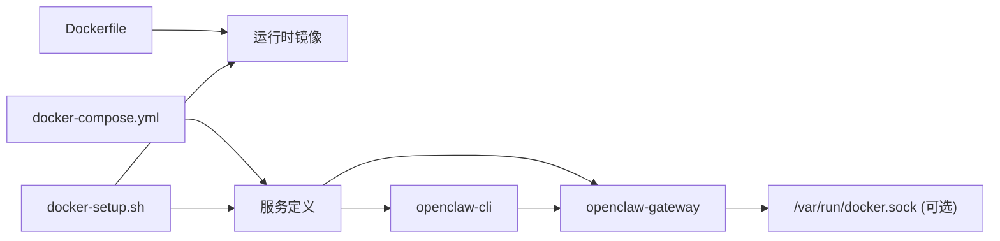

# Docker 容器化部署

<cite>
**本文引用的文件**   
- [Dockerfile](file://Dockerfile)
- [docker-compose.yml](file://docker-compose.yml)
- [.dockerignore](file://.dockerignore)
- [docker-setup.sh](file://docker-setup.sh)
- [Dockerfile.sandbox](file://Dockerfile.sandbox)
- [Dockerfile.sandbox-browser](file://Dockerfile.sandbox-browser)
- [Dockerfile.sandbox-common](file://Dockerfile.sandbox-common)
- [openclaw.podman.env](file://openclaw.podman.env)
- [setup-podman.sh](file://setup-podman.sh)
- [src/agents/sandbox/docker.ts](file://src/agents/sandbox/docker.ts)
- [src/agents/sandbox/config.ts](file://src/agents/sandbox/config.ts)
- [src/agents/sandbox/types.docker.ts](file://src/agents/sandbox/types.docker.ts)
</cite>

## 目录
1. [简介](#简介)
2. [项目结构](#项目结构)
3. [核心组件](#核心组件)
4. [架构总览](#架构总览)
5. [详细组件分析](#详细组件分析)
6. [依赖关系分析](#依赖关系分析)
7. [性能考虑](#性能考虑)
8. [故障排查指南](#故障排查指南)
9. [结论](#结论)
10. [附录](#附录)

## 简介
本文件面向在 Docker/Podman 环境中部署 OpenClaw 的工程与运维人员，系统性阐述容器编排、镜像构建、网关启动流程、代理沙箱集成、配置与持久化、性能调优以及监控与排障方法。内容基于仓库中的 Dockerfile、docker-compose.yml、docker-setup.sh 及相关沙箱实现源码进行提炼与归纳。

## 项目结构
围绕容器化部署的关键文件与目录如下：
- 镜像构建：Dockerfile（主运行时镜像）、Dockerfile.sandbox（沙箱基础镜像）、Dockerfile.sandbox-browser（带浏览器的沙箱镜像）、Dockerfile.sandbox-common（沙箱通用工具层）
- 编排与运行：docker-compose.yml、docker-setup.sh、.dockerignore
- Podman 对齐：openclaw.podman.env、setup-podman.sh
- 沙箱集成：src/agents/sandbox/*（Docker 命令封装、配置解析、类型约束）



**图表来源**
- [Dockerfile:1-231](file://Dockerfile#L1-L231)
- [docker-compose.yml:1-77](file://docker-compose.yml#L1-L77)
- [.dockerignore:1-65](file://.dockerignore#L1-L65)
- [docker-setup.sh:1-598](file://docker-setup.sh#L1-L598)
- [Dockerfile.sandbox:1-24](file://Dockerfile.sandbox#L1-L24)
- [Dockerfile.sandbox-browser:1-35](file://Dockerfile.sandbox-browser#L1-L35)
- [Dockerfile.sandbox-common:1-48](file://Dockerfile.sandbox-common#L1-L48)
- [openclaw.podman.env:1-25](file://openclaw.podman.env#L1-L25)
- [setup-podman.sh:1-313](file://setup-podman.sh#L1-L313)
- [src/agents/sandbox/docker.ts:191-242](file://src/agents/sandbox/docker.ts#L191-L242)
- [src/agents/sandbox/config.ts:76-92](file://src/agents/sandbox/config.ts#L76-L92)
- [src/agents/sandbox/types.docker.ts:1-13](file://src/agents/sandbox/types.docker.ts#L1-L13)

**章节来源**
- [Dockerfile:1-231](file://Dockerfile#L1-L231)
- [docker-compose.yml:1-77](file://docker-compose.yml#L1-L77)
- [.dockerignore:1-65](file://.dockerignore#L1-L65)
- [docker-setup.sh:1-598](file://docker-setup.sh#L1-L598)
- [Dockerfile.sandbox:1-24](file://Dockerfile.sandbox#L1-L24)
- [Dockerfile.sandbox-browser:1-35](file://Dockerfile.sandbox-browser#L1-L35)
- [Dockerfile.sandbox-common:1-48](file://Dockerfile.sandbox-common#L1-L48)
- [openclaw.podman.env:1-25](file://openclaw.podman.env#L1-L25)
- [setup-podman.sh:1-313](file://setup-podman.sh#L1-L313)
- [src/agents/sandbox/docker.ts:191-242](file://src/agents/sandbox/docker.ts#L191-L242)
- [src/agents/sandbox/config.ts:76-92](file://src/agents/sandbox/config.ts#L76-L92)
- [src/agents/sandbox/types.docker.ts:1-13](file://src/agents/sandbox/types.docker.ts#L1-L13)

## 核心组件
- 主运行时镜像（OpenClaw Gateway）：多阶段构建，最终以非 root 用户运行，内置健康检查与默认启动命令；支持通过构建参数注入系统包、浏览器与 Docker CLI。
- 编排服务（docker-compose.yml）：定义 openclaw-gateway 与 openclaw-cli 两个服务，前者暴露网关与桥接端口，后者复用其网络与安全上下文。
- 启动脚本（docker-setup.sh）：自动推断/生成网关 Token、写入 .env、修复宿主机挂载权限、执行首次引导、可选启用沙箱并挂载 Docker socket。
- 沙箱镜像族：提供最小沙箱、带浏览器沙箱与通用工具层，支持按需扩展。
- Podman 支持：提供环境模板与一次性安装脚本，便于在不使用 Docker 的环境中部署。

**章节来源**
- [Dockerfile:103-231](file://Dockerfile#L103-L231)
- [docker-compose.yml:1-77](file://docker-compose.yml#L1-L77)
- [docker-setup.sh:413-598](file://docker-setup.sh#L413-L598)
- [Dockerfile.sandbox:1-24](file://Dockerfile.sandbox#L1-L24)
- [Dockerfile.sandbox-browser:1-35](file://Dockerfile.sandbox-browser#L1-L35)
- [Dockerfile.sandbox-common:1-48](file://Dockerfile.sandbox-common#L1-L48)
- [openclaw.podman.env:1-25](file://openclaw.podman.env#L1-L25)
- [setup-podman.sh:258-313](file://setup-podman.sh#L258-L313)

## 架构总览
下图展示容器化部署的整体交互：Compose 启动网关与 CLI 服务，CLI 通过本地网络访问网关；当启用沙箱时，网关通过 Docker socket 在宿主机上创建受控容器执行任务。

```mermaid
graph TB
subgraph "宿主机"
U["用户/客户端"]
D["Docker/Podman 引擎"]
S["宿主机文件系统<br/>~/.openclaw 与 workspace"]
end
subgraph "容器编排"
GW["openclaw-gateway<br/>端口: 18789/18790"]
CLI["openclaw-cli<br/>复用 GW 网络"]
end
subgraph "沙箱"
SB["沙箱容器<br/>基于 openclaw-sandbox*"]
end
U --> GW
CLI --> GW
GW <- --> D
D --> SB
GW --> S
CLI --> S
```

**图表来源**
- [docker-compose.yml:1-77](file://docker-compose.yml#L1-L77)
- [docker-setup.sh:509-574](file://docker-setup.sh#L509-L574)
- [Dockerfile.sandbox:1-24](file://Dockerfile.sandbox#L1-L24)
- [Dockerfile.sandbox-browser:1-35](file://Dockerfile.sandbox-browser#L1-L35)

## 详细组件分析

### Docker Compose 编排配置
- 服务定义
  - openclaw-gateway：绑定端口 18789/18790，设置 HOME/TERM 等环境变量，挂载配置与工作区目录，启用 init 进程与重启策略，内置健康检查。
  - openclaw-cli：与网关共享网络，具备安全加固（cap_drop、no-new-privileges），复用环境变量，stdin/tty 打开以便交互式使用。
- 网络与端口
  - 默认通过端口映射对外暴露；如需从宿主或外部访问，需将绑定模式调整为允许外网访问并配置认证。
- 卷挂载策略
  - 将宿主上的配置目录与工作区目录挂载到容器内用户家目录下的对应路径，确保数据持久化与可移植。
- 环境变量
  - 包含 HOME、TERM、网关 Token、私有 WebSocket 允许标志及各渠道会话密钥等。



**图表来源**
- [docker-compose.yml:1-77](file://docker-compose.yml#L1-L77)

**章节来源**
- [docker-compose.yml:1-77](file://docker-compose.yml#L1-L77)

### 镜像构建流程
- 多阶段构建
  - ext-deps：仅复制所需扩展的 package.json，避免无关源码变更导致缓存失效。
  - build：安装 Bun/Corepack，拉取依赖，构建 UI 与后端产物，裁剪开发依赖与映射文件。
  - runtime-assets：产出最终运行时资产层。
  - base-default/base-slim：选择完整/精简基础镜像，标注 OCI 基础镜像元信息。
  - runtime：拷贝运行时资产，安装可选系统包、浏览器与 Playwright、Docker CLI，设置非 root 用户与入口命令。
- 构建参数
  - OPENCLAW_VARIANT：选择 bookworm 或 bookworm-slim。
  - OPENCLAW_EXTENSIONS：按空格分隔的扩展名列表，仅引入指定扩展的依赖。
  - OPENCLAW_DOCKER_APT_PACKAGES：追加安装的系统包。
  - OPENCLAW_INSTALL_BROWSER：预装 Chromium/Xvfb 并缓存 Playwright 浏览器。
  - OPENCLAW_INSTALL_DOCKER_CLI：安装 Docker CLI 以支持沙箱容器管理。
- 安全与体积优化
  - 使用非 root 用户运行；利用 apt 缓存与 pnpm store 缓存提升构建效率；清理开发产物减少镜像体积。



**图表来源**
- [Dockerfile:27-231](file://Dockerfile#L27-L231)

**章节来源**
- [Dockerfile:1-231](file://Dockerfile#L1-L231)
- [.dockerignore:1-65](file://.dockerignore#L1-L65)

### 容器化网关启动流程
- 初始化脚本职责
  - 推断/生成 OPENCLAW_GATEWAY_TOKEN（优先读取配置或 .env，否则随机生成）。
  - 写入 .env 并修复挂载目录权限，确保容器内 node 用户可写。
  - 执行首次引导（onboard），固定 gateway.mode=local 与 gateway.bind=lan（或传入值）。
  - 可选启用沙箱：构建沙箱镜像、校验 Docker CLI 可用性、挂载 Docker socket、写入沙箱配置并重启网关。
- 健康检查与故障恢复
  - 容器内置健康检查探针，通过 /healthz 与 /readyz 检查存活与就绪。
  - Compose 层也定义了健康检查策略，失败时由重启策略保证恢复。



**图表来源**
- [docker-setup.sh:413-598](file://docker-setup.sh#L413-L598)
- [Dockerfile:224-231](file://Dockerfile#L224-L231)
- [docker-compose.yml:38-49](file://docker-compose.yml#L38-L49)

**章节来源**
- [docker-setup.sh:235-256](file://docker-setup.sh#L235-L256)
- [docker-setup.sh:442-477](file://docker-setup.sh#L442-L477)
- [Dockerfile:224-231](file://Dockerfile#L224-L231)
- [docker-compose.yml:38-49](file://docker-compose.yml#L38-L49)

### 代理沙箱的 Docker 集成
- 沙箱镜像族
  - openclaw-sandbox:bookworm-slim（最小工具集）
  - openclaw-sandbox-browser：额外安装 Chromium/Xvfb/novnc/websockify 等，支持远程桌面与浏览器自动化
  - openclaw-sandbox-common：在基础镜像上安装 pnpm、bun、brew、常用语言与工具链
- 网络隔离与资源限制
  - 通过 Docker 命令封装读取容器标签、环境变量与端口映射，用于沙箱生命周期管理与可观测性。
  - 沙箱配置解析与类型约束确保必填项（镜像、前缀、工作目录、只读根、tmpfs、网络、能力降级）得到满足。
- 启用流程
  - docker-setup.sh 在确认 Docker CLI 可用后，挂载 /var/run/docker.sock 并写入 agents.defaults.sandbox.* 配置，随后重启网关使之生效。
  - 若前置条件不满足，脚本会回滚沙箱配置并移除 socket 挂载，避免暴露宿主权限。



**图表来源**
- [src/agents/sandbox/types.docker.ts:1-13](file://src/agents/sandbox/types.docker.ts#L1-L13)
- [src/agents/sandbox/config.ts:76-92](file://src/agents/sandbox/config.ts#L76-L92)
- [src/agents/sandbox/docker.ts:191-242](file://src/agents/sandbox/docker.ts#L191-L242)

**章节来源**
- [Dockerfile.sandbox:1-24](file://Dockerfile.sandbox#L1-L24)
- [Dockerfile.sandbox-browser:1-35](file://Dockerfile.sandbox-browser#L1-L35)
- [Dockerfile.sandbox-common:1-48](file://Dockerfile.sandbox-common#L1-L48)
- [docker-setup.sh:480-574](file://docker-setup.sh#L480-L574)
- [src/agents/sandbox/docker.ts:191-242](file://src/agents/sandbox/docker.ts#L191-L242)
- [src/agents/sandbox/config.ts:76-92](file://src/agents/sandbox/config.ts#L76-L92)
- [src/agents/sandbox/types.docker.ts:1-13](file://src/agents/sandbox/types.docker.ts#L1-L13)

### Docker 环境下的配置管理、持久化与性能调优
- 配置管理
  - 通过 .env 注入 OPENCLAW_GATEWAY_TOKEN、OPENCLAW_GATEWAY_BIND、OPENCLAW_CONFIG_DIR、OPENCLAW_WORKSPACE_DIR 等关键变量。
  - docker-setup.sh 自动写入 .env 并在必要时生成 Token，确保首次引导成功。
- 持久化存储
  - 将宿主机目录挂载到容器内用户家目录下的 .openclaw 与 workspace，实现配置与工作数据持久化。
  - 脚本在启动前对挂载点执行 chown，避免因宿主 UID 差异导致的权限问题。
- 性能调优
  - 构建阶段启用 pnpm store 与 apt 缓存，降低重复构建时间。
  - 可选预装浏览器与 Playwright，避免容器启动时的动态下载。
  - 选择 slim 基础镜像以减小镜像体积，按需添加 apt 包。

**章节来源**
- [docker-setup.sh:395-411](file://docker-setup.sh#L395-L411)
- [docker-setup.sh:430-444](file://docker-setup.sh#L430-L444)
- [Dockerfile:58-59](file://Dockerfile#L58-L59)
- [Dockerfile:122-126](file://Dockerfile#L122-L126)
- [Dockerfile:162-171](file://Dockerfile#L162-L171)

### 完整部署示例与监控配置
- 部署步骤（Docker）
  - 准备 OPENCLAW_GATEWAY_TOKEN（可由 docker-setup.sh 自动生成）。
  - 执行 docker-setup.sh，它会：
    - 构建或拉取镜像
    - 修复挂载权限
    - 首次引导（onboard）
    - 可选启用沙箱（需要 Docker CLI 与 socket 权限）
    - 启动 openclaw-gateway
  - 通过 docker compose logs/health 检查运行状态。
- 监控建议
  - 利用容器内置 /healthz 与 /readyz 探针。
  - 结合 Compose 的健康检查策略与重启策略，实现自愈。
  - 在生产环境结合外部监控系统（如 Prometheus/Grafana）采集容器指标与日志。

**章节来源**
- [docker-setup.sh:476-495](file://docker-setup.sh#L476-L495)
- [docker-compose.yml:38-49](file://docker-compose.yml#L38-L49)
- [Dockerfile:224-231](file://Dockerfile#L224-L231)

## 依赖关系分析
- 组件耦合
  - docker-compose.yml 依赖 Dockerfile 产出的镜像；docker-setup.sh 在本地构建时使用 Dockerfile。
  - 沙箱功能依赖 Docker CLI 与 /var/run/docker.sock；未满足时脚本会回滚。
  - CLI 服务复用网关服务的网络与安全上下文，降低跨服务通信复杂度。
- 外部依赖
  - Docker/Podman 引擎、Debian Bookworm 生态（apt 包）、Node.js 生态（Bun/pnpm）。



**图表来源**
- [Dockerfile:103-231](file://Dockerfile#L103-L231)
- [docker-compose.yml:1-77](file://docker-compose.yml#L1-L77)
- [docker-setup.sh:413-598](file://docker-setup.sh#L413-L598)

**章节来源**
- [Dockerfile:103-231](file://Dockerfile#L103-L231)
- [docker-compose.yml:1-77](file://docker-compose.yml#L1-L77)
- [docker-setup.sh:480-574](file://docker-setup.sh#L480-L574)

## 性能考虑
- 构建性能
  - 启用 pnpm store 与 apt 缓存，避免重复下载。
  - 使用 slim 基础镜像与按需安装系统包。
  - 预装浏览器与 Playwright，缩短冷启动时间。
- 运行性能
  - 非 root 用户运行降低逃逸风险，同时避免特权操作带来的额外开销。
  - 通过 Compose 的重启策略与健康检查实现快速自愈。

[本节为通用指导，无需特定文件引用]

## 故障排查指南
- 网关无法访问
  - 若使用默认桥接网络，请确认已将绑定模式改为允许外网访问，并配置认证令牌。
  - 使用 Compose 健康检查与容器内部 /healthz 探针定位问题。
- 权限错误（EACCES）
  - 确认宿主机挂载目录已由脚本修复权限；避免宿主以 root 创建子目录导致 UID 不一致。
- 沙箱不可用
  - 确认镜像已启用 Docker CLI（构建参数 OPENCLAW_INSTALL_DOCKER_CLI=1）且宿主机存在 /var/run/docker.sock。
  - 若条件不满足，脚本会回滚沙箱配置并移除 socket 挂载。
- Podman 环境
  - 使用 openclaw.podman.env 提供必要环境变量，通过 setup-podman.sh 一次性安装并加载镜像。

**章节来源**
- [docker-setup.sh:430-444](file://docker-setup.sh#L430-L444)
- [docker-setup.sh:497-505](file://docker-setup.sh#L497-L505)
- [docker-setup.sh:563-574](file://docker-setup.sh#L563-L574)
- [openclaw.podman.env:1-25](file://openclaw.podman.env#L1-L25)
- [setup-podman.sh:258-277](file://setup-podman.sh#L258-L277)

## 结论
本方案通过多阶段构建与最小化运行时镜像、严格的非 root 运行与健康检查、可选的沙箱集成与 Docker socket 安全挂载，提供了稳定、可扩展且易于维护的容器化部署路径。配合 docker-setup.sh 与 docker-compose.yml，可在不同环境下快速完成部署与运维。

[本节为总结性内容，无需特定文件引用]

## 附录
- 关键构建参数速览
  - OPENCLAW_VARIANT：选择 bookworm/bookworm-slim
  - OPENCLAW_EXTENSIONS：空格分隔的扩展名列表
  - OPENCLAW_DOCKER_APT_PACKAGES：追加 apt 包
  - OPENCLAW_INSTALL_BROWSER：预装浏览器与 Playwright
  - OPENCLAW_INSTALL_DOCKER_CLI：安装 Docker CLI
- 常用命令
  - docker compose up -d openclaw-gateway
  - docker compose logs -f openclaw-gateway
  - docker compose run --rm openclaw-cli health --token "<你的令牌>"

[本节为参考性内容，无需特定文件引用]