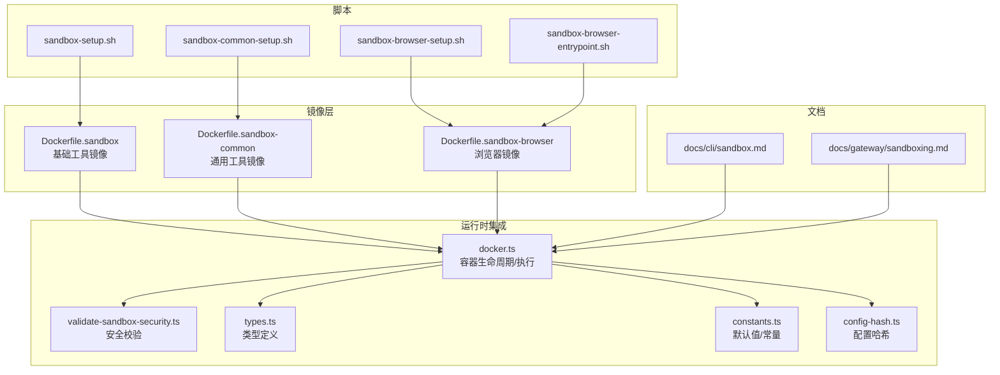
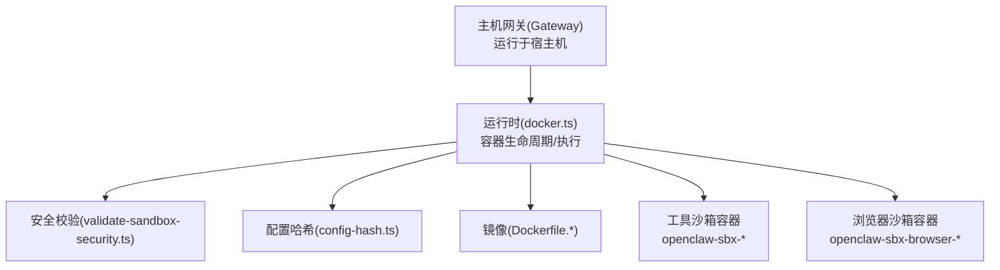
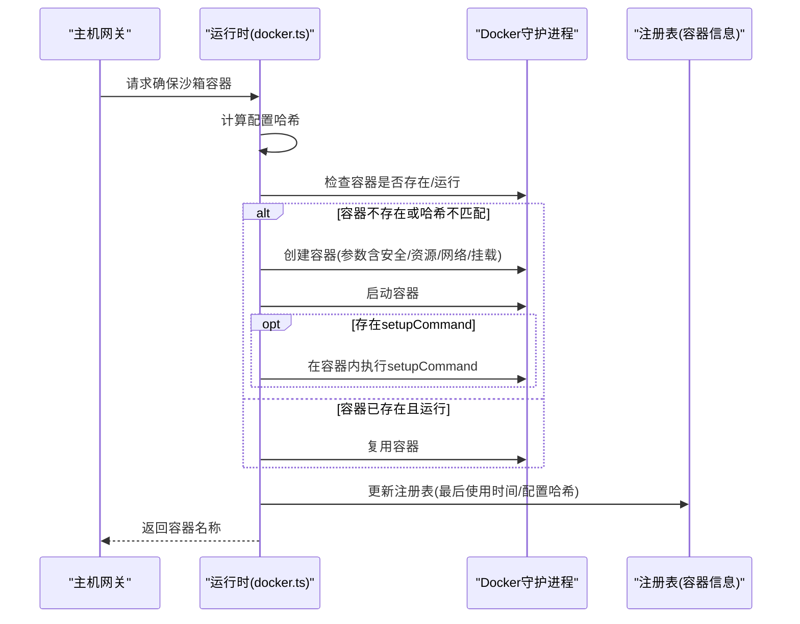
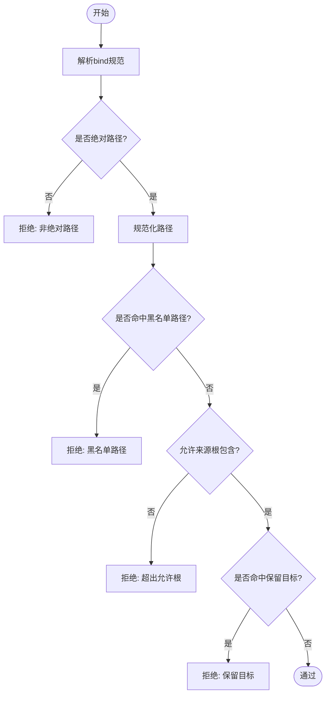
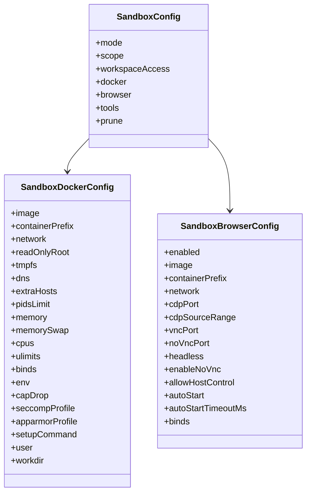
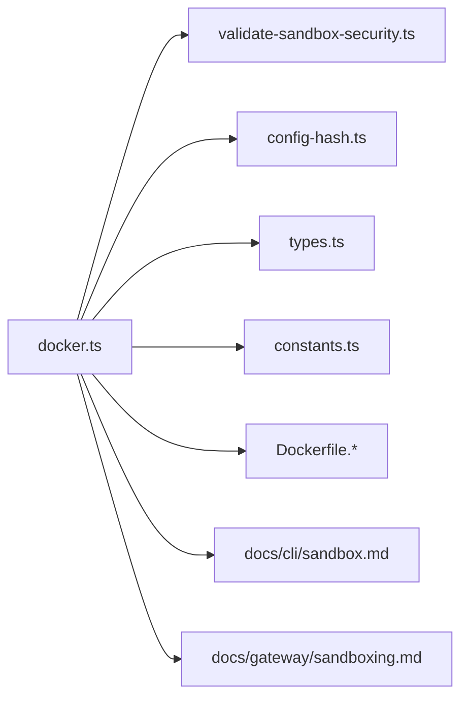

# Docker 沙箱集成

<cite>
**本文档引用的文件**
- [Dockerfile](file://Dockerfile)
- [Dockerfile.sandbox](file://Dockerfile.sandbox)
- [Dockerfile.sandbox-browser](file://Dockerfile.sandbox-browser)
- [Dockerfile.sandbox-common](file://Dockerfile.sandbox-common)
- [scripts/sandbox-browser-entrypoint.sh](file://scripts/sandbox-browser-entrypoint.sh)
- [scripts/sandbox-browser-setup.sh](file://scripts/sandbox-browser-setup.sh)
- [scripts/sandbox-common-setup.sh](file://scripts/sandbox-common-setup.sh)
- [scripts/sandbox-setup.sh](file://scripts/sandbox-setup.sh)
- [src/agents/sandbox/docker.ts](file://src/agents/sandbox/docker.ts)
- [src/agents/sandbox/validate-sandbox-security.ts](file://src/agents/sandbox/validate-sandbox-security.ts)
- [src/agents/sandbox/types.ts](file://src/agents/sandbox/types.ts)
- [src/agents/sandbox/constants.ts](file://src/agents/sandbox/constants.ts)
- [src/agents/sandbox/config-hash.ts](file://src/agents/sandbox/config-hash.ts)
- [docs/cli/sandbox.md](file://docs/cli/sandbox.md)
- [docs/gateway/sandboxing.md](file://docs/gateway/sandboxing.md)
</cite>

## 目录
1. [简介](#简介)
2. [项目结构](#项目结构)
3. [核心组件](#核心组件)
4. [架构总览](#架构总览)
5. [详细组件分析](#详细组件分析)
6. [依赖关系分析](#依赖关系分析)
7. [性能考量](#性能考量)
8. [故障排查指南](#故障排查指南)
9. [结论](#结论)
10. [附录](#附录)

## 简介
本文件面向需要在 Docker 环境中集成 OpenClaw 沙箱能力的用户与工程师，系统性阐述主机网关与 Docker 工具容器的协作机制，覆盖沙箱配置选项（隔离级别、资源限制、网络策略）、镜像构建与定制（浏览器沙箱与通用工具镜像）、生命周期管理与自动清理、故障恢复、多代理环境下的配置与权限控制，以及 OPENCLAW_SANDBOX 等关键环境变量的使用与最佳实践。

## 项目结构
围绕 Docker 沙箱的关键文件组织如下：
- 镜像定义：Dockerfile.sandbox、Dockerfile.sandbox-browser、Dockerfile.sandbox-common
- 运行时集成：src/agents/sandbox/docker.ts、validate-sandbox-security.ts、types.ts、constants.ts、config-hash.ts
- 浏览器容器入口与构建：scripts/sandbox-browser-entrypoint.sh、scripts/sandbox-browser-setup.sh、scripts/sandbox-common-setup.sh、scripts/sandbox-setup.sh
- 文档参考：docs/cli/sandbox.md、docs/gateway/sandboxing.md

**图表来源**
- [Dockerfile.sandbox:1-24](file://Dockerfile.sandbox#L1-L24)
- [Dockerfile.sandbox-common:1-48](file://Dockerfile.sandbox-common#L1-L48)
- [Dockerfile.sandbox-browser:1-35](file://Dockerfile.sandbox-browser#L1-L35)
- [src/agents/sandbox/docker.ts:1-568](file://src/agents/sandbox/docker.ts#L1-L568)
- [src/agents/sandbox/validate-sandbox-security.ts:1-344](file://src/agents/sandbox/validate-sandbox-security.ts#L1-L344)
- [src/agents/sandbox/types.ts:1-91](file://src/agents/sandbox/types.ts#L1-L91)
- [src/agents/sandbox/constants.ts:1-55](file://src/agents/sandbox/constants.ts#L1-L55)
- [src/agents/sandbox/config-hash.ts:1-57](file://src/agents/sandbox/config-hash.ts#L1-L57)
- [scripts/sandbox-setup.sh:1-8](file://scripts/sandbox-setup.sh#L1-L8)
- [scripts/sandbox-common-setup.sh:1-55](file://scripts/sandbox-common-setup.sh#L1-L55)
- [scripts/sandbox-browser-setup.sh:1-8](file://scripts/sandbox-browser-setup.sh#L1-L8)
- [scripts/sandbox-browser-entrypoint.sh:1-128](file://scripts/sandbox-browser-entrypoint.sh#L1-L128)
- [docs/cli/sandbox.md:1-153](file://docs/cli/sandbox.md#L1-L153)
- [docs/gateway/sandboxing.md:1-260](file://docs/gateway/sandboxing.md#L1-L260)

**章节来源**
- [Dockerfile.sandbox:1-24](file://Dockerfile.sandbox#L1-L24)
- [Dockerfile.sandbox-common:1-48](file://Dockerfile.sandbox-common#L1-L48)
- [Dockerfile.sandbox-browser:1-35](file://Dockerfile.sandbox-browser#L1-L35)
- [src/agents/sandbox/docker.ts:1-568](file://src/agents/sandbox/docker.ts#L1-L568)
- [src/agents/sandbox/validate-sandbox-security.ts:1-344](file://src/agents/sandbox/validate-sandbox-security.ts#L1-L344)
- [src/agents/sandbox/types.ts:1-91](file://src/agents/sandbox/types.ts#L1-L91)
- [src/agents/sandbox/constants.ts:1-55](file://src/agents/sandbox/constants.ts#L1-L55)
- [src/agents/sandbox/config-hash.ts:1-57](file://src/agents/sandbox/config-hash.ts#L1-L57)
- [scripts/sandbox-setup.sh:1-8](file://scripts/sandbox-setup.sh#L1-L8)
- [scripts/sandbox-common-setup.sh:1-55](file://scripts/sandbox-common-setup.sh#L1-L55)
- [scripts/sandbox-browser-setup.sh:1-8](file://scripts/sandbox-browser-setup.sh#L1-L8)
- [scripts/sandbox-browser-entrypoint.sh:1-128](file://scripts/sandbox-browser-entrypoint.sh#L1-L128)
- [docs/cli/sandbox.md:1-153](file://docs/cli/sandbox.md#L1-L153)
- [docs/gateway/sandboxing.md:1-260](file://docs/gateway/sandboxing.md#L1-L260)

## 核心组件
- 容器运行时接口：封装 Docker 命令调用、错误处理、超时与中止信号、镜像存在性检查、容器状态查询、标签与环境变量读取、端口映射解析等。
- 安全校验模块：对 bind mount 来源路径、保留目标路径、网络模式、安全配置（seccomp/apparmor）进行严格校验，阻断高危配置。
- 类型与常量：统一描述沙箱模式、作用域、工作区访问策略、浏览器配置、默认镜像与端口、注册表路径等。
- 配置哈希：对沙箱配置进行稳定哈希，用于判断容器是否需要重建以应用变更。
- 脚本与镜像：提供一键构建基础镜像、通用工具镜像与浏览器镜像的能力，并通过入口脚本启动浏览器容器。

**章节来源**
- [src/agents/sandbox/docker.ts:1-568](file://src/agents/sandbox/docker.ts#L1-L568)
- [src/agents/sandbox/validate-sandbox-security.ts:1-344](file://src/agents/sandbox/validate-sandbox-security.ts#L1-L344)
- [src/agents/sandbox/types.ts:1-91](file://src/agents/sandbox/types.ts#L1-L91)
- [src/agents/sandbox/constants.ts:1-55](file://src/agents/sandbox/constants.ts#L1-L55)
- [src/agents/sandbox/config-hash.ts:1-57](file://src/agents/sandbox/config-hash.ts#L1-L57)
- [scripts/sandbox-setup.sh:1-8](file://scripts/sandbox-setup.sh#L1-L8)
- [scripts/sandbox-common-setup.sh:1-55](file://scripts/sandbox-common-setup.sh#L1-L55)
- [scripts/sandbox-browser-setup.sh:1-8](file://scripts/sandbox-browser-setup.sh#L1-L8)
- [scripts/sandbox-browser-entrypoint.sh:1-128](file://scripts/sandbox-browser-entrypoint.sh#L1-L128)

## 架构总览
下图展示主机网关与 Docker 工具容器的协作流程：Gateway 在宿主机上运行，根据配置选择是否启用沙箱；当启用时，运行时通过 Docker 命令创建/复用沙箱容器，挂载工作区与必要 bind，设置安全与资源限制；浏览器沙箱独立于工具容器，通过专用网络与端口暴露 CDP/VNC/noVNC。

**图表来源**
- [src/agents/sandbox/docker.ts:1-568](file://src/agents/sandbox/docker.ts#L1-L568)
- [src/agents/sandbox/validate-sandbox-security.ts:1-344](file://src/agents/sandbox/validate-sandbox-security.ts#L1-L344)
- [src/agents/sandbox/config-hash.ts:1-57](file://src/agents/sandbox/config-hash.ts#L1-L57)
- [Dockerfile.sandbox:1-24](file://Dockerfile.sandbox#L1-L24)
- [Dockerfile.sandbox-common:1-48](file://Dockerfile.sandbox-common#L1-L48)
- [Dockerfile.sandbox-browser:1-35](file://Dockerfile.sandbox-browser#L1-L35)

## 详细组件分析

### 组件一：容器运行时与生命周期管理
- 关键职责
  - 解析并调用 docker 可执行程序（含 Windows 兼容处理）
  - 执行容器创建、启动、停止、删除、重启
  - 查询容器状态、标签、环境变量、端口映射
  - 确保镜像存在或拉取默认镜像并打标签
  - 计算配置哈希，按需重建容器以应用配置变更
  - 将工作区与自定义 bind 挂载到容器
  - 支持 setupCommand 一次性初始化命令
- 错误处理
  - 对 docker 命令不存在、非零退出码、中止信号进行统一处理
  - 提供 allowFailure 选项以容忍失败
- 性能与可靠性
  - 使用标签记录创建时间、会话键、配置哈希，便于自动清理与热容器保护窗口
  - 通过配置哈希避免不必要的重建，提升迭代效率

**图表来源**
- [src/agents/sandbox/docker.ts:492-567](file://src/agents/sandbox/docker.ts#L492-L567)

**章节来源**
- [src/agents/sandbox/docker.ts:1-568](file://src/agents/sandbox/docker.ts#L1-L568)

### 组件二：安全校验与隔离策略
- bind mount 校验
  - 拒绝危险来源路径（如 /etc、/proc、/sys、/dev、/run*、/var/run*、/var/run/docker.sock 等）
  - 拒绝覆盖根目录或包含系统目录的挂载
  - 拒绝非绝对路径与保留目标路径（如 /workspace、/agent）
  - 支持允许来源根列表与“危险覆盖”豁免开关
- 网络模式校验
  - 默认禁止 host 网络与 container:* 命名空间加入
  - 提供危险开关仅在完全信任时启用
- 安全配置校验
  - 禁止 unconfined 的 seccomp/apparmor 配置
- 以上规则在容器创建前强制执行，防止配置注入与逃逸风险

**图表来源**
- [src/agents/sandbox/validate-sandbox-security.ts:96-281](file://src/agents/sandbox/validate-sandbox-security.ts#L96-L281)

**章节来源**
- [src/agents/sandbox/validate-sandbox-security.ts:1-344](file://src/agents/sandbox/validate-sandbox-security.ts#L1-L344)

### 组件三：沙箱配置与镜像定制
- 配置项概览
  - 模式：off/non-main/all
  - 作用域：session/agent/shared
  - 工作区访问：none/ro/rw
  - Docker 镜像、容器前缀、网络、只读根、tmpfs、DNS、hosts、pids 限制、内存/CPU、ulimit、binds、env、cap-drop、seccomp/apparmor、setupCommand
  - 浏览器：镜像、网络、CDP/VNC/noVNC 端口、自动启动、无头模式、绑定、CDP 源范围、宿主控制
- 镜像构建
  - 基础工具镜像：包含 bash、curl、git、jq、python3、ripgrep 等
  - 通用工具镜像：在基础镜像上安装 pnpm、bun、brew、常用语言与工具链
  - 浏览器镜像：安装 Chromium、Xvfb、noVNC、x11vnc、websockify 等，暴露 CDP/VNC/noVNC 端口
- 环境变量与入口
  - 浏览器容器入口脚本支持多种环境变量控制 CDP/VNC/noVNC、无头模式、禁用图形标志、扩展禁用、渲染进程限制、禁用沙箱等
  - 默认网络为 none，可通过配置覆盖

**图表来源**
- [src/agents/sandbox/types.ts:55-91](file://src/agents/sandbox/types.ts#L55-L91)
- [src/agents/sandbox/constants.ts:39-48](file://src/agents/sandbox/constants.ts#L39-L48)

**章节来源**
- [src/agents/sandbox/types.ts:1-91](file://src/agents/sandbox/types.ts#L1-L91)
- [src/agents/sandbox/constants.ts:1-55](file://src/agents/sandbox/constants.ts#L1-L55)
- [Dockerfile.sandbox:1-24](file://Dockerfile.sandbox#L1-L24)
- [Dockerfile.sandbox-common:1-48](file://Dockerfile.sandbox-common#L1-L48)
- [Dockerfile.sandbox-browser:1-35](file://Dockerfile.sandbox-browser#L1-L35)
- [scripts/sandbox-browser-entrypoint.sh:1-128](file://scripts/sandbox-browser-entrypoint.sh#L1-L128)

### 组件四：OPENCLAW_SANDBOX 与 Docker 网关集成
- OPENCLAW_SANDBOX=1（或 true/yes/on）可启用 Docker 网关部署下的沙箱路径
- 可通过 OPENCLAW_DOCKER_SOCKET 指定 Docker 套接字位置
- docker-setup.sh 可引导沙箱相关配置
- 运行时在容器内调用 docker 命令时，会解析并执行 docker（Windows 上进行兼容处理）

**章节来源**
- [docs/gateway/sandboxing.md:194-197](file://docs/gateway/sandboxing.md#L194-L197)
- [src/agents/sandbox/docker.ts:46-65](file://src/agents/sandbox/docker.ts#L46-L65)

### 组件五：自动清理与故障恢复
- 注册表记录容器创建时间、最后使用时间、镜像与配置哈希
- 热容器保护窗口（默认 5 分钟）：最近使用的容器在配置变化时提示重建，避免中断当前任务
- 非热容器在配置哈希不匹配时直接删除旧容器并重建
- CLI 提供 sandbox recreate 命令，支持按会话、按代理或全部重建
- 自动清理策略：空闲超过 idleHours 或存在超过 maxAgeDays 的容器会被清理

**章节来源**
- [src/agents/sandbox/docker.ts:492-567](file://src/agents/sandbox/docker.ts#L492-L567)
- [src/agents/sandbox/constants.ts:10-11](file://src/agents/sandbox/constants.ts#L10-L11)
- [docs/cli/sandbox.md:47-121](file://docs/cli/sandbox.md#L47-L121)

### 组件六：多代理环境与权限控制
- 每个代理可独立覆盖沙箱与工具策略（agents.list[].sandbox 与 agents.list[].tools）
- 工具策略在沙箱规则之前生效：若被全局或代理层面拒绝，则沙箱不会放行
- elevated 是显式逃逸通道，直接在宿主执行，绕过沙箱
- 多代理场景下建议：
  - 使用 scope: "agent" 或 "session" 以隔离不同代理的工作区与资源
  - 为敏感代理开启更严格的 workspaceAccess（如 ro/rw 与 binds 限制）
  - 通过 per-agent binds 与 setupCommand 为特定代理提供所需工具链

**章节来源**
- [docs/gateway/sandboxing.md:233-237](file://docs/gateway/sandboxing.md#L233-L237)
- [docs/gateway/sandboxing.md:218-226](file://docs/gateway/sandboxing.md#L218-L226)

## 依赖关系分析
- 运行时依赖 Docker 命令可用性；当 docker 不在 PATH 中时，会返回明确的错误提示
- 安全校验前置，任何不合规配置都会在创建阶段被阻止
- 配置哈希决定是否重建容器，避免频繁重建带来的开销
- 浏览器容器与工具容器分别管理，互不影响但共享默认网络策略

**图表来源**
- [src/agents/sandbox/docker.ts:1-568](file://src/agents/sandbox/docker.ts#L1-L568)
- [src/agents/sandbox/validate-sandbox-security.ts:1-344](file://src/agents/sandbox/validate-sandbox-security.ts#L1-L344)
- [src/agents/sandbox/config-hash.ts:1-57](file://src/agents/sandbox/config-hash.ts#L1-L57)
- [src/agents/sandbox/types.ts:1-91](file://src/agents/sandbox/types.ts#L1-L91)
- [src/agents/sandbox/constants.ts:1-55](file://src/agents/sandbox/constants.ts#L1-L55)
- [docs/cli/sandbox.md:1-153](file://docs/cli/sandbox.md#L1-L153)
- [docs/gateway/sandboxing.md:1-260](file://docs/gateway/sandboxing.md#L1-L260)

**章节来源**
- [src/agents/sandbox/docker.ts:1-568](file://src/agents/sandbox/docker.ts#L1-L568)
- [src/agents/sandbox/validate-sandbox-security.ts:1-344](file://src/agents/sandbox/validate-sandbox-security.ts#L1-L344)
- [src/agents/sandbox/config-hash.ts:1-57](file://src/agents/sandbox/config-hash.ts#L1-L57)
- [src/agents/sandbox/types.ts:1-91](file://src/agents/sandbox/types.ts#L1-L91)
- [src/agents/sandbox/constants.ts:1-55](file://src/agents/sandbox/constants.ts#L1-L55)
- [docs/cli/sandbox.md:1-153](file://docs/cli/sandbox.md#L1-L153)
- [docs/gateway/sandboxing.md:1-260](file://docs/gateway/sandboxing.md#L1-L260)

## 性能考量
- 镜像层优化：基础镜像采用 Debian bookworm-slim，减少体积；通过缓存 apt 与 pnpm store 提升构建速度
- 容器复用：通过配置哈希与注册表记录，避免不必要的重建；热容器保护窗口降低频繁重建对用户体验的影响
- 资源限制：合理设置 pids/memory/CPU/ulimit，防止单个代理占用过多资源影响其他任务
- 网络隔离：默认 no network，按需开启 bridge 或自定义网络，减少不必要的出站流量与攻击面

## 故障排查指南
- Docker 命令不可用
  - 现象：报错提示需要安装 Docker 或关闭沙箱
  - 处理：安装 Docker 并确保 docker 命令在 PATH 中；或设置 agents.defaults.sandbox.mode=off
  - 参考：运行时错误处理与友好提示
- 配置变更未生效
  - 现象：更新镜像或配置后容器仍使用旧设置
  - 处理：使用 openclaw sandbox recreate 强制重建；或等待自动清理与下次使用时重建
  - 参考：配置哈希与自动清理逻辑
- bind 挂载被拒绝
  - 现象：提示 bind mount 使用了非绝对路径、超出允许根或命中保留目标
  - 处理：修正为绝对路径并确保在允许根内；避免挂载系统关键目录；必要时使用危险开关（仅在完全信任时）
  - 参考：安全校验规则
- 网络模式被阻止
  - 现象：host 或 container:* 网络模式被拒绝
  - 处理：改用 bridge 或 none；如确需 join 容器命名空间，使用危险开关
  - 参考：网络模式校验
- 浏览器容器无法连接
  - 现象：CDP/noVNC 无法访问
  - 处理：确认端口映射、网络、CDP 源范围、无头模式与密码；检查容器日志
  - 参考：浏览器入口脚本与默认端口

**章节来源**
- [src/agents/sandbox/docker.ts:105-151](file://src/agents/sandbox/docker.ts#L105-L151)
- [src/agents/sandbox/docker.ts:492-567](file://src/agents/sandbox/docker.ts#L492-L567)
- [src/agents/sandbox/validate-sandbox-security.ts:182-281](file://src/agents/sandbox/validate-sandbox-security.ts#L182-L281)
- [src/agents/sandbox/validate-sandbox-security.ts:283-306](file://src/agents/sandbox/validate-sandbox-security.ts#L283-L306)
- [scripts/sandbox-browser-entrypoint.sh:1-128](file://scripts/sandbox-browser-entrypoint.sh#L1-L128)
- [docs/cli/sandbox.md:47-121](file://docs/cli/sandbox.md#L47-L121)

## 结论
通过严格的运行时封装、全面的安全校验、灵活的配置与镜像体系，以及完善的自动清理与故障恢复机制，OpenClaw 的 Docker 沙箱在保证安全性的同时，提供了良好的可维护性与可扩展性。建议在生产环境中优先采用最小权限原则与严格的 workspaceAccess 策略，并结合 per-agent 覆盖与工具策略，实现多代理场景下的精细化治理。

## 附录
- 快速开始
  - 构建基础镜像：scripts/sandbox-setup.sh
  - 构建通用工具镜像：scripts/sandbox-common-setup.sh
  - 构建浏览器镜像：scripts/sandbox-browser-setup.sh
- 常用 CLI
  - openclaw sandbox explain/list/recreate
- 环境变量
  - OPENCLAW_SANDBOX、OPENCLAW_DOCKER_SOCKET（Docker 网关部署）

**章节来源**
- [scripts/sandbox-setup.sh:1-8](file://scripts/sandbox-setup.sh#L1-L8)
- [scripts/sandbox-common-setup.sh:1-55](file://scripts/sandbox-common-setup.sh#L1-L55)
- [scripts/sandbox-browser-setup.sh:1-8](file://scripts/sandbox-browser-setup.sh#L1-L8)
- [docs/cli/sandbox.md:1-153](file://docs/cli/sandbox.md#L1-L153)
- [docs/gateway/sandboxing.md:194-197](file://docs/gateway/sandboxing.md#L194-L197)