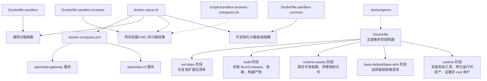
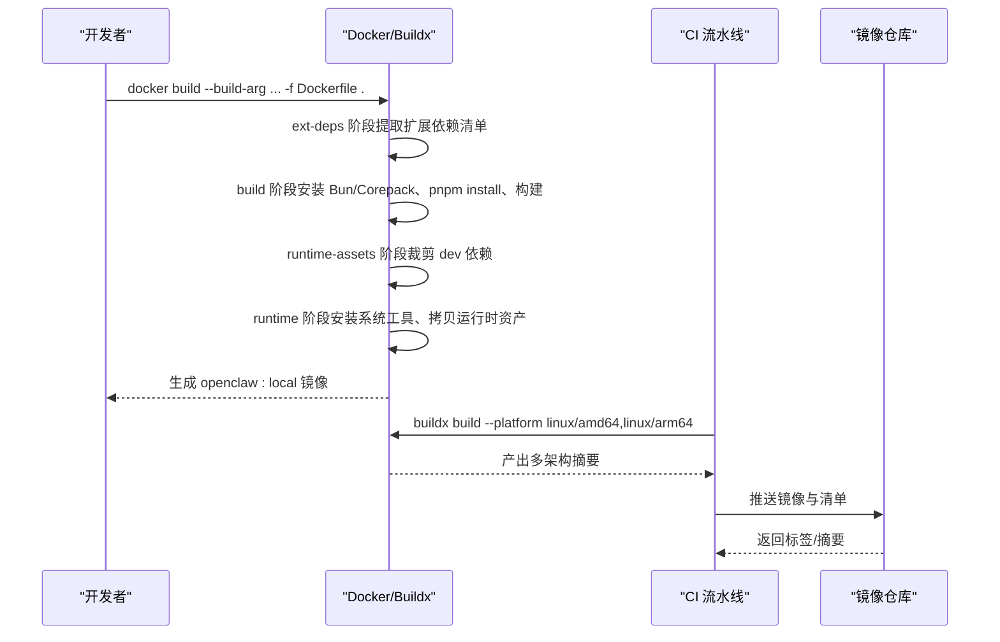
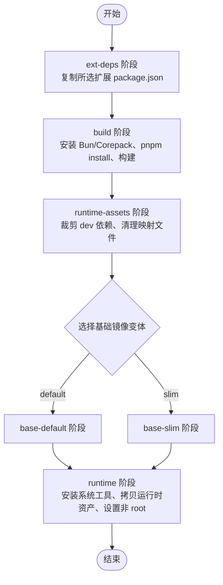
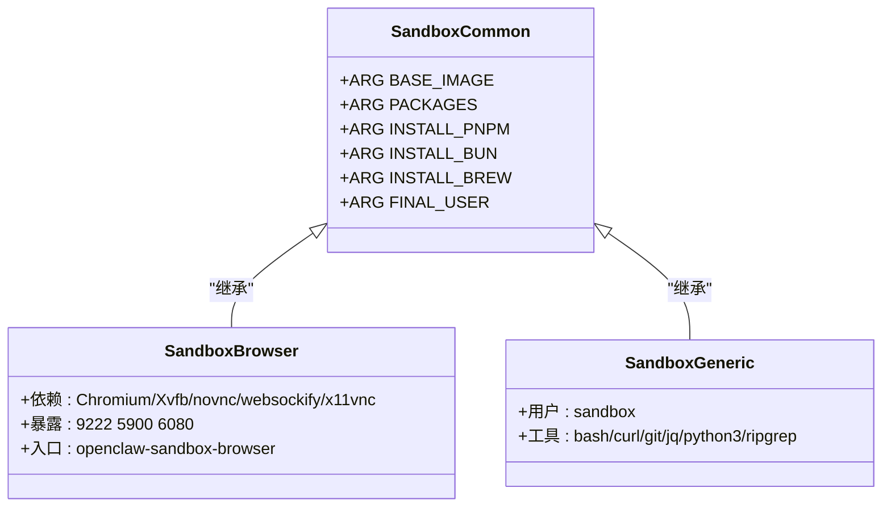
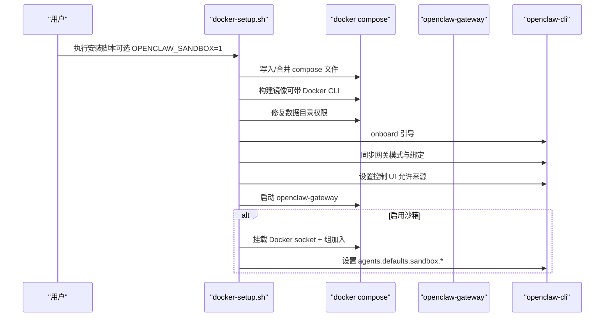
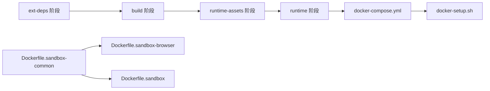

# Docker 镜像构建

<cite>
**本文档引用的文件**
- [Dockerfile](file://Dockerfile)
- [Dockerfile.sandbox](file://Dockerfile.sandbox)
- [Dockerfile.sandbox-browser](file://Dockerfile.sandbox-browser)
- [Dockerfile.sandbox-common](file://Dockerfile.sandbox-common)
- [.dockerignore](file://.dockerignore)
- [docker-compose.yml](file://docker-compose.yml)
- [docker-setup.sh](file://docker-setup.sh)
- [scripts/sandbox-browser-entrypoint.sh](file://scripts/sandbox-browser-entrypoint.sh)
- [scripts/sandbox-setup.sh](file://scripts/sandbox-setup.sh)
- [scripts/sandbox-common-setup.sh](file://scripts/sandbox-common-setup.sh)
- [openclaw.podman.env](file://openclaw.podman.env)
- [scripts/podman/openclaw.container.in](file://scripts/podman/openclaw.container.in)
- [src/docker-build-cache.test.ts](file://src/docker-build-cache.test.ts)
- [src/dockerfile.test.ts](file://src/dockerfile.test.ts)
- [src/docker-image-digests.test.ts](file://src/docker-image-digests.test.ts)
- [.github/workflows/docker-release.yml](file://.github/workflows/docker-release.yml)
</cite>

## 目录
1. [简介](#简介)
2. [项目结构](#项目结构)
3. [核心组件](#核心组件)
4. [架构总览](#架构总览)
5. [详细组件分析](#详细组件分析)
6. [依赖关系分析](#依赖关系分析)
7. [性能考量](#性能考量)
8. [故障排除指南](#故障排除指南)
9. [结论](#结论)
10. [附录](#附录)

## 简介
本文件系统性阐述 OpenClaw 的 Docker 镜像构建流程与最佳实践，覆盖基础镜像选择、多阶段构建、依赖管理、沙箱镜像的安全配置与工具安装、镜像优化策略（层缓存、体积与构建时长）、自定义镜像创建与发布/版本管理/更新策略，并对比主镜像与沙箱镜像在构建目标与优化重点上的差异。

## 项目结构
与 Docker 构建相关的核心文件与脚本分布如下：
- 主镜像构建：Dockerfile（多阶段构建）、.dockerignore（构建上下文优化）
- 沙箱镜像族：Dockerfile.sandbox（通用）、Dockerfile.sandbox-browser（带浏览器与 VNC）、Dockerfile.sandbox-common（可定制化基础）
- 运行编排：docker-compose.yml（服务编排与健康检查）、docker-setup.sh（一键安装与沙箱启用）
- 安全与工具：scripts/sandbox-browser-entrypoint.sh（浏览器/远程访问入口）、scripts/sandbox-setup.sh 与 scripts/sandbox-common-setup.sh（沙箱镜像构建）
- 平台适配：openclaw.podman.env 与 scripts/podman/openclaw.container.in（Podman Quadlet）
- 质量保障：src/docker-build-cache.test.ts、src/dockerfile.test.ts、src/docker-image-digests.test.ts（测试用例）
- 发布流水线：.github/workflows/docker-release.yml（跨架构镜像清单）

**图表来源**
- [Dockerfile:1-231](file://Dockerfile#L1-L231)
- [Dockerfile.sandbox:1-24](file://Dockerfile.sandbox#L1-L24)
- [Dockerfile.sandbox-browser:1-35](file://Dockerfile.sandbox-browser#L1-L35)
- [Dockerfile.sandbox-common:1-48](file://Dockerfile.sandbox-common#L1-L48)
- [docker-compose.yml:1-77](file://docker-compose.yml#L1-L77)
- [docker-setup.sh:1-598](file://docker-setup.sh#L1-L598)
- [.dockerignore:1-65](file://.dockerignore#L1-L65)
- [scripts/sandbox-browser-entrypoint.sh:1-128](file://scripts/sandbox-browser-entrypoint.sh#L1-L128)

**章节来源**
- [Dockerfile:1-231](file://Dockerfile#L1-L231)
- [Dockerfile.sandbox:1-24](file://Dockerfile.sandbox#L1-L24)
- [Dockerfile.sandbox-browser:1-35](file://Dockerfile.sandbox-browser#L1-L35)
- [Dockerfile.sandbox-common:1-48](file://Dockerfile.sandbox-common#L1-L48)
- [docker-compose.yml:1-77](file://docker-compose.yml#L1-L77)
- [docker-setup.sh:1-598](file://docker-setup.sh#L1-L598)
- [.dockerignore:1-65](file://.dockerignore#L1-L65)

## 核心组件
- 多阶段主镜像构建：通过 ext-deps 提取扩展依赖清单、build 完成构建、runtime-assets 裁剪、最终 runtime 基于默认或 slim 变体生成。
- 沙箱镜像族：通用沙箱、带浏览器/VNC 的沙箱、可定制化沙箱基础镜像，支持按需安装 pnpm/bun/Linuxbrew 等工具。
- 运行时环境：非 root 用户执行、健康检查、可选安装浏览器与 Docker CLI、暴露探针端点。
- 构建上下文与缓存：.dockerignore 限制无关文件、pnpm 缓存挂载、分层缓存策略。
- 发布与验证：CI 使用 buildx 创建多架构清单、测试用例验证缓存布局与基础镜像固定。

**章节来源**
- [Dockerfile:1-231](file://Dockerfile#L1-L231)
- [Dockerfile.sandbox:1-24](file://Dockerfile.sandbox#L1-L24)
- [Dockerfile.sandbox-browser:1-35](file://Dockerfile.sandbox-browser#L1-L35)
- [Dockerfile.sandbox-common:1-48](file://Dockerfile.sandbox-common#L1-L48)
- [src/docker-build-cache.test.ts:1-36](file://src/docker-build-cache.test.ts#L1-L36)
- [src/dockerfile.test.ts:1-69](file://src/dockerfile.test.ts#L1-L69)
- [src/docker-image-digests.test.ts:36-98](file://src/docker-image-digests.test.ts#L36-L98)

## 架构总览
下图展示从源码到运行容器的关键路径，以及沙箱镜像如何与主镜像协作：

**图表来源**
- [Dockerfile:1-231](file://Dockerfile#L1-L231)
- [.github/workflows/docker-release.yml:282-308](file://.github/workflows/docker-release.yml#L282-L308)

## 详细组件分析

### 主镜像（Dockerfile）分析
- 基础镜像与变体
  - 固定 SHA256 的 node:22-bookworm 与 bookworm-slim，确保可复现性；通过 OPENCLAW_VARIANT 切换默认或 slim。
  - 通过 OPENCLAW_NODE_BOOKWORM_IMAGE/OPENCLAW_NODE_BOOKWORM_SLIM_IMAGE 与对应 digest 参数集中管理基础镜像。
- 多阶段设计
  - ext-deps：仅复制所选扩展的 package.json，避免无关扩展变更导致缓存失效。
  - build：安装 Bun 与 Corepack，使用 pnpm 缓存挂载安装依赖，构建 UI 与主程序。
  - runtime-assets：裁剪开发依赖并删除类型/映射文件，缩小体积。
  - runtime：根据变体安装必要系统工具，拷贝运行时资产，设置非 root 用户，暴露健康检查端点。
- 可选增强
  - OPENCLAW_DOCKER_APT_PACKAGES：按需安装系统包。
  - OPENCLAW_INSTALL_BROWSER：预装 Chromium 与 Playwright，减少容器启动等待。
  - OPENCLAW_INSTALL_DOCKER_CLI：安装 Docker CLI，配合沙箱功能。
- 运行参数
  - 默认以非 root 用户运行，健康检查探活，命令启动网关服务。

**图表来源**
- [Dockerfile:1-231](file://Dockerfile#L1-L231)

**章节来源**
- [Dockerfile:1-231](file://Dockerfile#L1-L231)
- [src/dockerfile.test.ts:10-24](file://src/dockerfile.test.ts#L10-L24)
- [src/docker-image-digests.test.ts:75-85](file://src/docker-image-digests.test.ts#L75-L85)

### 沙箱镜像族分析
- 通用沙箱（Dockerfile.sandbox）
  - 基于 Debian bookworm-slim，安装常用工具，创建 sandbox 用户，CMD 保持容器存活。
- 带浏览器的沙箱（Dockerfile.sandbox-browser）
  - 在通用基础上增加 Chromium、Xvfb、novnc、websockify、x11vnc 等，暴露调试端口，提供 scripts/sandbox-browser-entrypoint.sh 入口。
- 可定制化沙箱基础（Dockerfile.sandbox-common）
  - 支持通过 ARG 注入包列表、是否安装 pnpm/bun/Linuxbrew、最终用户等，作为更灵活的沙箱基础镜像。

**图表来源**
- [Dockerfile.sandbox-common:1-48](file://Dockerfile.sandbox-common#L1-L48)
- [Dockerfile.sandbox-browser:1-35](file://Dockerfile.sandbox-browser#L1-L35)
- [Dockerfile.sandbox:1-24](file://Dockerfile.sandbox#L1-L24)

**章节来源**
- [Dockerfile.sandbox:1-24](file://Dockerfile.sandbox#L1-L24)
- [Dockerfile.sandbox-browser:1-35](file://Dockerfile.sandbox-browser#L1-L35)
- [Dockerfile.sandbox-common:1-48](file://Dockerfile.sandbox-common#L1-L48)
- [scripts/sandbox-browser-entrypoint.sh:1-128](file://scripts/sandbox-browser-entrypoint.sh#L1-L128)

### 运行编排与一键安装（docker-compose.yml 与 docker-setup.sh）
- docker-compose.yml
  - openclaw-gateway：绑定端口、健康检查、持久化配置与工作区目录、可选挂载 Docker socket 实现沙箱容器管理。
  - openclaw-cli：网络模式共享、安全能力限制、TTY/交互式、入口指向 CLI。
- docker-setup.sh
  - 自动检测与校验环境、生成/注入 .env、构建镜像、修复数据目录权限、引导首次 onboarding、可选启用沙箱（含 Docker socket 挂载与策略回滚）。

**图表来源**
- [docker-compose.yml:1-77](file://docker-compose.yml#L1-L77)
- [docker-setup.sh:1-598](file://docker-setup.sh#L1-L598)

**章节来源**
- [docker-compose.yml:1-77](file://docker-compose.yml#L1-L77)
- [docker-setup.sh:1-598](file://docker-setup.sh#L1-L598)

### 构建上下文与缓存策略（.dockerignore 与测试）
- .dockerignore
  - 排除大体积与无关文件，保留构建 Canvas A2UI 所需的最小子集，显著缩小构建上下文。
- 测试验证
  - docker-build-cache.test.ts：断言依赖安装早于全量复制，保证缓存稳定性。
  - dockerfile.test.ts：断言使用共享 pnpm store 缓存挂载。
  - docker-image-digests.test.ts：断言基础镜像固定到不可变摘要。

**章节来源**
- [.dockerignore:1-65](file://.dockerignore#L1-L65)
- [src/docker-build-cache.test.ts:1-36](file://src/docker-build-cache.test.ts#L1-L36)
- [src/dockerfile.test.ts:24-36](file://src/dockerfile.test.ts#L24-L36)
- [src/docker-image-digests.test.ts:75-85](file://src/docker-image-digests.test.ts#L75-L85)

### 发布与版本管理（CI 与清单）
- CI 使用 buildx 为 amd64 与 arm64 分别构建摘要，再通过 imagetools 创建多架构清单，统一标签。
- 建议策略
  - 语义化版本标签（如 v2026.3.10）同时维护 latest、slim 与 slim:latest 双标签策略。
  - 对于多架构镜像，优先推送清单而非单平台镜像，确保跨架构透明拉取。

**章节来源**
- [.github/workflows/docker-release.yml:282-308](file://.github/workflows/docker-release.yml#L282-L308)

## 依赖关系分析
- 组件耦合
  - 主镜像依赖 ext-deps 的“仅清单”层，降低无关变更对缓存的影响。
  - 沙箱镜像族通过 Dockerfile.sandbox-common 提供统一可配置入口，便于复用与定制。
- 外部依赖
  - 基础镜像固定摘要，上游更新需手动同步。
  - pnpm 缓存挂载提升重复构建速度。
- 潜在循环依赖
  - 构建脚本与镜像之间无直接循环，但沙箱启用需要 Docker CLI，需在主镜像中显式安装。

**图表来源**
- [Dockerfile:1-231](file://Dockerfile#L1-L231)
- [Dockerfile.sandbox-common:1-48](file://Dockerfile.sandbox-common#L1-L48)
- [Dockerfile.sandbox-browser:1-35](file://Dockerfile.sandbox-browser#L1-L35)
- [Dockerfile.sandbox:1-24](file://Dockerfile.sandbox#L1-L24)
- [docker-compose.yml:1-77](file://docker-compose.yml#L1-L77)
- [docker-setup.sh:1-598](file://docker-setup.sh#L1-L598)

**章节来源**
- [Dockerfile:1-231](file://Dockerfile#L1-L231)
- [Dockerfile.sandbox-common:1-48](file://Dockerfile.sandbox-common#L1-L48)
- [Dockerfile.sandbox-browser:1-35](file://Dockerfile.sandbox-browser#L1-L35)
- [Dockerfile.sandbox:1-24](file://Dockerfile.sandbox#L1-L24)
- [docker-compose.yml:1-77](file://docker-compose.yml#L1-L77)
- [docker-setup.sh:1-598](file://docker-setup.sh#L1-L598)

## 性能考量
- 层缓存策略
  - 将 pnpm install 放置在 COPY 依赖清单之后，COPY 源码之前，避免源码变更导致缓存失效。
  - 使用共享 pnpm store 挂载，加速重复构建。
- 体积优化
  - runtime-assets 阶段裁剪 dev 依赖与类型/映射文件。
  - 选择 slim 变体基础镜像，按需安装系统包。
- 构建时间减少
  - ext-deps 仅复制扩展清单，避免无关源码参与解析。
  - .dockerignore 限制构建上下文，仅保留必要的资源。
- 运行时体验
  - 可选预装浏览器与 Playwright，减少容器启动后首次安装耗时。
  - 非 root 用户运行，降低逃逸风险，同时兼容大多数部署场景。

**章节来源**
- [Dockerfile:56-84](file://Dockerfile#L56-L84)
- [Dockerfile.sandbox-common:24-44](file://Dockerfile.sandbox-common#L24-L44)
- [.dockerignore:1-65](file://.dockerignore#L1-L65)
- [src/docker-build-cache.test.ts:12-22](file://src/docker-build-cache.test.ts#L12-L22)
- [src/dockerfile.test.ts:24-36](file://src/dockerfile.test.ts#L24-L36)

## 故障排除指南
- 构建失败（OOM/Killed）
  - 在 pnpm install 中限制内存上限，缓解小规格 VM 上的 OOM。
- 构建上下文过大
  - 确认 .dockerignore 已正确排除无关文件，尤其是大型二进制与构建产物。
- 沙箱无法启动
  - 确保主镜像已安装 Docker CLI（OPENCLAW_INSTALL_DOCKER_CLI=1），并在 compose 中挂载 Docker socket。
  - 若沙箱配置不完整，脚本会回滚并移除沙箱覆盖层，避免暴露 socket。
- 健康检查失败
  - 检查网关绑定模式与端口映射，loopback 绑定在桥接网络下对外不可达，建议使用 host 网络或改为 lan 并设置认证。
- 基础镜像更新
  - 当上游基础镜像更新时，需同步更新摘要与对应 ARG，测试用例会验证摘要固定。

**章节来源**
- [Dockerfile:56-59](file://Dockerfile#L56-L59)
- [.dockerignore:1-65](file://.dockerignore#L1-L65)
- [docker-setup.sh:497-534](file://docker-setup.sh#L497-L534)
- [docker-compose.yml:15-22](file://docker-compose.yml#L15-L22)
- [src/docker-image-digests.test.ts:75-85](file://src/docker-image-digests.test.ts#L75-L85)

## 结论
该构建体系通过多阶段与固定摘要的基础镜像，结合分层缓存与上下文瘦身，实现了稳定、可复现且高效的镜像构建。主镜像聚焦运行时最小化与安全基线，沙箱镜像族提供灵活的隔离与工具链支持。配合 CI 多架构清单与一键安装脚本，可快速落地生产环境。

## 附录

### 自定义镜像创建与配置选项
- 主镜像
  - 变体选择：通过 OPENCLAW_VARIANT 切换 default/slim。
  - 扩展依赖：通过 OPENCLAW_EXTENSIONS 传入扩展目录名，仅复制其 package.json。
  - 系统包：通过 OPENCLAW_DOCKER_APT_PACKAGES 注入。
  - 浏览器：通过 OPENCLAW_INSTALL_BROWSER 预装 Chromium 与 Playwright。
  - Docker CLI：通过 OPENCLAW_INSTALL_DOCKER_CLI 安装，启用沙箱功能。
- 沙箱镜像
  - 通用：Dockerfile.sandbox
  - 带浏览器：Dockerfile.sandbox-browser + scripts/sandbox-browser-entrypoint.sh
  - 可定制化：Dockerfile.sandbox-common，支持 PACKAGES、INSTALL_*、FINAL_USER 等参数。

**章节来源**
- [Dockerfile:15-20](file://Dockerfile#L15-L20)
- [Dockerfile:148-203](file://Dockerfile#L148-L203)
- [Dockerfile.sandbox-common:10-16](file://Dockerfile.sandbox-common#L10-L16)
- [scripts/sandbox-browser-entrypoint.sh:1-128](file://scripts/sandbox-browser-entrypoint.sh#L1-L128)

### 发布、版本管理与更新策略
- 版本标签
  - 使用语义化版本（如 vYYYY.MM.DD 或内部版本号），维护 latest、slim 与 slim:latest。
- 多架构清单
  - CI 使用 buildx 为 amd64 与 arm64 构建摘要，再创建清单，统一标签。
- 更新策略
  - 基础镜像更新需同步摘要；上游依赖更新通过 Dependabot 触发，测试用例验证固定摘要与缓存挂载。

**章节来源**
- [.github/workflows/docker-release.yml:282-308](file://.github/workflows/docker-release.yml#L282-L308)
- [src/docker-image-digests.test.ts:87-98](file://src/docker-image-digests.test.ts#L87-L98)

### Podman 平台适配
- openclaw.podman.env：定义网关令牌、端口映射与可选提供商凭据。
- scripts/podman/openclaw.container.in：Quadlet 模板，使用 rootless 命名空间与本地环境文件。

**章节来源**
- [openclaw.podman.env:1-25](file://openclaw.podman.env#L1-L25)
- [scripts/podman/openclaw.container.in:1-29](file://scripts/podman/openclaw.container.in#L1-L29)