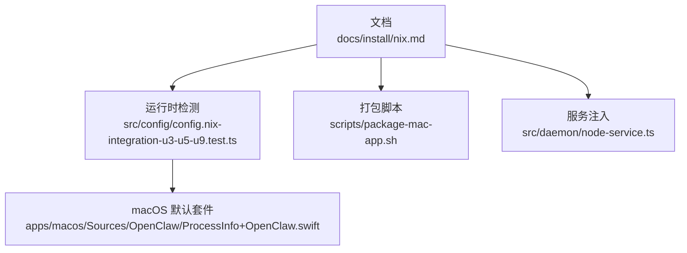
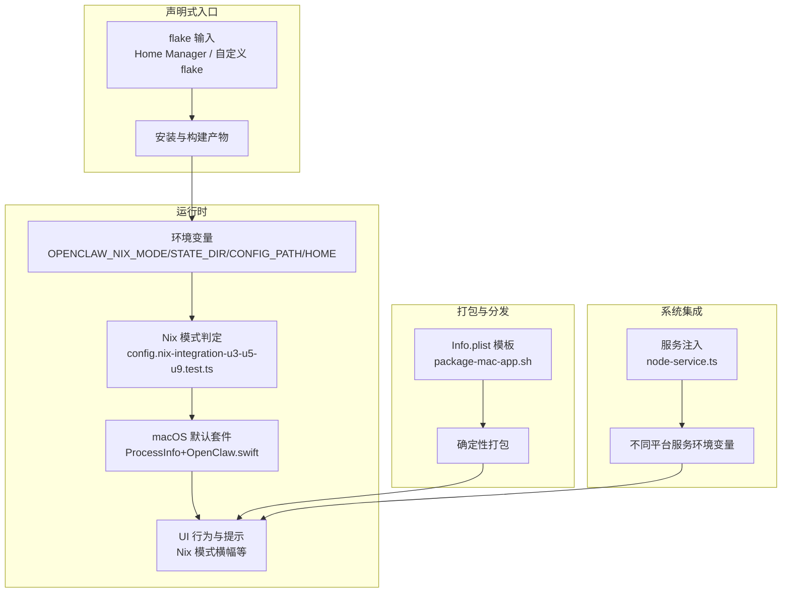
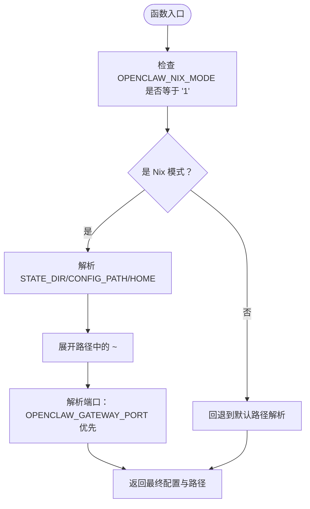
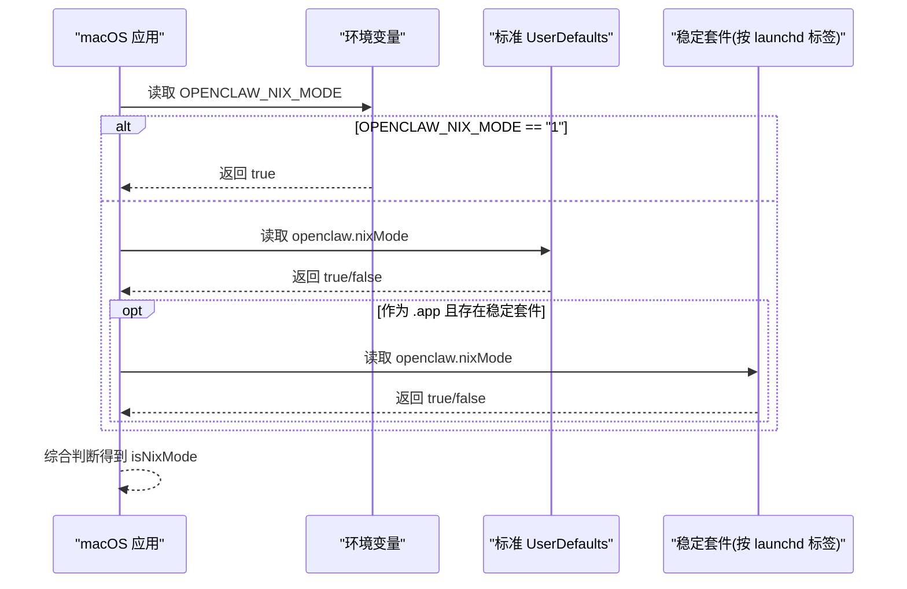
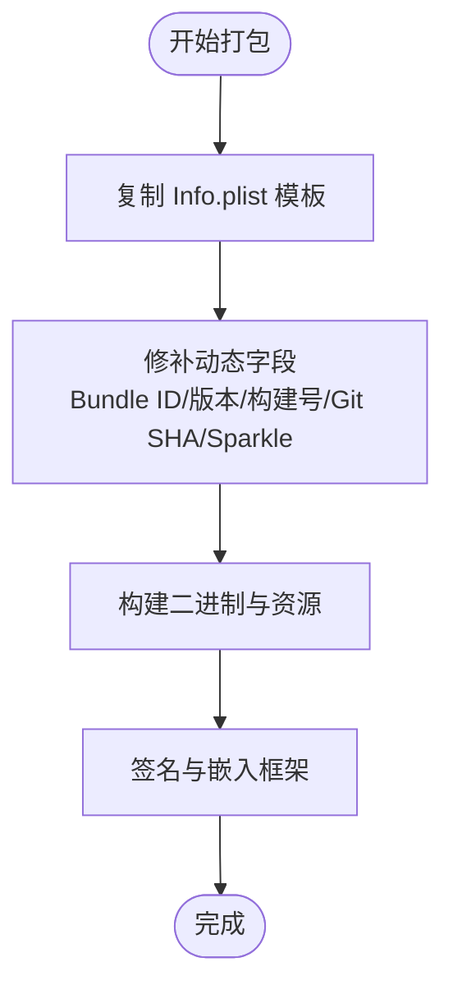
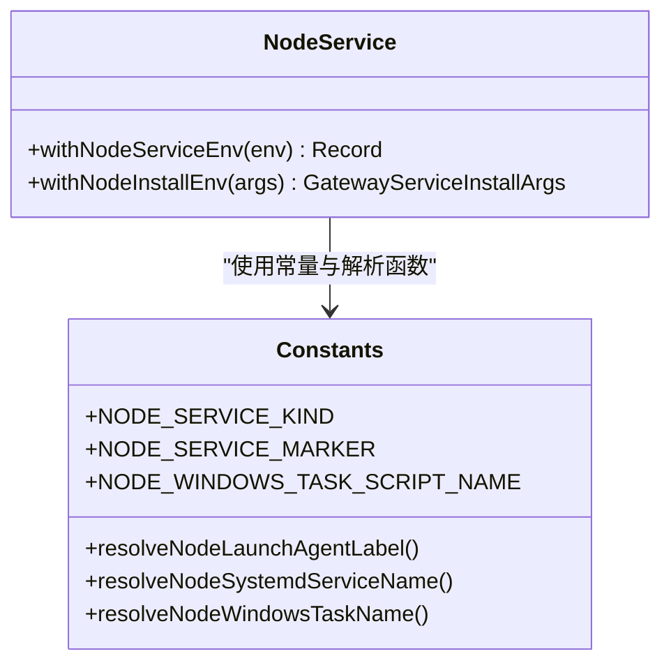
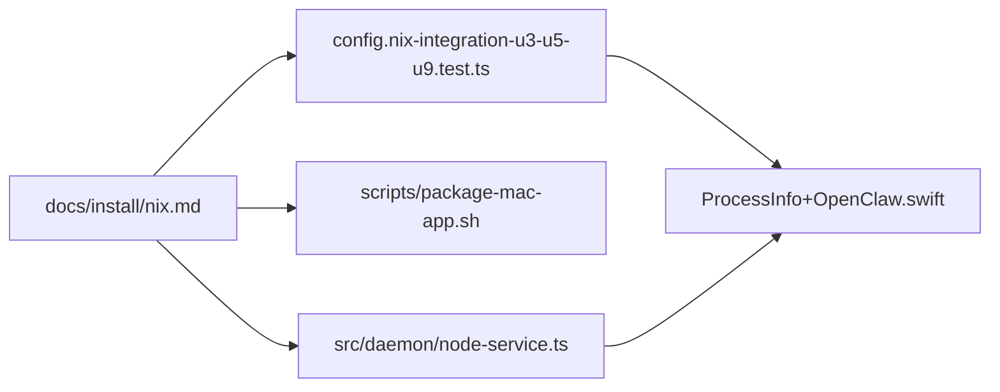

# Nix 声明式部署

<cite>
**本文引用的文件**
- [docs/install/nix.md](file://docs/install/nix.md)
- [src/config/config.nix-integration-u3-u5-u9.test.ts](file://src/config/config.nix-integration-u3-u5-u9.test.ts)
- [apps/macos/Sources/OpenClaw/ProcessInfo+OpenClaw.swift](file://apps/macos/Sources/OpenClaw/ProcessInfo+OpenClaw.swift)
- [scripts/package-mac-app.sh](file://scripts/package-mac-app.sh)
- [src/daemon/node-service.ts](file://src/daemon/node-service.ts)
</cite>

## 目录
1. [简介](#简介)
2. [项目结构](#项目结构)
3. [核心组件](#核心组件)
4. [架构总览](#架构总览)
5. [详细组件分析](#详细组件分析)
6. [依赖关系分析](#依赖关系分析)
7. [性能考虑](#性能考虑)
8. [故障排除指南](#故障排除指南)
9. [结论](#结论)
10. [附录](#附录)

## 简介
本文件面向在 Nix/NixOS 或通过 Home Manager 部署 OpenClaw 的用户与维护者，系统性阐述如何以声明式方式构建、运行与打包 OpenClaw，并结合仓库内现有 Nix 模式支持（环境变量、路径解析、macOS 默认套件等）给出可落地的实践建议。内容覆盖：
- Nix 工作原理与声明式配置要点
- flake 输入、输出与开发环境设置
- 构建、测试与打包流程
- 系统级部署（服务、权限、集成）
- 最佳实践与性能优化
- 故障排除与常见问题

## 项目结构
与 Nix 声明式部署直接相关的关键位置：
- 文档：docs/install/nix.md 提供 Nix 安装与模式行为说明
- 运行时检测：src/config/config.nix-integration-u3-u5-u9.test.ts 展示 Nix 模式识别与路径解析逻辑
- macOS 默认套件：apps/macos/Sources/OpenClaw/ProcessInfo+OpenClaw.swift 支持跨 bundle-id 的稳定 Nix 模式识别
- 打包脚本：scripts/package-mac-app.sh 使用 Info.plist 模板确保打包确定性
- 服务注入：src/daemon/node-service.ts 在不同平台注入服务相关环境变量

**图表来源**
- [docs/install/nix.md:1-99](file://docs/install/nix.md#L1-L99)
- [src/config/config.nix-integration-u3-u5-u9.test.ts:1-265](file://src/config/config.nix-integration-u3-u5-u9.test.ts#L1-L265)
- [apps/macos/Sources/OpenClaw/ProcessInfo+OpenClaw.swift:1-49](file://apps/macos/Sources/OpenClaw/ProcessInfo+OpenClaw.swift#L1-L49)
- [scripts/package-mac-app.sh:1-288](file://scripts/package-mac-app.sh#L1-L288)
- [src/daemon/node-service.ts:1-42](file://src/daemon/node-service.ts#L1-L42)

**章节来源**
- [docs/install/nix.md:1-99](file://docs/install/nix.md#L1-L99)
- [src/config/config.nix-integration-u3-u5-u9.test.ts:1-265](file://src/config/config.nix-integration-u3-u5-u9.test.ts#L1-L265)
- [apps/macos/Sources/OpenClaw/ProcessInfo+OpenClaw.swift:1-49](file://apps/macos/Sources/OpenClaw/ProcessInfo+OpenClaw.swift#L1-L49)
- [scripts/package-mac-app.sh:1-288](file://scripts/package-mac-app.sh#L1-L288)
- [src/daemon/node-service.ts:1-42](file://src/daemon/node-service.ts#L1-L42)

## 核心组件
- Nix 模式开关与路径解析：通过环境变量 OPENCLAW_NIX_MODE 控制，配合 OPENCLAW_STATE_DIR、OPENCLAW_CONFIG_PATH、OPENCLAW_HOME 实现对状态与配置的显式定位，避免写入不可变存储。
- macOS 默认套件兼容：在应用 bundle 外部变化时，仍可通过稳定的 UserDefaults 套件读取 Nix 模式标记，保证 UI 与行为一致性。
- 打包确定性：macOS 打包脚本从固定模板复制并修补 Info.plist 字段，确保 SwiftPM 打包与 Nix 构建的一致性。
- 平台服务注入：在不同操作系统上注入服务相关环境变量，便于统一管理服务生命周期。

**章节来源**
- [docs/install/nix.md:46-81](file://docs/install/nix.md#L46-L81)
- [src/config/config.nix-integration-u3-u5-u9.test.ts:36-118](file://src/config/config.nix-integration-u3-u5-u9.test.ts#L36-L118)
- [apps/macos/Sources/OpenClaw/ProcessInfo+OpenClaw.swift:9-35](file://apps/macos/Sources/OpenClaw/ProcessInfo+OpenClaw.swift#L9-L35)
- [scripts/package-mac-app.sh:168-188](file://scripts/package-mac-app.sh#L168-L188)
- [src/daemon/node-service.ts:12-42](file://src/daemon/node-service.ts#L12-L42)

## 架构总览
下图展示 Nix 模式下的关键交互：用户通过 Home Manager/自定义 flake 引入 OpenClaw；运行时根据环境变量与默认套件决定是否启用 Nix 模式；配置与状态路径由环境变量显式控制；打包阶段使用 Info.plist 模板确保确定性；服务层在不同平台注入统一的服务环境变量。

**图表来源**
- [docs/install/nix.md:14-43](file://docs/install/nix.md#L14-L43)
- [src/config/config.nix-integration-u3-u5-u9.test.ts:36-53](file://src/config/config.nix-integration-u3-u5-u9.test.ts#L36-L53)
- [apps/macos/Sources/OpenClaw/ProcessInfo+OpenClaw.swift:9-35](file://apps/macos/Sources/OpenClaw/ProcessInfo+OpenClaw.swift#L9-L35)
- [scripts/package-mac-app.sh:168-188](file://scripts/package-mac-app.sh#L168-L188)
- [src/daemon/node-service.ts:12-42](file://src/daemon/node-service.ts#L12-L42)

## 详细组件分析

### 组件一：Nix 模式与路径解析
- 功能要点
  - 仅当 OPENCLAW_NIX_MODE=1 时启用 Nix 模式（严格匹配“1”，非空字符串即视为开启）
  - 配置路径优先级：OPENCLAW_CONFIG_PATH > STATE_DIR 下默认 openclaw.json > HOME 下默认 .openclaw/openclaw.json
  - 状态目录优先级：OPENCLAW_STATE_DIR > OPENCLAW_HOME 下 .openclaw
  - 支持路径中的波浪号展开（如 ~/plugins/demo-plugin）
  - 端口解析：OPENCLAW_GATEWAY_PORT 优先于配置文件中的 gateway.port
- 设计考量
  - 显式路径控制避免写入 Nix 不可变 store
  - 严格的布尔判定减少误判
  - 路径展开提升用户配置灵活性

**图表来源**
- [src/config/config.nix-integration-u3-u5-u9.test.ts:36-220](file://src/config/config.nix-integration-u3-u5-u9.test.ts#L36-L220)

**章节来源**
- [src/config/config.nix-integration-u3-u5-u9.test.ts:36-220](file://src/config/config.nix-integration-u3-u5-u9.test.ts#L36-L220)
- [docs/install/nix.md:46-81](file://docs/install/nix.md#L46-L81)

### 组件二：macOS 默认套件与 Nix 模式识别
- 功能要点
  - 优先检查环境变量 OPENCLAW_NIX_MODE=1
  - 其次检查标准 UserDefaults 中的 openclaw.nixMode
  - 在作为 .app 运行时，检查稳定套件（launchd 标签对应的套件）中的 openclaw.nixMode
  - 避免本地测试环境误触发
- 设计考量
  - 跨 bundle-id 场景保持一致的 Nix 模式感知
  - 仅在应用包环境中查询稳定套件，避免开发者机器干扰测试

**图表来源**
- [apps/macos/Sources/OpenClaw/ProcessInfo+OpenClaw.swift:9-35](file://apps/macos/Sources/OpenClaw/ProcessInfo+OpenClaw.swift#L9-L35)

**章节来源**
- [apps/macos/Sources/OpenClaw/ProcessInfo+OpenClaw.swift:9-35](file://apps/macos/Sources/OpenClaw/ProcessInfo+OpenClaw.swift#L9-L35)

### 组件三：打包脚本与 Info.plist 模板
- 功能要点
  - 从固定模板复制 Info.plist 并修补动态字段（Bundle ID、版本、构建号、Git SHA、Sparkle 配置等）
  - 用于 SwiftPM 打包与 Nix 构建的一致性，无需完整 Xcode 工具链
- 设计考量
  - 将动态元数据注入到模板中，确保构建产物可复现且可审计
  - 保留 Sparkle 更新相关配置以便后续分发

**图表来源**
- [scripts/package-mac-app.sh:168-188](file://scripts/package-mac-app.sh#L168-L188)

**章节来源**
- [scripts/package-mac-app.sh:168-188](file://scripts/package-mac-app.sh#L168-L188)
- [docs/install/nix.md:82-92](file://docs/install/nix.md#L82-L92)

### 组件四：服务注入与平台适配
- 功能要点
  - 在不同平台注入服务相关环境变量（如 launchd、systemd、Windows 任务名称等）
  - 统一服务标记与日志前缀，便于运维与诊断
- 设计考量
  - 通过统一的注入函数在各平台上保持一致的行为契约

**图表来源**
- [src/daemon/node-service.ts:12-42](file://src/daemon/node-service.ts#L12-L42)

**章节来源**
- [src/daemon/node-service.ts:12-42](file://src/daemon/node-service.ts#L12-L42)

## 依赖关系分析
- 文档驱动：docs/install/nix.md 为用户与维护者提供权威的 Nix 模式说明与路径约定
- 运行时依赖：config.nix-integration-u3-u5-u9.test.ts 提供 Nix 模式识别与路径解析的实现依据
- 平台适配：ProcessInfo+OpenClaw.swift 保障 macOS 在不同 bundle 环境下的行为一致性
- 打包依赖：package-mac-app.sh 依赖 Info.plist 模板以确保确定性
- 系统集成：node-service.ts 为多平台服务提供统一注入点

**图表来源**
- [docs/install/nix.md:1-99](file://docs/install/nix.md#L1-L99)
- [src/config/config.nix-integration-u3-u5-u9.test.ts:1-265](file://src/config/config.nix-integration-u3-u5-u9.test.ts#L1-L265)
- [apps/macos/Sources/OpenClaw/ProcessInfo+OpenClaw.swift:1-49](file://apps/macos/Sources/OpenClaw/ProcessInfo+OpenClaw.swift#L1-L49)
- [scripts/package-mac-app.sh:1-288](file://scripts/package-mac-app.sh#L1-L288)
- [src/daemon/node-service.ts:1-42](file://src/daemon/node-service.ts#L1-L42)

**章节来源**
- [docs/install/nix.md:1-99](file://docs/install/nix.md#L1-L99)
- [src/config/config.nix-integration-u3-u5-u9.test.ts:1-265](file://src/config/config.nix-integration-u3-u5-u9.test.ts#L1-L265)
- [apps/macos/Sources/OpenClaw/ProcessInfo+OpenClaw.swift:1-49](file://apps/macos/Sources/OpenClaw/ProcessInfo+OpenClaw.swift#L1-L49)
- [scripts/package-mac-app.sh:1-288](file://scripts/package-mac-app.sh#L1-L288)
- [src/daemon/node-service.ts:1-42](file://src/daemon/node-service.ts#L1-L42)

## 性能考虑
- 构建缓存与增量编译
  - 利用 Nix 的可复现实验室特性，将构建步骤拆分为可缓存单元，减少重复编译时间
- 打包确定性
  - 通过 Info.plist 模板与固定字段修补，避免因工具链差异导致的二次打包
- 服务启动与资源占用
  - 统一服务注入减少平台差异带来的额外开销
- 路径解析与 I/O
  - 显式路径避免不必要的目录扫描与回退逻辑，降低启动时延

## 故障排除指南
- 症状：Nix 模式未生效
  - 排查项
    - 确认环境变量 OPENCLAW_NIX_MODE=1 已正确设置
    - macOS：确认通过 defaults 写入 ai.openclaw.mac 套件中的 openclaw.nixMode
  - 参考
    - [docs/install/nix.md:46-62](file://docs/install/nix.md#L46-L62)
    - [apps/macos/Sources/OpenClaw/ProcessInfo+OpenClaw.swift:17-25](file://apps/macos/Sources/OpenClaw/ProcessInfo+OpenClaw.swift#L17-L25)
- 症状：配置或状态路径异常
  - 排查项
    - 明确设置 OPENCLAW_STATE_DIR 与 OPENCLAW_CONFIG_PATH，避免写入不可变 store
    - 检查路径中的 ~ 是否被正确展开
  - 参考
    - [docs/install/nix.md:64-74](file://docs/install/nix.md#L64-L74)
    - [src/config/config.nix-integration-u3-u5-u9.test.ts:55-118](file://src/config/config.nix-integration-u3-u5-u9.test.ts#L55-L118)
- 症状：打包后应用无法更新或签名异常
  - 排查项
    - 确认 Info.plist 模板存在且修补字段完整
    - 确保签名脚本正常执行
  - 参考
    - [scripts/package-mac-app.sh:168-188](file://scripts/package-mac-app.sh#L168-L188)
- 症状：服务在不同平台启动失败
  - 排查项
    - 检查服务注入的平台变量是否正确传入
  - 参考
    - [src/daemon/node-service.ts:12-42](file://src/daemon/node-service.ts#L12-L42)

**章节来源**
- [docs/install/nix.md:46-74](file://docs/install/nix.md#L46-L74)
- [apps/macos/Sources/OpenClaw/ProcessInfo+OpenClaw.swift:17-25](file://apps/macos/Sources/OpenClaw/ProcessInfo+OpenClaw.swift#L17-L25)
- [src/config/config.nix-integration-u3-u5-u9.test.ts:55-118](file://src/config/config.nix-integration-u3-u5-u9.test.ts#L55-L118)
- [scripts/package-mac-app.sh:168-188](file://scripts/package-mac-app.sh#L168-L188)
- [src/daemon/node-service.ts:12-42](file://src/daemon/node-service.ts#L12-L42)

## 结论
通过 Nix 的声明式能力，OpenClaw 可以在多平台上实现可复现、可回滚与可审计的部署。结合严格的 Nix 模式识别、显式路径控制、确定性打包与平台化服务注入，能够显著提升生产稳定性与可维护性。建议在实际部署中遵循本文的最佳实践，并在出现问题时参考故障排除指南快速定位。

## 附录
- 快速参考
  - 启用 Nix 模式：导出 OPENCLAW_NIX_MODE=1；macOS 可通过 defaults 写入稳定套件
  - 设置状态与配置路径：OPENCLAW_STATE_DIR、OPENCLAW_CONFIG_PATH、OPENCLAW_HOME
  - 打包：使用 Info.plist 模板修补动态字段，确保 Sparkle 配置与签名正确
  - 服务：在不同平台注入统一的服务环境变量，便于统一管理