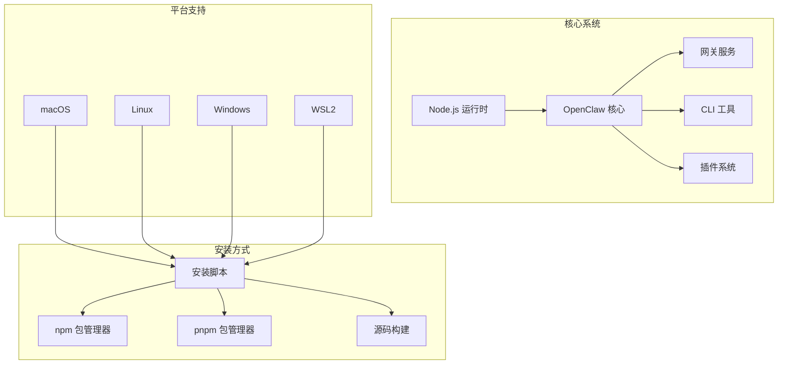
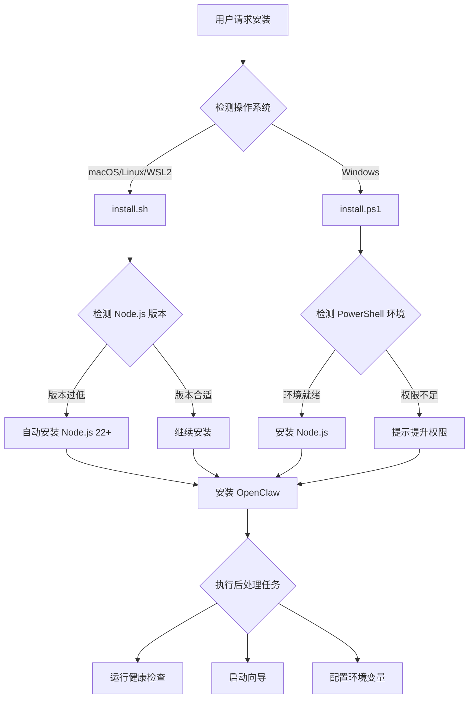
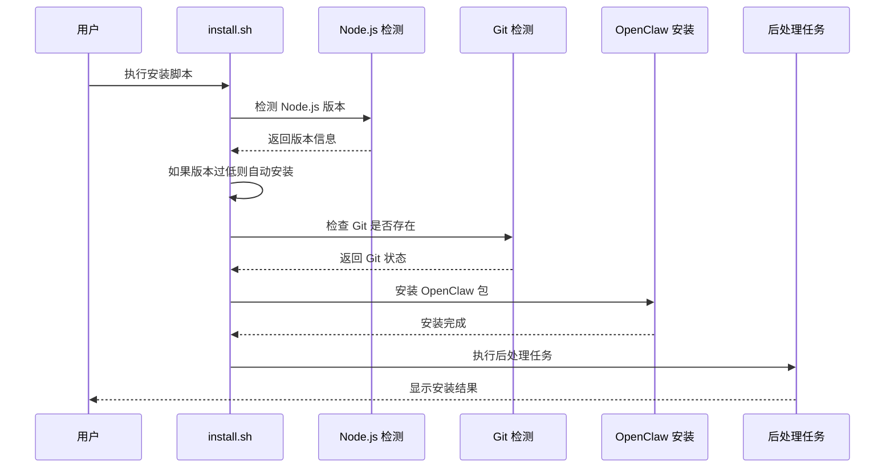
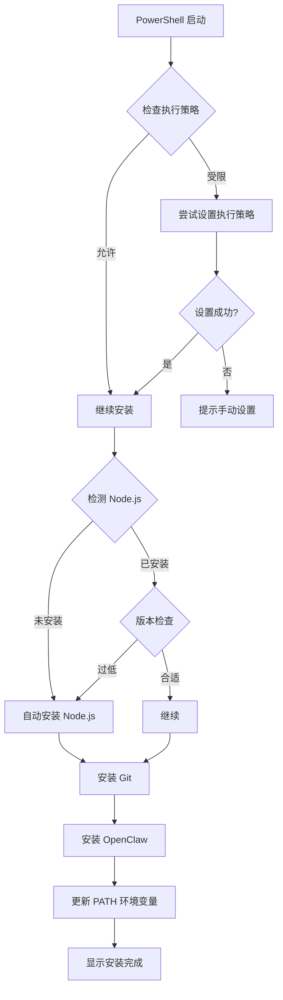
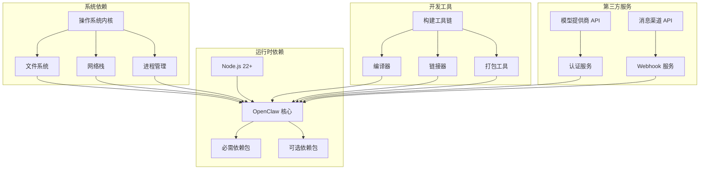

# 传统安装方式

<cite>
**本文档引用的文件**
- [README.md](file://README.md)
- [package.json](file://package.json)
- [docs/install/installer.md](file://docs/install/installer.md)
- [docs/install/node.md](file://docs/install/node.md)
- [docs/install/docker.md](file://docs/install/docker.md)
- [docs/install/fly.md](file://docs/install/fly.md)
- [docs/install/render.mdx](file://docs/install/render.mdx)
- [docs/install/index.md](file://docs/install/index.md)
- [scripts/install.sh](file://scripts/install.sh)
- [scripts/install.ps1](file://scripts/install.ps1)
- [fly.toml](file://fly.toml)
- [render.yaml](file://render.yaml)
</cite>

## 目录
1. [简介](#简介)
2. [项目结构](#项目结构)
3. [核心组件](#核心组件)
4. [架构概览](#架构概览)
5. [详细组件分析](#详细组件分析)
6. [依赖关系分析](#依赖关系分析)
7. [性能考虑](#性能考虑)
8. [故障排除指南](#故障排除指南)
9. [结论](#结论)
10. [附录](#附录)

## 简介

OpenClaw 是一个可在本地设备上运行的个人AI助手，支持多渠道消息集成和扩展插件系统。本文档详细介绍传统的系统安装方式，包括完整的安装流程、系统要求检查、依赖包安装和环境配置。

OpenClaw 提供了多种安装方式，但传统安装方式主要通过直接系统安装实现，这种方式适合需要完全控制安装过程和环境配置的用户。

## 项目结构

OpenClaw 采用模块化设计，包含以下主要组件：

**图表来源**
- [package.json:422-424](file://package.json#L422-L424)
- [docs/install/index.md:14-22](file://docs/install/index.md#L14-L22)

**章节来源**
- [README.md:21-29](file://README.md#L21-L29)
- [package.json:16-34](file://package.json#L16-L34)

## 核心组件

### 系统要求

OpenClaw 的传统安装方式需要满足以下系统要求：

- **Node.js 版本**: 必须使用 Node.js 22 或更高版本
- **操作系统支持**: macOS、Linux、Windows（推荐使用 WSL2）
- **包管理器**: 支持 npm、pnpm、bun
- **存储空间**: 至少需要足够的磁盘空间来存储应用数据和缓存

### 安装脚本系统

OpenClaw 提供了三个专用的安装脚本，分别针对不同的平台：

| 脚本名称 | 平台支持 | 主要功能 |
|---------|----------|----------|
| install.sh | macOS / Linux / WSL2 | 全功能安装，自动检测和安装 Node.js |
| install-cli.sh | macOS / Linux / WSL2 | 本地前缀安装，无需系统级 Node 依赖 |
| install.ps1 | Windows PowerShell | Windows 平台专用安装 |

**章节来源**
- [docs/install/installer.md:14-18](file://docs/install/installer.md#L14-L18)
- [docs/install/node.md:12-21](file://docs/install/node.md#L12-L21)

## 架构概览

OpenClaw 的传统安装架构采用分层设计，确保安装过程的可靠性和可维护性：

**图表来源**
- [scripts/install.sh:253-269](file://scripts/install.sh#L253-L269)
- [scripts/install.ps1:270-330](file://scripts/install.ps1#L270-L330)

**章节来源**
- [docs/install/installer.md:67-88](file://docs/install/installer.md#L67-L88)
- [scripts/install.sh:674-803](file://scripts/install.sh#L674-L803)

## 详细组件分析

### macOS/Linux/WSL2 安装流程

macOS 和 Linux 平台的安装流程相对简单，主要通过 install.sh 脚本完成：

#### 安装流程详解

**图表来源**
- [scripts/install.sh:674-803](file://scripts/install.sh#L674-L803)
- [scripts/install.sh:82-90](file://scripts/install.sh#L82-L90)

#### 关键特性

1. **智能版本检测**: 自动检测并升级到兼容的 Node.js 版本
2. **包管理器适配**: 支持多种包管理器（npm、pnpm、bun）
3. **错误恢复机制**: 自动处理常见的安装问题
4. **环境清理**: 清理旧版本冲突和残留文件

**章节来源**
- [scripts/install.sh:568-672](file://scripts/install.sh#L568-L672)
- [docs/install/installer.md:127-164](file://docs/install/installer.md#L127-L164)

### Windows 安装流程

Windows 平台的安装通过 install.ps1 PowerShell 脚本实现，具有特殊的安全考虑：

#### Windows 安装特点

**图表来源**
- [scripts/install.ps1:56-80](file://scripts/install.ps1#L56-L80)
- [scripts/install.ps1:151-162](file://scripts/install.ps1#L151-L162)

**章节来源**
- [scripts/install.ps1:102-162](file://scripts/install.ps1#L102-L162)
- [docs/install/installer.md:248-264](file://docs/install/installer.md#L248-L264)

### 本地前缀安装模式

install-cli.sh 提供了独特的本地前缀安装模式，适合需要避免系统级安装的场景：

#### 本地安装优势

- **隔离性**: 所有组件都安装在用户指定的前缀目录下
- **无管理员权限**: 不需要提升权限即可安装
- **可移植性**: 前缀目录可以轻松复制或移动
- **版本控制**: 可以在同一系统上安装多个版本

**章节来源**
- [docs/install/installer.md:174-186](file://docs/install/installer.md#L174-L186)
- [docs/install/installer.md:213-242](file://docs/install/installer.md#L213-L242)

## 依赖关系分析

OpenClaw 的传统安装涉及多个层面的依赖关系：

**图表来源**
- [package.json:340-395](file://package.json#L340-L395)
- [package.json:418-425](file://package.json#L418-L425)

**章节来源**
- [package.json:340-465](file://package.json#L340-L465)
- [docs/install/docker.md:26-34](file://docs/install/docker.md#L26-L34)

### 核心依赖包

OpenClaw 的核心依赖包包括：

| 依赖类型 | 包名 | 版本范围 | 用途 |
|---------|------|----------|------|
| 核心运行时 | @mariozechner/pi-agent-core | 0.57.1 | AI 代理核心 |
| 消息通道 | @whiskeysockets/baileys | 7.0.0-rc.9 | WhatsApp 支持 |
| Web 框架 | hono | 4.12.7 | HTTP 服务器 |
| 数据库 | sqlite-vec | 0.1.7-alpha.2 | 向量数据库 |
| 工具库 | chalk, commander | 最新版本 | 命令行界面 |

**章节来源**
- [package.json:340-395](file://package.json#L340-L395)

## 性能考虑

传统安装方式在性能方面有以下特点：

### 内存使用优化

- **Node.js 内存限制**: 默认配置为 1536MB，可根据需要调整
- **垃圾回收优化**: 使用现代 Node.js 版本的垃圾回收机制
- **缓存策略**: 合理配置缓存大小以平衡性能和内存使用

### 磁盘空间管理

- **日志轮转**: 自动管理日志文件大小和数量
- **临时文件清理**: 定期清理临时文件和缓存
- **媒体文件存储**: 提供可配置的媒体文件存储路径

### 网络性能

- **连接池管理**: 优化与外部服务的连接复用
- **超时配置**: 合理设置网络请求超时时间
- **重试机制**: 实现智能的失败重试策略

## 故障排除指南

### 常见安装问题

#### Node.js 版本问题

**问题**: `openclaw: command not found`

**解决方案**:
1. 检查 Node.js 版本：`node -v`
2. 确保版本为 22 或更高
3. 更新 PATH 环境变量

**章节来源**
- [docs/install/node.md:91-126](file://docs/install/node.md#L91-L126)

#### 权限问题

**问题**: `npm install -g` 失败，出现 EACCES 错误

**解决方案**:
1. 切换 npm 全局前缀到用户可写目录
2. 更新 shell 配置文件添加 PATH
3. 重新加载 shell 配置

**章节来源**
- [docs/install/node.md:128-139](file://docs/install/node.md#L128-L139)

#### 依赖安装失败

**问题**: sharp 包构建失败

**解决方案**:
1. 设置环境变量 `SHARP_IGNORE_GLOBAL_LIBVIPS=1`
2. 安装系统级 libvips 库
3. 使用预编译的二进制文件

**章节来源**
- [docs/install/index.md:82-90](file://docs/install/index.md#L82-L90)

### 系统特定问题

#### macOS 特定问题

**Xcode 命令行工具缺失**:
- 运行 `xcode-select --install`
- 完成安装后重新运行安装脚本

**Homebrew 问题**:
- 检查 Homebrew 安装状态
- 更新 Homebrew 到最新版本

#### Linux 特定问题

**包管理器检测失败**:
- 手动安装必要的构建工具
- 确保系统具备编译能力

**权限问题**:
- 使用 sudo 运行安装脚本
- 检查用户对目标目录的写权限

#### Windows 特定问题

**PowerShell 执行策略**:
- 设置执行策略为 RemoteSigned
- 在当前会话中临时绕过限制

**Git 安装问题**:
- 确保 Git 安装路径在 PATH 中
- 重启 PowerShell 使 PATH 变更生效

**章节来源**
- [scripts/install.ps1:56-80](file://scripts/install.ps1#L56-L80)
- [scripts/install.sh:622-654](file://scripts/install.sh#L622-L654)

## 结论

传统安装方式为 OpenClaw 提供了灵活且可控的安装体验。通过精心设计的安装脚本和全面的故障排除指南，用户可以在各种操作系统环境下成功部署 OpenClaw。

关键优势包括：
- **跨平台支持**: 统一的安装体验适用于所有支持的操作系统
- **自动化程度高**: 减少手动配置工作量
- **错误恢复能力强**: 自动处理常见安装问题
- **环境隔离**: 支持多种安装模式以满足不同需求

建议在生产环境中使用传统安装方式，因为它提供了最佳的控制力和可维护性。

## 附录

### 开发环境搭建

对于开发者，建议使用以下工具链：

1. **Node.js 版本**: 使用 nvm 或 fnm 管理多个版本
2. **包管理器**: 推荐使用 pnpm，支持工作区和快速安装
3. **IDE 配置**: VS Code + TypeScript 插件
4. **调试工具**: Chrome DevTools + Node.js 调试器

### 云平台部署选项

除了传统安装，OpenClaw 还支持多种云平台部署：

#### Fly.io 部署

**图表来源**
- [docs/install/fly.md:28-82](file://docs/install/fly.md#L28-L82)

#### Render 部署

Render 提供了基于 Blueprint 的声明式部署方式，支持一键部署和持续集成。

**章节来源**
- [docs/install/render.mdx:12-51](file://docs/install/render.mdx#L12-L51)

### 验证和测试

安装完成后，建议执行以下验证步骤：

1. **基本功能测试**: 运行 `openclaw doctor` 检查系统状态
2. **网关连接测试**: 验证 WebSocket 连接是否正常
3. **插件加载测试**: 确认各插件能够正常加载
4. **配置文件测试**: 验证配置文件的正确性和完整性

**章节来源**
- [docs/install/index.md:163-180](file://docs/install/index.md#L163-L180)