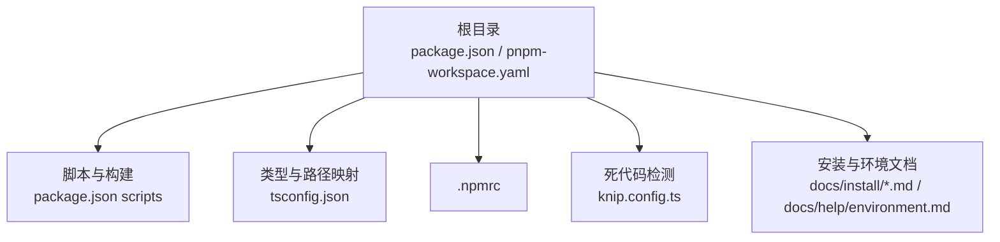
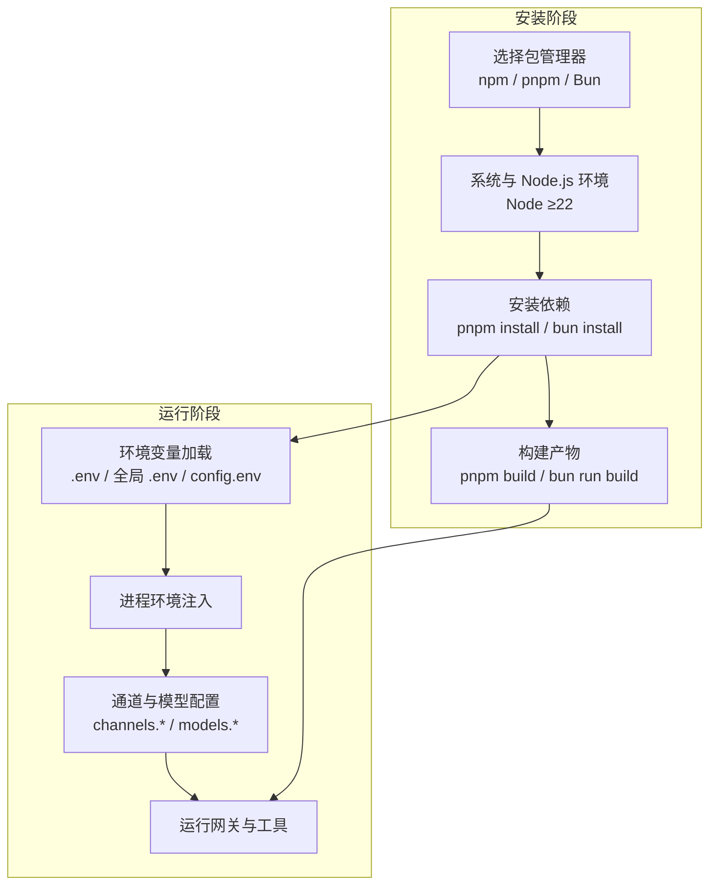
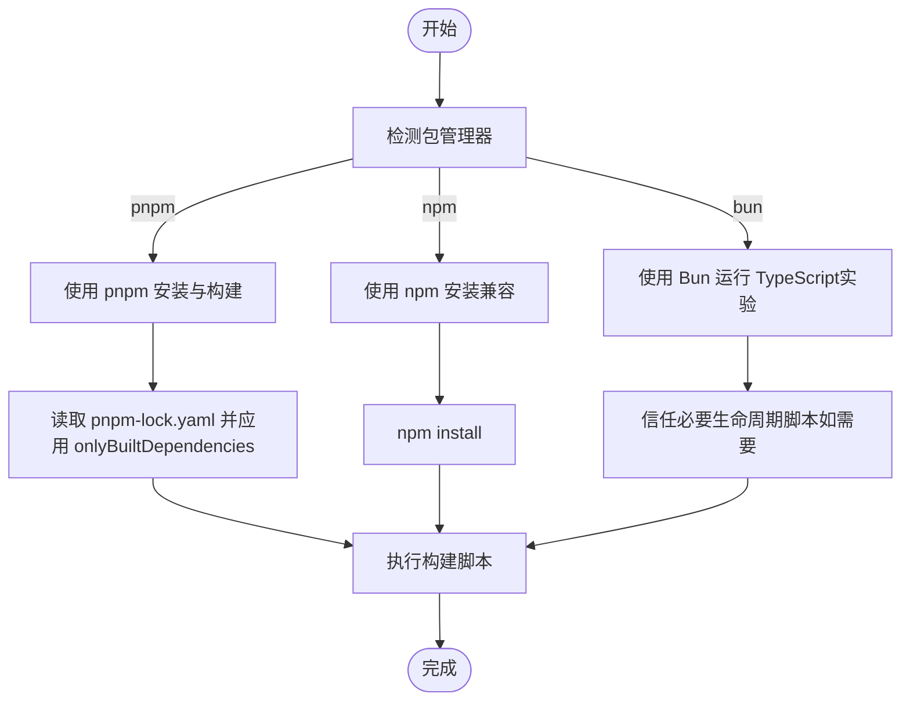
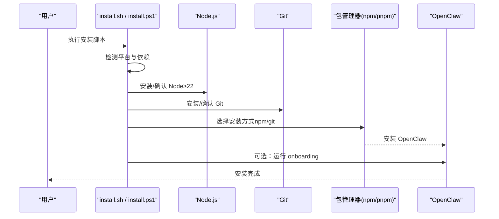
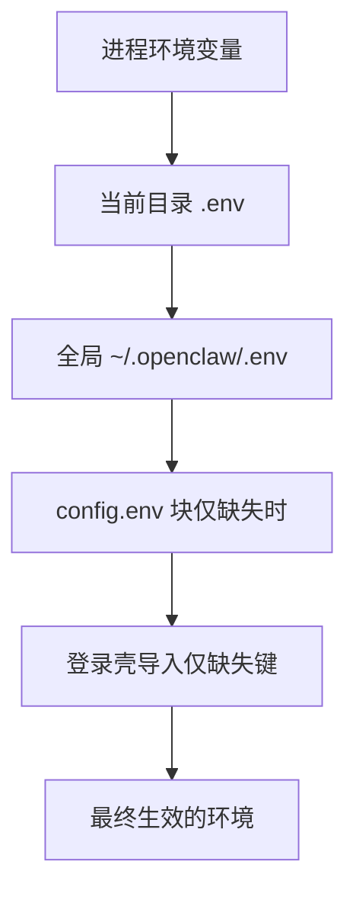
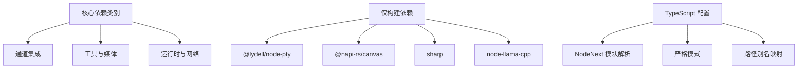

# 依赖安装和配置

<cite>
**本文档引用的文件**
- [package.json](file://package.json)
- [pnpm-workspace.yaml](file://pnpm-workspace.yaml)
- [.npmrc](file://.npmrc)
- [tsconfig.json](file://tsconfig.json)
- [knip.config.ts](file://knip.config.ts)
- [README.md](file://README.md)
- [docs/install/installer.md](file://docs/install/installer.md)
- [docs/install/node.md](file://docs/install/node.md)
- [docs/install/bun.md](file://docs/install/bun.md)
- [docs/install/docker.md](file://docs/install/docker.md)
- [docs/help/environment.md](file://docs/help/environment.md)
</cite>

## 目录
1. [简介](#简介)
2. [项目结构](#项目结构)
3. [核心组件](#核心组件)
4. [架构总览](#架构总览)
5. [详细组件分析](#详细组件分析)
6. [依赖分析](#依赖分析)
7. [性能考虑](#性能考虑)
8. [故障排除指南](#故障排除指南)
9. [结论](#结论)
10. [附录](#附录)

## 简介
本文件面向 OpenClaw 项目的依赖安装与配置，系统性阐述包管理器选择（npm、pnpm、Bun）、跨平台安装流程（系统包、Node.js 模块、全局工具）、环境变量与配置文件的设置方式，并提供冲突解决、版本兼容性处理以及依赖更新维护的最佳实践。内容基于仓库中的实际配置与文档，确保可操作性和一致性。

## 项目结构
OpenClaw 采用多工作区与多包管理模式，核心依赖与脚本集中在根目录的 package.json 中，pnpm 工作区通过 pnpm-workspace.yaml 声明；TypeScript 编译与路径映射在 tsconfig.json 中定义；knip 配置用于死代码检测与入口扫描。

图表来源
- [package.json:1-465](file://package.json#L1-L465)
- [pnpm-workspace.yaml:1-18](file://pnpm-workspace.yaml#L1-L18)
- [tsconfig.json:1-29](file://tsconfig.json#L1-L29)
- [knip.config.ts:1-106](file://knip.config.ts#L1-L106)
- [docs/install/installer.md:1-406](file://docs/install/installer.md#L1-L406)
- [docs/help/environment.md:1-141](file://docs/help/environment.md#L1-L141)

章节来源
- [package.json:1-465](file://package.json#L1-L465)
- [pnpm-workspace.yaml:1-18](file://pnpm-workspace.yaml#L1-L18)
- [tsconfig.json:1-29](file://tsconfig.json#L1-L29)
- [knip.config.ts:1-106](file://knip.config.ts#L1-L106)

## 核心组件
- 包管理器与工作区
  - 默认包管理器：pnpm（packageManager 字段指定）
  - 工作区：根目录与 ui、packages/*、extensions/* 多包协同
  - 仅构建依赖：onlyBuiltDependencies 列表，避免不必要的二进制安装
- 构建与脚本
  - 多平台构建脚本（Android、iOS、macOS、UI 构建等）
  - 开发与测试脚本（watch、test、lint、format 等）
- 类型与路径映射
  - NodeNext 模块解析、严格模式、DOM/ES2023 目标
  - 路径别名映射至 src/plugin-sdk
- 死代码检测
  - knip 配置按工作区扫描入口，忽略测试与 fixtures

章节来源
- [package.json:340-465](file://package.json#L340-L465)
- [pnpm-workspace.yaml:1-18](file://pnpm-workspace.yaml#L1-L18)
- [tsconfig.json:1-29](file://tsconfig.json#L1-L29)
- [knip.config.ts:1-106](file://knip.config.ts#L1-L106)

## 架构总览
下图展示从安装到运行的关键依赖链路：包管理器选择 → 系统与 Node.js 环境准备 → 依赖安装与构建 → 运行时环境变量注入 → 通道与模型配置。

图表来源
- [README.md:50-110](file://README.md#L50-L110)
- [docs/install/installer.md:1-406](file://docs/install/installer.md#L1-L406)
- [docs/install/node.md:1-139](file://docs/install/node.md#L1-L139)
- [docs/help/environment.md:1-141](file://docs/help/environment.md#L1-L141)

## 详细组件分析

### 包管理器选择与配置
- 推荐与支持
  - 官方推荐：pnpm（开发构建首选），支持 npm 与 Bun 的本地运行体验
  - Bun：实验性，适合快速本地开发循环，但部分脚本仍依赖 pnpm（如 docs:build、ui:*、protocol:check）
- 工作区与锁定策略
  - pnpm-workspace.yaml 声明工作区范围与仅构建依赖列表
  - .npmrc 提示 pnpm 构建脚本白名单位于 package.json 的 pnpm.onlyBuiltDependencies
- 版本与引擎
  - engines.node 要求 ≥22.12.0
  - packageManager 字段固定 pnpm@10.23.0

图表来源
- [package.json:422-465](file://package.json#L422-L465)
- [pnpm-workspace.yaml:7-18](file://pnpm-workspace.yaml#L7-L18)
- [.npmrc:1-2](file://.npmrc#L1-L2)
- [docs/install/bun.md:1-60](file://docs/install/bun.md#L1-L60)

章节来源
- [package.json:422-465](file://package.json#L422-L465)
- [pnpm-workspace.yaml:1-18](file://pnpm-workspace.yaml#L1-L18)
- [.npmrc:1-2](file://.npmrc#L1-L2)
- [docs/install/bun.md:1-60](file://docs/install/bun.md#L1-L60)

### 跨平台安装流程
- macOS / Linux / WSL
  - install.sh：自动检测/安装 Node（≥22）、Git，支持 npm 或 git 安装方式，可执行 onboarding
  - 支持环境变量控制安装方法、版本、是否跳过 onboarding、是否 dry-run 等
- Windows
  - install.ps1：支持 winget/Chocolatey/Scoop 安装 Node，支持 npm 或 git 安装方式
  - 自动修复 PATH，支持非交互式运行
- CLI 本地前缀安装
  - install-cli.sh：将 Node 与 OpenClaw 安装到本地前缀（默认 ~/.openclaw），无需系统级 Node

图表来源
- [docs/install/installer.md:61-164](file://docs/install/installer.md#L61-L164)
- [docs/install/installer.md:168-242](file://docs/install/installer.md#L168-L242)
- [docs/install/installer.md:246-324](file://docs/install/installer.md#L246-L324)

章节来源
- [docs/install/installer.md:1-406](file://docs/install/installer.md#L1-L406)
- [docs/install/node.md:1-139](file://docs/install/node.md#L1-L139)

### 环境变量与配置文件
- 加载顺序（高→低）
  1) 进程环境变量
  2) 当前目录 .env（dotenv 默认，不覆盖既有值）
  3) 全局 ~/.openclaw/.env
  4) 配置文件中 config.env 块（仅在缺失时应用）
  5) 可选登录壳导入（仅对缺失键生效）
- 配置文件位置
  - OPENCLAW_HOME：覆盖内部路径解析的主目录
  - OPENCLAW_STATE_DIR：覆盖状态目录（默认 ~/.openclaw）
  - OPENCLAW_CONFIG_PATH：覆盖配置文件路径（默认 ~/.openclaw/openclaw.json）
- 运行时注入
  - OPENCLAW_LOG_LEVEL：覆盖日志级别
  - OPENCLAW_THEME：强制 TUI 主题
  - COLORFGBG：根据终端背景色自动选择主题
- 配置中的变量替换
  - 在字符串值中使用 ${VAR_NAME} 引用环境变量

图表来源
- [docs/help/environment.md:14-22](file://docs/help/environment.md#L14-L22)
- [docs/help/environment.md:24-52](file://docs/help/environment.md#L24-L52)
- [docs/help/environment.md:77-93](file://docs/help/environment.md#L77-L93)

章节来源
- [docs/help/environment.md:1-141](file://docs/help/environment.md#L1-L141)

### 依赖冲突解决与版本兼容性
- 仅构建依赖
  - pnpm.onlyBuiltDependencies 与 pnpm-workspace.yaml 的 onlyBuiltDependencies 控制二进制原生模块的安装范围，减少不必要的编译与失败
- 版本覆盖
  - pnpm.overrides 统一关键依赖版本，降低上游不兼容风险
- Node 引擎约束
  - engines.node 要求 ≥22.12.0，确保与依赖生态兼容
- 平台差异
  - Windows：sharp/libvips 可能需要额外配置，安装脚本默认关闭系统 libvips 使用以避免编译问题
  - Linux：若 npm 全局前缀无写权限，建议切换到用户可写目录

章节来源
- [package.json:426-463](file://package.json#L426-L463)
- [pnpm-workspace.yaml:7-18](file://pnpm-workspace.yaml#L7-L18)
- [docs/install/installer.md:362-405](file://docs/install/installer.md#L362-L405)

### 依赖更新与维护最佳实践
- 使用 pnpm 锁定文件
  - 保持 pnpm-lock.yaml 与 pnpm-workspace.yaml 同步，避免跨包版本漂移
- 分层升级策略
  - 先升级 devDependencies，再升级 dependencies，最后 peerDependencies
  - 对仅构建依赖进行灰度验证（如 @napi-rs/canvas、node-llama-cpp）
- 死代码与入口扫描
  - 使用 knip.config.ts 的入口扫描与忽略规则，定期清理未使用依赖
- 文档与脚本一致性
  - Bun 运行脚本时注意部分脚本仍硬编码 pnpm（如 docs:build、ui:*、protocol:check），建议在这些场景使用 pnpm

章节来源
- [knip.config.ts:1-106](file://knip.config.ts#L1-L106)
- [docs/install/bun.md:57-60](file://docs/install/bun.md#L57-L60)

## 依赖分析
- 核心依赖类别
  - 通道集成：Telegram、Discord、Slack、Signal、WhatsApp、iMessage、Matrix、Mattermost、Nextcloud Talk、Nostr、Synology Chat、Tlon、Twitch、Zalo 等
  - 工具与媒体：浏览器控制、Canvas、节点工具、音频/视频处理、PDF 解析、OCR 等
  - 运行时与网络：WebSocket、HTTP 服务器、代理、定时任务、日志
- 仅构建依赖清单
  - @lydell/node-pty、@matrix-org/matrix-sdk-crypto-nodejs、@napi-rs/canvas、@tloncorp/api、@whiskeysockets/baileys、authenticate-pam、esbuild、node-llama-cpp、protobufjs、sharp
- TypeScript 与路径映射
  - NodeNext 模块解析、严格模式、DOM/ES2023 目标、路径别名 openclaw/plugin-sdk/*

图表来源
- [package.json:340-421](file://package.json#L340-L421)
- [pnpm-workspace.yaml:7-18](file://pnpm-workspace.yaml#L7-L18)
- [tsconfig.json:10-24](file://tsconfig.json#L10-L24)

章节来源
- [package.json:340-421](file://package.json#L340-L421)
- [pnpm-workspace.yaml:7-18](file://pnpm-workspace.yaml#L7-L18)
- [tsconfig.json:10-24](file://tsconfig.json#L10-L24)

## 性能考虑
- 构建缓存与分层
  - Dockerfile 示例展示了将依赖层前置以提升重建速度，避免无关变更触发 pnpm install
- 浏览器与沙箱
  - Docker 环境下可通过环境变量调整浏览器渲染限制与扩展策略，平衡兼容性与性能
- 日志与健康检查
  - /healthz 与 /readyz 探针用于容器健康监控，结合日志级别控制减少开销

章节来源
- [docs/install/docker.md:405-436](file://docs/install/docker.md#L405-L436)
- [docs/install/docker.md:469-495](file://docs/install/docker.md#L469-L495)

## 故障排除指南
- Node 未找到或命令不可用
  - 检查 npm prefix -g 输出，确保全局 bin 目录在 PATH 中；Windows 需在系统环境变量中添加
- 权限错误（EACCES）
  - 将 npm 全局前缀切换到用户可写目录，并导出 PATH
- sharp/libvips 构建问题
  - 安装脚本默认关闭系统 libvips 使用；如需启用可设置环境变量覆盖
- Windows 上 git/spawn 问题
  - 安装 Git for Windows，重启 PowerShell 后重试
- Docker 权限与挂载
  - 确保宿主机挂载目录属主为 uid 1000；必要时以 root 运行（有安全权衡）

章节来源
- [docs/install/node.md:89-139](file://docs/install/node.md#L89-L139)
- [docs/install/installer.md:362-405](file://docs/install/installer.md#L362-L405)
- [docs/install/docker.md:392-404](file://docs/install/docker.md#L392-L404)

## 结论
OpenClaw 的依赖体系围绕 pnpm 工作区与严格的 Node 引擎要求构建，辅以仅构建依赖与版本覆盖策略，确保在多平台与多通道场景下的稳定性与可维护性。通过规范化的环境变量加载顺序、清晰的配置文件结构与脚本化安装流程，项目实现了从开发到生产的无缝衔接。遵循本文档的安装与配置建议，可有效规避常见依赖冲突与版本兼容性问题，并建立可持续的依赖更新与维护机制。

## 附录
- 快速参考
  - 安装：优先使用 install.sh（macOS/Linux/WSL）或 install.ps1（Windows），或 install-cli.sh（本地前缀）
  - 运行：pnpm install → pnpm build → pnpm openclaw onboard（或对应平台的启动命令）
  - 环境变量：按顺序加载，优先级高者不被后续来源覆盖
  - 仅构建依赖：仅在需要编译原生模块时安装，减少失败与体积