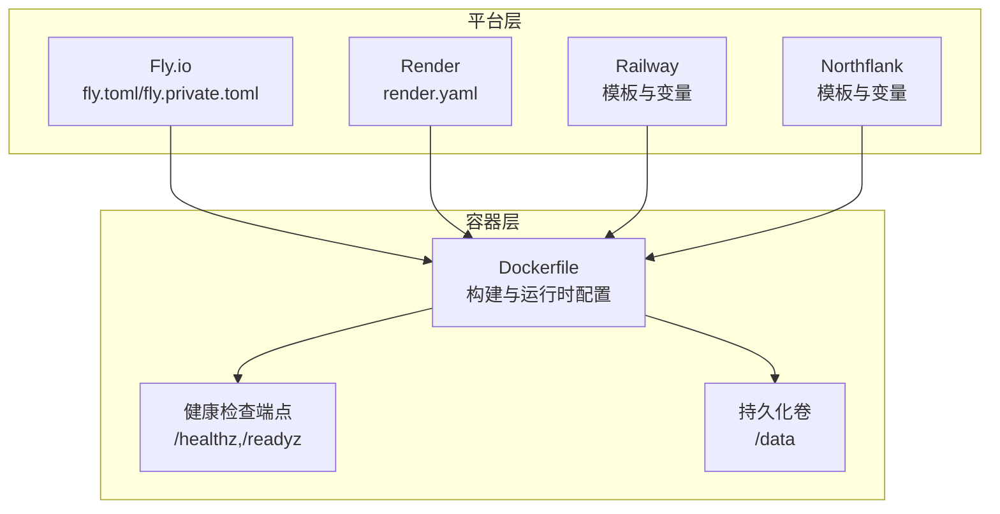
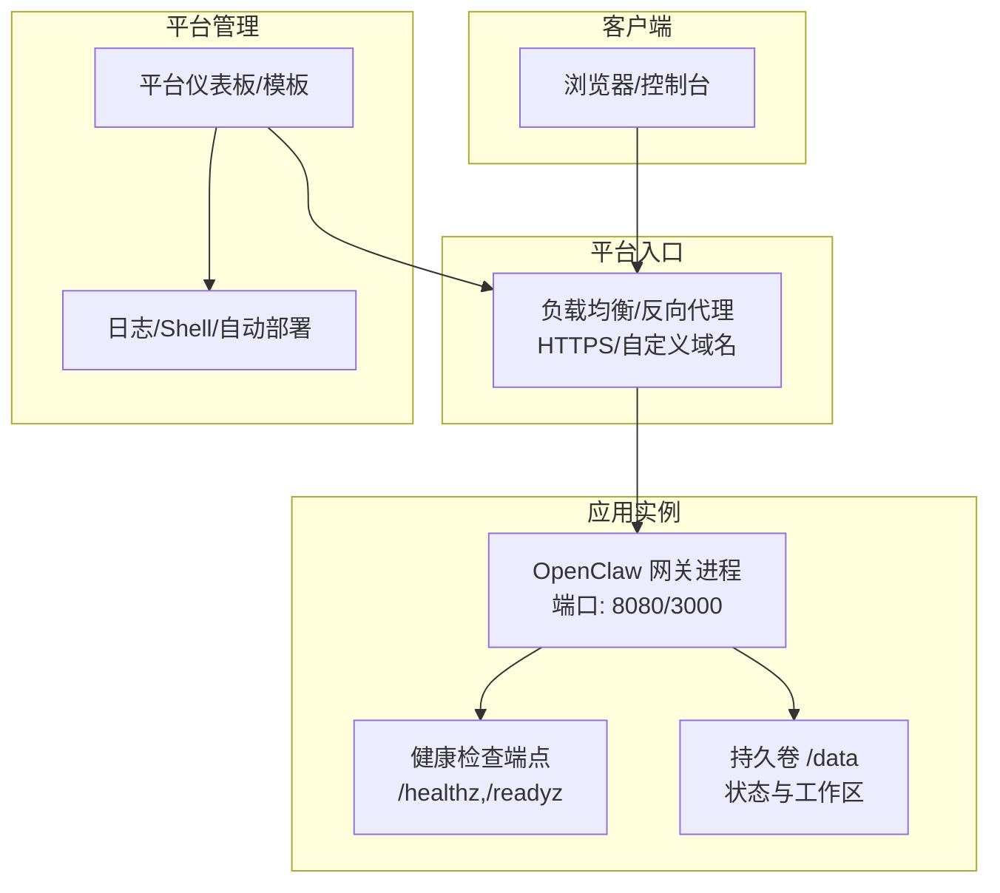
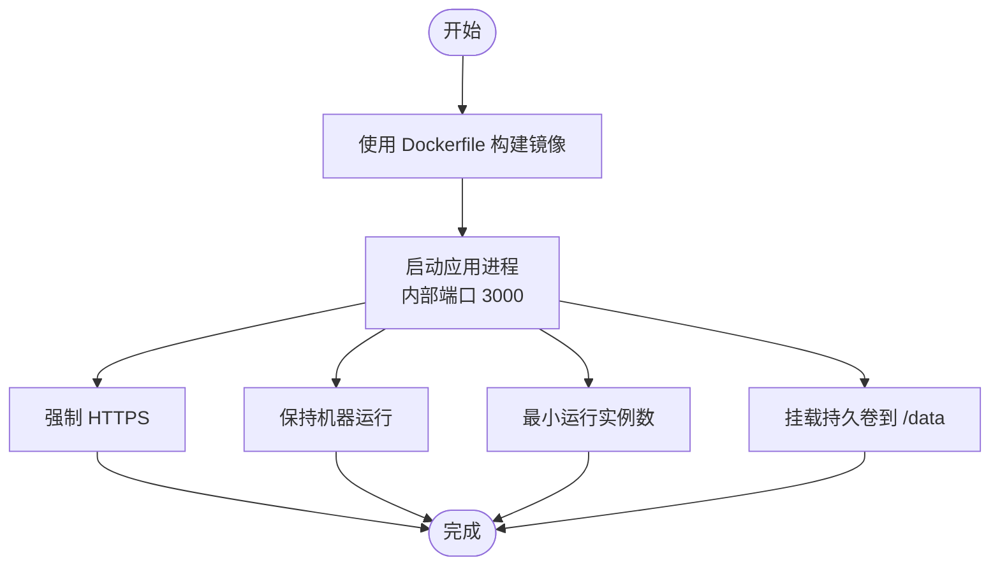
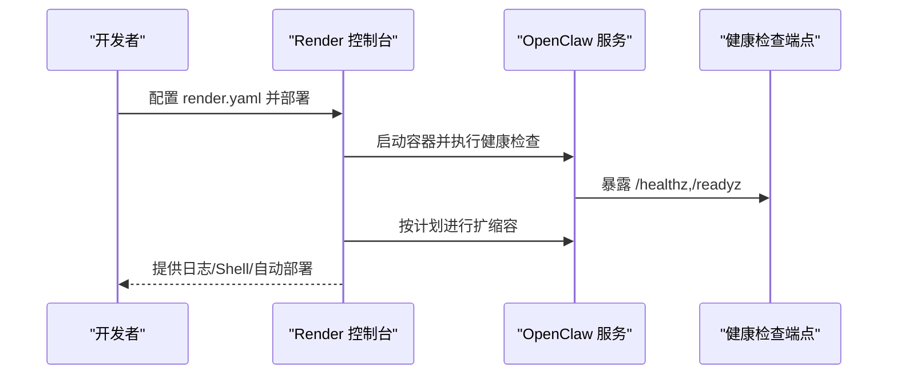
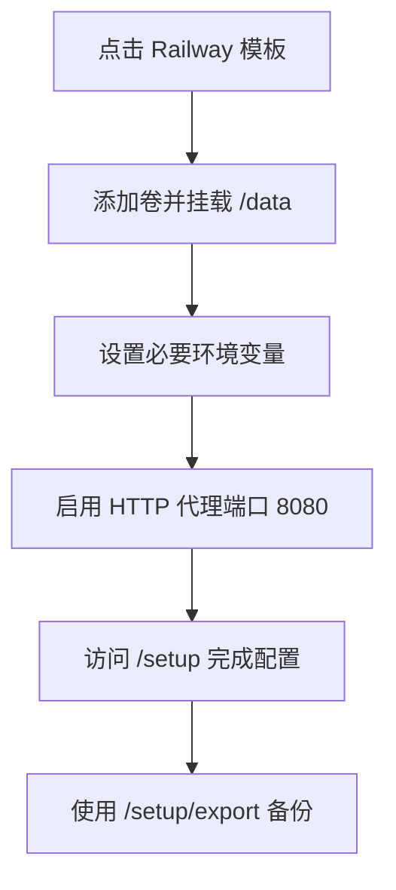
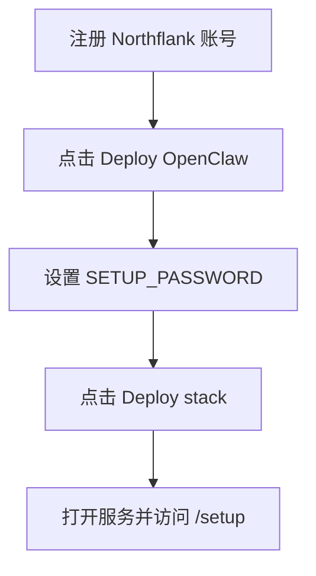
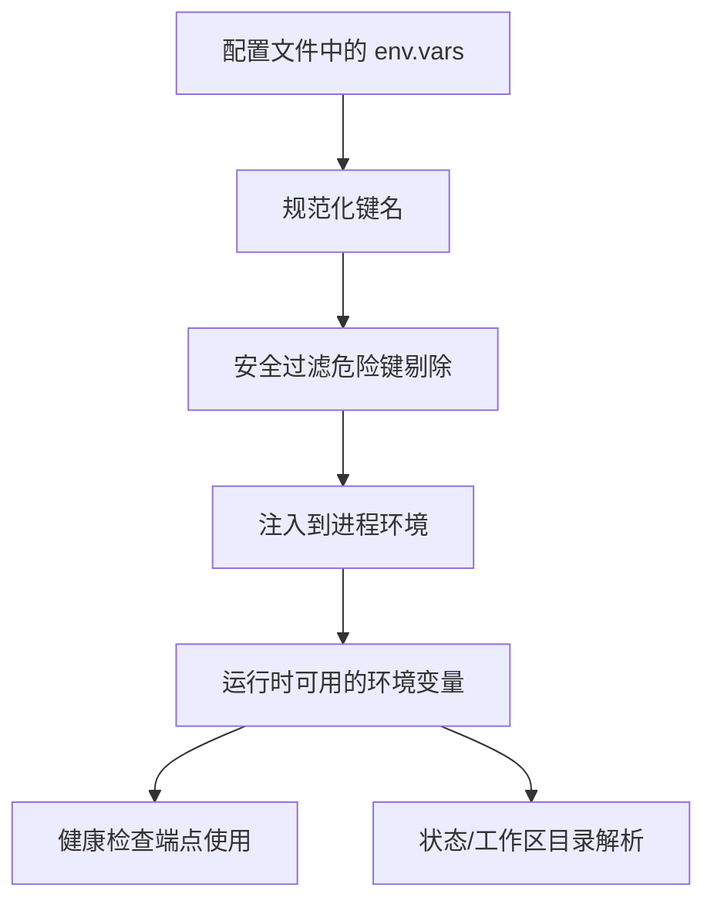
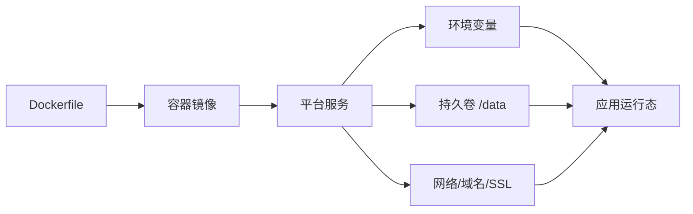

# 平台特定设置

<cite>
**本文引用的文件**
- [fly.toml](file://fly.toml)
- [fly.private.toml](file://fly.private.toml)
- [render.yaml](file://render.yaml)
- [railway.mdx](file://docs/install/railway.mdx)
- [northflank.mdx](file://docs/install/northflank.mdx)
- [render.mdx](file://docs/install/render.mdx)
- [Dockerfile](file://Dockerfile)
- [src/config/env-vars.ts](file://src/config/env-vars.ts)
- [src/gateway/server-http.ts](file://src/gateway/server-http.ts)
- [src/gateway/server-http.probe.test.ts](file://src/gateway/server-http.probe.test.ts)
- [docker-compose.yml](file://docker-compose.yml)
- [docker-setup.sh](file://docker-setup.sh)
</cite>

## 目录
1. [简介](#简介)
2. [项目结构](#项目结构)
3. [核心组件](#核心组件)
4. [架构总览](#架构总览)
5. [详细组件分析](#详细组件分析)
6. [依赖关系分析](#依赖关系分析)
7. [性能与成本优化](#性能与成本优化)
8. [故障排查指南](#故障排查指南)
9. [结论](#结论)
10. [附录](#附录)

## 简介
本文件面向在多个云平台（Fly.io、Render、Railway、Northflank）上部署 OpenClaw 的用户，提供平台特定的配置方法、环境变量、数据库与存储、域名与 SSL、自动扩缩容、备份与迁移、以及多环境部署与成本优化建议。内容基于仓库中已提供的部署蓝图与文档，确保可操作性与一致性。

## 项目结构
OpenClaw 提供统一的容器镜像与健康检查端点，并通过平台的编排能力完成部署。关键要素包括：
- 容器镜像：基于 Dockerfile 构建，内置健康检查端点，支持持久化卷挂载。
- 平台蓝图：Fly、Render、Railway、Northflank 均提供一键部署或模板，定义服务、环境变量、磁盘与网络。
- 配置注入：通过环境变量与状态目录实现配置与工作区持久化，支持安全覆盖与校验。

图表来源
- [Dockerfile:224-230](file://Dockerfile#L224-L230)
- [fly.toml:1-35](file://fly.toml#L1-L35)
- [fly.private.toml:1-40](file://fly.private.toml#L1-L40)
- [render.yaml:1-22](file://render.yaml#L1-L22)
- [railway.mdx:1-100](file://docs/install/railway.mdx#L1-L100)
- [northflank.mdx:1-54](file://docs/install/northflank.mdx#L1-L54)

章节来源
- [Dockerfile:1-231](file://Dockerfile#L1-L231)
- [fly.toml:1-35](file://fly.toml#L1-L35)
- [fly.private.toml:1-40](file://fly.private.toml#L1-L40)
- [render.yaml:1-22](file://render.yaml#L1-L22)
- [railway.mdx:1-100](file://docs/install/railway.mdx#L1-L100)
- [northflank.mdx:1-54](file://docs/install/northflank.mdx#L1-L54)
- [render.mdx:1-160](file://docs/install/render.mdx#L1-L160)

## 核心组件
- 容器与健康检查
  - 容器入口与健康检查端点由 Dockerfile 定义，支持 /healthz（存活）、/readyz（就绪）等探针。
  - 平台需按各自规范配置健康检查路径与超时。
- 持久化存储
  - 使用 /data 作为状态与工作区根目录，平台需提供持久卷并挂载到该路径。
- 网络与端口
  - 平台需暴露应用端口（常见为 8080 或 3000），并正确处理 HTTPS 与自定义域名。
- 环境变量
  - 关键变量包括端口、状态目录、工作区目录、网关令牌等；部分平台支持自动生成或提示输入。

章节来源
- [Dockerfile:224-230](file://Dockerfile#L224-L230)
- [src/gateway/server-http.ts:198-236](file://src/gateway/server-http.ts#L198-L236)
- [src/gateway/server-http.probe.test.ts:1-155](file://src/gateway/server-http.probe.test.ts#L1-L155)
- [render.yaml:1-22](file://render.yaml#L1-L22)
- [railway.mdx:42-65](file://docs/install/railway.mdx#L42-L65)
- [northflank.mdx:1-54](file://docs/install/northflank.mdx#L1-L54)
- [render.mdx:102-104](file://docs/install/render.mdx#L102-L104)

## 架构总览
下图展示 OpenClaw 在不同平台上的部署拓扑与数据流：

图表来源
- [Dockerfile:224-230](file://Dockerfile#L224-L230)
- [render.yaml:24-51](file://render.yaml#L24-L51)
- [railway.mdx:42-65](file://docs/install/railway.mdx#L42-L65)
- [northflank.mdx:1-54](file://docs/install/northflank.mdx#L1-L54)
- [render.mdx:102-104](file://docs/install/render.mdx#L102-L104)

## 详细组件分析

### Fly.io 部署
- 应用与区域
  - 应用名与主区域在配置中指定，可按就近区域调整。
- 构建与镜像
  - 使用仓库根 Dockerfile 进行构建。
- 环境变量
  - 生产模式、状态目录、内存上限等关键变量。
- 进程与服务
  - 内部端口与进程命令；强制 HTTPS、保持机器运行、最小运行实例数。
- 虚拟机规格
  - VM 规格与内存配置。
- 存储挂载
  - 将持久卷挂载至 /data，用于状态与工作区。

图表来源
- [fly.toml:1-35](file://fly.toml#L1-L35)

章节来源
- [fly.toml:1-35](file://fly.toml#L1-L35)
- [fly.private.toml:1-40](file://fly.private.toml#L1-L40)

### Render 部署
- 蓝图定义
  - 通过 render.yaml 声明服务类型、运行时、计划、健康检查路径、环境变量与磁盘。
- 端口与健康检查
  - 健康检查路径为 /health，平台据此进行重启与状态判断。
- 计划与扩缩容
  - 支持垂直与水平扩展；免费计划无持久盘，需升级以保留配置。
- 自定义域名与 SSL
  - 添加域名后按指引配置 CNAME，平台自动签发 TLS 证书。
- 备份与迁移
  - 可通过导出接口下载可移植备份，便于迁移。

图表来源
- [render.yaml:24-51](file://render.yaml#L24-L51)
- [Dockerfile:224-230](file://Dockerfile#L224-L230)
- [render.mdx:117-125](file://docs/install/render.mdx#L117-L125)

章节来源
- [render.yaml:1-22](file://render.yaml#L1-L22)
- [render.mdx:1-160](file://docs/install/render.mdx#L1-L160)
- [Dockerfile:224-230](file://Dockerfile#L224-L230)

### Railway 部署
- 一键模板
  - 提供 Railway 模板，一键部署并运行网关。
- 必需设置
  - 公共网络（HTTP 代理端口 8080）、附加卷（/data）、环境变量（如 SETUP_PASSWORD、PORT、状态目录等）。
- 设置流程
  - 通过 /setup 浏览器向导完成模型与频道配置，Control UI 位于 /openclaw。
- 备份与迁移
  - 可在 /setup/export 导出状态与工作区，便于迁移到其他主机。

图表来源
- [railway.mdx:17-23](file://docs/install/railway.mdx#L17-L23)
- [railway.mdx:42-65](file://docs/install/railway.mdx#L42-L65)
- [railway.mdx:93-99](file://docs/install/railway.mdx#L93-L99)

章节来源
- [railway.mdx:1-100](file://docs/install/railway.mdx#L1-L100)

### Northflank 部署
- 一键模板
  - 提供 Northflank 模板，注册账号后一键部署。
- 必要步骤
  - 设置 SETUP_PASSWORD，部署完成后打开 /setup 完成配置与 Control UI。
- 频道令牌
  - 提供 Telegram 与 Discord 令牌获取指引。

图表来源
- [northflank.mdx:9-19](file://docs/install/northflank.mdx#L9-L19)

章节来源
- [northflank.mdx:1-54](file://docs/install/northflank.mdx#L1-L54)

### 环境变量与配置注入
- 环境变量收集与安全过滤
  - 配置中的环境变量会经过规范化与安全过滤，避免危险键被注入。
- 健康检查端点
  - /healthz 返回存活状态，/readyz 返回就绪状态，支持本地与远程访问差异。
- 状态与工作区目录
  - 通过 OPENCLAW_STATE_DIR 与 OPENCLAW_WORKSPACE_DIR 控制状态与工作区路径，平台需将持久卷挂载到 /data。

图表来源
- [src/config/env-vars.ts:13-55](file://src/config/env-vars.ts#L13-L55)
- [src/config/env-vars.ts:79-97](file://src/config/env-vars.ts#L79-L97)
- [Dockerfile:224-230](file://Dockerfile#L224-L230)
- [docker-compose.yml:13-13](file://docker-compose.yml#L13-L13)
- [docker-setup.sh:187-214](file://docker-setup.sh#L187-L214)

章节来源
- [src/config/env-vars.ts:1-98](file://src/config/env-vars.ts#L1-L98)
- [src/gateway/server-http.ts:198-236](file://src/gateway/server-http.ts#L198-L236)
- [src/gateway/server-http.probe.test.ts:1-155](file://src/gateway/server-http.probe.test.ts#L1-L155)
- [docker-compose.yml:13-13](file://docker-compose.yml#L13-L13)
- [docker-setup.sh:187-214](file://docker-setup.sh#L187-L214)

## 依赖关系分析
- 平台对容器镜像的依赖
  - 所有平台均使用仓库根 Dockerfile 构建镜像，容器内提供健康检查端点。
- 平台对持久化存储的依赖
  - /data 为状态与工作区根目录，需由平台提供持久卷并挂载。
- 平台对网络与域名的依赖
  - 平台负责 HTTPS、自定义域名与证书；应用仅需暴露健康检查与业务端口。
- 平台对环境变量的依赖
  - 平台在服务层面注入变量，应用侧进行安全过滤与应用。

图表来源
- [Dockerfile:224-230](file://Dockerfile#L224-L230)
- [render.yaml:24-51](file://render.yaml#L24-L51)
- [railway.mdx:42-65](file://docs/install/railway.mdx#L42-L65)
- [northflank.mdx:1-54](file://docs/install/northflank.mdx#L1-L54)
- [render.mdx:110-116](file://docs/install/render.mdx#L110-L116)

章节来源
- [Dockerfile:1-231](file://Dockerfile#L1-L231)
- [render.yaml:1-22](file://render.yaml#L1-L22)
- [railway.mdx:1-100](file://docs/install/railway.mdx#L1-L100)
- [northflank.mdx:1-54](file://docs/install/northflank.mdx#L1-L54)
- [render.mdx:1-160](file://docs/install/render.mdx#L1-L160)

## 性能与成本优化
- 端口与网络
  - 选择靠近用户的区域与就近端口，减少延迟；Render 的免费计划存在空闲休眠，生产建议升级。
- 存储与 I/O
  - 使用平台持久卷挂载 /data，避免每次部署丢失配置；Render 免费计划无持久盘，需定期导出备份。
- 扩缩容策略
  - Render 支持垂直与水平扩展；对于 OpenClaw，通常垂直扩容即可满足需求。
- 健康检查与启动时间
  - 确保容器能在健康检查超时时间内完成启动；Render 默认健康检查超时较短，需关注启动耗时。
- 成本控制
  - 免费/起步计划适合测试与演示；生产建议使用带持久盘与稳定实例的计划。

章节来源
- [render.mdx:63-73](file://docs/install/render.mdx#L63-L73)
- [render.mdx:117-125](file://docs/install/render.mdx#L117-L125)
- [render.mdx:145-148](file://docs/install/render.mdx#L145-L148)
- [render.mdx:149-153](file://docs/install/render.mdx#L149-L153)

## 故障排查指南
- 服务无法启动
  - 检查平台部署日志与容器启动日志；确认必要环境变量（如 SETUP_PASSWORD）已设置且端口匹配。
- 健康检查失败
  - 确认 /healthz 与 /readyz 能返回预期状态；检查容器是否在超时前完成启动。
- 冷启动缓慢（免费计划）
  - 免费计划可能在空闲后休眠，首次请求会有冷启动延迟；升级计划可获得常驻实例。
- 数据丢失
  - 免费计划无持久盘，部署或重启后配置会重置；建议升级或定期导出备份。
- 网络与域名
  - 自定义域名需按平台指引配置 CNAME；平台会自动签发 TLS 证书。

章节来源
- [render.mdx:136-160](file://docs/install/render.mdx#L136-L160)
- [Dockerfile:224-230](file://Dockerfile#L224-L230)
- [src/gateway/server-http.ts:198-236](file://src/gateway/server-http.ts#L198-L236)
- [src/gateway/server-http.probe.test.ts:1-155](file://src/gateway/server-http.probe.test.ts#L1-L155)

## 结论
通过平台蓝图与容器镜像的配合，OpenClaw 可在 Fly.io、Render、Railway、Northflank 上实现快速、一致的部署。关键在于正确配置环境变量、持久化存储、健康检查与网络入口，并结合平台特性进行扩缩容与成本优化。遇到问题时，优先检查健康检查、日志与持久化卷挂载。

## 附录
- 平台迁移与多环境
  - 使用 /setup/export 导出配置与工作区，可在任意 OpenClaw 主机恢复；迁移时注意新平台的环境变量与存储挂载。
- 数据库与外部状态
  - 当前部署蓝图未包含数据库服务；若需外部数据库，请在对应平台的编排中新增数据库服务并注入连接信息。

章节来源
- [railway.mdx:93-99](file://docs/install/railway.mdx#L93-L99)
- [render.mdx:126-135](file://docs/install/render.mdx#L126-L135)