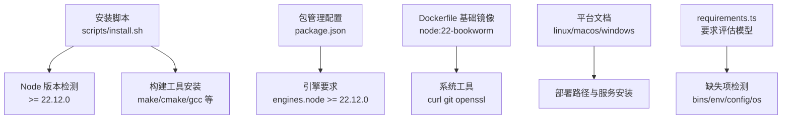
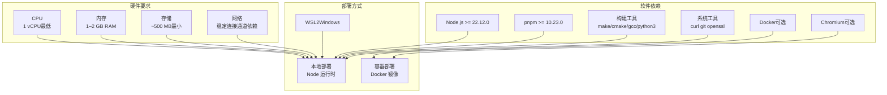
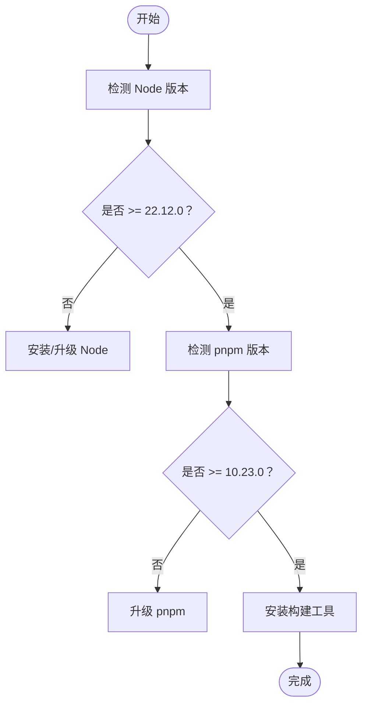
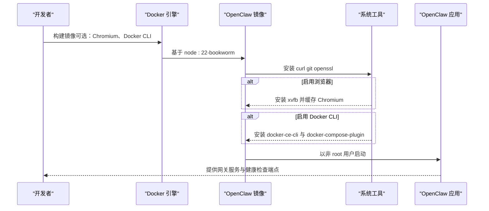
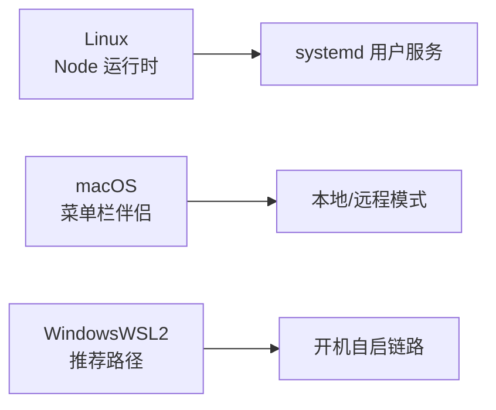
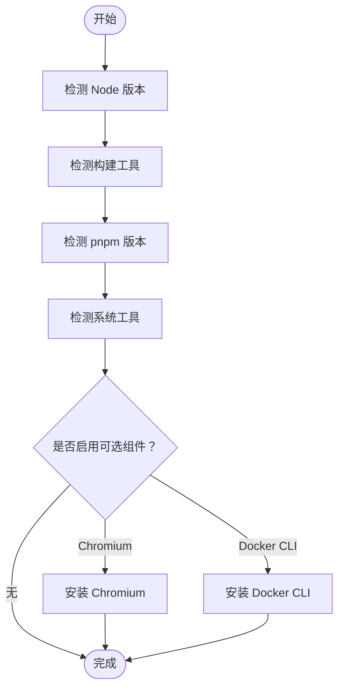
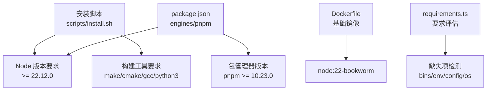

# 系统要求和前置条件

<cite>
**本文档引用的文件**
- [scripts/install.sh](file://scripts/install.sh)
- [package.json](file://package.json)
- [Dockerfile](file://Dockerfile)
- [docs/platforms/linux.md](file://docs/platforms/linux.md)
- [docs/platforms/macos.md](file://docs/platforms/macos.md)
- [docs/platforms/windows.md](file://docs/platforms/windows.md)
- [docs/install/docker.md](file://docs/install/docker.md)
- [docs/install/node.md](file://docs/install/node.md)
- [src/shared/requirements.ts](file://src/shared/requirements.ts)
- [src/cli/requirements-test-fixtures.ts](file://src/cli/requirements-test-fixtures.ts)
- [docs/help/faq.md](file://docs/help/faq.md)
</cite>

## 目录
1. [简介](#简介)
2. [项目结构](#项目结构)
3. [核心组件](#核心组件)
4. [架构总览](#架构总览)
5. [详细组件分析](#详细组件分析)
6. [依赖关系分析](#依赖关系分析)
7. [性能考虑](#性能考虑)
8. [故障排查指南](#故障排查指南)
9. [结论](#结论)
10. [附录](#附录)

## 简介
本文件面向系统管理员与运维工程师，提供 OpenClaw 的系统要求与前置条件说明，覆盖硬件资源、软件依赖、操作系统兼容性、部署方式（本地/容器）以及性能基准与容量规划建议。内容基于仓库中的安装脚本、Docker 镜像定义、平台文档与运行时配置进行整理。

## 项目结构
围绕“系统要求与前置条件”，本仓库的关键支撑文件分布如下：
- 安装与检测：scripts/install.sh（Node 版本检测、构建工具安装、终端交互）
- 运行时与包管理：package.json（Node 引擎版本、包管理器版本）
- 容器化运行：Dockerfile 及相关文档（镜像基础、系统依赖、浏览器与 Docker CLI 可选安装）
- 平台与部署：各平台文档（Linux、macOS、Windows/WSL2）
- 要求评估：requirements.ts 与 requirements-test-fixtures.ts（可复用的要求模型）

图表来源
- [scripts/install.sh:19-21](file://scripts/install.sh#L19-L21)
- [package.json:422-424](file://package.json#L422-L424)
- [Dockerfile:93-101](file://Dockerfile#L93-L101)
- [docs/platforms/linux.md:11](file://docs/platforms/linux.md#L11)
- [docs/platforms/macos.md:24](file://docs/platforms/macos.md#L24)
- [docs/platforms/windows.md:11](file://docs/platforms/windows.md#L11)
- [src/shared/requirements.ts:177-197](file://src/shared/requirements.ts#L177-L197)

章节来源
- [scripts/install.sh:19-21](file://scripts/install.sh#L19-L21)
- [package.json:422-424](file://package.json#L422-L424)
- [Dockerfile:93-101](file://Dockerfile#L93-L101)
- [docs/platforms/linux.md:11](file://docs/platforms/linux.md#L11)
- [docs/platforms/macos.md:24](file://docs/platforms/macos.md#L24)
- [docs/platforms/windows.md:11](file://docs/platforms/windows.md#L11)
- [src/shared/requirements.ts:177-197](file://src/shared/requirements.ts#L177-L197)

## 核心组件
- Node.js 运行时与版本要求
  - 最低版本：Node 22.12.0（由安装脚本与包管理配置共同约束）
  - 包管理器：pnpm 10.23.0（在 package.json 中声明）
- 构建与系统工具
  - Linux：自动安装 build-essential、python3、make、g++、cmake 等
  - macOS：Xcode 命令行工具与 cmake（通过 Homebrew 安装）
- 容器化运行
  - 基础镜像：node:22-bookworm（固定摘要以确保可重复构建）
  - 可选安装：Chromium 浏览器、Docker CLI（用于沙箱）
- 平台支持
  - Linux：推荐使用 Node 运行时；支持 systemd 用户服务
  - macOS：菜单栏伴侣应用 + Gateway 管理；支持本地/远程模式
  - Windows：WSL2 推荐路径；支持开机自启链路

章节来源
- [scripts/install.sh:19-21](file://scripts/install.sh#L19-L21)
- [package.json:422-424](file://package.json#L422-L424)
- [Dockerfile:40-44](file://Dockerfile#L40-L44)
- [Dockerfile:122-126](file://Dockerfile#L122-L126)
- [Dockerfile:164-171](file://Dockerfile#L164-L171)
- [docs/platforms/linux.md:11](file://docs/platforms/linux.md#L11)
- [docs/platforms/macos.md:24](file://docs/platforms/macos.md#L24)
- [docs/platforms/windows.md:11](file://docs/platforms/windows.md#L11)

## 架构总览
下图展示从“系统前置条件”到“运行时”的关键映射关系，帮助理解不同部署方式对硬件与软件的约束。

图表来源
- [docs/help/faq.md:956-959](file://docs/help/faq.md#L956-L959)
- [scripts/install.sh:568-620](file://scripts/install.sh#L568-L620)
- [Dockerfile:122-126](file://Dockerfile#L122-L126)
- [Dockerfile:164-171](file://Dockerfile#L164-L171)
- [docs/platforms/linux.md:11](file://docs/platforms/linux.md#L11)
- [docs/platforms/windows.md:11](file://docs/platforms/windows.md#L11)

## 详细组件分析

### Node.js 与包管理器要求
- Node.js 版本
  - 安装脚本中定义最低版本为 22.12.0，并提供版本解析与校验逻辑
  - package.json 的 engines 字段同样要求 Node >= 22.12.0
- 包管理器
  - package.json 指定 packageManager 为 pnpm@10.23.0
- 构建工具
  - Linux：自动安装 build-essential、python3、make、g++、cmake
  - macOS：安装 Xcode 命令行工具与 cmake（通过 Homebrew）

图表来源
- [scripts/install.sh:1252-1300](file://scripts/install.sh#L1252-L1300)
- [package.json:422-424](file://package.json#L422-L424)
- [scripts/install.sh:568-620](file://scripts/install.sh#L568-L620)
- [scripts/install.sh:622-654](file://scripts/install.sh#L622-L654)

章节来源
- [scripts/install.sh:19-21](file://scripts/install.sh#L19-L21)
- [scripts/install.sh:1252-1300](file://scripts/install.sh#L1252-L1300)
- [package.json:422-424](file://package.json#L422-L424)
- [scripts/install.sh:568-620](file://scripts/install.sh#L568-L620)
- [scripts/install.sh:622-654](file://scripts/install.sh#L622-L654)

### 容器化运行与系统工具
- 基础镜像
  - 使用 node:22-bookworm（固定摘要），确保可重复构建
- 系统工具
  - 默认安装 curl、git、openssl；可选安装 xvfb 与 Chromium
- Docker CLI
  - 可选安装 docker-ce-cli 与 docker-compose-plugin，便于沙箱容器管理
- 运行用户
  - 非 root 用户（node: uid 1000）降低攻击面

图表来源
- [Dockerfile:40-44](file://Dockerfile#L40-L44)
- [Dockerfile:122-126](file://Dockerfile#L122-L126)
- [Dockerfile:164-171](file://Dockerfile#L164-L171)
- [Dockerfile:178-203](file://Dockerfile#L178-L203)
- [Dockerfile:211-214](file://Dockerfile#L211-L214)

章节来源
- [Dockerfile:40-44](file://Dockerfile#L40-L44)
- [Dockerfile:122-126](file://Dockerfile#L122-L126)
- [Dockerfile:164-171](file://Dockerfile#L164-L171)
- [Dockerfile:178-203](file://Dockerfile#L178-L203)
- [Dockerfile:211-214](file://Dockerfile#L211-L214)

### 平台兼容性与部署路径
- Linux
  - 推荐 Node 运行时；支持 systemd 用户服务；适合 VPS/服务器
- macOS
  - 菜单栏伴侣应用 + Gateway 管理；支持本地/远程模式；注意状态目录避免云同步
- Windows（WSL2）
  - 推荐路径；需启用 systemd；支持开机自启链路

图表来源
- [docs/platforms/linux.md:11](file://docs/platforms/linux.md#L11)
- [docs/platforms/linux.md:67](file://docs/platforms/linux.md#L67)
- [docs/platforms/macos.md:24](file://docs/platforms/macos.md#L24)
- [docs/platforms/windows.md:11](file://docs/platforms/windows.md#L11)
- [docs/platforms/windows.md:63](file://docs/platforms/windows.md#L63)

章节来源
- [docs/platforms/linux.md:11](file://docs/platforms/linux.md#L11)
- [docs/platforms/linux.md:67](file://docs/platforms/linux.md#L67)
- [docs/platforms/macos.md:24](file://docs/platforms/macos.md#L24)
- [docs/platforms/windows.md:11](file://docs/platforms/windows.md#L11)
- [docs/platforms/windows.md:63](file://docs/platforms/windows.md#L63)

### 系统预检清单与自动化检查
- 预检清单（建议）
  - Node.js：已安装且版本满足要求
  - 包管理器：pnpm 已安装并版本满足要求
  - 构建工具：make、cmake、gcc、python3（Linux）或 Xcode 命令行工具（macOS）
  - 系统工具：curl、git、openssl（容器镜像默认安装）
  - 可选：Chromium（浏览器自动化）、Docker CLI（沙箱）
- 自动化检查
  - 安装脚本内置 Node 版本检测与构建工具安装流程
  - requirements.ts 提供可复用的“缺失项检测”模型（bins/env/config/os）

图表来源
- [scripts/install.sh:1252-1300](file://scripts/install.sh#L1252-L1300)
- [scripts/install.sh:568-620](file://scripts/install.sh#L568-L620)
- [scripts/install.sh:622-654](file://scripts/install.sh#L622-L654)
- [src/shared/requirements.ts:177-197](file://src/shared/requirements.ts#L177-L197)

章节来源
- [scripts/install.sh:1252-1300](file://scripts/install.sh#L1252-L1300)
- [scripts/install.sh:568-620](file://scripts/install.sh#L568-L620)
- [scripts/install.sh:622-654](file://scripts/install.sh#L622-L654)
- [src/shared/requirements.ts:177-197](file://src/shared/requirements.ts#L177-L197)

## 依赖关系分析
- 外部依赖
  - Node.js 与包管理器版本由安装脚本与 package.json 共同约束
  - Docker 镜像依赖 node:22-bookworm 基础镜像
- 内部耦合
  - 安装脚本负责环境准备（Node、构建工具、系统工具）
  - requirements.ts 作为通用要求评估模块，可被 CLI/工具复用

图表来源
- [scripts/install.sh:19-21](file://scripts/install.sh#L19-L21)
- [package.json:422-424](file://package.json#L422-L424)
- [Dockerfile:40-44](file://Dockerfile#L40-L44)
- [src/shared/requirements.ts:177-197](file://src/shared/requirements.ts#L177-L197)

章节来源
- [scripts/install.sh:19-21](file://scripts/install.sh#L19-L21)
- [package.json:422-424](file://package.json#L422-L424)
- [Dockerfile:40-44](file://Dockerfile#L40-L44)
- [src/shared/requirements.ts:177-197](file://src/shared/requirements.ts#L177-L197)

## 性能考虑
- 资源建议（来自 FAQ）
  - 绝对最低：1 vCPU、1 GB RAM、约 500 MB 磁盘
  - 推荐：1–2 vCPU、2 GB 或更高内存（留有余量，日志、媒体、多通道）
- 存储增长热点
  - 容器文档指出以下路径可能快速增长：media/、会话 JSONL、cron 运行日志、滚动文件日志等
- 浏览器自动化
  - 在容器中预装 Chromium 可减少启动时长与网络开销
- 网络
  - 稳定网络连接对消息通道（如 WhatsApp/Telegram/Slack/Discord）至关重要

章节来源
- [docs/help/faq.md:956-959](file://docs/help/faq.md#L956-L959)
- [docs/install/docker.md:543](file://docs/install/docker.md#L543)
- [Dockerfile:164-171](file://Dockerfile#L164-L171)

## 故障排查指南
- Node 命令未找到
  - 检查 npm 全局前缀是否在 PATH 中；按平台指引添加到 shell 启动文件
- 权限错误（Linux）
  - 将 npm 全局前缀设置为用户可写目录，并更新 PATH
- 构建工具缺失
  - 安装脚本会自动检测并安装缺失的构建工具（Linux：apt/yum/dnf/pacman；macOS：Homebrew）
- Docker CLI 缺失（沙箱）
  - 在容器镜像中可选择安装 docker-ce-cli 与 docker-compose-plugin

章节来源
- [docs/install/node.md:91-139](file://docs/install/node.md#L91-L139)
- [scripts/install.sh:568-620](file://scripts/install.sh#L568-L620)
- [scripts/install.sh:622-654](file://scripts/install.sh#L622-L654)
- [Dockerfile:178-203](file://Dockerfile#L178-L203)

## 结论
- OpenClaw 的系统要求以“轻量”为原则：最低 1 vCPU/1 GB RAM 即可运行基础网关；推荐 2 GB+ 以应对日志、媒体与多通道场景
- 软件依赖以 Node 22.12.0 与 pnpm 10.23.0 为核心，安装脚本与 Dockerfile 提供自动化准备
- 平台支持覆盖 Linux、macOS 与 Windows（WSL2），容器化部署可选安装浏览器与 Docker CLI
- 建议结合“系统预检清单”与“自动化检查”模块，确保部署一致性与可维护性

## 附录
- 快速对照表
  - Node.js：>= 22.12.0
  - 包管理器：pnpm >= 10.23.0
  - 构建工具：make/cmake/gcc/python3（Linux）或 Xcode 命令行工具（macOS）
  - 系统工具：curl、git、openssl（容器镜像默认安装）
  - 可选：Chromium（浏览器自动化）、Docker CLI（沙箱）