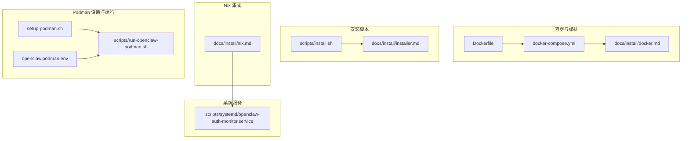
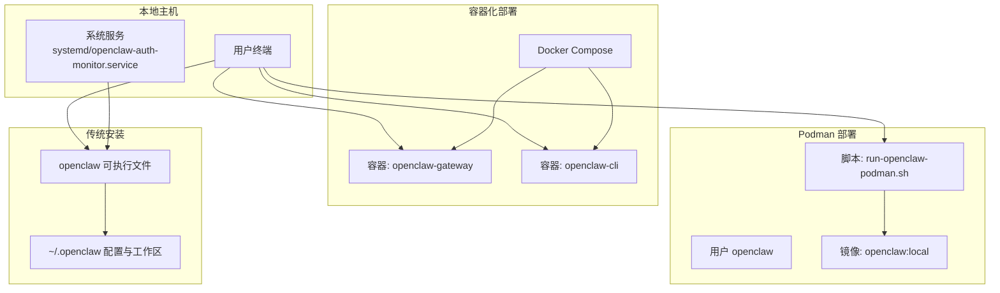
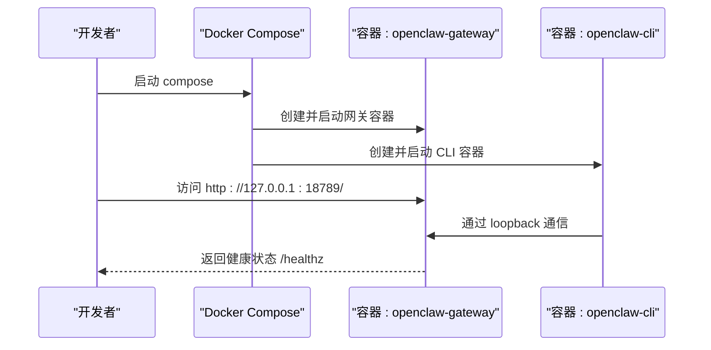
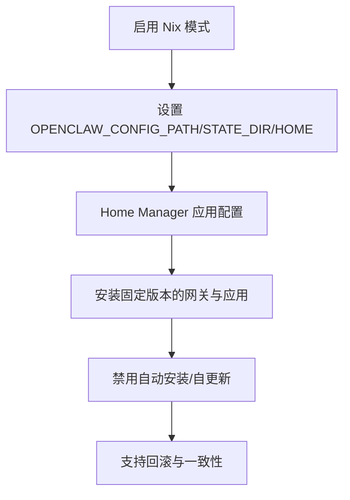
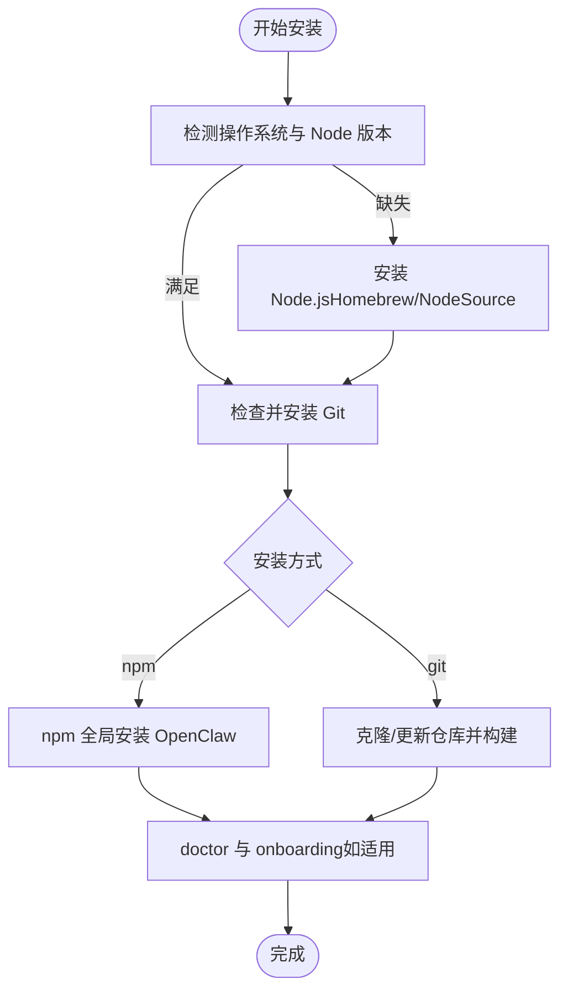
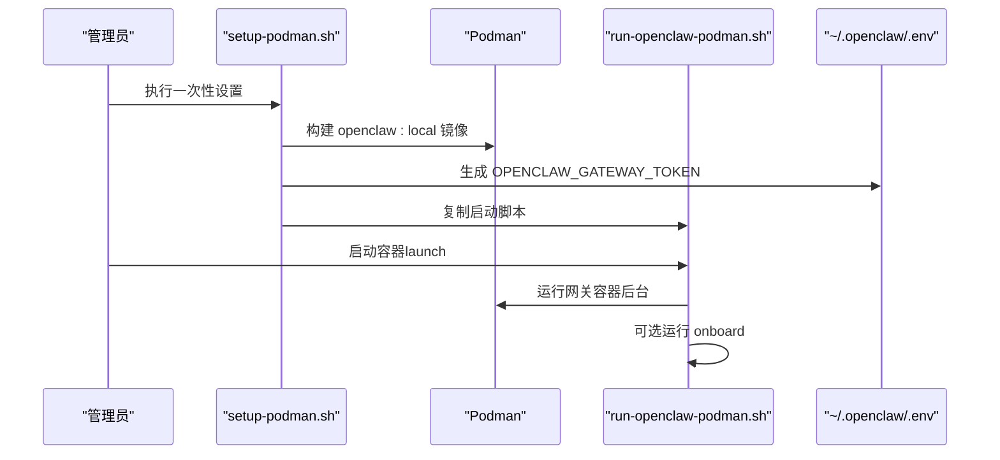
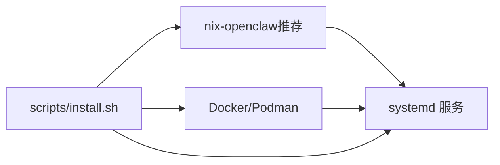

# 部署方式

<cite>
**本文引用的文件**
- [Dockerfile](file://Dockerfile)
- [docker-compose.yml](file://docker-compose.yml)
- [docs/install/docker.md](file://docs/install/docker.md)
- [scripts/install.sh](file://scripts/install.sh)
- [docs/install/installer.md](file://docs/install/installer.md)
- [docs/install/nix.md](file://docs/install/nix.md)
- [setup-podman.sh](file://setup-podman.sh)
- [openclaw.podman.env](file://openclaw.podman.env)
- [scripts/run-openclaw-podman.sh](file://scripts/run-openclaw-podman.sh)
- [scripts/systemd/openclaw-auth-monitor.service](file://scripts/systemd/openclaw-auth-monitor.service)
</cite>

## 目录
1. [简介](#简介)
2. [项目结构](#项目结构)
3. [核心组件](#核心组件)
4. [架构总览](#架构总览)
5. [详细组件分析](#详细组件分析)
6. [依赖关系分析](#依赖关系分析)
7. [性能考量](#性能考量)
8. [故障排查指南](#故障排查指南)
9. [结论](#结论)
10. [附录](#附录)

## 简介
本文件面向 OpenClaw 的多种部署方式，提供从零到一的完整技术文档，覆盖以下主题：
- Docker 容器化部署：镜像构建、Compose 编排、环境变量、网络与端口映射、健康检查、沙箱（Agent Sandbox）与浏览器工具支持等。
- Nix 声明式包管理：通过 nix-openclaw 在 Nix/NixOS/Home Manager 中实现可复现、可回滚的安装与运行。
- 传统安装方式：macOS/Linux/WSL 的交互式安装脚本、命令行安装脚本与 Windows PowerShell 脚本，以及依赖准备、权限与路径问题处理。
- 不同部署方式的优缺点、适用场景与性能对比。
- 部署前准备、环境预检、常见问题与生产最佳实践。

## 项目结构
围绕部署的相关文件主要分布在以下位置：
- 容器镜像与编排：根目录 Dockerfile、docker-compose.yml；Docker 使用指南文档。
- 安装脚本与自动化：scripts/install.sh、docs/install/installer.md。
- Nix 集成：docs/install/nix.md。
- Podman 一次性设置与运行脚本：setup-podman.sh、openclaw.podman.env、scripts/run-openclaw-podman.sh。
- 系统服务示例：scripts/systemd/openclaw-auth-monitor.service。

图表来源
- [Dockerfile:1-231](file://Dockerfile#L1-L231)
- [docker-compose.yml:1-77](file://docker-compose.yml#L1-L77)
- [docs/install/docker.md:1-844](file://docs/install/docker.md#L1-L844)
- [scripts/install.sh:1-2499](file://scripts/install.sh#L1-L2499)
- [docs/install/installer.md:1-406](file://docs/install/installer.md#L1-L406)
- [docs/install/nix.md:1-99](file://docs/install/nix.md#L1-L99)
- [setup-podman.sh:1-313](file://setup-podman.sh#L1-L313)
- [openclaw.podman.env:1-25](file://openclaw.podman.env#L1-L25)
- [scripts/run-openclaw-podman.sh:1-232](file://scripts/run-openclaw-podman.sh#L1-L232)
- [scripts/systemd/openclaw-auth-monitor.service:1-15](file://scripts/systemd/openclaw-auth-monitor.service#L1-L15)

章节来源
- [Dockerfile:1-231](file://Dockerfile#L1-L231)
- [docker-compose.yml:1-77](file://docker-compose.yml#L1-L77)
- [docs/install/docker.md:1-844](file://docs/install/docker.md#L1-L844)
- [scripts/install.sh:1-2499](file://scripts/install.sh#L1-L2499)
- [docs/install/installer.md:1-406](file://docs/install/installer.md#L1-L406)
- [docs/install/nix.md:1-99](file://docs/install/nix.md#L1-L99)
- [setup-podman.sh:1-313](file://setup-podman.sh#L1-L313)
- [openclaw.podman.env:1-25](file://openclaw.podman.env#L1-L25)
- [scripts/run-openclaw-podman.sh:1-232](file://scripts/run-openclaw-podman.sh#L1-L232)
- [scripts/systemd/openclaw-auth-monitor.service:1-15](file://scripts/systemd/openclaw-auth-monitor.service#L1-L15)

## 核心组件
- 容器镜像与运行时
  - Dockerfile 定义多阶段构建、基础镜像固定、运行时用户与非 root 启动、健康检查与可选的浏览器与 Docker CLI 安装参数。
  - docker-compose.yml 提供网关与 CLI 服务定义、卷挂载、端口映射、健康检查与安全限制。
- 安装脚本
  - scripts/install.sh 支持 macOS/Linux/WSL 的交互式安装，自动检测 Node 版本、安装依赖、选择 npm 或 git 安装方式、运行 doctor 与 onboarding。
  - docs/install/installer.md 提供安装脚本的使用说明、标志与环境变量参考。
- Nix 集成
  - docs/install/nix.md 指向 nix-openclaw，提供声明式安装、Nix 模式行为、路径与回滚能力。
- Podman 设置与运行
  - setup-podman.sh 一次性设置 openclaw 用户、构建镜像、加载到目标用户存储、生成启动脚本与可选 Quadlet。
  - openclaw.podman.env 提供 Podman 运行所需的环境变量模板。
  - scripts/run-openclaw-podman.sh 提供 Podman 启动、设置向导与日志查看。
- 系统服务
  - scripts/systemd/openclaw-auth-monitor.service 展示如何以 systemd 服务形式监控认证过期。

章节来源
- [Dockerfile:1-231](file://Dockerfile#L1-L231)
- [docker-compose.yml:1-77](file://docker-compose.yml#L1-L77)
- [scripts/install.sh:1-2499](file://scripts/install.sh#L1-L2499)
- [docs/install/installer.md:1-406](file://docs/install/installer.md#L1-L406)
- [docs/install/nix.md:1-99](file://docs/install/nix.md#L1-L99)
- [setup-podman.sh:1-313](file://setup-podman.sh#L1-L313)
- [openclaw.podman.env:1-25](file://openclaw.podman.env#L1-L25)
- [scripts/run-openclaw-podman.sh:1-232](file://scripts/run-openclaw-podman.sh#L1-L232)
- [scripts/systemd/openclaw-auth-monitor.service:1-15](file://scripts/systemd/openclaw-auth-monitor.service#L1-L15)

## 架构总览
下图展示三种部署方式在系统中的角色与交互：

图表来源
- [docker-compose.yml:1-77](file://docker-compose.yml#L1-L77)
- [scripts/run-openclaw-podman.sh:1-232](file://scripts/run-openclaw-podman.sh#L1-L232)
- [scripts/systemd/openclaw-auth-monitor.service:1-15](file://scripts/systemd/openclaw-auth-monitor.service#L1-L15)

## 详细组件分析

### Docker 容器化部署
- 镜像构建
  - 多阶段构建：扩展依赖提取、构建产物裁剪、最终运行时镜像最小化。
  - 基础镜像固定：基于 node:22-bookworm 并使用 SHA256 固定，确保可复现性。
  - 可选参数：OPENCLAW_EXTENSIONS（预装扩展依赖）、OPENCLAW_DOCKER_APT_PACKAGES（安装系统包）、OPENCLAW_INSTALL_BROWSER（预装 Chromium）、OPENCLAW_INSTALL_DOCKER_CLI（安装 Docker CLI）。
- Compose 编排
  - 服务：openclaw-gateway（网关）、openclaw-cli（CLI）。
  - 卷：挂载 ~/.openclaw 与 ~/.openclaw/workspace 到容器内。
  - 端口：默认 18789（网关）、18790（桥接）。
  - 健康检查：内置 HEALTHCHECK 探测 /healthz。
  - 安全：CLI 丢弃敏感能力并启用 no-new-privileges。
- 网络与绑定
  - 默认绑定模式为 lan，便于宿主机访问；loopback 仅限容器内访问。
  - 如需外部访问，需设置认证令牌并调整绑定模式与防火墙策略。
- 沙箱与浏览器
  - 支持 Agent Sandbox（Docker 隔离工具执行），可通过 OPENCLAW_SANDBOX=1 启用。
  - 浏览器工具可在容器中运行，或使用专用浏览器沙箱镜像。
- 环境变量与配置
  - 关键变量：OPENCLAW_GATEWAY_TOKEN、OPENCLAW_GATEWAY_BIND、OPENCLAW_CONFIG_DIR、OPENCLAW_WORKSPACE_DIR、OPENCLAW_DOCKER_APT_PACKAGES、OPENCLAW_EXTENSIONS 等。
  - 文档参考：docs/install/docker.md。

图表来源
- [docker-compose.yml:1-77](file://docker-compose.yml#L1-L77)
- [Dockerfile:224-231](file://Dockerfile#L224-L231)
- [docs/install/docker.md:469-495](file://docs/install/docker.md#L469-L495)

章节来源
- [Dockerfile:1-231](file://Dockerfile#L1-L231)
- [docker-compose.yml:1-77](file://docker-compose.yml#L1-L77)
- [docs/install/docker.md:1-844](file://docs/install/docker.md#L1-L844)

### Nix 声明式包管理
- 安装方式
  - 推荐使用 nix-openclaw（Home Manager 模块），实现可复现、可回滚的安装与运行。
  - 支持 macOS 应用、网关、工具（whisper、spotify、摄像头）等统一打包与固定版本。
- Nix 模式
  - 通过 OPENCLAW_NIX_MODE=1 或 macOS defaults 开启 Nix 模式，禁用自动安装与自更新，使配置确定化。
  - 运行时路径：OPENCLAW_CONFIG_PATH、OPENCLAW_STATE_DIR、OPENCLAW_HOME。
- 打包注意
  - macOS Info.plist 模板在打包流程中被复制并修补动态字段，保证 SwiftPM 与 Nix 构建的一致性。

图表来源
- [docs/install/nix.md:46-99](file://docs/install/nix.md#L46-L99)

章节来源
- [docs/install/nix.md:1-99](file://docs/install/nix.md#L1-L99)

### 传统安装方式（macOS/Linux/WSL）
- 安装脚本 install.sh
  - 自动检测 OS 与 Node 版本，必要时安装 Node.js（macOS 通过 Homebrew，Linux 通过 NodeSource）。
  - 支持 npm 与 git 两种安装方式；git 方式会克隆/更新仓库、安装 pnpm 依赖、构建 UI 与 CLI，并在 ~/.local/bin 安装包装器。
  - 升级或 git 安装后自动运行 doctor；若存在 BOOTSTRAP.md，尝试自动 onboarding。
- 安装脚本 install-cli.sh
  - 将 Node 与 OpenClaw 安装到本地前缀（默认 ~/.openclaw），无需系统 Node 依赖，适合受限环境。
- Windows 安装脚本 install.ps1
  - 通过 winget/Chocolatey/Scoop 安装 Node，支持 npm/git 安装方式与 onboarding。
- 环境要求与预检
  - Node.js 22.12+；Git；Linux 上可能需要 sudo 权限与构建工具链。
  - npm 全局安装权限问题可通过切换到 ~/.npm-global 解决。
- 常见问题
  - PATH 未包含 npm 全局 bin 导致 openclaw 命令找不到；Windows 下 PATH 需要添加 npm prefix。
  - sharp/libvips 构建冲突可通过 SHARP_IGNORE_GLOBAL_LIBVIPS 控制。

图表来源
- [scripts/install.sh:1252-1486](file://scripts/install.sh#L1252-L1486)
- [docs/install/installer.md:61-164](file://docs/install/installer.md#L61-L164)

章节来源
- [scripts/install.sh:1-2499](file://scripts/install.sh#L1-L2499)
- [docs/install/installer.md:1-406](file://docs/install/installer.md#L1-L406)

### Podman 部署（一次性设置与运行）
- 一次性设置 setup-podman.sh
  - 创建 openclaw 用户（nologin，带家目录），初始化 ~/.openclaw 与 workspace。
  - 生成 OPENCLAW_GATEWAY_TOKEN 并写入 ~/.openclaw/.env。
  - 构建 openclaw:local 镜像并加载到目标用户 Podman 存储。
  - 可选安装 systemd Quadlet，以便作为用户服务开机自启。
- 运行脚本 scripts/run-openclaw-podman.sh
  - 生成或注入 OPENCLAW_GATEWAY_TOKEN，创建 minimal config（gateway.mode=local）。
  - 支持以 keep-id/host 用户命名空间启动，自动处理 SELinux mount 选项。
  - 支持 podman run -it 运行 onboard 向导，或后台运行网关容器。
- 环境变量 openclaw.podman.env
  - 提供 OPENCLAW_GATEWAY_TOKEN、Provider 凭证、端口映射与绑定模式等模板。

图表来源
- [setup-podman.sh:193-313](file://setup-podman.sh#L193-L313)
- [scripts/run-openclaw-podman.sh:145-232](file://scripts/run-openclaw-podman.sh#L145-L232)
- [openclaw.podman.env:1-25](file://openclaw.podman.env#L1-L25)

章节来源
- [setup-podman.sh:1-313](file://setup-podman.sh#L1-L313)
- [openclaw.podman.env:1-25](file://openclaw.podman.env#L1-L25)
- [scripts/run-openclaw-podman.sh:1-232](file://scripts/run-openclaw-podman.sh#L1-L232)

### 系统服务与监控
- systemd 服务示例
  - scripts/systemd/openclaw-auth-monitor.service 展示如何以 systemd 服务形式监控认证过期，支持环境变量配置通知渠道。
- 生产建议
  - 在 systemd 用户环境中启用持久化（linger），确保 rootless Podman 在无交互登录时仍可运行。
  - 结合定时任务与通知通道，实现认证过期预警与自动续期。

章节来源
- [scripts/systemd/openclaw-auth-monitor.service:1-15](file://scripts/systemd/openclaw-auth-monitor.service#L1-L15)

## 依赖关系分析
- 组件耦合
  - Dockerfile 与 docker-compose.yml 强耦合于运行时用户与端口映射；Dockerfile 的 build-arg 与 Compose 的环境变量共同决定功能开关（浏览器、Docker CLI、APT 包等）。
  - install.sh 与 docs/install/installer.md 形成“安装流程规范”，对 Node/Git/pnpm 的依赖与错误处理路径清晰。
  - nix-openclaw 与 docs/install/nix.md 提供声明式安装入口，Nix 模式下禁用自动安装与自更新，降低运行时不确定性。
  - setup-podman.sh 与 scripts/run-openclaw-podman.sh 形成“用户隔离 + 镜像构建 + 启动”的闭环。
- 外部依赖
  - Docker/Podman、systemd、Homebrew（macOS）、NodeSource（Linux）、Git、构建工具链（make/g++/cmake/python3）。

图表来源
- [scripts/install.sh:1-2499](file://scripts/install.sh#L1-L2499)
- [docs/install/nix.md:1-99](file://docs/install/nix.md#L1-L99)
- [setup-podman.sh:1-313](file://setup-podman.sh#L1-L313)
- [scripts/run-openclaw-podman.sh:1-232](file://scripts/run-openclaw-podman.sh#L1-L232)
- [scripts/systemd/openclaw-auth-monitor.service:1-15](file://scripts/systemd/openclaw-auth-monitor.service#L1-L15)

章节来源
- [scripts/install.sh:1-2499](file://scripts/install.sh#L1-L2499)
- [docs/install/nix.md:1-99](file://docs/install/nix.md#L1-L99)
- [setup-podman.sh:1-313](file://setup-podman.sh#L1-L313)
- [scripts/run-openclaw-podman.sh:1-232](file://scripts/run-openclaw-podman.sh#L1-L232)
- [scripts/systemd/openclaw-auth-monitor.service:1-15](file://scripts/systemd/openclaw-auth-monitor.service#L1-L15)

## 性能考量
- 容器镜像层缓存
  - 将依赖层（package.json/pnpm-lock.yaml）与源码拷贝顺序优化，避免无关变更导致 pnpm install 重跑。
- 内存与 OOM
  - 构建阶段通过 NODE_OPTIONS=--max-old-space-size=2048 降低低内存主机上的 OOM 风险。
- 浏览器与 Playwright
  - 预装 Chromium 可减少容器启动时的下载与安装开销；持久化浏览器缓存可提升后续启动速度。
- 端口与网络
  - 默认使用 loopback 绑定以减少暴露面；如需外部访问，应配合防火墙与认证令牌，避免不必要的端口暴露。

章节来源
- [Dockerfile:56-59](file://Dockerfile#L56-L59)
- [docs/install/docker.md:405-436](file://docs/install/docker.md#L405-L436)

## 故障排查指南
- Docker
  - 权限与 EACCES：确保宿主挂载目录属主匹配容器内 node 用户（uid 1000）。
  - 绑定模式与端口：若宿主机无法访问，检查 OPENCLAW_GATEWAY_BIND 与端口映射。
  - 健康检查：使用 /healthz 与 /readyz 探针定位进程存活与就绪状态。
- Nix
  - Nix 模式下禁用自动安装：按提示手动安装依赖或通过 nix-openclaw 提供的模块解决。
  - 路径问题：确保 OPENCLAW_CONFIG_PATH、OPENCLAW_STATE_DIR、OPENCLAW_HOME 指向 Nix 管理的可写位置。
- 传统安装
  - PATH 未包含 npm 全局 bin：在 shell rc 文件追加 PATH 或使用 install-cli.sh 的本地前缀安装。
  - sharp/libvips 构建失败：设置 SHARP_IGNORE_GLOBAL_LIBVIPS=0 或安装系统 libvips。
- Podman
  - SELinux：在 Enforcing/Permissive 模式下自动附加 :Z 以正确 relabel 挂载目录。
  - 用户命名空间：keep-id 保持 UID/GID，避免挂载所有权问题；否则需手动修复。

章节来源
- [docs/install/docker.md:392-404](file://docs/install/docker.md#L392-L404)
- [docs/install/nix.md:64-81](file://docs/install/nix.md#L64-L81)
- [scripts/install.sh:1573-1603](file://scripts/install.sh#L1573-L1603)
- [scripts/run-openclaw-podman.sh:186-200](file://scripts/run-openclaw-podman.sh#L186-L200)

## 结论
- Docker 适合需要隔离、快速验证与标准化部署的场景；通过 Compose 与健康检查实现可观测性与可维护性。
- Nix 适合追求可复现、可回滚与声明式管理的用户；Nix 模式下配置确定化，适合生产与多机一致性。
- 传统安装适合开发与本地调试，流程简单、可控性强；在受限环境可使用 install-cli.sh 进行本地前缀安装。
- Podman 适合 rootless 场景与 systemd 用户服务；一次性设置脚本简化了镜像构建与用户隔离。

## 附录
- 部署前准备清单
  - 确认 Node.js 22.12+、Git、构建工具链（Linux）。
  - 准备 ~/.openclaw 与 workspace 目录（权限与所有权）。
  - 准备 Provider 凭证（如 Claude/Telegram/Discord 等）。
- 生产最佳实践
  - 使用固定镜像标签与 OCI 基础镜像注解，确保可追溯性。
  - 采用非 root 用户运行容器，最小化权限与能力。
  - 严格控制绑定模式与端口暴露，结合防火墙与认证令牌。
  - 对浏览器与沙箱工具进行资源限制与安全策略配置。
  - 使用 systemd 服务监控认证过期，建立告警与自动续期机制。