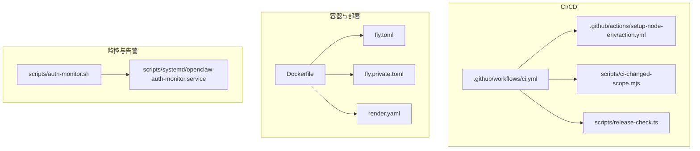
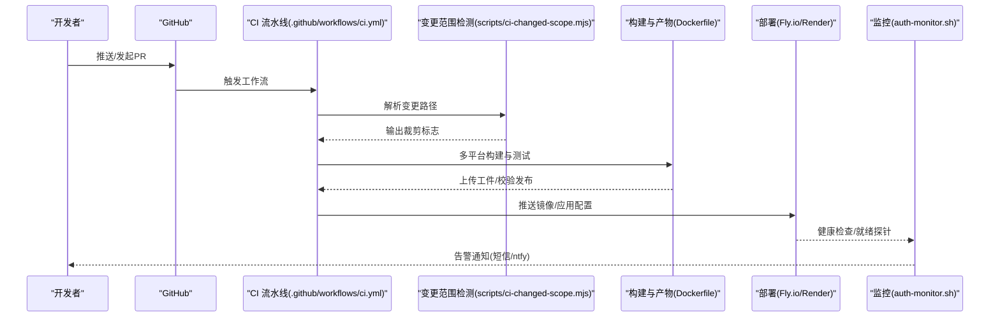
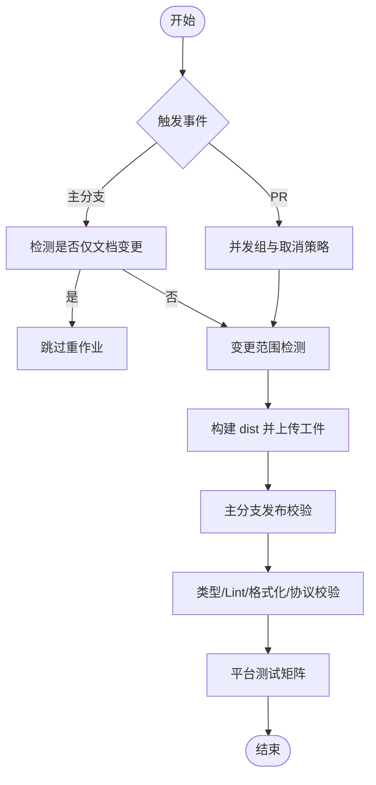
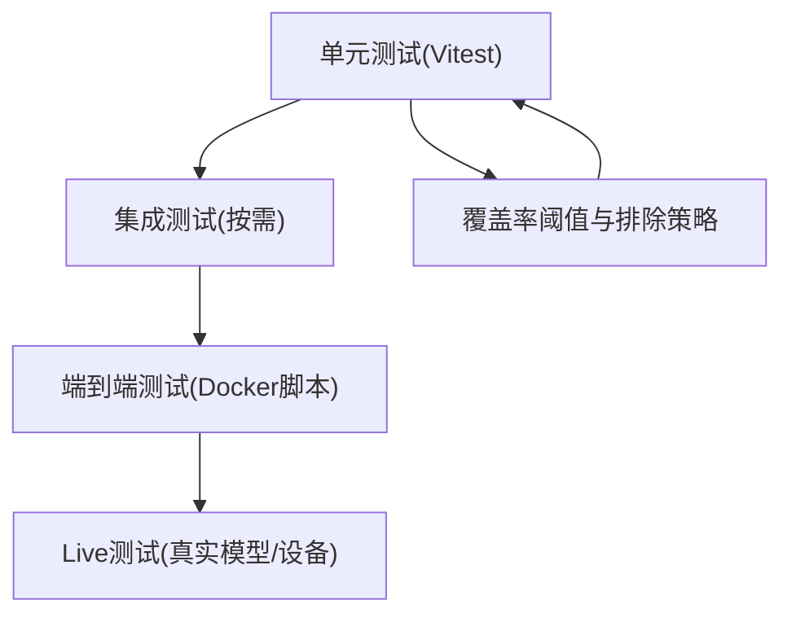
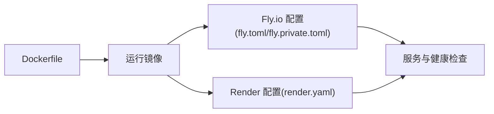
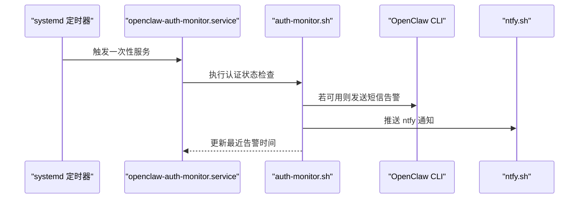
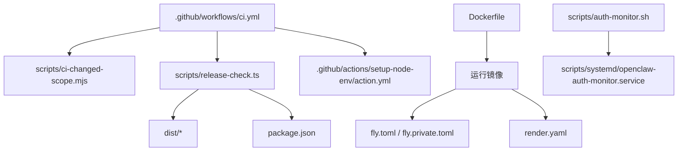

# 部署自动化

<cite>
**本文引用的文件**
- [.github/workflows/ci.yml](file://.github/workflows/ci.yml)
- [.github/actions/setup-node-env/action.yml](file://.github/actions/setup-node-env/action.yml)
- [scripts/ci-changed-scope.mjs](file://scripts/ci-changed-scope.mjs)
- [scripts/release-check.ts](file://scripts/release-check.ts)
- [vitest.config.ts](file://vitest.config.ts)
- [Dockerfile](file://Dockerfile)
- [fly.toml](file://fly.toml)
- [fly.private.toml](file://fly.private.toml)
- [render.yaml](file://render.yaml)
- [package.json](file://package.json)
- [scripts/auth-monitor.sh](file://scripts/auth-monitor.sh)
- [scripts/systemd/openclaw-auth-monitor.service](file://scripts/systemd/openclaw-auth-monitor.service)
</cite>

## 目录
1. [简介](#简介)
2. [项目结构](#项目结构)
3. [核心组件](#核心组件)
4. [架构总览](#架构总览)
5. [详细组件分析](#详细组件分析)
6. [依赖关系分析](#依赖关系分析)
7. [性能考量](#性能考量)
8. [故障排查指南](#故障排查指南)
9. [结论](#结论)
10. [附录](#附录)

## 简介
本文件系统化梳理 OpenClaw 的部署自动化体系，覆盖 CI/CD 流水线设计与实现、自动化测试流程（单元、集成、端到端）、持续部署策略（蓝绿/滚动/回滚思路）、部署脚本编写与维护要点（环境变量、密钥处理、错误处理），以及监控告警与日志收集的自动化配置。目标是帮助读者快速理解并高效维护该仓库的自动化发布与运维能力。

## 项目结构
OpenClaw 将部署自动化分为三层：
- 持续集成与质量门禁：基于 GitHub Actions 的多平台流水线，按变更范围裁剪作业，确保 PR 快速反馈与主分支稳定发布。
- 容器化运行时与部署：通过 Dockerfile 构建最小运行镜像，Fly.io 与 Render 提供云原生部署配置，支持持久化存储与健康检查。
- 运维监控与告警：通过 systemd 服务与定时任务对认证状态进行周期性检查，结合通知渠道（短信、ntfy）实现预警。

图表来源
- [.github/workflows/ci.yml](file://.github/workflows/ci.yml)
- [.github/actions/setup-node-env/action.yml](file://.github/actions/setup-node-env/action.yml)
- [scripts/ci-changed-scope.mjs](file://scripts/ci-changed-scope.mjs)
- [scripts/release-check.ts](file://scripts/release-check.ts)
- [Dockerfile](file://Dockerfile)
- [fly.toml](file://fly.toml)
- [fly.private.toml](file://fly.private.toml)
- [render.yaml](file://render.yaml)
- [scripts/auth-monitor.sh](file://scripts/auth-monitor.sh)
- [scripts/systemd/openclaw-auth-monitor.service](file://scripts/systemd/openclaw-auth-monitor.service)

章节来源
- [.github/workflows/ci.yml](file://.github/workflows/ci.yml)
- [scripts/ci-changed-scope.mjs](file://scripts/ci-changed-scope.mjs)
- [scripts/release-check.ts](file://scripts/release-check.ts)
- [Dockerfile](file://Dockerfile)
- [fly.toml](file://fly.toml)
- [fly.private.toml](file://fly.private.toml)
- [render.yaml](file://render.yaml)
- [scripts/auth-monitor.sh](file://scripts/auth-monitor.sh)
- [scripts/systemd/openclaw-auth-monitor.service](file://scripts/systemd/openclaw-auth-monitor.service)

## 核心组件
- GitHub Actions CI 流水线：按 PR 与主分支区分触发；通过并发组与“仅文档变更跳过”策略减少资源消耗；按变更范围裁剪作业矩阵。
- 变更范围检测：根据变更路径匹配规则，动态输出 run_node/run_macos/run_android/run_windows/run_skills_python 等标志，驱动后续作业选择。
- 发布校验：在主分支构建后执行 npm pack 干运行与清单校验，确保产物完整性与插件 SDK 导出一致性。
- 容器化运行时：多阶段构建，剥离开发工具与源码，产出精简运行镜像；支持扩展依赖注入、浏览器与 Docker CLI 可选安装。
- 云平台部署：Fly.io 与 Render 的容器部署配置，定义健康检查、进程绑定、持久卷挂载与环境变量。
- 运维监控：基于 systemd 的一次性服务与定时器，周期性检查 Claude 认证状态并通过 OpenClaw 或 ntfy 推送告警。

章节来源
- [.github/workflows/ci.yml](file://.github/workflows/ci.yml)
- [scripts/ci-changed-scope.mjs](file://scripts/ci-changed-scope.mjs)
- [scripts/release-check.ts](file://scripts/release-check.ts)
- [Dockerfile](file://Dockerfile)
- [fly.toml](file://fly.toml)
- [fly.private.toml](file://fly.private.toml)
- [render.yaml](file://render.yaml)
- [scripts/auth-monitor.sh](file://scripts/auth-monitor.sh)
- [scripts/systemd/openclaw-auth-monitor.service](file://scripts/systemd/openclaw-auth-monitor.service)

## 架构总览
下图展示从代码提交到容器部署与监控告警的关键路径：

图表来源
- [.github/workflows/ci.yml](file://.github/workflows/ci.yml)
- [scripts/ci-changed-scope.mjs](file://scripts/ci-changed-scope.mjs)
- [Dockerfile](file://Dockerfile)
- [fly.toml](file://fly.toml)
- [fly.private.toml](file://fly.private.toml)
- [render.yaml](file://render.yaml)
- [scripts/auth-monitor.sh](file://scripts/auth-monitor.sh)

## 详细组件分析

### 组件A：CI/CD 流水线与触发策略
- 触发条件
  - 主分支推送：全量或按变更范围裁剪的作业。
  - PR：默认触发，但通过并发组与“仅文档变更跳过”降低开销。
- 并发控制
  - 使用 concurrency.group 与 cancel-in-progress 控制 PR 的并发取消。
- 作业分层
  - 文档变更检测：仅当存在非文档变更时才继续。
  - 变更范围检测：按 Node、macOS、Android、Windows、Skills Python 划分。
  - 构建与发布校验：主分支构建 dist 并执行 npm pack 干运行与清单校验。
  - 质量门禁：类型检查、LINT、格式化、协议生成校验等。
  - 平台测试：Node/Bun 测试矩阵、Windows 分片、macOS Swift 构建与测试、Android Gradle 任务。
- 关键输入与缓存
  - 自定义 Composite Action 初始化 Node/pnpm/Bun 环境，支持 sticky disk 缓存与冻结锁文件安装。

图表来源
- [.github/workflows/ci.yml](file://.github/workflows/ci.yml)
- [scripts/ci-changed-scope.mjs](file://scripts/ci-changed-scope.mjs)

章节来源
- [.github/workflows/ci.yml](file://.github/workflows/ci.yml)
- [.github/actions/setup-node-env/action.yml](file://.github/actions/setup-node-env/action.yml)
- [scripts/ci-changed-scope.mjs](file://scripts/ci-changed-scope.mjs)

### 组件B：自动化测试流程（单元/集成/端到端）
- 单元测试
  - Vitest 配置：按平台设置最大并发，启用 v8 覆盖率，排除大量非核心目录以稳定阈值。
  - 用例组织：include/exclude 明确覆盖范围，避免重复统计与过度负担。
- 集成测试
  - 通过 vitest.config.ts 中的 include/exclude 识别集成测试文件，集中于 src/* 目录。
- 端到端测试
  - 通过 Docker 脚本与 e2e 目录中的脚本组合，覆盖引导、网关网络、插件、清理等场景。
- Live 测试
  - 通过 OPENCLAW_LIVE_TEST 等环境变量启用真实模型与设备联调。

图表来源
- [vitest.config.ts](file://vitest.config.ts)
- [package.json](file://package.json)

章节来源
- [vitest.config.ts](file://vitest.config.ts)
- [package.json](file://package.json)

### 组件C：持续部署策略与配置
- Dockerfile 多阶段构建
  - 提取扩展依赖清单，避免无关扩展变更导致缓存失效。
  - 构建期剔除 dev 依赖与映射文件，运行时仅保留 dist、extensions、skills、docs。
  - 支持可选安装 Chromium 与 Playwright、Docker CLI，便于沙箱与自动化。
- Fly.io 部署
  - 定义 http_service 内部端口、强制 HTTPS、最小运行实例数、自动启停。
  - 挂载持久卷 /data，设置内存与 CPU 规格。
  - 私有部署模板隐藏公网入口，仅通过 fly proxy/WireGuard/SSH 访问。
- Render 部署
  - Docker 运行时，健康检查路径 /health，环境变量如 PORT、OPENCLAW_STATE_DIR、OPENCLAW_GATEWAY_TOKEN。
  - 持久磁盘挂载 /data，容量与计划可配置。

图表来源
- [Dockerfile](file://Dockerfile)
- [fly.toml](file://fly.toml)
- [fly.private.toml](file://fly.private.toml)
- [render.yaml](file://render.yaml)

章节来源
- [Dockerfile](file://Dockerfile)
- [fly.toml](file://fly.toml)
- [fly.private.toml](file://fly.private.toml)
- [render.yaml](file://render.yaml)

### 组件D：部署脚本编写与维护指南
- 环境变量管理
  - 在 CI 中通过 GITHUB_ENV 注入测试资源限制（如 OPENCLAW_TEST_WORKERS、OPENCLAW_TEST_MAX_OLD_SPACE_SIZE_MB）。
  - 在容器中通过 Dockerfile ENV 与平台配置（fly.toml/render.yaml）统一设置 NODE_ENV、OPENCLAW_STATE_DIR、NODE_OPTIONS 等。
- 密钥与敏感信息
  - CI 中使用 GitHub Secrets 管理令牌与凭据，不直接暴露在工作流或脚本中。
  - 变更范围检测与发布校验脚本均通过本地文件读取，避免在命令行暴露。
- 错误处理
  - CI 步骤采用 set -euo pipefail 与带重试的子模块初始化，失败时尽早退出并保留上下文。
  - 发布校验脚本对缺失文件、版本不一致、Sparkle 版本下限等进行严格检查，失败即终止。
- 蓝绿/滚动/回滚思路
  - 当前未见专用蓝绿/滚动/回滚脚本。建议在现有健康检查基础上，结合平台的多实例与自动启停策略，通过切换最小运行实例数与路由策略实现平滑升级；回滚可通过镜像标签与配置回退实现。

章节来源
- [.github/workflows/ci.yml](file://.github/workflows/ci.yml)
- [Dockerfile](file://Dockerfile)
- [fly.toml](file://fly.toml)
- [fly.private.toml](file://fly.private.toml)
- [render.yaml](file://render.yaml)
- [scripts/release-check.ts](file://scripts/release-check.ts)

### 组件E：监控告警与日志收集自动化
- 认证状态监控
  - auth-monitor.sh 周期性检查 Claude 凭证有效期，支持通过 OpenClaw 短信与 ntfy 推送告警。
  - systemd 服务与定时器确保在系统启动后自动执行，避免漏报。
- 日志与可观测性
  - 容器内置 /healthz 与 /readyz 健康检查端点，便于平台侧探针探测。
  - 建议在生产环境中开启结构化日志与集中式日志收集（如 stdout/stderr 采集至平台日志系统）。

图表来源
- [scripts/auth-monitor.sh](file://scripts/auth-monitor.sh)
- [scripts/systemd/openclaw-auth-monitor.service](file://scripts/systemd/openclaw-auth-monitor.service)

章节来源
- [scripts/auth-monitor.sh](file://scripts/auth-monitor.sh)
- [scripts/systemd/openclaw-auth-monitor.service](file://scripts/systemd/openclaw-auth-monitor.service)

## 依赖关系分析
- CI 依赖
  - GitHub Actions 元数据与 Composite Action（setup-node-env）提供一致的运行环境。
  - 变更范围检测脚本依赖 Git diff 结果，输出给后续作业选择。
  - 发布校验脚本依赖 npm pack 与 dist/plugin-sdk 输出，确保产物完整。
- 容器与部署
  - Dockerfile 依赖 package.json 与扩展清单，构建期剔除 dev 依赖与映射文件。
  - Fly.io/Render 配置依赖 Dockerfile 与健康检查端点。
- 监控与告警
  - auth-monitor.sh 依赖 Claude 凭证文件与 OpenClaw CLI，通知渠道通过环境变量配置。

图表来源
- [.github/workflows/ci.yml](file://.github/workflows/ci.yml)
- [scripts/ci-changed-scope.mjs](file://scripts/ci-changed-scope.mjs)
- [scripts/release-check.ts](file://scripts/release-check.ts)
- [.github/actions/setup-node-env/action.yml](file://.github/actions/setup-node-env/action.yml)
- [Dockerfile](file://Dockerfile)
- [fly.toml](file://fly.toml)
- [fly.private.toml](file://fly.private.toml)
- [render.yaml](file://render.yaml)
- [scripts/auth-monitor.sh](file://scripts/auth-monitor.sh)
- [scripts/systemd/openclaw-auth-monitor.service](file://scripts/systemd/openclaw-auth-monitor.service)

章节来源
- [.github/workflows/ci.yml](file://.github/workflows/ci.yml)
- [scripts/ci-changed-scope.mjs](file://scripts/ci-changed-scope.mjs)
- [scripts/release-check.ts](file://scripts/release-check.ts)
- [.github/actions/setup-node-env/action.yml](file://.github/actions/setup-node-env/action.yml)
- [Dockerfile](file://Dockerfile)
- [fly.toml](file://fly.toml)
- [fly.private.toml](file://fly.private.toml)
- [render.yaml](file://render.yaml)
- [scripts/auth-monitor.sh](file://scripts/auth-monitor.sh)
- [scripts/systemd/openclaw-auth-monitor.service](file://scripts/systemd/openclaw-auth-monitor.service)

## 性能考量
- CI 并发与缓存
  - 通过并发组与“仅文档变更跳过”减少不必要的作业执行。
  - pnpm store 缓存与 sticky disk 选项在不同平台间权衡复用与稳定性。
- 测试并行度
  - Vitest 最大并发按平台与 CI 环境动态调整，Windows 采用分片策略降低不稳定因素。
- 构建体积与启动时间
  - 多阶段构建与剔除 dev 依赖显著减小镜像体积，提升拉取与启动速度。
  - 可选安装 Chromium/Playwright 与 Docker CLI 以换取首次启动成本，适合需要浏览器自动化或沙箱场景。

## 故障排查指南
- CI 构建失败
  - 检查变更范围检测输出与作业裁剪逻辑，确认是否因仅文档变更被跳过。
  - 查看 Composite Action 的 Node/pnpm/Bun 安装与缓存命中情况。
- 发布校验失败
  - 关注 npm pack 干运行结果与 dist/plugin-sdk 导出完整性，核对插件版本同步与 Sparkle 版本下限。
- 容器健康问题
  - 检查 /healthz 与 /readyz 端点返回状态，确认进程绑定与端口配置。
  - 核对持久卷挂载与权限，确保 /data 可写。
- 认证告警频繁
  - 检查 auth-monitor.sh 的通知间隔与状态文件，确认 Claude 凭证有效性与网络可达性。
  - 如需紧急恢复，参考 fly.proxy 或 WireGuard 访问方式临时绕过公网限制。

章节来源
- [.github/workflows/ci.yml](file://.github/workflows/ci.yml)
- [scripts/release-check.ts](file://scripts/release-check.ts)
- [Dockerfile](file://Dockerfile)
- [fly.toml](file://fly.toml)
- [fly.private.toml](file://fly.private.toml)
- [render.yaml](file://render.yaml)
- [scripts/auth-monitor.sh](file://scripts/auth-monitor.sh)

## 结论
OpenClaw 的部署自动化以 GitHub Actions 为核心，结合变更范围裁剪、严格的发布校验与多平台测试矩阵，确保高质量交付。容器化运行时与云平台配置提供了稳定的运行环境与可观测性。运维层面通过 systemd 与定时任务实现认证状态的主动监控与告警。建议在现有基础上完善蓝绿/滚动/回滚策略与集中式日志收集，进一步提升发布安全性与可追溯性。

## 附录
- 关键脚本与配置路径
  - CI 工作流：.github/workflows/ci.yml
  - 环境准备动作：.github/actions/setup-node-env/action.yml
  - 变更范围检测：scripts/ci-changed-scope.mjs
  - 发布校验：scripts/release-check.ts
  - 测试配置：vitest.config.ts
  - 容器构建：Dockerfile
  - Fly.io 配置：fly.toml / fly.private.toml
  - Render 配置：render.yaml
  - 认证监控：scripts/auth-monitor.sh
  - systemd 服务：scripts/systemd/openclaw-auth-monitor.service