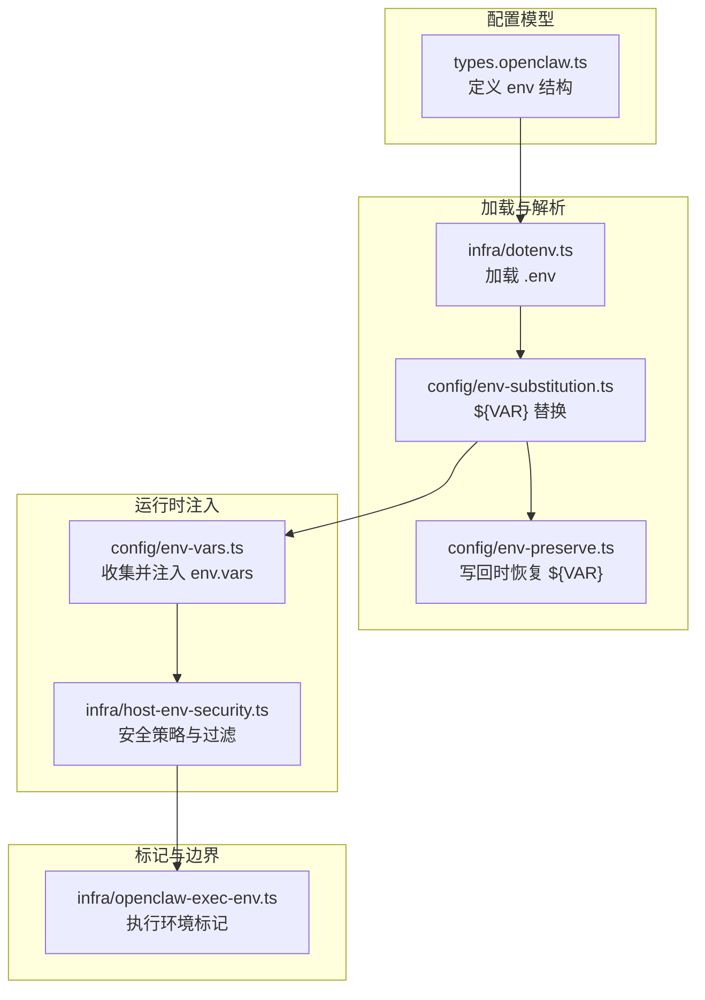
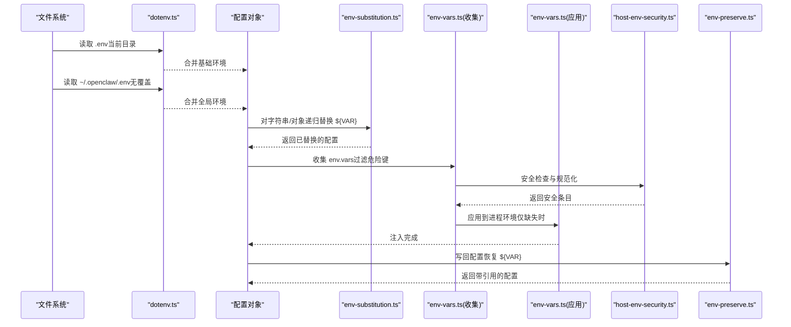
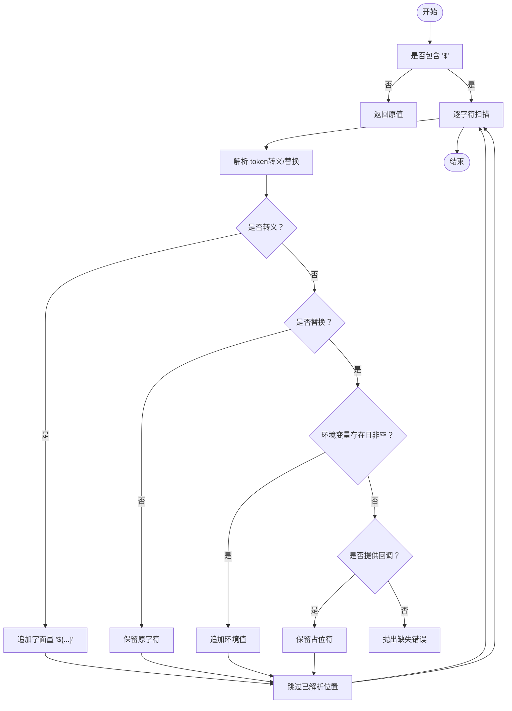
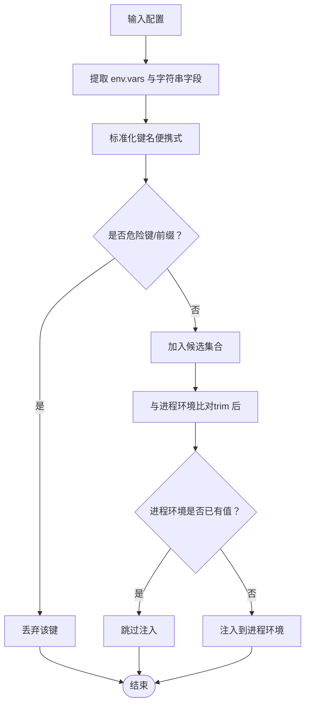
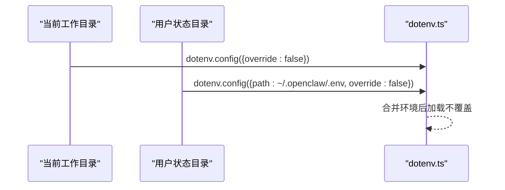
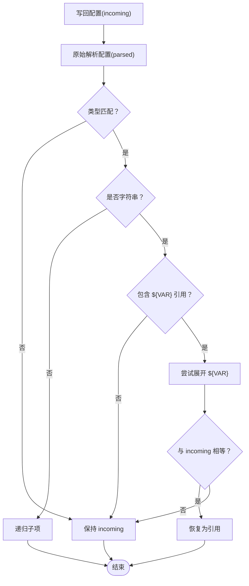
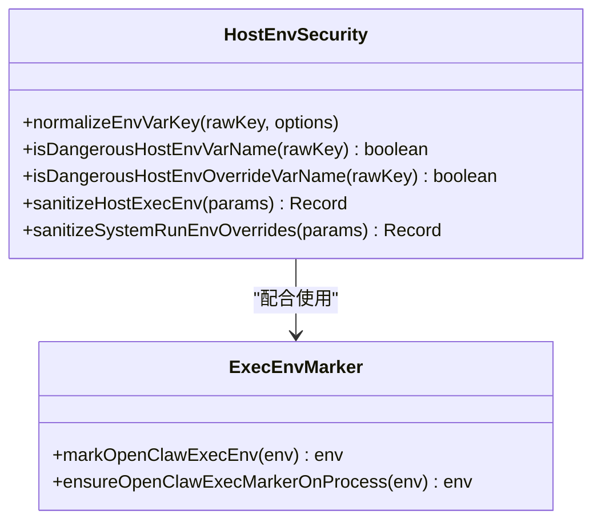
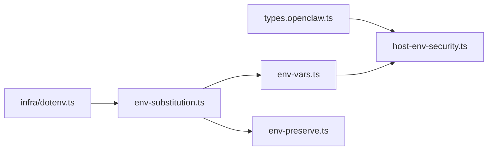

# 环境变量配置

<cite>
**本文引用的文件**
- [src/config/env-substitution.ts](file://src/config/env-substitution.ts)
- [src/config/env-vars.ts](file://src/config/env-vars.ts)
- [src/config/env-preserve.ts](file://src/config/env-preserve.ts)
- [src/infra/dotenv.ts](file://src/infra/dotenv.ts)
- [src/infra/host-env-security.ts](file://src/infra/host-env-security.ts)
- [src/infra/host-env-security-policy.json](file://src/infra/host-env-security-policy.json)
- [src/infra/openclaw-exec-env.ts](file://src/infra/openclaw-exec-env.ts)
- [src/config/types.openclaw.ts](file://src/config/types.openclaw.ts)
- [src/config/config.env-vars.test.ts](file://src/config/config.env-vars.test.ts)
- [openclaw.podman.env](file://openclaw.podman.env)
- [src/infra/dotenv.test.ts](file://src/infra/dotenv.test.ts)
- [src/config/paths.test.ts](file://src/config/paths.test.ts)
- [src/cli/profile.test.ts](file://src/cli/profile.test.ts)
</cite>

## 目录
1. [简介](#简介)
2. [项目结构](#项目结构)
3. [核心组件](#核心组件)
4. [架构总览](#架构总览)
5. [详细组件分析](#详细组件分析)
6. [依赖关系分析](#依赖关系分析)
7. [性能考量](#性能考量)
8. [故障排查指南](#故障排查指南)
9. [结论](#结论)
10. [附录](#附录)

## 简介
本文件系统性阐述 OpenClaw 的环境变量配置体系，涵盖以下方面：
- 环境变量的加载与解析机制：变量替换、类型转换与默认值处理
- 支持的环境变量清单：敏感配置、运行时选项与调试设置
- 优先级与覆盖规则：与配置文件的关系及冲突处理
- 最佳实践：安全考虑、命名约定与组织结构
- 不同部署环境的配置示例与模板

## 项目结构
OpenClaw 将“环境变量配置”拆分为多个模块协同工作：
- 配置文件模型定义：在配置类型中声明 env 块及其字段
- 环境变量加载：.env 文件加载与全局回退路径
- 变量替换：对配置中的 ${VAR} 占位符进行解析
- 运行时注入：将配置中的 env.vars 注入到进程环境（仅在未存在时）
- 安全策略：禁止危险键名与前缀，限制可覆盖范围
- 写回保护：在写回配置时保留 ${VAR} 引用，避免丢失环境化来源

图表来源
- [src/config/types.openclaw.ts:40-55](file://src/config/types.openclaw.ts#L40-L55)
- [src/infra/dotenv.ts:6-20](file://src/infra/dotenv.ts#L6-L20)
- [src/config/env-substitution.ts:197-203](file://src/config/env-substitution.ts#L197-L203)
- [src/config/env-vars.ts:79-97](file://src/config/env-vars.ts#L79-L97)
- [src/infra/host-env-security.ts:59-81](file://src/infra/host-env-security.ts#L59-L81)
- [src/infra/openclaw-exec-env.ts:4-16](file://src/infra/openclaw-exec-env.ts#L4-L16)

章节来源
- [src/config/types.openclaw.ts:40-55](file://src/config/types.openclaw.ts#L40-L55)
- [src/infra/dotenv.ts:6-20](file://src/infra/dotenv.ts#L6-L20)
- [src/config/env-substitution.ts:197-203](file://src/config/env-substitution.ts#L197-L203)
- [src/config/env-vars.ts:79-97](file://src/config/env-vars.ts#L79-L97)
- [src/infra/host-env-security.ts:59-81](file://src/infra/host-env-security.ts#L59-L81)
- [src/infra/openclaw-exec-env.ts:4-16](file://src/infra/openclaw-exec-env.ts#L4-L16)

## 核心组件
- 配置模型（env）：在配置类型中定义 env 字段，支持 inline 变量与 shellEnv 导入开关
- .env 加载器：优先加载当前目录 .env，再从用户状态目录加载全局 .env（不覆盖已存在的变量）
- 变量替换器：递归遍历配置对象，将字符串中的 ${VAR} 替换为进程环境值
- 运行时注入器：将配置中的 env.vars 注入到进程环境，但不会覆盖已存在的变量
- 安全策略：基于白名单/黑名单策略拒绝危险键名与前缀，并限制可覆盖范围
- 写回保护器：在写回配置时检测并恢复 ${VAR} 引用，避免丢失环境化来源

章节来源
- [src/config/types.openclaw.ts:40-55](file://src/config/types.openclaw.ts#L40-L55)
- [src/infra/dotenv.ts:6-20](file://src/infra/dotenv.ts#L6-L20)
- [src/config/env-substitution.ts:197-203](file://src/config/env-substitution.ts#L197-L203)
- [src/config/env-vars.ts:79-97](file://src/config/env-vars.ts#L79-L97)
- [src/infra/host-env-security.ts:59-81](file://src/infra/host-env-security.ts#L59-L81)
- [src/config/env-preserve.ts:89-134](file://src/config/env-preserve.ts#L89-L134)

## 架构总览
下图展示从“配置文件解析”到“运行时环境”的端到端流程，以及与安全策略和写回保护的交互。

图表来源
- [src/infra/dotenv.ts:6-20](file://src/infra/dotenv.ts#L6-L20)
- [src/config/env-substitution.ts:197-203](file://src/config/env-substitution.ts#L197-L203)
- [src/config/env-vars.ts:79-97](file://src/config/env-vars.ts#L79-L97)
- [src/infra/host-env-security.ts:59-81](file://src/infra/host-env-security.ts#L59-L81)
- [src/config/env-preserve.ts:89-134](file://src/config/env-preserve.ts#L89-L134)

## 详细组件分析

### 组件一：环境变量替换器（${VAR}）
- 功能要点
  - 仅匹配大写/下划线风格的变量名
  - 支持转义语法输出字面量 `${VAR}`（通过双重转义）
  - 缺失变量时抛出错误或回调保留占位符
  - 递归应用于字符串、数组与对象
- 错误处理
  - 缺失变量抛出带上下文的错误，便于定位配置路径
- 性能特性
  - 线性扫描字符串，复杂度 O(n)；递归遍历对象按节点数线性扩展

图表来源
- [src/config/env-substitution.ts:43-76](file://src/config/env-substitution.ts#L43-L76)
- [src/config/env-substitution.ts:88-135](file://src/config/env-substitution.ts#L88-L135)
- [src/config/env-substitution.ts:161-186](file://src/config/env-substitution.ts#L161-L186)

章节来源
- [src/config/env-substitution.ts:1-204](file://src/config/env-substitution.ts#L1-L204)

### 组件二：配置环境变量收集与注入（env.vars）
- 功能要点
  - 收集 env.vars 与 env 下的字符串字段，标准化键名（便携式）
  - 过滤危险键名与前缀，避免注入高危环境变量
  - 仅在进程环境未设置时才注入，保证外部环境优先
- 安全边界
  - 使用安全策略模块拒绝黑名单键与前缀
  - 规范化键名，拒绝非便携式键（仅允许字母/数字/下划线）

图表来源
- [src/config/env-vars.ts:13-55](file://src/config/env-vars.ts#L13-L55)
- [src/config/env-vars.ts:79-97](file://src/config/env-vars.ts#L79-L97)
- [src/infra/host-env-security.ts:59-81](file://src/infra/host-env-security.ts#L59-L81)

章节来源
- [src/config/env-vars.ts:1-98](file://src/config/env-vars.ts#L1-L98)
- [src/infra/host-env-security.ts:1-158](file://src/infra/host-env-security.ts#L1-L158)

### 组件三：.env 加载与全局回退
- 行为
  - 先加载当前工作目录 .env（dotenv 默认行为）
  - 再加载用户状态目录下的 .env（如不存在则跳过）
  - 后加载的 .env 不会覆盖已存在的变量
- 路径来源
  - 全局 .env 路径由配置目录解析函数决定，通常位于用户主目录下的隐藏目录

图表来源
- [src/infra/dotenv.ts:6-20](file://src/infra/dotenv.ts#L6-L20)

章节来源
- [src/infra/dotenv.ts:1-21](file://src/infra/dotenv.ts#L1-L21)
- [src/infra/dotenv.test.ts:1-48](file://src/infra/dotenv.test.ts#L1-L48)

### 组件四：写回保护（恢复 ${VAR} 引用）
- 目标
  - 在写回配置时，若某值与当前环境变量展开一致，则恢复为原始的 ${VAR} 引用
- 条件
  - 原始解析值包含 ${VAR} 模式
  - 当前环境中展开结果与写回值一致
- 类型与结构
  - 递归处理字符串、数组与对象，保持类型一致性

图表来源
- [src/config/env-preserve.ts:89-134](file://src/config/env-preserve.ts#L89-L134)

章节来源
- [src/config/env-preserve.ts:1-135](file://src/config/env-preserve.ts#L1-L135)

### 组件五：安全策略与执行环境标记
- 安全策略
  - 黑名单键与前缀：如 NODE_OPTIONS、LD_PRELOAD、DYLD_* 等
  - 可覆盖黑名单：如 HOME、ZDOTDIR、GIT_* 等
  - 便携式键名校验：仅允许字母/数字/下划线
- 执行环境标记
  - 在注入的环境上添加特定标记，便于下游识别执行来源

图表来源
- [src/infra/host-env-security.ts:45-157](file://src/infra/host-env-security.ts#L45-L157)
- [src/infra/openclaw-exec-env.ts:4-16](file://src/infra/openclaw-exec-env.ts#L4-L16)

章节来源
- [src/infra/host-env-security.ts:1-158](file://src/infra/host-env-security.ts#L1-L158)
- [src/infra/openclaw-exec-env.ts:1-16](file://src/infra/openclaw-exec-env.ts#L1-L16)
- [src/infra/host-env-security-policy.json:1-51](file://src/infra/host-env-security-policy.json#L1-L51)

## 依赖关系分析
- 配置模型依赖于安全策略与替换器，以确保 env 块的语义正确与安全
- .env 加载器独立于配置解析，但其结果会被替换器消费
- 注入器依赖安全策略与替换器的结果，避免危险键进入进程环境
- 写回保护器依赖替换器的展开语义，确保引用恢复的一致性

图表来源
- [src/config/types.openclaw.ts:40-55](file://src/config/types.openclaw.ts#L40-L55)
- [src/infra/dotenv.ts:6-20](file://src/infra/dotenv.ts#L6-L20)
- [src/config/env-substitution.ts:197-203](file://src/config/env-substitution.ts#L197-L203)
- [src/config/env-vars.ts:79-97](file://src/config/env-vars.ts#L79-L97)
- [src/infra/host-env-security.ts:59-81](file://src/infra/host-env-security.ts#L59-L81)
- [src/config/env-preserve.ts:89-134](file://src/config/env-preserve.ts#L89-L134)

章节来源
- [src/config/types.openclaw.ts:40-55](file://src/config/types.openclaw.ts#L40-L55)
- [src/infra/dotenv.ts:6-20](file://src/infra/dotenv.ts#L6-L20)
- [src/config/env-substitution.ts:197-203](file://src/config/env-substitution.ts#L197-L203)
- [src/config/env-vars.ts:79-97](file://src/config/env-vars.ts#L79-L97)
- [src/infra/host-env-security.ts:59-81](file://src/infra/host-env-security.ts#L59-L81)
- [src/config/env-preserve.ts:89-134](file://src/config/env-preserve.ts#L89-L134)

## 性能考量
- 变量替换复杂度与配置规模线性相关，建议：
  - 控制配置层级深度与字符串长度
  - 避免在热路径中重复进行大规模替换
- 注入器仅在缺失时写入，避免不必要的环境变更
- 写回保护器采用浅层正则匹配与递归遍历，注意避免在超大配置上频繁写回

## 故障排查指南
- 缺失环境变量错误
  - 现象：替换阶段抛出缺失错误，包含变量名与配置路径
  - 排查：确认 .env 是否加载成功、变量是否拼写正确、是否被安全策略拦截
- 变量未生效
  - 现象：配置中设置了 env.vars，但进程环境未更新
  - 排查：确认该键在进程环境中是否已存在；确认键名是否被安全策略过滤
- 写回后丢失 ${VAR}
  - 现象：写回配置后，原本的 ${VAR} 被具体值替代
  - 排查：确认写回前后的环境值是否一致；检查写回保护逻辑是否触发
- .env 未加载
  - 现象：全局 .env 未生效
  - 排查：确认状态目录路径与文件是否存在；确认加载顺序与覆盖策略

章节来源
- [src/config/env-substitution.ts:29-37](file://src/config/env-substitution.ts#L29-L37)
- [src/config/env-vars.test.ts:14-134](file://src/config/config.env-vars.test.ts#L14-L134)
- [src/infra/dotenv.ts:6-20](file://src/infra/dotenv.ts#L6-L20)

## 结论
OpenClaw 的环境变量配置系统通过“加载—替换—注入—保护—安全”的闭环设计，实现了灵活、安全与可追溯的配置管理。其关键优势在于：
- 明确的优先级与覆盖规则，保证外部环境优先
- 严格的危险键过滤与便携式键名校验
- 可观测的变量替换与写回保护，避免信息丢失
- 与配置文件的解耦与可移植性

## 附录

### 支持的环境变量清单与用途
- 配置模型中的 env 字段
  - env.shellEnv：启用从登录 shell 导入环境（需显式开启）
  - env.vars：内联环境变量，仅在缺失时注入
  - env 下的字符串键：作为 sugar 语法直接声明环境变量
- 通用运行时与路径相关
  - OPENCLAW_HOME：默认状态与配置目录根
  - OPENCLAW_STATE_DIR：状态目录（可覆盖）
  - OPENCLAW_CONFIG_PATH：配置文件路径（可覆盖）
  - OPENCLAW_CLI：标记执行来源
- 安全与调试相关
  - OPENCLAW_NIX_MODE：Nix 模式开关
  - OPENCLAW_GATEWAY_TOKEN：网关鉴权令牌
  - OPENCLAW_GATEWAY_BIND：网关绑定方式
  - OPENCLAW_PODMAN_GATEWAY_HOST_PORT / OPENCLAW_PODMAN_BRIDGE_HOST_PORT：Podman 端口映射
- 提供商与服务密钥
  - OPENROUTER_API_KEY、GROQ_API_KEY、BRAVE_API_KEY 等（按需配置）
  - Claude/网页会话相关键（可选）
- 其他
  - OPENCLAW_SHELL：用于某些扩展的 shell 覆盖（测试夹具中可见）

章节来源
- [src/config/types.openclaw.ts:40-55](file://src/config/types.openclaw.ts#L40-L55)
- [openclaw.podman.env:1-25](file://openclaw.podman.env#L1-L25)
- [src/config/paths.test.ts:39-82](file://src/config/paths.test.ts#L39-L82)
- [src/cli/profile.test.ts:84-101](file://src/cli/profile.test.ts#L84-L101)

### 优先级与覆盖规则
- 外部环境优先：进程环境已存在的变量不会被配置注入覆盖
- .env 加载顺序：先当前目录，后用户状态目录；后者不覆盖前者
- 安全策略优先：危险键与前缀一律拒绝注入
- 写回保护：若写回值与当前环境展开一致，则恢复为 ${VAR}

章节来源
- [src/config/env-vars.ts:79-97](file://src/config/env-vars.ts#L79-L97)
- [src/infra/dotenv.ts:6-20](file://src/infra/dotenv.ts#L6-L20)
- [src/infra/host-env-security.ts:59-81](file://src/infra/host-env-security.ts#L59-L81)
- [src/config/env-preserve.ts:89-134](file://src/config/env-preserve.ts#L89-L134)

### 最佳实践
- 命名约定
  - 使用全大写字母与下划线，确保跨平台兼容
  - 仅使用字母、数字、下划线，避免特殊字符
- 安全考虑
  - 避免在 env.vars 中设置黑名单键与前缀
  - 使用 .env 存放机密，避免硬编码在配置文件中
  - 通过安全策略与写回保护减少泄露风险
- 组织结构
  - 将敏感变量集中于 .env，非敏感变量置于配置文件
  - 使用 env.vars 仅注入缺失值，避免无意覆盖
  - 在多环境间维护不同的 .env 并通过脚本选择加载

### 不同部署环境的配置示例与模板
- Podman 部署
  - 示例模板：见 [openclaw.podman.env](file://openclaw.podman.env)
  - 关键点：设置网关令牌与端口映射，必要时生成随机令牌
- 开发与 CI
  - 建议：在 CI 中通过环境变量注入，本地使用 .env 回退
  - 注意：.env 不应提交到版本库，使用 .gitignore 屏蔽
- Nix 环境
  - 通过 OPENCLAW_NIX_MODE 控制模式行为
  - 配置路径与状态目录可通过 OPENCLAW_CONFIG_PATH 与 OPENCLAW_STATE_DIR 覆盖

章节来源
- [openclaw.podman.env:1-25](file://openclaw.podman.env#L1-L25)
- [src/config/paths.test.ts:39-82](file://src/config/paths.test.ts#L39-L82)
- [src/config/config.nix-integration-u3-u5-u9.test.ts:46-118](file://src/config/config.nix-integration-u3-u5-u9.test.ts#L46-L118)