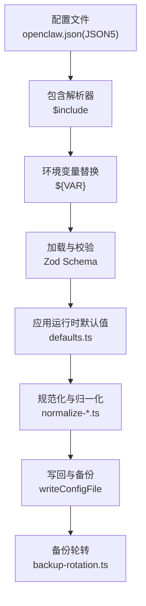
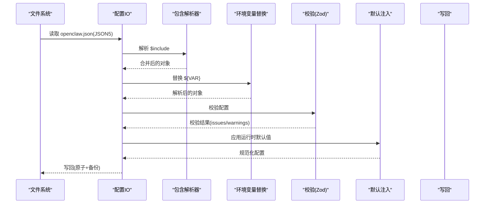
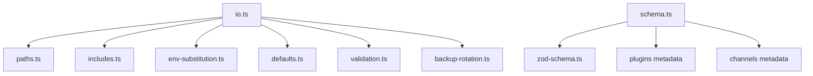

# 配置文件结构

<cite>
**本文引用的文件**
- [src/config/io.ts](file://src/config/io.ts)
- [src/config/paths.ts](file://src/config/paths.ts)
- [src/config/includes.ts](file://src/config/includes.ts)
- [src/config/merge-config.ts](file://src/config/merge-config.ts)
- [src/config/defaults.ts](file://src/config/defaults.ts)
- [src/config/zod-schema.ts](file://src/config/zod-schema.ts)
- [src/config/types.openclaw.ts](file://src/config/types.openclaw.ts)
- [src/config/types.base.ts](file://src/config/types.base.ts)
- [src/config/schema.ts](file://src/config/schema.ts)
- [src/config/validation.ts](file://src/config/validation.ts)
- [src/config/version.ts](file://src/config/version.ts)
- [src/config/env-substitution.ts](file://src/config/env-substitution.ts)
- [src/config/env-vars.ts](file://src/config/env-vars.ts)
- [src/config/normalize-paths.ts](file://src/config/normalize-paths.ts)
- [src/config/normalize-exec-safe-bin.ts](file://src/config/normalize-exec-safe-bin.ts)
- [src/config/runtime-overrides.ts](file://src/config/runtime-overrides.ts)
- [src/config/backup-rotation.ts](file://src/config/backup-rotation.ts)
- [src/config/agent-dirs.ts](file://src/config/agent-dirs.ts)
- [src/config/merge-patch.ts](file://src/config/merge-patch.ts)
- [src/config/talk.ts](file://src/config/talk.ts)
- [src/config/model-input.ts](file://src/config/model-input.ts)
- [src/config/agents/defaults.js](file://src/agents/defaults.js)
- [src/agents/model-selection.js](file://src/agents/model-selection.js)
- [src/config/agent-limits.ts](file://src/config/agent-limits.ts)
- [src/config/talk.js](file://src/config/talk.js)
- [src/config/model-input.js](file://src/config/model-input.js)
- [src/config/agents/defaults.js](file://src/agents/defaults.js)
- [src/agents/model-selection.js](file://src/agents/model-selection.js)
- [src/config/agent-limits.ts](file://src/config/agent-limits.ts)
- [src/config/talk.ts](file://src/config/talk.ts)
- [src/config/model-input.ts](file://src/config/model-input.ts)
- [src/config/agents/defaults.js](file://src/agents/defaults.js)
- [src/agents/model-selection.js](file://src/agents/model-selection.js)
- [src/config/agent-limits.ts](file://src/config/agent-limits.ts)
- [src/config/talk.ts](file://src/config/talk.ts)
- [src/config/model-input.ts](file://src/config/model-input.ts)
</cite>

## 目录
1. [简介](#简介)
2. [项目结构](#项目结构)
3. [核心组件](#核心组件)
4. [架构总览](#架构总览)
5. [详细组件分析](#详细组件分析)
6. [依赖分析](#依赖分析)
7. [性能考虑](#性能考虑)
8. [故障排除指南](#故障排除指南)
9. [结论](#结论)
10. [附录](#附录)

## 简介
本文件系统化阐述 OpenClaw 的配置文件结构与加载机制，涵盖以下主题：
- 配置文件的层次结构与组织：全局配置、插件与渠道扩展配置、模块化包含（$include）。
- JSON Schema 结构：字段定义、数据类型、默认值与敏感标记。
- 加载顺序与合并机制：文件优先级、继承关系、覆盖规则与运行时默认注入。
- 版本管理与向后兼容：元数据、版本戳、未来配置警告与迁移提示。
- 完整示例：基础配置、完整配置与最小可用配置的结构要点。

## 项目结构
OpenClaw 的配置系统由“解析器 + 包装 IO + 默认注入 + 校验 + 合并 + 写回”构成，核心位于 src/config 目录。关键职责划分如下：
- 路径解析：确定配置文件路径、状态目录与 OAuth 存储路径。
- 解析与包含：支持 JSON5 语法与 $include 模块化包含，深度限制与安全校验。
- 环境变量替换：在加载阶段进行 ${VAR} 替换，并在写回时智能恢复。
- 默认注入：按需应用运行时默认值（日志、会话、模型、代理并发等）。
- 校验与提示：基于 Zod Schema 的强类型校验与 UI 提示构建。
- 合并与写回：生成补丁、保留环境变量引用、备份轮转与原子写入。

图表来源
- [src/config/io.ts:734-883](file://src/config/io.ts#L734-L883)
- [src/config/includes.ts:340-347](file://src/config/includes.ts#L340-L347)
- [src/config/env-substitution.ts](file://src/config/env-substitution.ts)
- [src/config/defaults.ts:1-537](file://src/config/defaults.ts#L1-L537)
- [src/config/backup-rotation.ts](file://src/config/backup-rotation.ts)

章节来源
- [src/config/paths.ts:118-194](file://src/config/paths.ts#L118-L194)
- [src/config/io.ts:734-883](file://src/config/io.ts#L734-L883)

## 核心组件
- 配置 IO 与缓存：负责读取、解析、校验、应用默认值、写回与缓存控制。
- 包含解析器：支持 $include 指令，递归解析、深度限制、路径安全检查与错误传播。
- 环境变量替换：在加载阶段解析 ${VAR}，写回时根据变更集恢复原样。
- 运行时默认注入：按模块注入日志、会话、模型、代理并发等默认值。
- Schema 与 UI 提示：构建 JSON Schema 与 UI 提示，支持插件与渠道扩展。
- 写回与备份：生成补丁、原子写入、备份轮转与审计日志。

章节来源
- [src/config/io.ts:1-1560](file://src/config/io.ts#L1-L1560)
- [src/config/includes.ts:1-347](file://src/config/includes.ts#L1-L347)
- [src/config/defaults.ts:1-537](file://src/config/defaults.ts#L1-L537)
- [src/config/schema.ts:1-712](file://src/config/schema.ts#L1-L712)

## 架构总览
下图展示从磁盘到内存再到持久化的完整流程，以及关键扩展点（插件、渠道、心跳目标提示）。

图表来源
- [src/config/io.ts:734-883](file://src/config/io.ts#L734-L883)
- [src/config/includes.ts:340-347](file://src/config/includes.ts#L340-L347)
- [src/config/env-substitution.ts](file://src/config/env-substitution.ts)
- [src/config/defaults.ts:1-537](file://src/config/defaults.ts#L1-L537)

## 详细组件分析

### 配置文件层次与位置
- 默认位置：~/.openclaw/openclaw.json（或通过 OPENCLAW_STATE_DIR 指定状态目录）。
- 支持历史兼容：若存在旧目录中的配置文件，优先使用现有文件。
- 可通过 OPENCLAW_CONFIG_PATH 显式指定配置文件路径。
- OAuth 凭据存储：默认位于状态目录下的 credentials/oauth.json。

章节来源
- [src/config/paths.ts:118-194](file://src/config/paths.ts#L118-L194)
- [src/config/paths.ts:248-264](file://src/config/paths.ts#L248-L264)

### $include 模块化包含与合并规则
- 语法：在配置根对象中使用键 "$include"，值可为字符串或字符串数组。
- 行为：
  - 单文件：直接读取并解析为对象。
  - 数组：依次深合并，数组元素拼接，对象递归合并，原始值覆盖。
  - 其他键与包含同时存在时，要求包含内容为对象，否则抛出错误。
- 安全与限制：
  - 最大包含深度限制（常量定义）。
  - 文件大小上限（常量定义）。
  - 路径必须位于配置目录内，禁止逃逸；对符号链接进行 realpath 校验。
- 错误类型：包含循环、超出深度、路径逃逸、读取/解析失败等。

章节来源
- [src/config/includes.ts:1-347](file://src/config/includes.ts#L1-L347)

### 环境变量替换与写回保护
- 加载阶段：在应用默认值前，先将 config.env 中的变量注入进程环境，再对配置中的 ${VAR} 进行替换。
- 写回阶段：收集当前文件中的 ${VAR} 引用，仅在对应路径未发生变更时才恢复原样，避免无意覆盖用户手改值。
- 变更路径追踪：基于 diff 生成变更集合，用于决定是否恢复 ${VAR}。

章节来源
- [src/config/env-substitution.ts](file://src/config/env-substitution.ts)
- [src/config/env-vars.ts](file://src/config/env-vars.ts)
- [src/config/io.ts:1086-1333](file://src/config/io.ts#L1086-L1333)

### 运行时默认注入与规范化
- 默认注入顺序（节选）：消息、会话、日志、模型、代理并发、上下文修剪、压缩策略、Talk 配置规范化与 API Key 注入。
- 归一化：路径规范化、可执行二进制安全配置归一化。
- 代理主键兼容：忽略自定义 mainKey，统一为主会话 "main" 并给出兼容性警告。

章节来源
- [src/config/defaults.ts:1-537](file://src/config/defaults.ts#L1-L537)
- [src/config/normalize-paths.ts](file://src/config/normalize-paths.ts)
- [src/config/normalize-exec-safe-bin.ts](file://src/config/normalize-exec-safe-bin.ts)
- [src/config/defaults.ts:146-170](file://src/config/defaults.ts#L146-L170)

### 校验与 UI 提示（Schema）
- 基础 Schema：以 Zod 定义，覆盖所有顶层配置段（如 agents、models、channels、gateway 等），并包含类型、枚举、范围约束与超时/字节解析。
- UI 提示：构建 ConfigUiHints，支持标签、帮助文本、分组、排序、高级/敏感标记、占位符等。
- 插件与渠道扩展：动态合并插件与渠道的配置 Schema 与 UI 提示，支持通配符匹配与派生标签。
- 心跳目标提示：自动为心跳目标字段添加帮助文本与占位符，包含已知通道列表。

章节来源
- [src/config/zod-schema.ts:1-911](file://src/config/zod-schema.ts#L1-L911)
- [src/config/schema.ts:1-712](file://src/config/schema.ts#L1-L712)
- [src/config/schema.ts:265-283](file://src/config/schema.ts#L265-L283)

### 写回与备份
- 补丁生成：基于当前磁盘配置与新配置计算合并补丁，仅写回变更部分。
- 原子写入：先写临时文件，再 rename 或 fallback 到 copy+chmod，保证原子性。
- 备份轮转：写入前维护配置备份，保留最近若干份。
- 审计日志：记录写入事件、变更摘要与可疑行为。

章节来源
- [src/config/io.ts:1086-1333](file://src/config/io.ts#L1086-L1333)
- [src/config/backup-rotation.ts](file://src/config/backup-rotation.ts)

### 版本管理与向后兼容
- 元数据：meta.lastTouchedVersion 与 lastTouchedAt 记录最后写入版本与时戳。
- 版本比较：当配置来自未来版本时发出警告。
- 缓存与快照：支持配置缓存与运行时快照，投影与刷新时保持结构兼容性。
- 迁移提示：当检测到遗留键时，提供修复建议与命令示例。

章节来源
- [src/config/io.ts:607-633](file://src/config/io.ts#L607-L633)
- [src/config/io.ts:1467-1491](file://src/config/io.ts#L1467-L1491)
- [src/config/io.ts:1438-1459](file://src/config/io.ts#L1438-L1459)
- [src/config/version.ts](file://src/config/version.ts)

### 配置文件结构与字段定义（概览）
- 顶层字段（节选）：meta、env、wizard、diagnostics、logging、cli、update、browser、ui、secrets、skills、plugins、models、nodeHost、agents、tools、bindings、broadcast、audio、media、messages、commands、approvals、session、web、channels、cron、hooks、discovery、canvasHost、talk、gateway、memory。
- 字段类型与默认值：详见 Zod Schema 定义与默认注入逻辑；例如 logging.redactSensitive 默认为 "tools"，agents.defaults.maxConcurrent 与 subagents.maxConcurrent 有默认并发限制。
- 敏感字段：通过敏感标记注册，在 UI 中隐藏输入与提示。

章节来源
- [src/config/zod-schema.ts:206-621](file://src/config/zod-schema.ts#L206-L621)
- [src/config/types.openclaw.ts:31-123](file://src/config/types.openclaw.ts#L31-L123)
- [src/config/defaults.ts:390-405](file://src/config/defaults.ts#L390-L405)
- [src/config/defaults.ts:349-388](file://src/config/defaults.ts#L349-L388)

### 配置加载顺序与合并机制
- 顺序：包含解析 → 环境变量替换 → 校验 → 应用默认值 → 规范化 → 写回。
- 合并：$include 使用深合并；数组拼接；对象递归合并；原始值覆盖。
- 覆盖规则：运行时默认值在加载阶段注入，写回时不写入默认值，仅保留显式设置。
- 继承关系：插件与渠道通过 Schema 扩展注入，UI 提示与敏感标记动态派生。

章节来源
- [src/config/includes.ts:69-85](file://src/config/includes.ts#L69-L85)
- [src/config/io.ts:734-883](file://src/config/io.ts#L734-L883)
- [src/config/schema.ts:285-350](file://src/config/schema.ts#L285-L350)

### 配置文件示例（结构要点）
- 最小可用配置：至少包含一个有效的通道配置（如 channels.<id>），并确保必要的凭据与端口设置。
- 基础配置：包含 logging、session、agents.defaults、models、gateway 等常用段落。
- 完整配置：包含 plugins.entries.<id>.config、channels.<id> 的完整 Schema、cron、hooks、gateway.auth、talk 等。

注意：本节提供结构要点说明，不直接展示具体配置内容。请参考以下文件定位相应字段与默认值：
- [src/config/types.openclaw.ts:31-123](file://src/config/types.openclaw.ts#L31-L123)
- [src/config/zod-schema.ts:206-621](file://src/config/zod-schema.ts#L206-L621)
- [src/config/defaults.ts:1-537](file://src/config/defaults.ts#L1-L537)

## 依赖分析
- 配置 IO 依赖路径解析、包含解析、环境变量替换、默认注入、校验、备份轮转等模块。
- Schema 构建依赖插件与渠道元数据，动态合并扩展 Schema 与 UI 提示。
- 写回依赖补丁生成与归一化工具，确保只写回必要变更并保持原子性。

图表来源
- [src/config/io.ts:1-1560](file://src/config/io.ts#L1-L1560)
- [src/config/schema.ts:1-712](file://src/config/schema.ts#L1-L712)
- [src/config/zod-schema.ts:1-911](file://src/config/zod-schema.ts#L1-L911)

章节来源
- [src/config/io.ts:1-1560](file://src/config/io.ts#L1-L1560)
- [src/config/schema.ts:1-712](file://src/config/schema.ts#L1-L712)

## 性能考虑
- 配置缓存：支持短时缓存以减少重复读取与校验开销。
- 写回优化：仅写回变更路径，避免全量写入；原子 rename 或 copy-fallback 降低锁竞争。
- 合并补丁：基于 diff 生成最小补丁，减少磁盘写入与序列化成本。
- 默认注入：按需注入，避免在写回阶段引入默认值污染用户配置。

## 故障排除指南
- 包含错误：检查 $include 类型、路径逃逸、深度超限与文件大小限制。
- 环境变量：确认 ${VAR} 是否被正确替换，写回时是否被恢复；缺失变量会作为警告而非致命错误。
- 校验失败：根据 issues/warnings 定位字段路径与错误原因，必要时使用修复命令调整。
- 权限问题：容器部署中常见权限不足导致读取失败，需修正文件属主与权限。
- 版本差异：当配置来自未来版本时会收到警告，建议升级运行时版本。

章节来源
- [src/config/includes.ts:47-63](file://src/config/includes.ts#L47-L63)
- [src/config/io.ts:1033-1067](file://src/config/io.ts#L1033-L1067)
- [src/config/io.ts:772-788](file://src/config/io.ts#L772-L788)
- [src/config/io.ts:619-633](file://src/config/io.ts#L619-L633)

## 结论
OpenClaw 的配置系统以模块化、强类型与安全性为核心设计原则：通过 $include 实现配置解耦，通过 Zod Schema 保障结构正确性，通过运行时默认注入与规范化确保一致性，通过写回补丁与原子写入保障可靠性。配合版本元数据与兼容性提示，系统在演进过程中尽量降低迁移成本并提升可观测性。

## 附录
- 关键常量与阈值：包含最大深度、单文件大小上限、缓存时间等，见对应模块定义。
- 代理与模型默认值：并发限制、上下文修剪模式、压缩策略等，见 defaults.ts。
- 心跳目标校验：支持 "last"、"none" 与通道 ID，见 validation.ts。