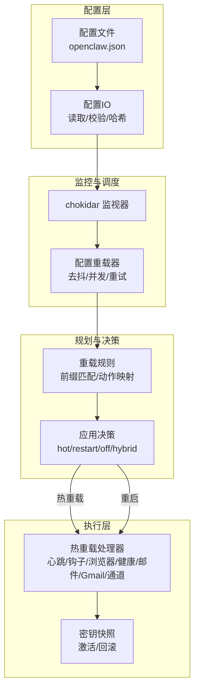
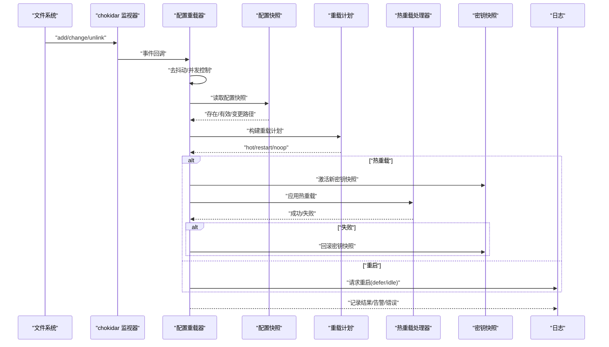
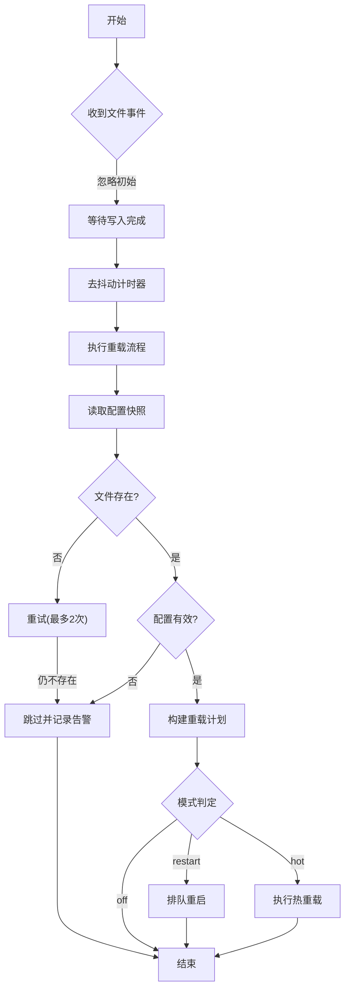
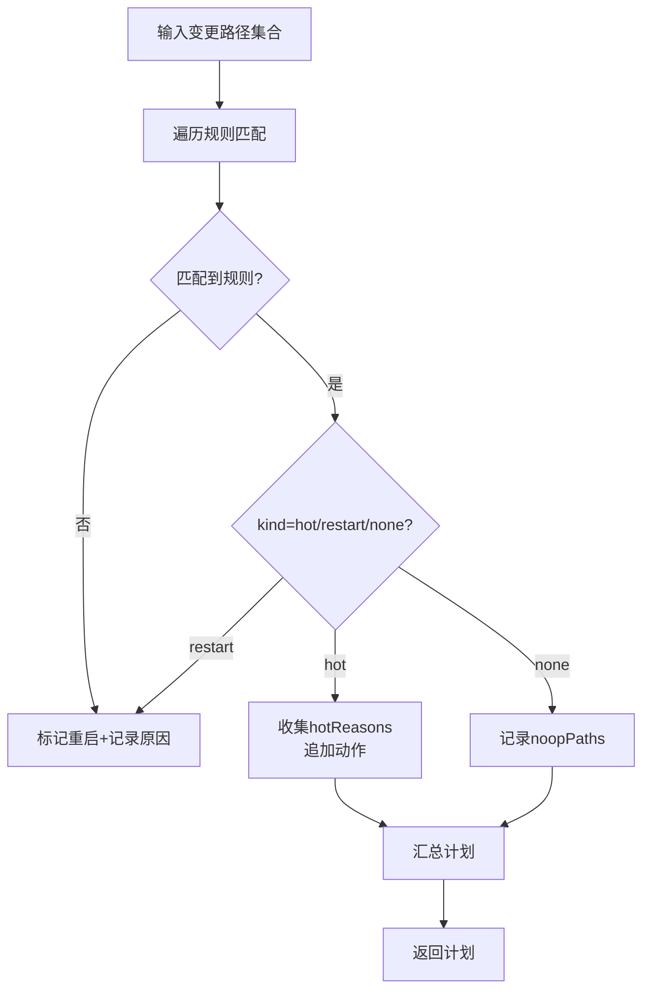
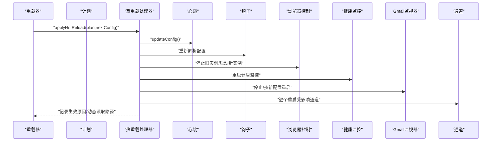
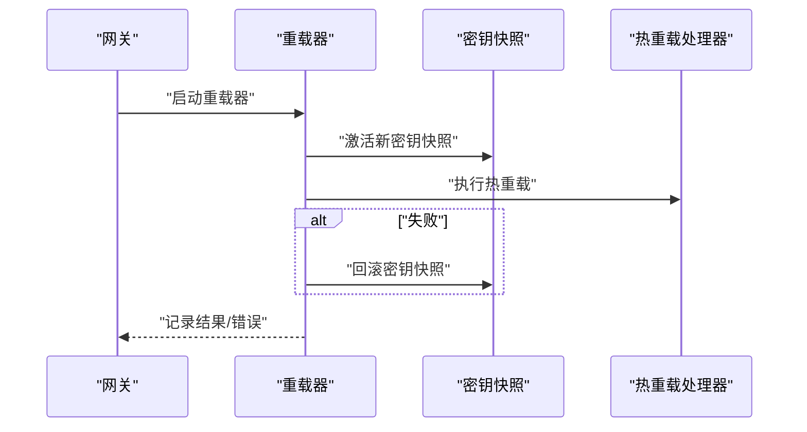
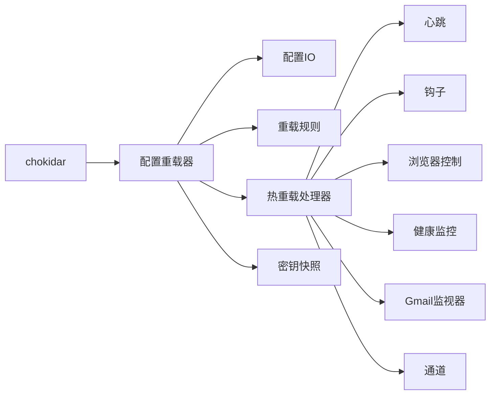

# 配置热重载

<cite>
**本文档引用的文件**
- [src/gateway/config-reload.ts](file://src/gateway/config-reload.ts)
- [src/gateway/server-reload-handlers.ts](file://src/gateway/server-reload-handlers.ts)
- [src/gateway/config-reload-plan.ts](file://src/gateway/config-reload-plan.ts)
- [src/gateway/server.impl.ts](file://src/gateway/server.impl.ts)
- [src/config/schema.help.ts](file://src/config/schema.help.ts)
- [src/gateway/config-reload.test.ts](file://src/gateway/config-reload.test.ts)
- [src/config/io.ts](file://src/config/io.ts)
- [src/cli/config-cli.ts](file://src/cli/config-cli.ts)
</cite>

## 目录
1. [简介](#简介)
2. [项目结构](#项目结构)
3. [核心组件](#核心组件)
4. [架构总览](#架构总览)
5. [详细组件分析](#详细组件分析)
6. [依赖关系分析](#依赖关系分析)
7. [性能考量](#性能考量)
8. [故障排除指南](#故障排除指南)
9. [结论](#结论)
10. [附录](#附录)

## 简介
本文件系统性阐述 OpenClaw 的配置热重载（Live Config Reload）机制，覆盖文件监控、增量变更检测、应用决策与执行、安全与回滚保障、以及在开发与生产环境中的使用建议与故障排除。热重载通过文件系统事件驱动，结合“热重载/重启/禁用”三种模式，确保在不中断服务的前提下尽可能地动态更新运行时行为。

## 项目结构
热重载能力由以下模块协同实现：
- 文件监控与调度：基于 chokidar 监听配置文件变化，进行去抖动与并发控制
- 变更检测与规划：计算变更路径集合，生成“热重载/重启/无操作”的重载计划
- 应用执行：按计划对心跳、钩子、浏览器控制、健康检查、Gmail 监视器、通道等进行增量更新或重启
- 安全与回滚：在热重载失败时回滚密钥快照，避免半应用状态
- 集成入口：网关启动时初始化重载器，并将日志与错误收敛到统一通道

**图表来源**
- [src/gateway/config-reload.ts:217-247](file://src/gateway/config-reload.ts#L217-L247)
- [src/gateway/config-reload-plan.ts:142-215](file://src/gateway/config-reload-plan.ts#L142-L215)
- [src/gateway/server-reload-handlers.ts:52-145](file://src/gateway/server-reload-handlers.ts#L52-L145)
- [src/gateway/server.impl.ts:982-1012](file://src/gateway/server.impl.ts#L982-L1012)

**章节来源**
- [src/gateway/config-reload.ts:1-248](file://src/gateway/config-reload.ts#L1-L248)
- [src/gateway/config-reload-plan.ts:1-216](file://src/gateway/config-reload-plan.ts#L1-L216)
- [src/gateway/server-reload-handlers.ts:1-237](file://src/gateway/server-reload-handlers.ts#L1-L237)
- [src/gateway/server.impl.ts:980-1066](file://src/gateway/server.impl.ts#L980-L1066)

## 核心组件
- 配置重载器（startGatewayConfigReloader）
  - 基于 chokidar 监听配置文件增删改事件
  - 使用 awaitWriteFinish 与去抖动窗口合并频繁写入
  - 并发保护：running/pending 防止重入；stopped 控制生命周期
  - 缺失文件重试：最多两次，间隔固定毫秒数
  - 无效配置跳过：格式化问题列表并记录告警
  - 模式解析：从配置读取 reload.mode 与 debounceMs
- 重载计划构建（buildGatewayReloadPlan）
  - 规则引擎：基于配置路径前缀匹配，决定 restart/hot/none
  - 动作映射：将路径前缀映射到具体组件重启/热更新动作
  - 插件扩展：通道插件可声明 configPrefixes/noopPrefixes
- 热重载处理器（applyHotReload）
  - 更新心跳、钩子、浏览器控制、健康监控、Gmail 监视器
  - 重启指定通道（受环境变量与策略约束）
  - 更新命令队列并发限制
  - 记录热重载生效原因与动态读取路径
- 集成入口（server.impl）
  - 启动重载器，注入 onHotReload/onRestart 日志与回调
  - 在热重载前后激活/回滚密钥快照，确保一致性

**章节来源**
- [src/gateway/config-reload.ts:72-247](file://src/gateway/config-reload.ts#L72-L247)
- [src/gateway/config-reload-plan.ts:142-215](file://src/gateway/config-reload-plan.ts#L142-L215)
- [src/gateway/server-reload-handlers.ts:52-145](file://src/gateway/server-reload-handlers.ts#L52-L145)
- [src/gateway/server.impl.ts:982-1012](file://src/gateway/server.impl.ts#L982-L1012)

## 架构总览
下图展示从配置文件变更到运行时组件更新的端到端流程，包括错误处理与回滚路径。

**图表来源**
- [src/gateway/config-reload.ts:184-215](file://src/gateway/config-reload.ts#L184-L215)
- [src/gateway/server.impl.ts:985-1001](file://src/gateway/server.impl.ts#L985-L1001)
- [src/gateway/server-reload-handlers.ts:149-233](file://src/gateway/server-reload-handlers.ts#L149-L233)

## 详细组件分析

### 组件A：配置重载器（文件监控与调度）
- 关键职责
  - 监听配置文件事件并调度重载
  - 合并频繁写入：awaitWriteFinish + debounceMs
  - 并发与停止控制：running/pending/stopped
  - 缺失文件重试：最多两次，避免瞬时删除导致误判
  - 无效配置跳过：记录问题列表，避免污染运行时
- 错误恢复
  - 监视器错误：记录告警并关闭监视器，防止资源泄漏
  - 重启回调失败：捕获异常并允许后续变更重试
- 性能特征
  - 去抖动窗口可由配置覆盖，默认约 300ms
  - awaitWriteFinish 稳定阈值与轮询间隔降低磁盘抖动

**图表来源**
- [src/gateway/config-reload.ts:184-247](file://src/gateway/config-reload.ts#L184-L247)

**章节来源**
- [src/gateway/config-reload.ts:217-247](file://src/gateway/config-reload.ts#L217-L247)
- [src/gateway/config-reload.test.ts:324-367](file://src/gateway/config-reload.test.ts#L324-L367)

### 组件B：重载计划构建（规则与动作映射）
- 规则体系
  - 基础规则：如 hooks.gmail、gateway.channelHealthCheckMinutes、models/agents.defaults 心跳相关等走热重载
  - 重启规则：如 gateway、discovery、canvasHost 等根级配置强制重启
  - 无操作规则：如 meta/identity/wizard/logging 等元数据字段
  - 插件扩展：通道插件可声明 configPrefixes（热重载）与 noopPrefixes（无操作）
- 决策逻辑
  - 未知路径默认重启
  - 若计划要求重启且当前模式为 hot，则忽略该变更
  - 若计划要求重启且模式为 hybrid/restart，则排队重启

**图表来源**
- [src/gateway/config-reload-plan.ts:142-215](file://src/gateway/config-reload-plan.ts#L142-L215)

**章节来源**
- [src/gateway/config-reload-plan.ts:36-131](file://src/gateway/config-reload-plan.ts#L36-L131)
- [src/gateway/config-reload.test.ts:120-246](file://src/gateway/config-reload.test.ts#L120-L246)

### 组件C：热重载处理器（增量更新与重启请求）
- 热重载动作
  - 心跳：更新心跳运行器配置
  - 钩子：重新解析钩子配置
  - 浏览器控制：停止旧实例并启动新实例
  - 健康监控：根据分钟数重启健康检查
  - Gmail 监视器：停止并按新配置重启
  - 通道：按需逐个重启受影响通道（受环境变量与策略约束）
  - 并发：更新命令队列并发限制
- 重启请求
  - 若无 SIGUSR1 监听器则跳过
  - 若有活动任务则延迟重启直至空闲或超时
  - 已安排重启则去重

**图表来源**
- [src/gateway/server-reload-handlers.ts:52-145](file://src/gateway/server-reload-handlers.ts#L52-L145)

**章节来源**
- [src/gateway/server-reload-handlers.ts:149-233](file://src/gateway/server-reload-handlers.ts#L149-L233)

### 组件D：集成入口与安全回滚
- 入口集成
  - 网关启动时创建重载器，注入日志与回调
  - 热重载前激活新密钥快照，失败后回滚至先前快照
  - 重启前进行“重启检查”，失败可重试
- 安全机制
  - 密钥快照激活/回滚：避免密钥变更导致的半应用状态
  - 无效配置跳过：避免将错误配置带入运行时
  - 监视器错误关闭：防止资源泄漏与持续告警

**图表来源**
- [src/gateway/server.impl.ts:985-1001](file://src/gateway/server.impl.ts#L985-L1001)

**章节来源**
- [src/gateway/server.impl.ts:982-1012](file://src/gateway/server.impl.ts#L982-L1012)

## 依赖关系分析
- 外部依赖
  - chokidar：文件系统事件监听与 awaitWriteFinish
- 内部依赖
  - 配置IO：读取配置快照、校验、哈希
  - 配置规则：重载规则与动作映射
  - 运行时组件：心跳、钩子、浏览器控制、健康监控、Gmail 监视器、通道
  - 密钥管理：激活/回滚运行时密钥快照

**图表来源**
- [src/gateway/config-reload.ts:217-247](file://src/gateway/config-reload.ts#L217-L247)
- [src/gateway/config-reload-plan.ts:103-131](file://src/gateway/config-reload-plan.ts#L103-L131)
- [src/gateway/server-reload-handlers.ts:26-32](file://src/gateway/server-reload-handlers.ts#L26-L32)

**章节来源**
- [src/gateway/config-reload.ts:1-248](file://src/gateway/config-reload.ts#L1-L248)
- [src/gateway/config-reload-plan.ts:1-216](file://src/gateway/config-reload-plan.ts#L1-L216)
- [src/gateway/server-reload-handlers.ts:1-237](file://src/gateway/server-reload-handlers.ts#L1-L237)

## 性能考量
- 去抖动与写入稳定
  - awaitWriteFinish 的稳定性阈值与轮询间隔减少频繁触发
  - debounceMs 可调，默认约 300ms，避免抖动风暴
- 并发与重入防护
  - running/pending/stopped 状态机避免重复执行
- 资源释放
  - 监视器错误时主动关闭，防止句柄泄漏
- I/O 与校验
  - 配置读取与校验在热重载前完成，避免运行时异常

[本节为通用指导，无需特定文件来源]

## 故障排除指南
- 配置无效
  - 现象：热重载被跳过并记录告警
  - 排查：查看格式化的问题列表，使用 doctor 修复
  - 参考：[src/gateway/config-reload.ts:141-148](file://src/gateway/config-reload.ts#L141-L148)、[src/cli/config-cli.ts:232-244](file://src/cli/config-cli.ts#L232-L244)
- 配置文件缺失
  - 现象：短暂告警并重试，超过最大重试次数后跳过
  - 排查：确认文件存在、权限正确、路径无误
  - 参考：[src/gateway/config-reload.ts:124-139](file://src/gateway/config-reload.ts#L124-L139)、[src/config/io.ts:1037-1068](file://src/config/io.ts#L1037-L1068)
- 重启检查失败
  - 现象：重启回调抛出异常，保留重载器运行并等待后续变更重试
  - 排查：检查 SecretRef 解析、网络连通性、外部监听器状态
  - 参考：[src/gateway/config-reload.ts:112-122](file://src/gateway/config-reload.ts#L112-L122)
- 监视器错误
  - 现象：记录告警并关闭监视器
  - 排查：检查文件系统权限、inode 数量、进程资源限制
  - 参考：[src/gateway/config-reload.ts:227-234](file://src/gateway/config-reload.ts#L227-L234)
- 热重载失败回滚
  - 现象：热重载执行失败后回滚密钥快照
  - 排查：确认密钥来源可用、网络代理可达
  - 参考：[src/gateway/server.impl.ts:994-999](file://src/gateway/server.impl.ts#L994-L999)

**章节来源**
- [src/gateway/config-reload.ts:124-148](file://src/gateway/config-reload.ts#L124-L148)
- [src/gateway/server.impl.ts:994-1001](file://src/gateway/server.impl.ts#L994-L1001)
- [src/config/io.ts:1037-1068](file://src/config/io.ts#L1037-L1068)
- [src/cli/config-cli.ts:232-244](file://src/cli/config-cli.ts#L232-L244)

## 结论
OpenClaw 的配置热重载通过“文件监控 + 增量变更检测 + 规则驱动的重载计划 + 安全回滚”的组合，在保证运行时一致性的前提下，最大化地减少停机时间。推荐在生产中采用 hybrid 模式，配合合理的 debounceMs 与严格的配置校验，确保变更既及时又安全。

[本节为总结，无需特定文件来源]

## 附录

### 使用指南与最佳实践
- 模式选择
  - hybrid：最安全的日常更新模式，优先尝试热重载，必要时重启
  - hot：仅用于已知可热重载的路径，避免误触重启
  - restart：强制重启，适合大规模或未知变更
  - off：禁用热重载，仅通过重启生效
- debounceMs 设置
  - 开发环境可适当降低以获得更快反馈
  - 生产环境建议保持默认或适度增加，避免抖动
- 变更范围控制
  - 优先修改心跳、钩子、浏览器、健康监控、Gmail 监视器、通道等支持热重载的路径
  - 避免直接修改 gateway/discovery/canvasHost 等根级配置，除非明确需要重启
- 安全与合规
  - 严格校验配置有效性，避免将错误配置带入运行时
  - 在热重载前后确保密钥快照一致，失败即回滚
  - 对通道重启添加环境变量与策略约束，避免在高负载时段触发

**章节来源**
- [src/config/schema.help.ts:411-413](file://src/config/schema.help.ts#L411-L413)
- [src/gateway/config-reload-plan.ts:36-98](file://src/gateway/config-reload-plan.ts#L36-L98)

### 不同场景的应用示例
- 开发调试
  - 使用 hybrid 模式，设置较低 debounceMs，快速验证配置变更
  - 修改 hooks.gmail 或 gateway.channelHealthCheckMinutes 等热重载路径
- 生产更新
  - 默认 hybrid，对大范围变更先在预生产验证
  - 对涉及密钥或远程连接的变更，优先采用 restart 模式
- 动态调整
  - 调整 agents.defaults.heartbeat、models/providers 等不影响进程重启的路径
  - 通过频道插件的 configPrefixes/noopPrefixes 扩展热重载范围

**章节来源**
- [src/gateway/config-reload-plan.ts:112-127](file://src/gateway/config-reload-plan.ts#L112-L127)
- [src/gateway/config-reload.test.ts:133-148](file://src/gateway/config-reload.test.ts#L133-L148)