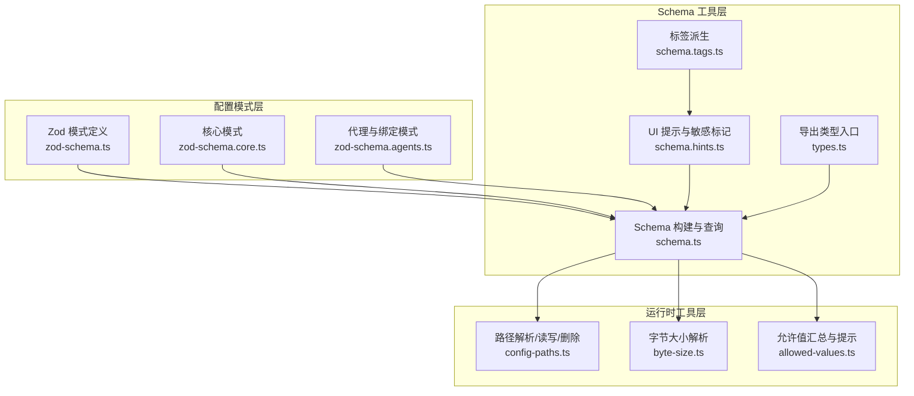
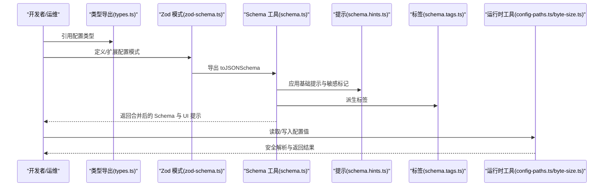
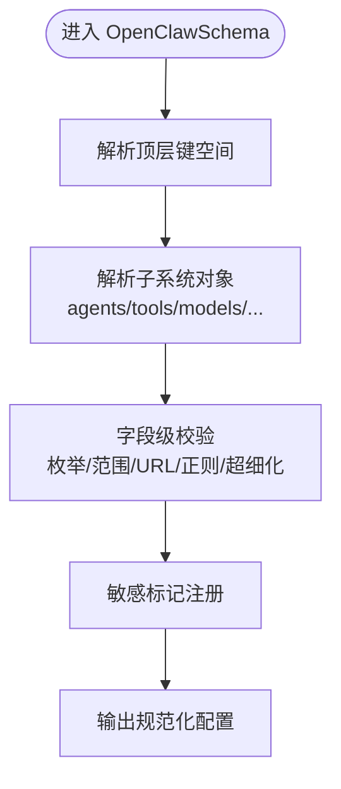
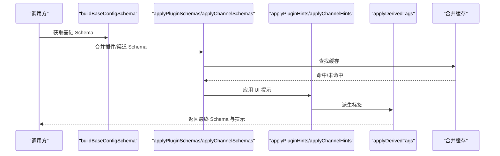
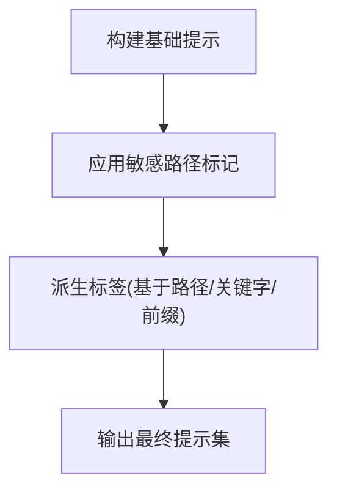
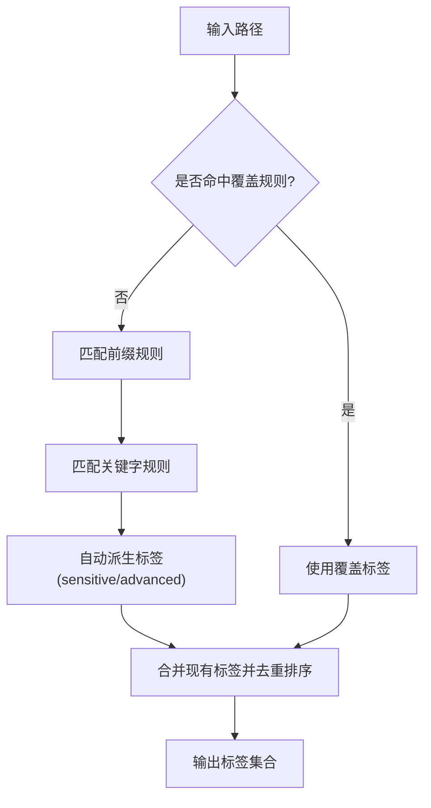
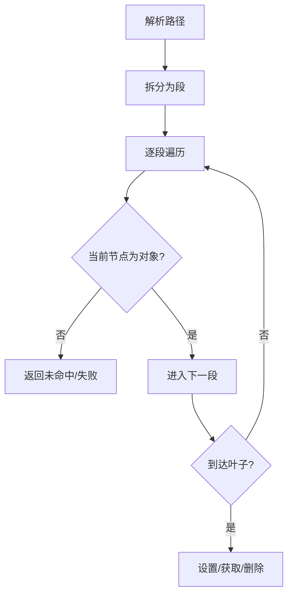
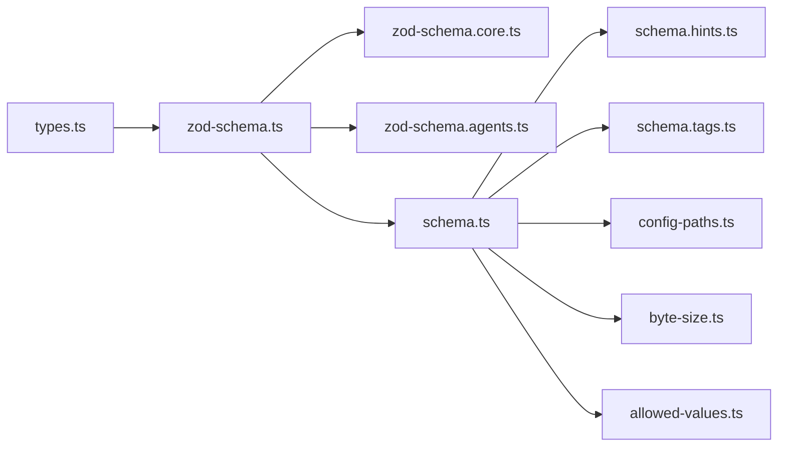

# 配置管理

<cite>
**本文引用的文件**
- [src/config/types.ts](file://src/config/types.ts)
- [src/config/schema.ts](file://src/config/schema.ts)
- [src/config/zod-schema.ts](file://src/config/zod-schema.ts)
- [src/config/schema.hints.ts](file://src/config/schema.hints.ts)
- [src/config/schema.tags.ts](file://src/config/schema.tags.ts)
- [src/config/config-paths.ts](file://src/config/config-paths.ts)
- [src/config/byte-size.ts](file://src/config/byte-size.ts)
- [src/config/allowed-values.ts](file://src/config/allowed-values.ts)
- [src/config/zod-schema.core.ts](file://src/config/zod-schema.core.ts)
- [src/config/zod-schema.agents.ts](file://src/config/zod-schema.agents.ts)
</cite>

## 目录
1. [简介](#简介)
2. [项目结构](#项目结构)
3. [核心组件](#核心组件)
4. [架构总览](#架构总览)
5. [详细组件分析](#详细组件分析)
6. [依赖关系分析](#依赖关系分析)
7. [性能考量](#性能考量)
8. [故障排查指南](#故障排查指南)
9. [结论](#结论)
10. [附录](#附录)

## 简介
本文件系统化阐述 OpenClaw 的配置管理系统，覆盖配置文件的结构与层次（全局配置、代理配置、渠道配置）、配置项语义与作用、环境变量与命令行参数的优先级规则、配置验证与错误处理机制、配置模板与示例、热重载与动态更新、以及配置迁移与版本兼容策略。目标是帮助开发者与运维人员在不同场景下正确、安全地使用与扩展配置体系。

## 项目结构
OpenClaw 的配置管理由“模式定义 + UI 提示 + 标签派生 + 路径工具 + 解析与校验”五部分组成：
- 模式定义：基于 Zod 的强类型模式，覆盖全局、代理、渠道等子系统。
- UI 提示：为控制界面生成字段标签、帮助文本、占位符、敏感标记与分组顺序。
- 标签派生：根据路径与关键字自动标注配置项的分类标签（如安全、网络、自动化）。
- 路径工具：对配置路径进行解析、读取、写入与删除，保证安全性与健壮性。
- 解析与校验：对字节大小、允许值集合、时间/大小字符串等进行统一解析与提示增强。

**图表来源**
- [src/config/zod-schema.ts:206-911](file://src/config/zod-schema.ts#L206-L911)
- [src/config/zod-schema.core.ts:1-732](file://src/config/zod-schema.core.ts#L1-L732)
- [src/config/zod-schema.agents.ts:1-109](file://src/config/zod-schema.agents.ts#L1-L109)
- [src/config/schema.ts:449-484](file://src/config/schema.ts#L449-L484)
- [src/config/schema.hints.ts:124-146](file://src/config/schema.hints.ts#L124-L146)
- [src/config/schema.tags.ts:130-175](file://src/config/schema.tags.ts#L130-L175)
- [src/config/types.ts:1-36](file://src/config/types.ts#L1-L36)
- [src/config/config-paths.ts:6-83](file://src/config/config-paths.ts#L6-L83)
- [src/config/byte-size.ts:7-25](file://src/config/byte-size.ts#L7-L25)
- [src/config/allowed-values.ts:54-86](file://src/config/allowed-values.ts#L54-L86)

**章节来源**
- [src/config/types.ts:1-36](file://src/config/types.ts#L1-L36)
- [src/config/schema.ts:449-484](file://src/config/schema.ts#L449-L484)
- [src/config/zod-schema.ts:206-911](file://src/config/zod-schema.ts#L206-L911)
- [src/config/zod-schema.core.ts:1-732](file://src/config/zod-schema.core.ts#L1-L732)
- [src/config/zod-schema.agents.ts:1-109](file://src/config/zod-schema.agents.ts#L1-L109)
- [src/config/schema.hints.ts:124-146](file://src/config/schema.hints.ts#L124-L146)
- [src/config/schema.tags.ts:130-175](file://src/config/schema.tags.ts#L130-L175)
- [src/config/config-paths.ts:6-83](file://src/config/config-paths.ts#L6-L83)
- [src/config/byte-size.ts:7-25](file://src/config/byte-size.ts#L7-L25)
- [src/config/allowed-values.ts:54-86](file://src/config/allowed-values.ts#L54-L86)

## 核心组件
- 全局配置模式（OpenClawSchema）
  - 定义顶层键空间：元数据、环境变量、向导、诊断、日志、CLI、更新、浏览器、UI、密钥、认证、ACP、模型、节点主机、代理、工具、绑定、广播、音频、媒体、消息、命令、审批、会话、定时任务、钩子、Web、渠道、发现、画布主机、语音合成、网关等。
  - 使用 Zod 的严格对象、枚举、联合、超细化（superRefine）与自定义解析器（如时间/大小字符串），确保输入合法性与一致性。
- Schema 构建与查询
  - 构建基础 Schema 并支持按插件与渠道扩展合并，生成带 UI 提示与敏感标记的最终 Schema。
  - 支持路径查询、子节点枚举、UI 提示匹配与安全裁剪（隐藏 $schema 等内部键）。
- UI 提示与标签
  - 基础提示（标签、帮助、占位符、分组顺序）与敏感路径识别；自动派生标签（安全、网络、自动化、存储等）。
- 路径工具
  - 安全解析点路径、按路径设置/获取/删除配置值，避免原型链注入与非法键名。
- 解析与校验辅助
  - 字节大小解析（支持字符串与数字）、允许值去重与格式化提示、错误信息增强（避免重复提示已知允许值）。

**章节来源**
- [src/config/zod-schema.ts:206-911](file://src/config/zod-schema.ts#L206-L911)
- [src/config/schema.ts:449-484](file://src/config/schema.ts#L449-L484)
- [src/config/schema.hints.ts:124-146](file://src/config/schema.hints.ts#L124-L146)
- [src/config/schema.tags.ts:130-175](file://src/config/schema.tags.ts#L130-L175)
- [src/config/config-paths.ts:6-83](file://src/config/config-paths.ts#L6-L83)
- [src/config/byte-size.ts:7-25](file://src/config/byte-size.ts#L7-L25)
- [src/config/allowed-values.ts:54-86](file://src/config/allowed-values.ts#L54-L86)

## 架构总览
配置系统以“模式定义”为核心，通过“Schema 工具层”生成可被 UI 与运行时使用的结构化 Schema，并结合“运行时工具层”的路径与解析能力，形成从“定义—提示—查询—执行”的闭环。

**图表来源**
- [src/config/types.ts:1-36](file://src/config/types.ts#L1-L36)
- [src/config/zod-schema.ts:206-911](file://src/config/zod-schema.ts#L206-L911)
- [src/config/schema.ts:449-484](file://src/config/schema.ts#L449-L484)
- [src/config/schema.hints.ts:124-146](file://src/config/schema.hints.ts#L124-L146)
- [src/config/schema.tags.ts:130-175](file://src/config/schema.tags.ts#L130-L175)
- [src/config/config-paths.ts:6-83](file://src/config/config-paths.ts#L6-L83)
- [src/config/byte-size.ts:7-25](file://src/config/byte-size.ts#L7-L25)

## 详细组件分析

### 组件一：全局配置模式（OpenClawSchema）
- 职责
  - 定义顶层配置结构与各子系统的模式边界，确保输入合法、默认值合理、跨子系统约束一致。
- 关键特性
  - 严格对象与 catchall：允许扩展但受控。
  - 超细化校验：如定时任务的持续时间与大小字符串解析、网关鉴权模式与必填字段校验。
  - 敏感标记注册：通过 SecretInputSchema 与 register(sensitive) 标注敏感字段。
- 数据流
  - 顶层对象键 → 子系统对象键 → 字段级校验 → 结果输出。

**图表来源**
- [src/config/zod-schema.ts:206-911](file://src/config/zod-schema.ts#L206-L911)
- [src/config/zod-schema.core.ts:148-179](file://src/config/zod-schema.core.ts#L148-L179)

**章节来源**
- [src/config/zod-schema.ts:206-911](file://src/config/zod-schema.ts#L206-L911)
- [src/config/zod-schema.core.ts:148-179](file://src/config/zod-schema.core.ts#L148-L179)

### 组件二：Schema 构建与查询（schema.ts）
- 职责
  - 构建基础 Schema，按插件与渠道扩展合并，生成 UI 提示与敏感标记，支持路径查询与子节点枚举。
- 关键流程
  - 基础 Schema 缓存与合并缓存（基于插件/渠道元数据哈希）。
  - 插件 Schema 合并：将插件定义的 config 模式与基础条目合并。
  - 渠道 Schema 合并：将渠道定义的 config 模式与 channels 对象合并。
  - UI 提示应用：基础提示 + 插件/渠道提示 + 敏感标记 + 衍生标签。
  - 路径查询：安全解析路径、定位子模式、裁剪仅保留必要字段、枚举子节点。
- 性能优化
  - 合并缓存上限与 LRU 替换，避免重复构建。
  - 仅裁剪必要 JSON Schema 字段用于 UI 查询，降低传输与渲染开销。

**图表来源**
- [src/config/schema.ts:449-484](file://src/config/schema.ts#L449-L484)
- [src/config/schema.ts:285-350](file://src/config/schema.ts#L285-L350)
- [src/config/schema.ts:167-241](file://src/config/schema.ts#L167-L241)
- [src/config/schema.ts:464-483](file://src/config/schema.ts#L464-L483)

**章节来源**
- [src/config/schema.ts:449-484](file://src/config/schema.ts#L449-L484)
- [src/config/schema.ts:285-350](file://src/config/schema.ts#L285-L350)
- [src/config/schema.ts:167-241](file://src/config/schema.ts#L167-L241)
- [src/config/schema.ts:464-483](file://src/config/schema.ts#L464-L483)

### 组件三：UI 提示与敏感标记（schema.hints.ts）
- 职责
  - 提供基础分组标签、字段标签、帮助文本、占位符与排序；识别敏感路径并标记。
- 关键机制
  - 基础提示构建：遍历分组映射与字段映射生成初始提示集。
  - 敏感路径识别：白名单排除、后缀匹配与正则匹配组合。
  - 递归映射敏感路径：遍历 Zod 模式树，将敏感标记传播到对应路径。

**图表来源**
- [src/config/schema.hints.ts:124-146](file://src/config/schema.hints.ts#L124-L146)
- [src/config/schema.hints.ts:148-165](file://src/config/schema.hints.ts#L148-L165)
- [src/config/schema.hints.ts:183-233](file://src/config/schema.hints.ts#L183-L233)

**章节来源**
- [src/config/schema.hints.ts:124-146](file://src/config/schema.hints.ts#L124-L146)
- [src/config/schema.hints.ts:148-165](file://src/config/schema.hints.ts#L148-L165)
- [src/config/schema.hints.ts:183-233](file://src/config/schema.hints.ts#L183-L233)

### 组件四：标签派生（schema.tags.ts）
- 职责
  - 将路径与关键字映射为一组标签，用于 UI 过滤与排序。
- 关键规则
  - 前缀规则：如 channels. → channels/tags；gateway. → network 等。
  - 关键字规则：如 token/password/secret 等 → security/auth。
  - 覆盖规则：针对特定路径的显式标签集合。
  - 自动派生：当 hint.sensitive 或 advanced 为真时追加相应标签。

**图表来源**
- [src/config/schema.tags.ts:108-122](file://src/config/schema.tags.ts#L108-L122)
- [src/config/schema.tags.ts:130-175](file://src/config/schema.tags.ts#L130-L175)

**章节来源**
- [src/config/schema.tags.ts:108-122](file://src/config/schema.tags.ts#L108-L122)
- [src/config/schema.tags.ts:130-175](file://src/config/schema.tags.ts#L130-L175)

### 组件五：路径工具（config-paths.ts）
- 职责
  - 安全解析配置路径、按路径设置/获取/删除配置值，防止原型链注入与非法键名。
- 关键点
  - 路径解析：支持数组索引与通配符（如 *），标准化为点号分隔。
  - 设置/获取/删除：逐层推进，遇非对象则创建空对象或返回未命中。
  - 去除空节点：删除后回溯清理空对象，保持配置树整洁。

**图表来源**
- [src/config/config-paths.ts:6-29](file://src/config/config-paths.ts#L6-L29)
- [src/config/config-paths.ts:31-42](file://src/config/config-paths.ts#L31-L42)
- [src/config/config-paths.ts:44-71](file://src/config/config-paths.ts#L44-L71)

**章节来源**
- [src/config/config-paths.ts:6-29](file://src/config/config-paths.ts#L6-L29)
- [src/config/config-paths.ts:31-42](file://src/config/config-paths.ts#L31-L42)
- [src/config/config-paths.ts:44-71](file://src/config/config-paths.ts#L44-L71)

### 组件六：解析与校验辅助（byte-size.ts、allowed-values.ts）
- 字节大小解析
  - 接受数字或字符串（如 "2mb"），返回非负整数值；支持默认单位与异常处理。
- 允许值汇总与提示
  - 对枚举/允许值集合进行去重、截断与格式化，避免 UI 展示过长；自动追加“允许值”提示，避免重复提示。

**章节来源**
- [src/config/byte-size.ts:7-25](file://src/config/byte-size.ts#L7-L25)
- [src/config/allowed-values.ts:54-86](file://src/config/allowed-values.ts#L54-L86)

## 依赖关系分析
- 类型导出入口
  - types.ts 将各子模块类型集中导出，便于上层引用与 IDE 提示。
- 模式依赖
  - zod-schema.ts 依赖 zod-schema.core.ts 与 zod-schema.agents.ts 等子模块，形成“核心 + 子系统”的分层模式。
- Schema 工具依赖
  - schema.ts 依赖 schema.hints.ts 与 schema.tags.ts，完成提示与标签的最终组装。
- 运行时工具依赖
  - config-paths.ts 依赖通用工具（如对象判断）与安全键检测；byte-size.ts 依赖 CLI 解析器；allowed-values.ts 为错误提示增强提供支持。

**图表来源**
- [src/config/types.ts:1-36](file://src/config/types.ts#L1-L36)
- [src/config/zod-schema.ts:1-23](file://src/config/zod-schema.ts#L1-L23)
- [src/config/schema.ts:1-11](file://src/config/schema.ts#L1-L11)
- [src/config/schema.hints.ts:1-11](file://src/config/schema.hints.ts#L1-L11)
- [src/config/schema.tags.ts:1-2](file://src/config/schema.tags.ts#L1-L2)
- [src/config/config-paths.ts:1-2](file://src/config/config-paths.ts#L1-L2)
- [src/config/byte-size.ts:1-2](file://src/config/byte-size.ts#L1-L2)
- [src/config/allowed-values.ts:1-2](file://src/config/allowed-values.ts#L1-L2)

**章节来源**
- [src/config/types.ts:1-36](file://src/config/types.ts#L1-L36)
- [src/config/zod-schema.ts:1-23](file://src/config/zod-schema.ts#L1-L23)
- [src/config/schema.ts:1-11](file://src/config/schema.ts#L1-L11)
- [src/config/schema.hints.ts:1-11](file://src/config/schema.hints.ts#L1-L11)
- [src/config/schema.tags.ts:1-2](file://src/config/schema.tags.ts#L1-L2)
- [src/config/config-paths.ts:1-2](file://src/config/config-paths.ts#L1-L2)
- [src/config/byte-size.ts:1-2](file://src/config/byte-size.ts#L1-L2)
- [src/config/allowed-values.ts:1-2](file://src/config/allowed-values.ts#L1-L2)

## 性能考量
- Schema 合并缓存
  - 通过哈希键缓存合并结果，限制最大缓存数量，避免重复构建带来的 CPU 与内存开销。
- 路径查询裁剪
  - 仅返回必要的 JSON Schema 字段，减少 UI 渲染与网络传输负担。
- 解析与提示
  - 字节大小解析与允许值汇总采用轻量算法，避免在高频路径上引入额外开销。

[本节为通用指导，无需具体文件分析]

## 故障排查指南
- 路径解析失败
  - 症状：设置/删除配置值返回失败。
  - 排查：确认路径是否为空、是否包含空段、是否包含被阻止的对象键。
  - 参考
    - [src/config/config-paths.ts:6-29](file://src/config/config-paths.ts#L6-L29)
- 字节大小/时间字符串解析失败
  - 症状：配置项报错“无效大小/时间”。
  - 排查：检查字符串格式（如 "2mb"/"1h"），确保单位与默认单位一致。
  - 参考
    - [src/config/byte-size.ts:7-25](file://src/config/byte-size.ts#L7-L25)
- 敏感字段未被正确标记
  - 症状：敏感字段未被 UI 标记为敏感。
  - 排查：确认字段路径是否匹配敏感模式；检查是否在白名单中；查看提示与标签派生逻辑。
  - 参考
    - [src/config/schema.hints.ts:120-122](file://src/config/schema.hints.ts#L120-L122)
    - [src/config/schema.tags.ts:130-175](file://src/config/schema.tags.ts#L130-L175)
- 插件/渠道 Schema 合并不生效
  - 症状：UI 中未出现插件/渠道配置项。
  - 排查：确认插件/渠道元数据 id 是否正确；检查合并缓存键与缓存命中情况。
  - 参考
    - [src/config/schema.ts:285-350](file://src/config/schema.ts#L285-L350)
    - [src/config/schema.ts:456-483](file://src/config/schema.ts#L456-L483)

**章节来源**
- [src/config/config-paths.ts:6-29](file://src/config/config-paths.ts#L6-L29)
- [src/config/byte-size.ts:7-25](file://src/config/byte-size.ts#L7-L25)
- [src/config/schema.hints.ts:120-122](file://src/config/schema.hints.ts#L120-L122)
- [src/config/schema.tags.ts:130-175](file://src/config/schema.tags.ts#L130-L175)
- [src/config/schema.ts:285-350](file://src/config/schema.ts#L285-L350)
- [src/config/schema.ts:456-483](file://src/config/schema.ts#L456-L483)

## 结论
OpenClaw 的配置管理系统以 Zod 模式为核心，结合 UI 提示与标签派生，辅以路径工具与解析校验，形成了高可维护、可扩展且安全可控的配置体系。通过缓存与裁剪优化，系统在复杂场景下仍能保持良好性能。建议在扩展新子系统或新增配置项时，遵循现有模式组织方式与校验策略，确保一致性与可维护性。

[本节为总结，无需具体文件分析]

## 附录

### 配置层次与优先级规则
- 层次结构
  - 全局配置：顶层键空间（meta/env/wizard/diagnostics/logging/cli/update/browser/ui/secrets/auth/acp/models/nodeHost/agents/tools/bindings/broadcast/audio/media/messages/commands/approvals/session/cron/hooks/web/channels/discovery/canvasHost/talk/gateway 等）。
  - 代理配置：agents.defaults 与 agents.list.*。
  - 渠道配置：channels.<channelId>。
- 优先级规则（通用实践）
  - 命令行参数 > 环境变量 > 配置文件（按子系统与键路径解析）。
  - 同一层级内，后加载的配置覆盖先前值；数组类配置通常采用“合并/替换”策略（由具体子系统决定）。
  - 敏感字段统一标记并在 UI 中脱敏显示，日志与导出时可选择性红化。

[本节为概念性说明，不直接分析具体文件]

### 配置验证机制与错误处理
- 类型检查
  - 使用 Zod 的严格对象与枚举，确保字段类型与取值范围。
- 约束验证
  - 使用 superRefine 进行跨字段约束（如 talk.provider 必须出现在 providers 中）。
  - 使用 refine 进行自定义校验（如 URL 协议、路径安全、时间/大小字符串解析）。
- 错误处理
  - 在解析失败时返回明确的错误信息；允许值提示自动追加“允许值列表”，避免重复提示。

**章节来源**
- [src/config/zod-schema.ts:185-204](file://src/config/zod-schema.ts#L185-L204)
- [src/config/zod-schema.ts:533-556](file://src/config/zod-schema.ts#L533-L556)
- [src/config/allowed-values.ts:93-98](file://src/config/allowed-values.ts#L93-L98)

### 配置模板与示例
- 基础配置
  - 包含最小可用键：如 logging.level、gateway.port、channels.<id>.* 等。
- 高级配置
  - 包含敏感字段（如鉴权令牌）、网络与安全相关选项（如 TLS、可信代理）、自动化与可观测性（如 cron、hooks、diagnostics）。
- 生产环境配置
  - 强制启用安全与可观测性选项；限制并发与缓存；开启 TLS 与访问控制；配置健康检查与告警。

[本节为概念性说明，不直接分析具体文件]

### 配置热重载与动态更新
- 热重载策略
  - 支持“热”（内存态热替换）与“重启”（进程重启）两种模式，由 gateway.reload.mode 控制。
  - 通过 debounceMs 控制重载触发频率，避免频繁抖动。
- 动态更新范围
  - 非关键路径（如日志级别、UI 偏好）可即时生效。
  - 关键路径（如网关鉴权、TLS、远程连接）需配合重启或服务端支持。

**章节来源**
- [src/config/zod-schema.ts:709-722](file://src/config/zod-schema.ts#L709-L722)

### 配置迁移与版本兼容
- 版本兼容
  - meta.lastTouchedVersion 与 lastTouchedAt 记录配置最后编辑版本与时点，便于迁移脚本识别。
  - 对于时间戳字段，支持字符串与数值的双向转换与校验。
- 迁移策略
  - 新增字段采用默认值；废弃字段保留但标记弃用；跨版本变更通过 schema 超细化与提示引导用户更新。

**章节来源**
- [src/config/zod-schema.ts:209-228](file://src/config/zod-schema.ts#L209-L228)