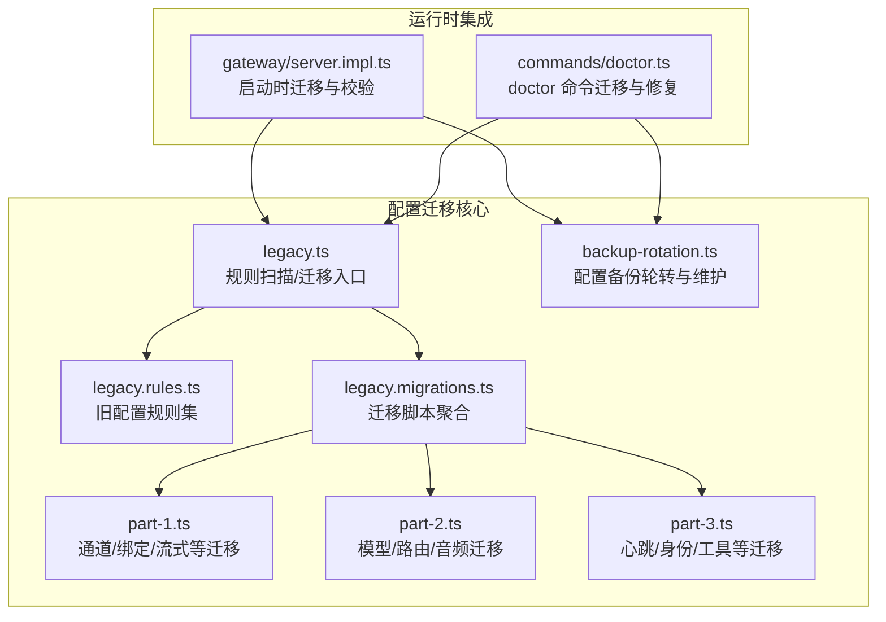
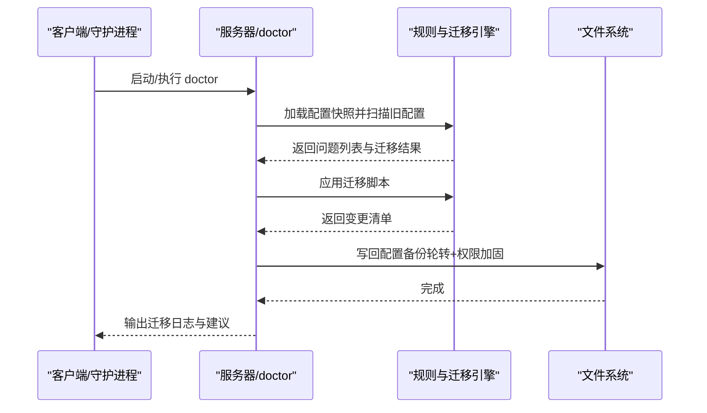
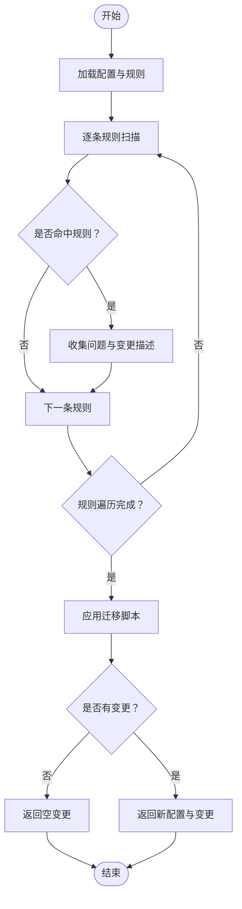
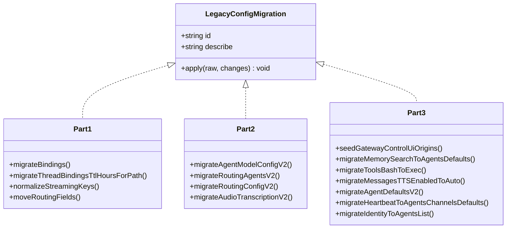
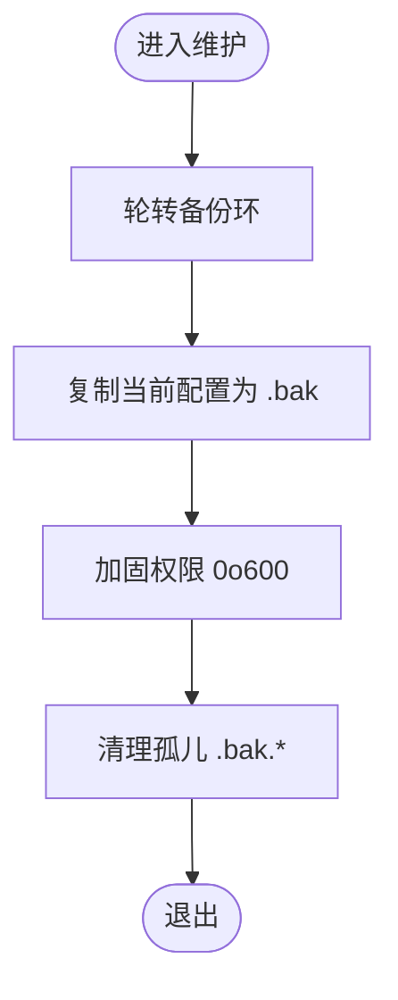
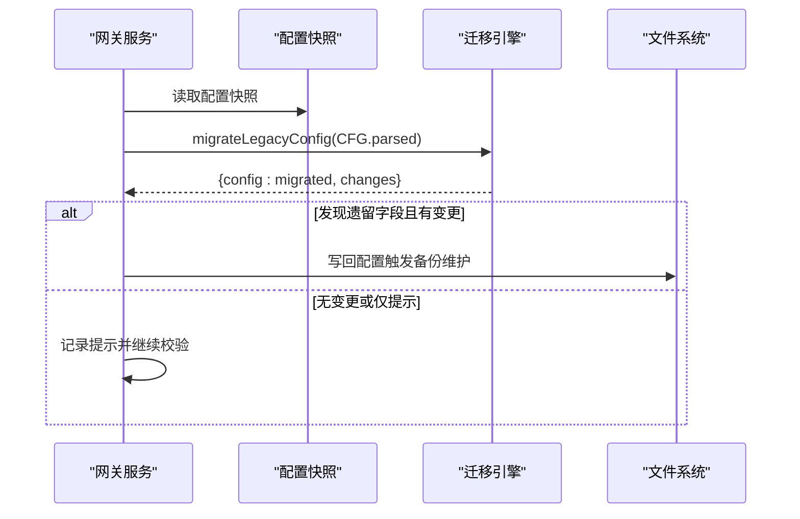
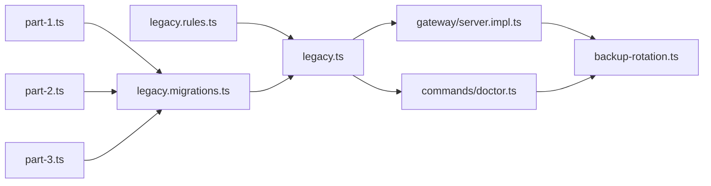

# 配置迁移

<cite>
**本文引用的文件**
- [src/config/legacy.ts](file://src/config/legacy.ts)
- [src/config/legacy.migrations.ts](file://src/config/legacy.migrations.ts)
- [src/config/legacy.migrations.part-1.ts](file://src/config/legacy.migrations.part-1.ts)
- [src/config/legacy.migrations.part-2.ts](file://src/config/legacy.migrations.part-2.ts)
- [src/config/legacy.migrations.part-3.ts](file://src/config/legacy.migrations.part-3.ts)
- [src/config/legacy.rules.ts](file://src/config/legacy.rules.ts)
- [src/config/backup-rotation.ts](file://src/config/backup-rotation.ts)
- [src/commands/doctor.ts](file://src/commands/doctor.ts)
- [src/gateway/server.impl.ts](file://src/gateway/server.impl.ts)
- [src/config/config-misc.test.ts](file://src/config/config-misc.test.ts)
- [src/gateway/server.legacy-migration.test.ts](file://src/gateway/server.legacy-migration.test.ts)
- [src/telegram/bot-handlers.ts](file://src/telegram/bot-handlers.ts)
- [src/slack/monitor/events/channels.ts](file://src/slack/monitor/events/channels.ts)
</cite>

## 目录
1. [简介](#简介)
2. [项目结构](#项目结构)
3. [核心组件](#核心组件)
4. [架构总览](#架构总览)
5. [详细组件分析](#详细组件分析)
6. [依赖关系分析](#依赖关系分析)
7. [性能考量](#性能考量)
8. [故障排查指南](#故障排查指南)
9. [结论](#结论)
10. [附录](#附录)

## 简介
本技术文档面向 OpenClaw 的配置迁移系统，系统性阐述版本检测、迁移脚本与数据转换机制，并给出迁移策略（向后兼容、渐进式迁移、破坏性变更处理）与工具/API 使用建议。文档同时覆盖命令行工具、程序化接口与批量迁移能力，以及最佳实践（备份策略、测试方法、回滚计划），并提供常见迁移场景示例（版本升级、配置重构、插件迁移）。

## 项目结构
OpenClaw 的配置迁移体系由“规则识别 + 迁移脚本 + 备份维护 + 命令行集成”构成，核心位于 src/config 目录，运行时在网关启动与 doctor 命令中被调用。

**图表来源**
- [src/config/legacy.ts:1-59](file://src/config/legacy.ts#L1-L59)
- [src/config/legacy.migrations.ts:1-10](file://src/config/legacy.migrations.ts#L1-L10)
- [src/config/legacy.migrations.part-1.ts:1-616](file://src/config/legacy.migrations.part-1.ts#L1-L616)
- [src/config/legacy.migrations.part-2.ts:1-427](file://src/config/legacy.migrations.part-2.ts#L1-L427)
- [src/config/legacy.migrations.part-3.ts:1-384](file://src/config/legacy.migrations.part-3.ts#L1-L384)
- [src/config/legacy.rules.ts:1-213](file://src/config/legacy.rules.ts#L1-L213)
- [src/config/backup-rotation.ts:1-126](file://src/config/backup-rotation.ts#L1-L126)
- [src/gateway/server.impl.ts:290-293](file://src/gateway/server.impl.ts#L290-L293)
- [src/commands/doctor.ts:103-106](file://src/commands/doctor.ts#L103-L106)

**章节来源**
- [src/config/legacy.ts:1-59](file://src/config/legacy.ts#L1-L59)
- [src/config/legacy.migrations.ts:1-10](file://src/config/legacy.migrations.ts#L1-L10)
- [src/config/backup-rotation.ts:1-126](file://src/config/backup-rotation.ts#L1-L126)
- [src/gateway/server.impl.ts:290-293](file://src/gateway/server.impl.ts#L290-L293)
- [src/commands/doctor.ts:103-106](file://src/commands/doctor.ts#L103-L106)

## 核心组件
- 规则引擎与扫描器：基于规则集识别旧配置路径与字段，生成迁移提示与变更清单。
- 迁移脚本集合：按阶段拆分（part-1/2/3），覆盖通道配置、模型与路由、心跳与工具等主题域。
- 备份维护：提供配置写入前的轮转、权限加固与孤儿备份清理，确保可回滚。
- 命令行集成：在 doctor 命令与网关启动流程中自动执行迁移与验证。

**章节来源**
- [src/config/legacy.ts:16-58](file://src/config/legacy.ts#L16-L58)
- [src/config/legacy.migrations.ts:5-9](file://src/config/legacy.migrations.ts#L5-L9)
- [src/config/backup-rotation.ts:16-125](file://src/config/backup-rotation.ts#L16-L125)

## 架构总览
配置迁移在“加载/启动”阶段自动执行，遵循“扫描规则 → 应用迁移 → 写回配置”的闭环；同时通过备份维护保障回滚能力。

**图表来源**
- [src/gateway/server.impl.ts:290-293](file://src/gateway/server.impl.ts#L290-L293)
- [src/commands/doctor.ts:103-106](file://src/commands/doctor.ts#L103-L106)
- [src/config/legacy.ts:16-58](file://src/config/legacy.ts#L16-L58)
- [src/config/backup-rotation.ts:115-125](file://src/config/backup-rotation.ts#L115-L125)

## 详细组件分析

### 组件一：规则与扫描（findLegacyConfigIssues / applyLegacyMigrations）
- 功能要点
  - 路径遍历与匹配：根据规则定义的路径数组定位旧配置节点。
  - 条件匹配：部分规则支持自定义匹配函数（如字段存在性、值语义判断）。
  - 变更记录：迁移过程累积变更描述，便于输出与审计。
- 数据结构
  - 规则对象包含路径、消息与可选匹配函数。
  - 迁移返回 next（新配置对象）与 changes（变更描述数组）。
- 复杂度
  - 扫描复杂度近似 O(R + N)，R 为规则数，N 为配置树节点数。
  - 迁移复杂度取决于具体脚本数量与层级深度。

**图表来源**
- [src/config/legacy.ts:16-58](file://src/config/legacy.ts#L16-L58)
- [src/config/legacy.rules.ts:49-212](file://src/config/legacy.rules.ts#L49-L212)

**章节来源**
- [src/config/legacy.ts:16-58](file://src/config/legacy.ts#L16-L58)
- [src/config/legacy.rules.ts:1-213](file://src/config/legacy.rules.ts#L1-L213)

### 组件二：迁移脚本聚合与阶段划分
- 聚合方式：通过合并三个迁移脚本文件形成完整迁移序列。
- 阶段划分
  - part-1：通道配置迁移（providers→channels）、绑定字段迁移、流式配置标准化、路由字段迁移等。
  - part-2：模型配置迁移（agent.model/allowedModels 等→agents.defaults.models）、路由配置迁移、音频转录迁移等。
  - part-3：心跳迁移（agents.defaults.heartbeat / channels.defaults.heartbeat）、身份迁移、工具迁移、控制面板允许来源种子等。
- 设计原则
  - 每个迁移脚本聚焦单一领域，避免跨域耦合。
  - 优先保留默认值与已存在的新配置，仅在缺失时填充。

**图表来源**
- [src/config/legacy.migrations.ts:1-10](file://src/config/legacy.migrations.ts#L1-L10)
- [src/config/legacy.migrations.part-1.ts:97-615](file://src/config/legacy.migrations.part-1.ts#L97-L615)
- [src/config/legacy.migrations.part-2.ts:38-426](file://src/config/legacy.migrations.part-2.ts#L38-L426)
- [src/config/legacy.migrations.part-3.ts:99-383](file://src/config/legacy.migrations.part-3.ts#L99-L383)

**章节来源**
- [src/config/legacy.migrations.ts:1-10](file://src/config/legacy.migrations.ts#L1-L10)
- [src/config/legacy.migrations.part-1.ts:1-616](file://src/config/legacy.migrations.part-1.ts#L1-L616)
- [src/config/legacy.migrations.part-2.ts:1-427](file://src/config/legacy.migrations.part-2.ts#L1-L427)
- [src/config/legacy.migrations.part-3.ts:1-384](file://src/config/legacy.migrations.part-3.ts#L1-L384)

### 组件三：备份轮转与维护（maintainConfigBackups）
- 能力
  - 轮转：将现有 .bak 顺次后移，丢弃最高位，将当前备份提升为 .bak.1。
  - 创建：写入新备份 openclaw.json.bak。
  - 权限加固：统一设置为仅属主可读写（0o600）。
  - 清理：删除不在轮转环内的孤儿 .bak.* 文件。
- 流程顺序：轮转 → 创建 .bak → 权限加固 → 清理孤儿文件。

**图表来源**
- [src/config/backup-rotation.ts:16-125](file://src/config/backup-rotation.ts#L16-L125)

**章节来源**
- [src/config/backup-rotation.ts:1-126](file://src/config/backup-rotation.ts#L1-L126)

### 组件四：运行时集成（网关启动与 doctor 命令）
- 网关启动：在服务初始化阶段对配置快照进行迁移与校验，若发现遗留字段但无迁移变更，仍会记录提示以避免静默失败。
- doctor 命令：加载并可能迁移配置，随后根据变更写回配置并触发备份维护，最后输出健康检查与修复建议。

**图表来源**
- [src/gateway/server.impl.ts:290-293](file://src/gateway/server.impl.ts#L290-L293)
- [src/commands/doctor.ts:103-106](file://src/commands/doctor.ts#L103-L106)

**章节来源**
- [src/gateway/server.impl.ts:290-293](file://src/gateway/server.impl.ts#L290-L293)
- [src/commands/doctor.ts:103-106](file://src/commands/doctor.ts#L103-L106)

## 依赖关系分析
- 规则与迁移：legacy.ts 依赖 legacy.rules.ts 与 legacy.migrations.ts；后者进一步拆分为三个迁移脚本文件。
- 运行时：gateway/server.impl.ts 与 commands/doctor.ts 在各自生命周期内调用迁移逻辑。
- 备份：两者均在写回配置前调用备份维护流程。

**图表来源**
- [src/config/legacy.ts:1-3](file://src/config/legacy.ts#L1-L3)
- [src/config/legacy.migrations.ts:1-10](file://src/config/legacy.migrations.ts#L1-L10)
- [src/config/legacy.migrations.part-1.ts:1-10](file://src/config/legacy.migrations.part-1.ts#L1-L10)
- [src/config/legacy.migrations.part-2.ts:1-10](file://src/config/legacy.migrations.part-2.ts#L1-L10)
- [src/config/legacy.migrations.part-3.ts:1-10](file://src/config/legacy.migrations.part-3.ts#L1-L10)
- [src/config/backup-rotation.ts:1-14](file://src/config/backup-rotation.ts#L1-L14)
- [src/gateway/server.impl.ts:290-293](file://src/gateway/server.impl.ts#L290-L293)
- [src/commands/doctor.ts:103-106](file://src/commands/doctor.ts#L103-L106)

**章节来源**
- [src/config/legacy.ts:1-59](file://src/config/legacy.ts#L1-L59)
- [src/config/legacy.migrations.ts:1-10](file://src/config/legacy.migrations.ts#L1-L10)
- [src/config/backup-rotation.ts:1-126](file://src/config/backup-rotation.ts#L1-L126)
- [src/gateway/server.impl.ts:290-293](file://src/gateway/server.impl.ts#L290-L293)
- [src/commands/doctor.ts:103-106](file://src/commands/doctor.ts#L103-L106)

## 性能考量
- 规则扫描与迁移均为线性遍历，整体复杂度与配置规模近似线性；建议在大规模配置时关注 I/O 开销（读写与备份）。
- 备份维护涉及多次文件操作，建议在批量写入场景合并变更后再一次性写回，减少轮转次数。
- 对于频繁启动的服务，可在迁移完成后延迟写回，避免重复 I/O。

## 故障排查指南
- 症状：启动时报“检测到旧配置但未产生自动迁移变更”
  - 排查：确认是否存在仅提示而无实际迁移的规则；检查迁移脚本是否已覆盖该字段。
  - 参考：网关启动日志中的提示信息。
- 症状：迁移后配置无效或行为异常
  - 排查：核对迁移变更清单，确认目标字段是否正确填充；检查备份文件是否可用。
  - 参考：doctor 命令输出与备份文件位置。
- 症状：写回失败或权限异常
  - 排查：确认文件系统权限与平台差异（chmod/readdir 支持情况）；必要时手动加固权限。
- 症状：插件迁移导致通道配置丢失
  - 排查：确认通道配置是否已迁移到 channels.<provider>；检查 accounts 下的子项是否同步迁移。

**章节来源**
- [src/gateway/server.legacy-migration.test.ts:40-40](file://src/gateway/server.legacy-migration.test.ts#L40-L40)
- [src/telegram/bot-handlers.ts:1424-1441](file://src/telegram/bot-handlers.ts#L1424-L1441)
- [src/slack/monitor/events/channels.ts:121-152](file://src/slack/monitor/events/channels.ts#L121-L152)

## 结论
OpenClaw 的配置迁移系统通过“规则驱动 + 分阶段脚本 + 自动备份”的设计，在保证向后兼容的同时，实现了平滑的渐进式迁移与对破坏性变更的可控处理。配合 doctor 命令与网关启动流程，系统能够在运行时自动修复与迁移配置，显著降低用户维护成本。

## 附录

### 迁移策略与最佳实践
- 向后兼容
  - 优先保留默认值与已存在配置，仅在缺失时填充；避免覆盖用户显式设置。
- 渐进式迁移
  - 将复杂迁移拆分为多个阶段脚本，逐步推进，降低单次变更风险。
- 破坏性变更处理
  - 提供明确的迁移提示与变更清单；在写回前执行备份轮转与权限加固。
- 备份策略
  - 使用固定数量的备份轮转（例如 5 个），并在写回后统一权限；定期清理孤儿备份。
- 测试方法
  - 单元测试覆盖典型迁移场景；端到端测试验证启动流程与 doctor 修复。
- 回滚计划
  - 通过 .bak 与 .bak.N 文件快速回滚；若权限异常，手动执行权限加固。

**章节来源**
- [src/config/backup-rotation.ts:3-125](file://src/config/backup-rotation.ts#L3-L125)
- [src/config/config-misc.test.ts:362-362](file://src/config/config-misc.test.ts#L362-L362)

### 工具与 API
- 命令行工具
  - doctor 命令：加载配置、执行迁移、写回并输出健康检查与修复建议。
  - 参考：[src/commands/doctor.ts:103-106](file://src/commands/doctor.ts#L103-L106)
- 程序化接口
  - 规则扫描与迁移入口：findLegacyConfigIssues、applyLegacyMigrations。
  - 参考：[src/config/legacy.ts:16-58](file://src/config/legacy.ts#L16-L58)
- 批量迁移
  - 在守护进程或批处理任务中循环调用迁移接口，合并变更后一次性写回，减少 I/O。
  - 参考：[src/config/backup-rotation.ts:115-125](file://src/config/backup-rotation.ts#L115-L125)

**章节来源**
- [src/commands/doctor.ts:103-106](file://src/commands/doctor.ts#L103-L106)
- [src/config/legacy.ts:16-58](file://src/config/legacy.ts#L16-L58)
- [src/config/backup-rotation.ts:115-125](file://src/config/backup-rotation.ts#L115-L125)

### 常见迁移场景示例
- 版本升级
  - 将旧版顶层字段迁移到新命名空间（如 channels.<provider>、agents.defaults）；写回前执行备份轮转。
  - 参考：[src/config/legacy.migrations.part-1.ts:219-252](file://src/config/legacy.migrations.part-1.ts#L219-L252)
- 配置重构
  - 将路由与会话配置迁移至 messages、tools 等新位置；保持默认值权威，仅填充缺失字段。
  - 参考：[src/config/legacy.migrations.part-2.ts:302-399](file://src/config/legacy.migrations.part-2.ts#L302-L399)
- 插件迁移
  - 通道配置从顶层移动到 channels.<provider>，并同步迁移 accounts 子项。
  - 参考：[src/config/legacy.migrations.part-1.ts:373-398](file://src/config/legacy.migrations.part-1.ts#L373-L398)

**章节来源**
- [src/config/legacy.migrations.part-1.ts:219-252](file://src/config/legacy.migrations.part-1.ts#L219-L252)
- [src/config/legacy.migrations.part-2.ts:302-399](file://src/config/legacy.migrations.part-2.ts#L302-L399)
- [src/config/legacy.migrations.part-1.ts:373-398](file://src/config/legacy.migrations.part-1.ts#L373-L398)