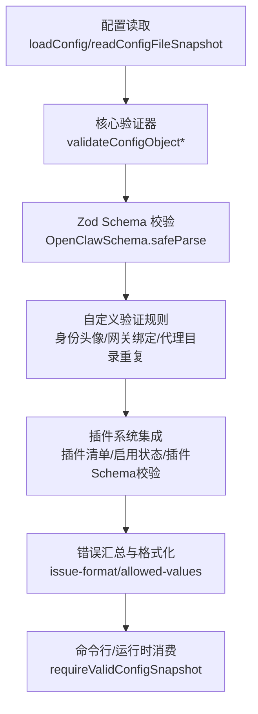
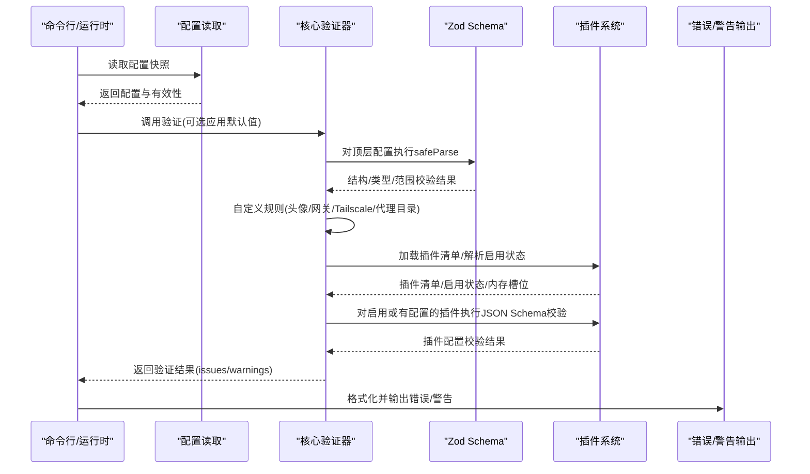
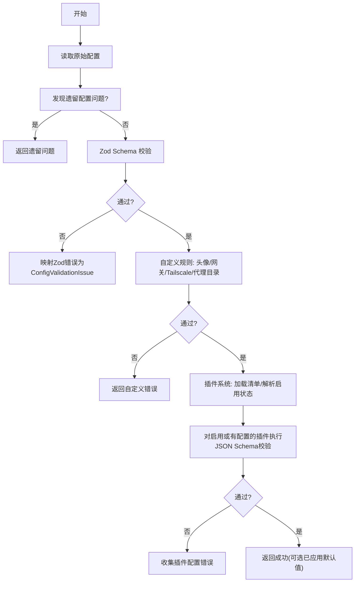
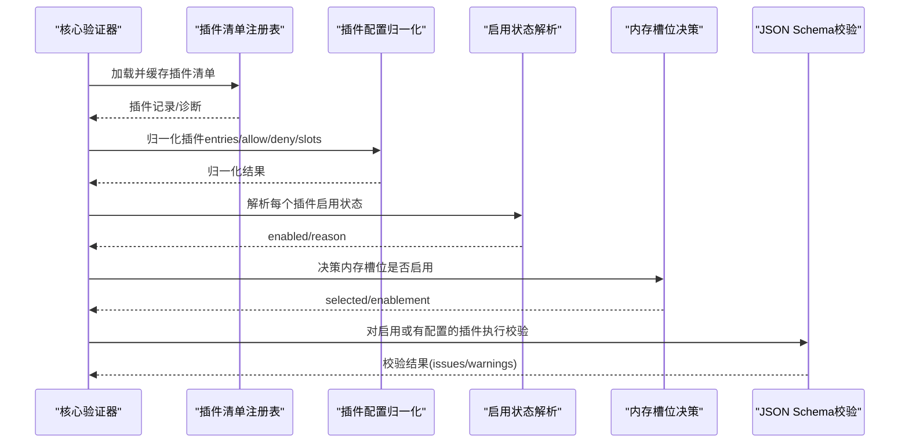
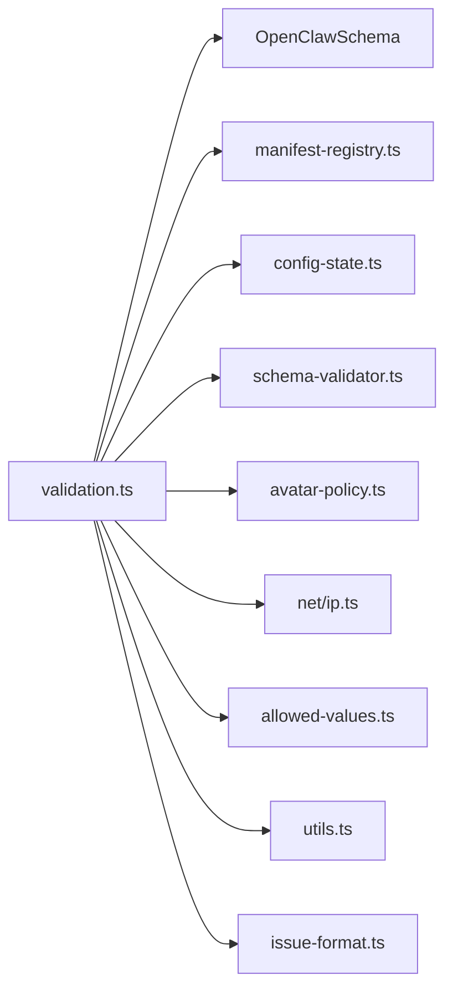

# 配置验证

<cite>
**本文引用的文件**
- [src/config/validation.ts](file://src/config/validation.ts)
- [src/commands/config-validation.ts](file://src/commands/config-validation.ts)
- [src/config/config.plugin-validation.test.ts](file://src/config/config.plugin-validation.test.ts)
- [src/config/config.talk-validation.test.ts](file://src/config/config.talk-validation.test.ts)
- [src/config/zod-schema.core.ts](file://src/config/zod-schema.core.ts)
- [src/config/zod-schema.agents.ts](file://src/config/zod-schema.agents.ts)
- [src/config/zod-schema.providers.ts](file://src/config/zod-schema.providers.ts)
- [src/config/zod-schema.channels.ts](file://src/config/zod-schema.channels.ts)
- [src/config/zod-schema.talk.test.ts](file://src/config/zod-schema.talk.test.ts)
- [src/config/zod-schema.secret-input-validation.ts](file://src/config/zod-schema.secret-input-validation.ts)
- [src/config/allowed-values.ts](file://src/config/allowed-values.ts)
- [src/config/issue-format.ts](file://src/config/issue-format.ts)
- [src/plugins/manifest-registry.ts](file://src/plugins/manifest-registry.ts)
- [src/plugins/config-state.ts](file://src/plugins/config-state.ts)
- [src/plugins/schema-validator.ts](file://src/plugins/schema-validator.ts)
- [src/shared/avatar-policy.ts](file://src/shared/avatar-policy.ts)
- [src/shared/net/ip.ts](file://src/shared/net/ip.ts)
- [src/utils.ts](file://src/utils.ts)
- [src/config/config.multi-agent-agentdir-validation.test.ts](file://src/config/config.multi-agent-agentdir-validation.test.ts)
- [src/config/io.validation-fails-closed.test.ts](file://src/config/io.validation-fails-closed.test.ts)
- [src/gateway/server-methods/validation.ts](file://src/gateway/server-methods/validation.ts)
</cite>

## 目录
1. [简介](#简介)
2. [项目结构](#项目结构)
3. [核心组件](#核心组件)
4. [架构总览](#架构总览)
5. [详细组件分析](#详细组件分析)
6. [依赖关系分析](#依赖关系分析)
7. [性能考量](#性能考量)
8. [故障排查指南](#故障排查指南)
9. [结论](#结论)
10. [附录](#附录)

## 简介
本文件面向 OpenClaw 的配置验证系统，系统性阐述从配置读取到最终验证的完整流程，覆盖 Zod Schema 验证、自定义验证规则与插件验证三类机制。文档将深入解释类型检查、范围验证、依赖验证与约束验证等不同类型的验证，并给出验证错误的分类、错误信息格式、修复建议与回退策略。最后提供最佳实践与常见问题的解决方案。

## 项目结构
OpenClaw 的配置验证由“核心验证器”“Zod Schema 定义”“插件注册与校验”“辅助工具（允许值提示、错误格式化）”四部分组成。核心验证器负责整体流程编排；Zod Schema 负责基础数据结构与字段约束；插件系统在加载后对插件配置进行二次校验；辅助模块提供允许值收集与错误输出格式化能力。

图表来源
- [src/config/validation.ts:229-286](file://src/config/validation.ts#L229-L286)
- [src/config/validation.ts:308-604](file://src/config/validation.ts#L308-L604)
- [src/commands/config-validation.ts:6-21](file://src/commands/config-validation.ts#L6-L21)

章节来源
- [src/config/validation.ts:229-286](file://src/config/validation.ts#L229-L286)
- [src/commands/config-validation.ts:6-21](file://src/commands/config-validation.ts#L6-L21)

## 核心组件
- 核心验证器
  - 提供原始验证与应用默认值后的验证两个入口，分别用于“写回配置”和“运行时使用”的场景。
  - 插件验证：加载插件清单、解析启用状态、按需对插件配置执行 JSON Schema 校验。
  - 自定义验证：身份头像路径合法性、网关与 Tailscale 绑定约束、代理目录重复检测等。
- Zod Schema 定义
  - 分层定义：核心、代理、模型、通道、提供商、会话、敏感字段等，确保字段类型、必填、枚举、范围等约束。
- 插件系统
  - 清单注册与缓存、启用状态解析、内存槽位决策、插件配置 JSON Schema 校验。
- 辅助工具
  - 允许值收集与提示生成、错误行格式化输出。

章节来源
- [src/config/validation.ts:229-286](file://src/config/validation.ts#L229-L286)
- [src/config/validation.ts:308-604](file://src/config/validation.ts#L308-L604)
- [src/config/zod-schema.core.ts](file://src/config/zod-schema.core.ts)
- [src/config/zod-schema.agents.ts](file://src/config/zod-schema.agents.ts)
- [src/config/zod-schema.providers.ts](file://src/config/zod-schema.providers.ts)
- [src/config/zod-schema.channels.ts](file://src/config/zod-schema.channels.ts)
- [src/config/allowed-values.ts:109-140](file://src/config/allowed-values.ts#L109-L140)
- [src/config/issue-format.ts](file://src/config/issue-format.ts)

## 架构总览
下图展示配置验证从读取到输出的端到端流程，以及与插件系统的交互。

图表来源
- [src/config/validation.ts:229-286](file://src/config/validation.ts#L229-L286)
- [src/config/validation.ts:308-604](file://src/config/validation.ts#L308-L604)
- [src/commands/config-validation.ts:6-21](file://src/commands/config-validation.ts#L6-L21)

## 详细组件分析

### 核心验证器与验证流程
- 原始验证与应用默认值验证
  - 原始验证：仅执行 Zod 校验与自定义规则，不应用运行时默认值，适合写回配置。
  - 应用默认值验证：在通过原始验证后，依次应用模型、代理、会话默认值，得到可用于运行时的配置。
- 自定义验证规则
  - 代理身份头像合法性：支持工作区相对路径、HTTP(S) URL、data URI，且不得越权访问。
  - 网关与 Tailscale 绑定约束：当 Tailscale 模式为 serve/funnel 时，要求绑定地址为本地回环。
  - 代理目录重复检测：多代理工作区目录不可重复。
- 插件验证集成
  - 加载插件清单并缓存，收集诊断信息（错误/警告）。
  - 解析插件启用状态与内存槽位决策，仅对启用或存在配置的插件执行 JSON Schema 校验。
  - 对未知插件 ID 进行容错处理：移除类插件以保持启动韧性。
- 错误与警告收集
  - 使用统一的 ConfigValidationIssue 结构，包含路径、消息、可选的允许值列表与隐藏数量。

图表来源
- [src/config/validation.ts:229-286](file://src/config/validation.ts#L229-L286)
- [src/config/validation.ts:308-604](file://src/config/validation.ts#L308-L604)

章节来源
- [src/config/validation.ts:229-286](file://src/config/validation.ts#L229-L286)
- [src/config/validation.ts:308-604](file://src/config/validation.ts#L308-L604)

### Zod Schema 验证
- 分层设计
  - 核心层：全局开关、网络、日志级别等。
  - 代理层：代理列表、默认值、心跳目标与策略、会话设置等。
  - 提供商层：各模型提供商的配置项与必填项。
  - 通道层：通道 ID 合法性、通道特定配置。
  - 敏感层：密钥与敏感输入的特殊处理。
- 典型约束
  - 类型检查：字符串、布尔、数值、数组、对象。
  - 枚举与范围：如心跳目标、直接策略、日志级别等。
  - 条件必填：多提供商场景下必须指定当前 provider。
  - 范围验证：超时时间、连接数上限等数值范围。
- 测试覆盖
  - talk 配置的 fail-closed 行为测试，确保非法类型、非法 provider 与缺少 provider 的多提供商配置被拒绝。

章节来源
- [src/config/zod-schema.core.ts](file://src/config/zod-schema.core.ts)
- [src/config/zod-schema.agents.ts](file://src/config/zod-schema.agents.ts)
- [src/config/zod-schema.providers.ts](file://src/config/zod-schema.providers.ts)
- [src/config/zod-schema.channels.ts](file://src/config/zod-schema.channels.ts)
- [src/config/zod-schema.secret-input-validation.ts](file://src/config/zod-schema.secret-input-validation.ts)
- [src/config/zod-schema.talk.test.ts:11-103](file://src/config/zod-schema.talk.test.ts#L11-L103)

### 自定义验证规则
- 身份头像路径合法性
  - 支持 data URI、HTTP(S) URL、工作区相对路径；禁止越权访问与不合规 URI 方案。
- 网关与 Tailscale 绑定约束
  - 当 Tailscale 模式为 serve 或 funnel 时，绑定地址必须为本地回环（127.0.0.1）。
- 代理目录重复检测
  - 多代理工作区目录不可重复，避免冲突。
- 心跳目标与通道合法性
  - 心跳目标允许枚举值与已知通道 ID，未知目标报错。
- 通道 ID 合法性
  - 通道 ID 可来自内置通道与插件声明的通道集合。

章节来源
- [src/config/validation.ts:148-196](file://src/config/validation.ts#L148-L196)
- [src/config/validation.ts:198-223](file://src/config/validation.ts#L198-L223)
- [src/config/validation.ts:384-407](file://src/config/validation.ts#L384-L407)
- [src/config/validation.ts:414-445](file://src/config/validation.ts#L414-L445)
- [src/config/config.multi-agent-agentdir-validation.test.ts](file://src/config/config.multi-agent-agentdir-validation.test.ts)
- [src/shared/avatar-policy.ts](file://src/shared/avatar-policy.ts)
- [src/shared/net/ip.ts](file://src/shared/net/ip.ts)

### 插件验证
- 插件清单加载与缓存
  - 通过插件清单注册表加载插件元信息，收集诊断（错误/警告），并将其映射为配置验证问题。
- 启用状态与内存槽位决策
  - 基于插件启用策略、来源与配置，解析有效启用状态；内存插件仅允许一个被选中。
- 插件配置 JSON Schema 校验
  - 对启用或存在配置的插件执行 JSON Schema 校验；未提供 schema 的插件报告缺失。
- 未知插件 ID 的容错
  - 对未知插件 ID 仅发出警告，保留系统启动韧性；对已移除插件 ID 发出“已移除”警告。

图表来源
- [src/config/validation.ts:339-382](file://src/config/validation.ts#L339-L382)
- [src/config/validation.ts:540-563](file://src/config/validation.ts#L540-L563)
- [src/config/validation.ts:567-589](file://src/config/validation.ts#L567-L589)
- [src/plugins/manifest-registry.ts](file://src/plugins/manifest-registry.ts)
- [src/plugins/config-state.ts](file://src/plugins/config-state.ts)
- [src/plugins/schema-validator.ts](file://src/plugins/schema-validator.ts)

章节来源
- [src/config/validation.ts:308-604](file://src/config/validation.ts#L308-L604)
- [src/config/config.plugin-validation.test.ts:133-208](file://src/config/config.plugin-validation.test.ts#L133-L208)
- [src/config/config.plugin-validation.test.ts:210-280](file://src/config/config.plugin-validation.test.ts#L210-L280)
- [src/config/config.plugin-validation.test.ts:307-331](file://src/config/config.plugin-validation.test.ts#L307-L331)
- [src/config/config.plugin-validation.test.ts:333-347](file://src/config/config.plugin-validation.test.ts#L333-L347)

### 错误分类与处理机制
- 错误类型
  - 结构/类型错误：字段类型不符、缺失必填字段。
  - 范围/枚举错误：超出范围或不在允许枚举内。
  - 依赖约束错误：多提供商场景缺少 provider、心跳目标未知。
  - 插件相关错误：插件不存在、schema 缺失、启用但配置存在。
- 错误信息格式
  - 统一使用 ConfigValidationIssue，包含 path、message、可选 allowedValues 与 hiddenCount。
  - 允许值提示：自动从 Zod 错误中提取允许值并追加到消息中。
- 修复建议
  - 类型错误：修正字段类型或删除多余字段。
  - 枚举错误：选择允许值之一。
  - 依赖错误：补充 provider 或调整多提供商配置。
  - 插件错误：移除未知插件条目、添加缺失 schema 或清理启用但无配置的条目。
- 回退策略
  - 插件移除类错误：以警告形式提示并忽略，保证系统启动。
  - 原始验证失败：阻止写回配置，要求修复后再试。
  - 运行时失败：通过命令行包装器输出详细错误并退出。

章节来源
- [src/config/validation.ts:117-140](file://src/config/validation.ts#L117-L140)
- [src/config/validation.ts:467-490](file://src/config/validation.ts#L467-L490)
- [src/config/allowed-values.ts:109-140](file://src/config/allowed-values.ts#L109-L140)
- [src/config/issue-format.ts](file://src/config/issue-format.ts)
- [src/commands/config-validation.ts:6-21](file://src/commands/config-validation.ts#L6-L21)

## 依赖关系分析
- 组件耦合
  - 核心验证器依赖 Zod Schema、插件系统、共享策略与工具函数。
  - 插件系统依赖清单注册表、启用状态解析与 JSON Schema 校验器。
  - 自定义验证规则依赖共享的策略与网络/路径工具。
- 外部依赖
  - 插件清单注册表缓存、启用状态解析、JSON Schema 校验器。
- 接口契约
  - 插件配置校验器返回统一的错误结构，核心验证器负责聚合与格式化。

图表来源
- [src/config/validation.ts:1-25](file://src/config/validation.ts#L1-L25)
- [src/config/validation.ts:339-382](file://src/config/validation.ts#L339-L382)
- [src/config/validation.ts:540-563](file://src/config/validation.ts#L540-L563)
- [src/config/validation.ts:567-589](file://src/config/validation.ts#L567-L589)

章节来源
- [src/config/validation.ts:1-25](file://src/config/validation.ts#L1-L25)

## 性能考量
- 缓存与复用
  - 插件清单注册表缓存减少重复加载开销；同一套配置多次验证时可复用解析结果。
- 惰性计算
  - 插件启用状态与内存槽位决策仅在需要时计算，避免不必要的遍历。
- I/O 优化
  - 在测试中预热缓存，减少磁盘读取与解析次数。
- 失败快速返回
  - 任一阶段失败立即返回，避免后续昂贵操作。

## 故障排查指南
- 常见问题与定位
  - talk 配置非法：silenceTimeoutMs 类型错误、provider 与 providers 不匹配、多提供商缺少 provider。
  - 插件未知 ID：插件目录变更或重命名导致的残留条目。
  - 插件 schema 缺失：插件未提供配置 schema 导致无法校验。
  - 心跳目标未知：目标不在内置通道或插件声明通道集合中。
- 修复步骤
  - 使用 doctor 命令获取更详细的诊断信息。
  - 修正类型或枚举值，补齐 provider 字段，清理未知插件条目。
  - 重新加载配置并再次验证。
- 关闭模式下的失败行为
  - 配置加载失败时抛出带 INVALID_CONFIG 错误码的异常，确保系统不会在无效配置下运行。

章节来源
- [src/config/config.talk-validation.test.ts:11-103](file://src/config/config.talk-validation.test.ts#L11-L103)
- [src/config/config.plugin-validation.test.ts:133-208](file://src/config/config.plugin-validation.test.ts#L133-L208)
- [src/config/config.plugin-validation.test.ts:333-347](file://src/config/config.plugin-validation.test.ts#L333-L347)
- [src/config/io.validation-fails-closed.test.ts](file://src/config/io.validation-fails-closed.test.ts)

## 结论
OpenClaw 的配置验证体系以 Zod Schema 为基础，结合自定义规则与插件系统，形成“结构/类型/范围/依赖/约束”五位一体的验证闭环。通过统一的错误格式与允许值提示，用户能够快速定位并修复问题；通过 fail-closed 与 fail-safe（插件移除）策略，系统在错误面前既严格又稳健。建议在团队内推广使用统一的配置模板与 CI 校验，持续提升配置质量与一致性。

## 附录
- 最佳实践
  - 使用分层 Schema 设计，明确字段类型与必填关系。
  - 对多提供商配置强制要求当前 provider，避免歧义。
  - 为插件提供完备的配置 schema，并在变更时同步更新。
  - 将配置校验纳入 CI，尽早发现潜在问题。
- 常见问题速查
  - “unknown heartbeat target”：确认目标在内置通道或插件声明通道中。
  - “plugin not found”：清理配置中的未知插件条目。
  - “plugin schema missing”：为插件补充配置 schema 或移除配置。
  - talk 配置错误：修正类型、补齐 provider 或删除多余字段。