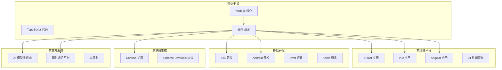
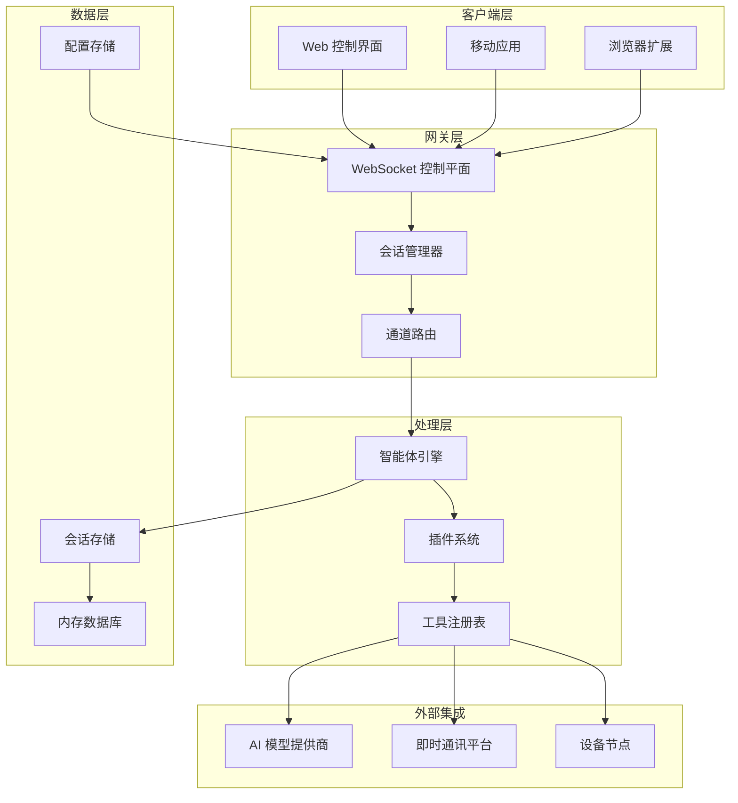
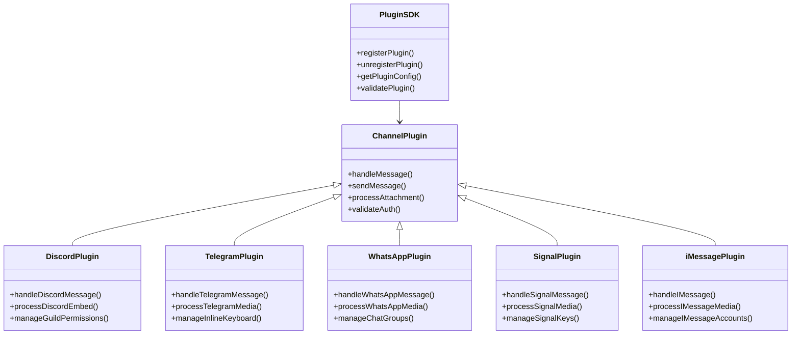
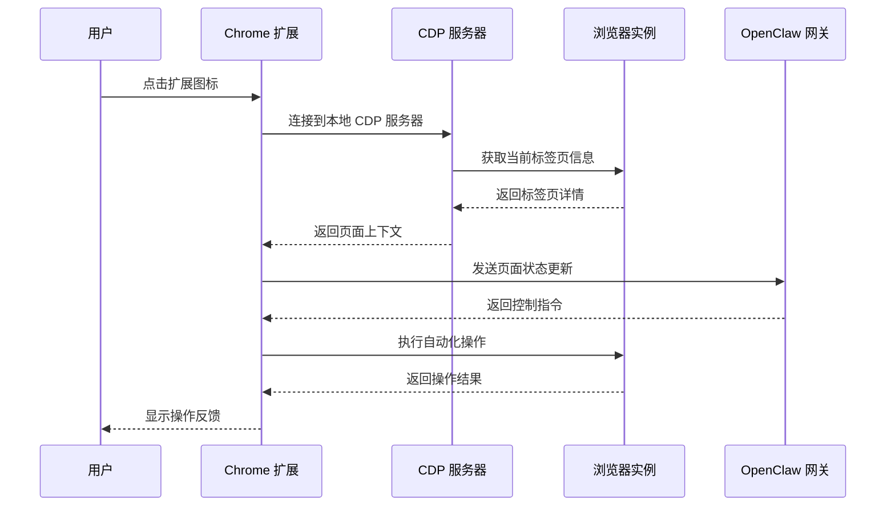
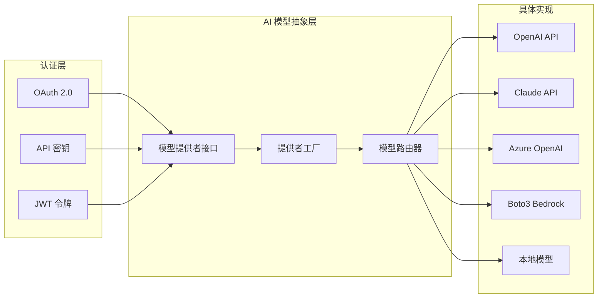
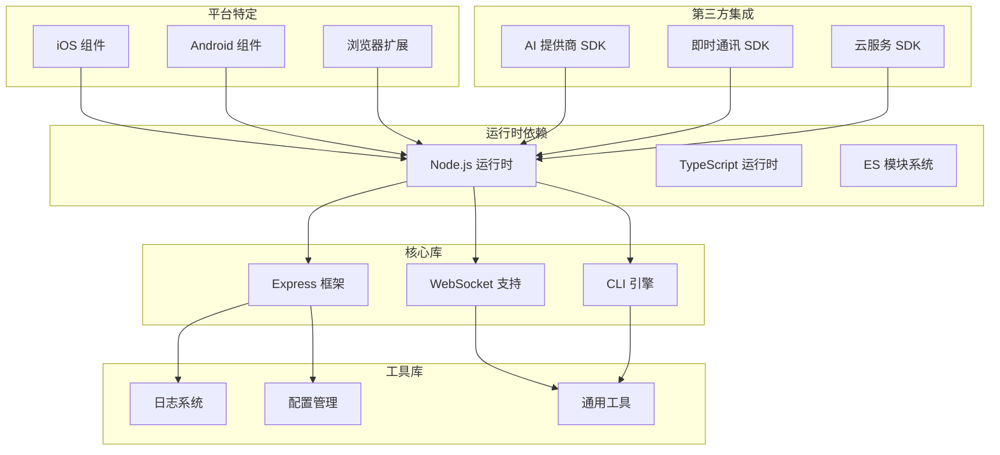

# 技术栈概览

<cite>
**本文档引用的文件**
- [package.json](file://package.json)
- [README.md](file://README.md)
- [src/index.ts](file://src/index.ts)
- [tsconfig.json](file://tsconfig.json)
- [ui/package.json](file://ui/package.json)
- [Swabble/Package.swift](file://Swabble/Package.swift)
- [apps/ios/project.yml](file://apps/ios/project.yml)
- [apps/android/build.gradle.kts](file://apps/android/build.gradle.kts)
- [assets/chrome-extension/manifest.json](file://assets/chrome-extension/manifest.json)
- [extensions/discord/package.json](file://extensions/discord/package.json)
- [extensions/telegram/package.json](file://extensions/telegram/package.json)
- [extensions/whatsapp/package.json](file://extensions/whatsapp/package.json)
- [extensions/signal/package.json](file://extensions/signal/package.json)
- [extensions/imessage/package.json](file://extensions/imessage/package.json)
</cite>

## 目录
1. [简介](#简介)
2. [项目结构](#项目结构)
3. [核心组件](#核心组件)
4. [架构概览](#架构概览)
5. [详细组件分析](#详细组件分析)
6. [依赖关系分析](#依赖关系分析)
7. [性能考量](#性能考量)
8. [故障排除指南](#故障排除指南)
9. [结论](#结论)

## 简介

OpenClaw 是一个个人 AI 助手项目，采用多语言混合架构设计。该项目的核心技术栈围绕 TypeScript/JavaScript 构建，同时集成了多种平台特定的开发语言和技术框架，形成了完整的跨平台解决方案。

项目的主要特点包括：
- **多平台支持**：支持 macOS、iOS、Android、Linux 和 Windows 平台
- **模块化架构**：通过插件系统实现功能扩展
- **实时通信**：基于 WebSocket 的实时控制平面
- **浏览器集成**：Chrome 扩展实现浏览器控制
- **AI 集成**：支持多种 AI 模型提供商

## 项目结构

OpenClaw 采用了清晰的分层项目结构，每个平台都有独立的开发环境：

**图表来源**
- [package.json:340-395](file://package.json#L340-L395)
- [src/index.ts:1-94](file://src/index.ts#L1-L94)

**章节来源**
- [package.json:1-465](file://package.json#L1-L465)
- [README.md:1-560](file://README.md#L1-L560)

## 核心组件

### 后端架构（Node.js + WebSocket + Express）

OpenClaw 的后端采用现代 Node.js 架构，主要技术组件包括：

**核心运行时**
- **Node.js >= 22.12.0**：项目要求的最低 Node.js 版本
- **TypeScript 5.9.3**：类型安全的 JavaScript 超集
- **Express 5.2.1**：Web 应用框架
- **WebSocket (ws)**：实时双向通信

**构建工具链**
- **pnpm 10.23.0**：包管理器
- **tsx**：TypeScript 运行时执行器
- **Vitest**：测试框架
- **Vite**：前端构建工具

**日志和监控**
- **tslog 4.10.2**：结构化日志记录
- **chalk 5.6.2**：命令行样式化输出

**章节来源**
- [package.json:422-424](file://package.json#L422-L424)
- [package.json:340-395](file://package.json#L340-L395)
- [tsconfig.json:1-29](file://tsconfig.json#L1-L29)

### 前端技术栈

项目提供了灵活的前端选择，支持多种现代前端框架：

**推荐前端框架**
- **Lit + Signals**：轻量级响应式前端框架
- **Vite 7.3.1**：现代化构建工具
- **Playwright 1.58.2**：端到端测试框架

**可选前端框架**
- **React 3.3.2**：用户界面库
- **Vue 3.3.2**：渐进式 JavaScript 框架
- **Angular 14.0.3**：完整的前端框架

**章节来源**
- [ui/package.json:11-21](file://ui/package.json#L11-L21)
- [ui/package.json:22-26](file://ui/package.json#L22-L26)

### 移动端开发

**iOS 开发**
- **Swift 6.0**：iOS 应用开发语言
- **Xcode 16.0**：iOS 开发工具
- **iOS 18.0+**：最低支持版本
- **Swift Package Manager**：包管理

**Android 开发**
- **Kotlin 2.2.21**：Android 应用开发语言
- **Android Gradle Plugin 9.0.1**：构建工具
- **Compose 2.2.21**：现代 UI 工具包
- **Android 9.0+**：最低支持版本

**章节来源**
- [apps/ios/project.yml:4-6](file://apps/ios/project.yml#L4-L6)
- [apps/android/build.gradle.kts:1-8](file://apps/android/build.gradle.kts#L1-L8)
- [Swabble/Package.swift:6-9](file://Swabble/Package.swift#L6-L9)

## 架构概览

OpenClaw 采用分布式微服务架构，通过 WebSocket 实现组件间通信：

**图表来源**
- [src/index.ts:1-94](file://src/index.ts#L1-L94)
- [README.md:185-202](file://README.md#L185-L202)

## 详细组件分析

### 插件系统架构

OpenClaw 采用模块化的插件系统，每个插件都是独立的 npm 包：

**图表来源**
- [extensions/discord/package.json:1-12](file://extensions/discord/package.json#L1-L12)
- [extensions/telegram/package.json:1-13](file://extensions/telegram/package.json#L1-L13)
- [extensions/whatsapp/package.json:1-13](file://extensions/whatsapp/package.json#L1-L13)
- [extensions/signal/package.json:1-13](file://extensions/signal/package.json#L1-L13)
- [extensions/imessage/package.json:1-13](file://extensions/imessage/package.json#L1-L13)

### 浏览器控制架构

Chrome 扩展通过 CDP（Chrome DevTools Protocol）实现浏览器控制：

**图表来源**
- [assets/chrome-extension/manifest.json:1-26](file://assets/chrome-extension/manifest.json#L1-L26)

**章节来源**
- [assets/chrome-extension/manifest.json:12-14](file://assets/chrome-extension/manifest.json#L12-L14)

### AI 模型集成架构

项目支持多种 AI 模型提供商，通过统一的抽象层进行管理：

**图表来源**
- [package.json:340-395](file://package.json#L340-L395)

**章节来源**
- [package.json:340-395](file://package.json#L340-L395)

## 依赖关系分析

### 核心依赖矩阵

OpenClaw 的依赖关系呈现典型的分层架构模式：

**图表来源**
- [package.json:340-395](file://package.json#L340-L395)
- [src/index.ts:1-94](file://src/index.ts#L1-L94)

### 版本兼容性矩阵

| 组件 | 最低版本 | 推荐版本 | 兼容性状态 |
|------|----------|----------|------------|
| Node.js | 22.12.0 | 22.x | ✅ 完全兼容 |
| TypeScript | 5.9.3 | 5.9.x | ✅ 完全兼容 |
| Express | 5.2.1 | 5.x | ✅ 完全兼容 |
| WebSocket | 8.19.0 | 8.x | ✅ 完全兼容 |
| iOS | 18.0 | 18+ | ✅ 完全兼容 |
| Android | 9.0 | 9+ | ✅ 完全兼容 |
| Swift | 6.0 | 6.x | ✅ 完全兼容 |
| Kotlin | 2.2.21 | 2.2.x | ✅ 完全兼容 |

**章节来源**
- [package.json:422-424](file://package.json#L422-L424)
- [apps/ios/project.yml:4-6](file://apps/ios/project.yml#L4-L6)
- [apps/android/build.gradle.kts:1-8](file://apps/android/build.gradle.kts#L1-L8)
- [Swabble/Package.swift:6-9](file://Swabble/Package.swift#L6-L9)

## 性能考量

### 内存管理优化

OpenClaw 采用多项内存管理策略来确保长期稳定运行：

- **垃圾回收优化**：合理设置 Node.js 垃圾回收参数
- **连接池管理**：WebSocket 连接池避免频繁建立连接
- **缓存策略**：智能缓存机制减少重复计算
- **资源清理**：定时清理临时文件和无用资源

### 并发处理

项目支持高并发场景的处理能力：

- **事件驱动架构**：基于事件循环的异步处理
- **多线程支持**：利用 Node.js worker threads 处理 CPU 密集任务
- **背压控制**：防止消息队列过载
- **超时管理**：合理的请求超时和重试机制

## 故障排除指南

### 常见问题诊断

**Node.js 版本问题**
- 检查 Node.js 版本是否满足最低要求
- 使用 nvm 管理多个 Node.js 版本
- 清理 npm 缓存重新安装依赖

**WebSocket 连接问题**
- 检查防火墙设置允许 WebSocket 连接
- 验证端口可用性和权限
- 查看网络代理配置

**插件加载失败**
- 确认插件包正确安装
- 检查插件依赖版本兼容性
- 查看插件错误日志

**章节来源**
- [src/index.ts:84-93](file://src/index.ts#L84-L93)

## 结论

OpenClaw 项目展现了现代全栈应用开发的最佳实践。通过精心设计的技术栈选择和架构规划，项目实现了：

**技术优势**
- **跨平台一致性**：统一的 TypeScript 基础确保各平台代码一致性
- **模块化设计**：插件系统支持功能的灵活扩展
- **实时通信**：WebSocket 架构提供流畅的用户体验
- **生态兼容**：支持主流 AI 模型和即时通讯平台

**架构特色**
- **分层清晰**：从底层基础设施到上层应用的明确分层
- **可扩展性**：插件化架构便于功能扩展
- **稳定性**：完善的错误处理和监控机制
- **性能优化**：针对不同平台的性能优化策略

该项目为构建复杂的 AI 驱动应用提供了优秀的参考架构，特别是在多平台、实时通信和 AI 集成方面具有重要的借鉴价值。