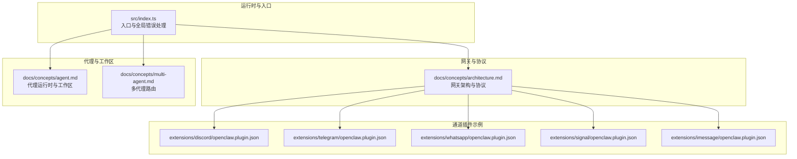
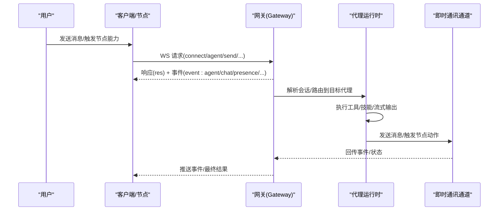
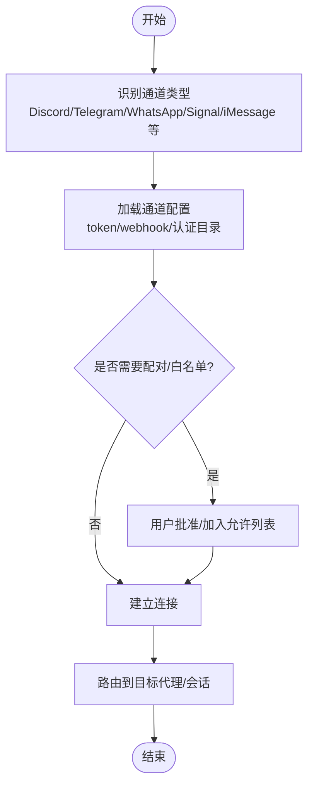
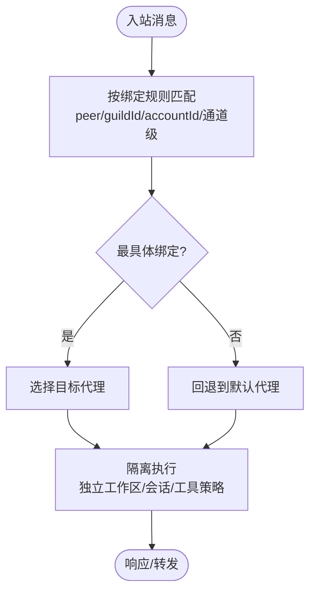
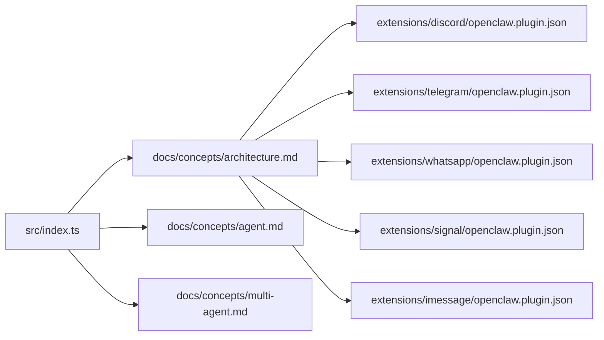

# 核心价值与功能特性

<cite>
**本文引用的文件**
- [README.md](file://README.md)
- [VISION.md](file://VISION.md)
- [CONTRIBUTING.md](file://CONTRIBUTING.md)
- [src/index.ts](file://src/index.ts)
- [docs/concepts/architecture.md](file://docs/concepts/architecture.md)
- [docs/concepts/agent.md](file://docs/concepts/agent.md)
- [docs/concepts/multi-agent.md](file://docs/concepts/multi-agent.md)
- [extensions/discord/openclaw.plugin.json](file://extensions/discord/openclaw.plugin.json)
- [extensions/telegram/openclaw.plugin.json](file://extensions/telegram/openclaw.plugin.json)
- [extensions/whatsapp/openclaw.plugin.json](file://extensions/whatsapp/openclaw.plugin.json)
- [extensions/signal/openclaw.plugin.json](file://extensions/signal/openclaw.plugin.json)
- [extensions/imessage/openclaw.plugin.json](file://extensions/imessage/openclaw.plugin.json)
</cite>

## 目录
1. [引言](#引言)
2. [项目结构](#项目结构)
3. [核心组件](#核心组件)
4. [架构总览](#架构总览)
5. [详细组件分析](#详细组件分析)
6. [依赖关系分析](#依赖关系分析)
7. [性能考量](#性能考量)
8. [故障排查指南](#故障排查指南)
9. [结论](#结论)
10. [附录](#附录)

## 引言
OpenClaw 是一个“在你自己的设备上运行”的个人 AI 助手，强调本地优先、隐私安全与强大能力的平衡。它通过单一网关（Gateway）控制所有即时通讯渠道，提供多通道收件箱、多代理路由、语音唤醒、Live Canvas、一流工具系统与配套应用等能力，帮助用户在熟悉的聊天界面中完成真实世界任务。

- 本地优先：数据与计算尽可能留在你的设备或受信任的网络内，降低泄露风险。
- 隐私优先：默认安全策略、可配置的沙箱与工具策略、严格的配对与鉴权流程。
- 能力优先：强大的工具系统、跨平台节点、实时画布协作、多代理隔离与路由。

章节来源
- [README.md:21-26](file://README.md#L21-L26)
- [README.md:126-136](file://README.md#L126-L136)
- [VISION.md:15-32](file://VISION.md#L15-L32)

## 项目结构
OpenClaw 的核心由“网关（Gateway）+ 多插件通道 + 工具与技能 + 客户端与节点”构成。顶层入口负责解析命令行、加载环境与日志、校验运行时版本，并构建 CLI 程序；概念文档定义了网关协议、代理运行时与多代理路由模型；扩展目录提供了各即时通讯平台的插件清单与配置模式。

图示来源
- [src/index.ts:1-94](file://src/index.ts#L1-L94)
- [docs/concepts/architecture.md:12-52](file://docs/concepts/architecture.md#L12-L52)
- [docs/concepts/agent.md:10-47](file://docs/concepts/agent.md#L10-L47)
- [docs/concepts/multi-agent.md:8-50](file://docs/concepts/multi-agent.md#L8-L50)
- [extensions/discord/openclaw.plugin.json:1-10](file://extensions/discord/openclaw.plugin.json#L1-L10)
- [extensions/telegram/openclaw.plugin.json:1-10](file://extensions/telegram/openclaw.plugin.json#L1-L10)
- [extensions/whatsapp/openclaw.plugin.json:1-10](file://extensions/whatsapp/openclaw.plugin.json#L1-L10)
- [extensions/signal/openclaw.plugin.json:1-10](file://extensions/signal/openclaw.plugin.json#L1-L10)
- [extensions/imessage/openclaw.plugin.json:1-10](file://extensions/imessage/openclaw.plugin.json#L1-L10)

章节来源
- [src/index.ts:36-44](file://src/index.ts#L36-L44)
- [docs/concepts/architecture.md:12-52](file://docs/concepts/architecture.md#L12-L52)

## 核心组件
- 网关（Gateway）：单一长连接的 WebSocket 控制平面，统一维护各消息通道、事件推送、健康状态与远程访问（Tailscale/SSH）。
- 代理运行时（Agent Runtime）：基于嵌入式 pi-mono 的单个代理运行时，配合工作区注入文件（如 AGENTS.md、SOUL.md、TOOLS.md）形成“记忆+边界+工具”的上下文。
- 多代理路由（Multi-Agent Routing）：在同一网关内托管多个独立代理，按通道账号与发送者/群组进行绑定路由，实现严格隔离与差异化权限。
- 通道插件（Channels）：以插件形式接入 20+ 即时通讯平台，每个插件声明支持的通道类型与最小配置模式。
- 工具与技能（Tools & Skills）：内置系统工具与浏览器控制，结合可安装的技能生态，覆盖日常任务自动化与专业领域。
- 节点与配套应用（Nodes & Apps）：macOS/iOS/Android 节点通过 WebSocket 连接，提供语音唤醒、Canvas、相机/屏幕录制、位置查询等本地能力。

章节来源
- [README.md:126-136](file://README.md#L126-L136)
- [docs/concepts/architecture.md:14-52](file://docs/concepts/architecture.md#L14-L52)
- [docs/concepts/agent.md:10-47](file://docs/concepts/agent.md#L10-L47)
- [docs/concepts/multi-agent.md:8-50](file://docs/concepts/multi-agent.md#L8-L50)

## 架构总览
下图展示了从用户消息进入，到网关路由、代理执行、工具调用与回传的端到端流程。客户端（CLI/桌面/Web）与节点（macOS/iOS/Android）均通过 WebSocket 连接到网关，网关再与各即时通讯通道对接。

图示来源
- [docs/concepts/architecture.md:61-78](file://docs/concepts/architecture.md#L61-L78)
- [docs/concepts/architecture.md:14-52](file://docs/concepts/architecture.md#L14-L52)

章节来源
- [docs/concepts/architecture.md:12-52](file://docs/concepts/architecture.md#L12-L52)

## 详细组件分析

### 组件一：多通道集成（20+ 即时通讯平台）
- 设计理念：以“插件化通道”方式接入主流即时通讯平台，每个插件声明支持的通道类型与最小配置模式，便于扩展与维护。
- 典型通道插件清单（示例）：
  - Discord：支持频道/群组/私聊，需配置 bot token。
  - Telegram：支持 bot token 与 webhook，支持群组与私聊。
  - WhatsApp：通过 Baileys 连接，需登录并管理允许列表。
  - Signal：依赖 signal-cli，需配置服务端。
  - iMessage：推荐 BlueBubbles（macOS 上的 iMessage 服务器），也可使用 legacy imsg。
- 价值主张：
  - 用户无需切换应用即可获得统一的智能助手体验；
  - 每个通道的配对/白名单/群组策略可独立配置，兼顾安全与便利。

图示来源
- [extensions/discord/openclaw.plugin.json:1-10](file://extensions/discord/openclaw.plugin.json#L1-L10)
- [extensions/telegram/openclaw.plugin.json:1-10](file://extensions/telegram/openclaw.plugin.json#L1-L10)
- [extensions/whatsapp/openclaw.plugin.json:1-10](file://extensions/whatsapp/openclaw.plugin.json#L1-L10)
- [extensions/signal/openclaw.plugin.json:1-10](file://extensions/signal/openclaw.plugin.json#L1-L10)
- [extensions/imessage/openclaw.plugin.json:1-10](file://extensions/imessage/openclaw.plugin.json#L1-L10)

章节来源
- [README.md:129](file://README.md#L129)
- [extensions/discord/openclaw.plugin.json:1-10](file://extensions/discord/openclaw.plugin.json#L1-L10)
- [extensions/telegram/openclaw.plugin.json:1-10](file://extensions/telegram/openclaw.plugin.json#L1-L10)
- [extensions/whatsapp/openclaw.plugin.json:1-10](file://extensions/whatsapp/openclaw.plugin.json#L1-L10)
- [extensions/signal/openclaw.plugin.json:1-10](file://extensions/signal/openclaw.plugin.json#L1-L10)
- [extensions/imessage/openclaw.plugin.json:1-10](file://extensions/imessage/openclaw.plugin.json#L1-L10)

### 组件二：多代理路由（隔离工作区与会话）
- 目标：在同一网关内托管多个“完全隔离”的代理（各自工作区、认证资料、会话存储），并通过“绑定规则”将不同通道账号/发送者路由到对应代理。
- 关键点：
  - 代理身份（agentId）决定工作区、状态目录与会话存储路径；
  - 绑定规则“最具体优先”，支持 peer/guildId/accountId 等多维匹配；
  - 支持 per-agent 沙箱与工具策略，实现差异化安全边界。
- 应用场景：
  - 同一 WhatsApp 号码分身路由到不同代理（如“家庭”“工作”“日常聊天”）；
  - Discord/Telegram 为不同用途分别配置 bot 并路由到专属代理；
  - 对高敏感群组启用更严格工具限制与 mention gating。

图示来源
- [docs/concepts/multi-agent.md:172-193](file://docs/concepts/multi-agent.md#L172-L193)
- [docs/concepts/multi-agent.md:307-377](file://docs/concepts/multi-agent.md#L307-L377)
- [docs/concepts/multi-agent.md:447-493](file://docs/concepts/multi-agent.md#L447-L493)

章节来源
- [docs/concepts/multi-agent.md:8-50](file://docs/concepts/multi-agent.md#L8-L50)
- [docs/concepts/multi-agent.md:172-193](file://docs/concepts/multi-agent.md#L172-L193)
- [docs/concepts/multi-agent.md:502-553](file://docs/concepts/multi-agent.md#L502-L553)

### 组件三：本地代理运行时与工作区
- 运行时：基于嵌入式 pi-mono 的单代理运行时，会话管理、发现与工具装配由 OpenClaw 自主实现。
- 工作区：代理工作区为工具与上下文的唯一工作目录，首次会话注入 AGENTS/SOUL/TOOLS 等文件，形成“记忆+边界+工具”的上下文。
- 价值主张：
  - 保持轻量核心的同时，提供强大的可扩展性；
  - 通过工作区与工具策略，确保在“强默认安全”前提下仍具备强大能力。

章节来源
- [docs/concepts/agent.md:10-47](file://docs/concepts/agent.md#L10-L47)
- [docs/concepts/agent.md:66-72](file://docs/concepts/agent.md#L66-L72)

### 组件四：语音唤醒与 Talk 模式
- 语音唤醒（Voice Wake）：在 macOS/iOS 上支持唤醒词触发，配合推送/按住说话模式，降低交互门槛。
- Talk 模式：在 Android 上提供连续语音输入，结合系统 TTS/第三方 TTS（如 ElevenLabs）实现自然对话。
- 价值主张：
  - 在移动与桌面场景下提供自然的人机交互；
  - 与网关节点能力联动，实现跨设备的语音协同。

章节来源
- [README.md:131-132](file://README.md#L131-L132)

### 组件五：Live Canvas 与 A2UI
- Live Canvas：网关提供 Canvas 主机与 A2UI 主机，支持在画布上进行可视化协作与动态内容渲染。
- 价值主张：
  - 将“思考过程”可视化，提升人机协作效率；
  - 通过节点能力（相机/屏幕录制/位置）与 Canvas 结合，实现更强的计算机使用能力。

章节来源
- [README.md:132-133](file://README.md#L132-L133)

### 组件六：一流工具系统
- 内置工具：系统命令执行、读写编辑、会话工具、浏览器控制等；
- 技能体系：通过 ClawHub 生态发布与安装技能，覆盖广泛场景；
- 价值主张：
  - 以“工具+技能”双轮驱动，既满足基础能力，又可快速扩展专业能力；
  - 通过沙箱与工具策略，保障在开放生态下的安全可控。

章节来源
- [README.md:133-134](file://README.md#L133-L134)

### 组件七：配套应用与节点
- macOS 菜单栏应用：提供网关控制、健康监控、WebChat 与调试工具；
- iOS/Android 节点：设备配对后可执行本地能力（系统命令、通知、Canvas、相机/屏幕录制、位置查询等）；
- 价值主张：
  - 在本地设备上提供“近场即得”的智能助手体验；
  - 通过节点能力与网关协议，实现“执行在远端、感知在本地”的混合架构。

章节来源
- [README.md:134-135](file://README.md#L134-L135)
- [README.md:156-162](file://README.md#L156-L162)

## 依赖关系分析
- 入口与运行时：src/index.ts 负责加载环境、标准化环境变量、捕获未处理异常、解析 CLI 并启动程序。
- 网关协议与客户端：docs/concepts/architecture.md 描述了 WebSocket 控制面、事件模型与配对机制。
- 代理与工作区：docs/concepts/agent.md 定义了工作区注入文件、内置工具与会话存储。
- 多代理路由：docs/concepts/multi-agent.md 提供绑定规则、多账号与 per-agent 安全策略。
- 通道插件：各通道插件以 openclaw.plugin.json 声明支持的通道类型与最小配置模式。

图示来源
- [src/index.ts:36-44](file://src/index.ts#L36-L44)
- [docs/concepts/architecture.md:12-52](file://docs/concepts/architecture.md#L12-L52)
- [docs/concepts/agent.md:10-47](file://docs/concepts/agent.md#L10-L47)
- [docs/concepts/multi-agent.md:8-50](file://docs/concepts/multi-agent.md#L8-L50)
- [extensions/discord/openclaw.plugin.json:1-10](file://extensions/discord/openclaw.plugin.json#L1-L10)
- [extensions/telegram/openclaw.plugin.json:1-10](file://extensions/telegram/openclaw.plugin.json#L1-L10)
- [extensions/whatsapp/openclaw.plugin.json:1-10](file://extensions/whatsapp/openclaw.plugin.json#L1-L10)
- [extensions/signal/openclaw.plugin.json:1-10](file://extensions/signal/openclaw.plugin.json#L1-L10)
- [extensions/imessage/openclaw.plugin.json:1-10](file://extensions/imessage/openclaw.plugin.json#L1-L10)

章节来源
- [src/index.ts:36-44](file://src/index.ts#L36-L44)
- [docs/concepts/architecture.md:12-52](file://docs/concepts/architecture.md#L12-L52)
- [docs/concepts/agent.md:10-47](file://docs/concepts/agent.md#L10-L47)
- [docs/concepts/multi-agent.md:8-50](file://docs/concepts/multi-agent.md#L8-L50)

## 性能考量
- 本地优先：减少云端往返，降低延迟与带宽占用，适合高频、低延迟交互。
- 沙箱与工具策略：在保证安全的前提下，按需启用能力，避免不必要的资源消耗。
- 流式输出与块流：支持块级流式输出与合并，优化长文本传输与 UI 渲染体验。
- 远程访问：通过 Tailscale/SSH 隧道安全暴露网关，兼顾可用性与安全性。

章节来源
- [README.md:171-177](file://README.md#L171-L177)
- [docs/concepts/agent.md:94-104](file://docs/concepts/agent.md#L94-L104)

## 故障排查指南
- 安全与配对：默认 DM 策略建议采用“配对”或“允许列表”，避免未知发件人造成安全风险；可通过 doctor 检查 DM 策略配置。
- 远程访问：使用 Tailscale Serve/Funnel 或 SSH 隧道连接网关，注意绑定地址与鉴权设置。
- 日志与诊断：启用结构化日志，关注网关健康状态与事件流；必要时使用 doctor 进行迁移与配置检查。
- 通道问题：针对特定通道（如 WhatsApp/Telegram/Signal）检查 token/webhook/认证目录与允许列表配置。

章节来源
- [README.md:112-125](file://README.md#L112-L125)
- [README.md:213-239](file://README.md#L213-L239)
- [README.md:442-449](file://README.md#L442-L449)

## 结论
OpenClaw 以“本地优先”为核心价值主张，通过单一网关控制多通道、多代理路由与节点能力，构建出“在你设备上、在你熟悉的聊天界面中、做真正有用的事”的个人 AI 助手。其优势体现在：
- 隐私与安全：强默认安全、可配置沙箱与工具策略、严格的配对与鉴权；
- 能力与扩展：一流工具系统与技能生态、Live Canvas 与节点能力；
- 易用与可靠：终端优先的显式设置、稳定的多代理隔离与路由、完善的远程访问与诊断。

章节来源
- [VISION.md:15-32](file://VISION.md#L15-L32)
- [README.md:126-136](file://README.md#L126-L136)

## 附录
- 快速开始与升级：参考 README 中的入门与更新指南，使用 onboarding 向导完成网关安装与守护进程配置。
- 开发与贡献：遵循贡献指南，PR 保持聚焦、测试完备、文档清晰；维护者团队持续推动稳定性与用户体验。

章节来源
- [README.md:50-82](file://README.md#L50-L82)
- [CONTRIBUTING.md:79-107](file://CONTRIBUTING.md#L79-L107)