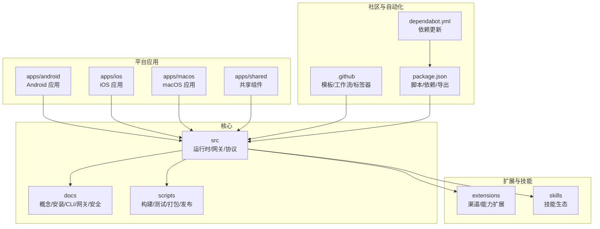
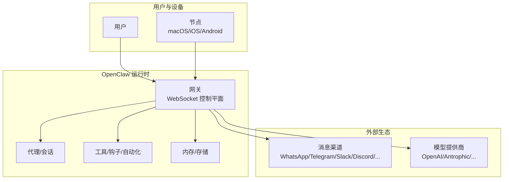
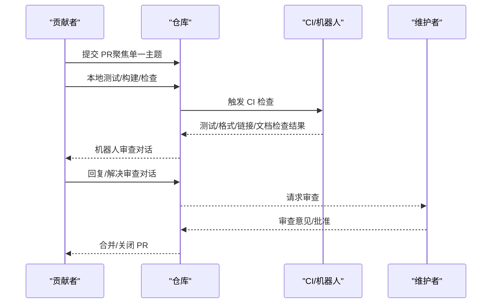
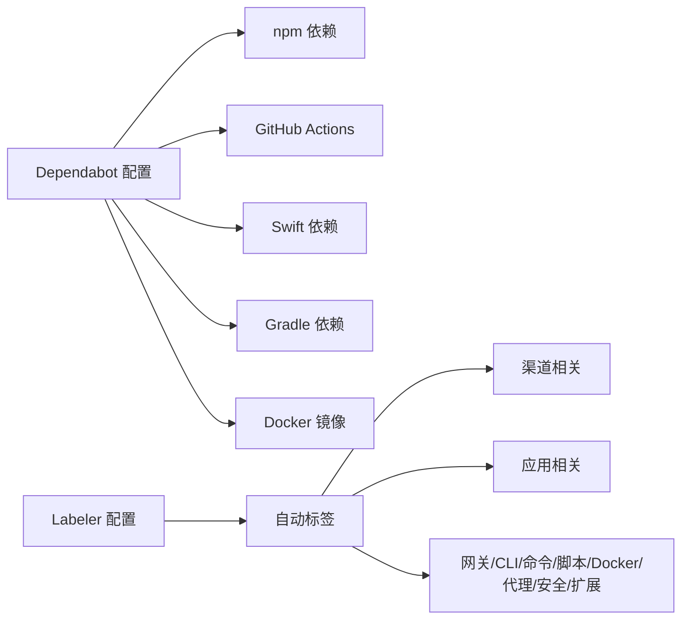

# 社区与贡献指南

<cite>
**本文档引用的文件**
- [CONTRIBUTING.md](file://CONTRIBUTING.md)
- [README.md](file://README.md)
- [VISION.md](file://VISION.md)
- [SECURITY.md](file://SECURITY.md)
- [.github/ISSUE_TEMPLATE/bug_report.yml](file://.github/ISSUE_TEMPLATE/bug_report.yml)
- [.github/ISSUE_TEMPLATE/feature_request.yml](file://.github/ISSUE_TEMPLATE/feature_request.yml)
- [.github/pull_request_template.md](file://.github/pull_request_template.md)
- [.github/labeler.yml](file://.github/labeler.yml)
- [.github/dependabot.yml](file://.github/dependabot.yml)
- [package.json](file://package.json)
</cite>

## 目录
1. [引言](#引言)
2. [项目结构](#项目结构)
3. [核心组件](#核心组件)
4. [架构总览](#架构总览)
5. [详细组件分析](#详细组件分析)
6. [依赖分析](#依赖分析)
7. [性能考虑](#性能考虑)
8. [故障排除指南](#故障排除指南)
9. [结论](#结论)
10. [附录](#附录)

## 引言
OpenClaw 是一个在用户设备上运行的个人 AI 助手，支持多通道消息集成（如 WhatsApp、Telegram、Slack、Discord、Google Chat、Signal、iMessage、BlueBubbles、IRC、Microsoft Teams、Matrix、Feishu、LINE、Mattermost、Nextcloud Talk、Nostr、Synology Chat、Tlon、Twitch、Zalo、Zalo Personal、WebChat 等），并可在 macOS/iOS/Android 上进行语音唤醒与实时画布协作。项目采用“本地优先”的安全模型，强调隐私与可控性，并通过社区驱动的方式持续演进。

本社区与贡献指南旨在帮助新老贡献者快速融入社区文化、理解贡献流程、掌握开发规范与测试要求，并明确治理结构与沟通渠道。我们倡导开放、包容、多元与平等，欢迎不同背景的人士参与开源协作。

## 项目结构
OpenClaw 采用多模块、多平台的组织方式：
- 核心运行时与网关：位于根目录下的 src、docs、scripts 等目录，负责协议、工具、会话、频道桥接与控制平面。
- 平台应用：apps 下包含 Android、iOS、macOS 应用与共享组件。
- 扩展与插件：extensions 提供各渠道与能力扩展；skills 提供技能生态。
- 文档与多语言：docs 目录覆盖概念、安装、CLI、网关、安全等主题，并提供国际化资源。
- 脚本与工具：scripts 提供构建、测试、打包、发布、沙箱与端到端测试脚本。
- 工作流与自动化：.github/workflows、dependabot.yml、labeler.yml 等实现 CI/CD、标签与依赖更新自动化。

图表来源
- [README.md:140-185](file://README.md#L140-L185)
- [package.json:217-339](file://package.json#L217-L339)

章节来源
- [README.md:140-185](file://README.md#L140-L185)
- [package.json:217-339](file://package.json#L217-L339)

## 核心组件
- 维护者团队：项目由一位“ benevolent dictator ”领导，并有多个领域维护者负责不同子系统（如 Discord、Telegram、iOS/Android、安全、UI/UX、文档等）。维护者职责包括问题分类、PR 审查、社区引导与方向把控。
- 治理与决策：维护者团队对重大变更进行审慎评估，优先保障稳定性与安全性；贡献规则强调“一次一议题”、避免超大 PR、保持 PR 的聚焦性与可回滚性。
- 社区文化：鼓励透明沟通、尊重与包容，重视用户体验与安全默认值，欢迎 AI 辅助 PR，但需保持可追溯与可验证。

章节来源
- [CONTRIBUTING.md:12-78](file://CONTRIBUTING.md#L12-L78)
- [VISION.md:34-40](file://VISION.md#L34-L40)

## 架构总览
OpenClaw 的整体架构围绕“网关控制平面 + 多平台节点 + 渠道桥接 + 插件/技能扩展”的模式展开。网关负责会话、路由、工具与事件的统一控制；平台应用作为节点执行本地动作；渠道扩展连接外部消息服务；技能与插件提供可组合的能力。

图表来源
- [README.md:185-212](file://README.md#L185-L212)
- [VISION.md:52-83](file://VISION.md#L52-L83)

章节来源
- [README.md:185-212](file://README.md#L185-L212)
- [VISION.md:52-83](file://VISION.md#L52-L83)

## 详细组件分析

### 贡献流程与代码规范
- 贡献入口
  - 小问题/修复：直接开 PR 即可。
  - 新功能/架构变更：先发起 GitHub Discussions 或在 Discord 中讨论，再决定是否进入 PR 流程。
  - 问题咨询：通过 Discord 帮助频道提问。
- PR 准备与审查
  - 在本地实例中测试；运行构建、检查与测试；必要时使用 AI 审查工具进行自审。
  - CI 必须通过；PR 需聚焦单一主题；描述“做了什么/为什么做”；回复或解决机器人审查对话后再请求复审。
  - UI/视觉变更需附带问题前后的截图。
- AI 辅助 PR
  - 明确标注 AI 辅助；说明测试程度；尽可能提供提示词或会话日志；确认理解代码；处理机器人审查对话。
- 当前焦点与路线图
  - 优先：稳定性（渠道连接边缘情况）、UX（引导向导与错误信息）、技能生态（ClawHub）、性能（令牌使用与压缩逻辑）。
  - 可通过 Issues 的“good first issue”标签寻找入门任务。

图表来源
- [CONTRIBUTING.md:85-106](file://CONTRIBUTING.md#L85-L106)
- [CONTRIBUTING.md:123-137](file://CONTRIBUTING.md#L123-L137)
- [CONTRIBUTING.md:138-148](file://CONTRIBUTING.md#L138-L148)

章节来源
- [CONTRIBUTING.md:79-106](file://CONTRIBUTING.md#L79-L106)
- [CONTRIBUTING.md:123-137](file://CONTRIBUTING.md#L123-L137)
- [CONTRIBUTING.md:138-148](file://CONTRIBUTING.md#L138-L148)

### 开发环境搭建与测试要求
- 运行时与安装
  - 推荐 Node ≥22；支持 npm/pnpm/bun；可通过 CLI 向导完成首次安装与守护进程安装。
- 从源码构建
  - 使用 pnpm 安装依赖；构建 UI 依赖；执行构建；安装向导；开发循环使用 watch 模式自动重载。
- 测试策略
  - 单元测试、端到端测试、Docker 场景测试、实时模型测试、UI 测试等多维度覆盖。
  - 提供并行测试脚本与覆盖率统计；支持 Docker 化的安装与升级 smoke 测试。
- 代码质量与格式
  - 使用 oxlint/oxfmt/markdownlint 等工具进行静态检查与格式化；Swift 侧使用 swiftlint/swiftformat。
  - 提供大量 lint 脚本，覆盖临时文件边界、随机消息路径、通道无关边界、HTTP 钩子安全等。

章节来源
- [README.md:92-111](file://README.md#L92-L111)
- [package.json:217-339](file://package.json#L217-L339)

### 问题报告与功能建议
- Bug 报告模板
  - 要求：简明摘要、可复现步骤、期望/实际行为、版本/操作系统、安装方式、模型与路由链路、配置位置与详情、日志/截图/证据、影响与严重性、附加信息。
- 功能建议模板
  - 要求：简要总结、待解决问题与现状不足、具体解决方案、替代方案对比、影响范围与证据、附加信息。

章节来源
- [.github/ISSUE_TEMPLATE/bug_report.yml:1-138](file://.github/ISSUE_TEMPLATE/bug_report.yml#L1-L138)
- [.github/ISSUE_TEMPLATE/feature_request.yml:1-71](file://.github/ISSUE_TEMPLATE/feature_request.yml#L1-L71)

### 提交规范与标签
- PR 模板
  - 摘要、变更类型、作用域、关联 Issue/PR、用户可见变化、安全影响、复现与验证、证据、人类验证、兼容性与迁移、失败恢复、风险与缓解。
- 自动标签
  - 依据变更文件自动打标签，覆盖渠道、应用、网关、文档、CLI、命令、脚本、Docker、代理、安全、扩展等类别，便于快速分流与定位。

章节来源
- [.github/pull_request_template.md:1-116](file://.github/pull_request_template.md#L1-L116)
- [.github/labeler.yml:1-259](file://.github/labeler.yml#L1-L259)

### 治理结构与维护者团队
- 维护者角色
  - 项目由一位“ benevolent dictator ”领导，另有多个领域维护者分别负责 Discord、Telegram、iOS/Android、安全、UI/UX、文档、JS 基础设施、多代理/CLI/Web 等。
- 申请成为维护者
  - 需要积极贡献记录、跨职能经验（工程/文档/社区），并具备可投入的时间与清晰的动机说明。
- 决策流程
  - 重大变更需审慎评估，优先保证安全默认与稳定性；贡献规则强调 PR 聚焦性与可维护性。

章节来源
- [CONTRIBUTING.md:12-78](file://CONTRIBUTING.md#L12-L78)
- [CONTRIBUTING.md:149-167](file://CONTRIBUTING.md#L149-L167)
- [VISION.md:34-40](file://VISION.md#L34-L40)

### 安全与漏洞报告
- 报告渠道
  - 根据受影响模块选择对应仓库；不确定时可发送邮件至 security@openclaw.ai。
- 报告要素
  - 标题、严重性评估、影响、受影响组件、技术复现、已证明影响、环境、修复建议。
- 三阶段快速分流
  - 必备要素：精确路径、版本/提交 SHA、可复现 PoC、与信任边界相关的已证明影响、明确不在“同主机/同配置”场景下依赖恶意操作员。
- 信任模型与边界
  - 强调“单用户受信任操作者”模型；不模拟多租户对抗场景；明确工具执行主机优先、沙箱与授权边界的重要性。
- Docker 与运行时安全
  - 官方镜像以非 root 用户运行；推荐只读文件系统与能力降级；Node 版本需满足安全补丁要求。

章节来源
- [SECURITY.md:5-31](file://SECURITY.md#L5-L31)
- [SECURITY.md:33-46](file://SECURITY.md#L33-L46)
- [SECURITY.md:88-102](file://SECURITY.md#L88-L102)
- [SECURITY.md:112-132](file://SECURITY.md#L112-L132)
- [SECURITY.md:246-276](file://SECURITY.md#L246-L276)

### 社区交流渠道
- 主要渠道
  - GitHub Issues/ Discussions：问题、功能建议与讨论。
  - Discord：帮助频道与社区互助。
  - Twitter/X：项目官方账号与维护者账号。
- 文档与导航
  - 项目 README 提供文档索引与常见问题链接；贡献指南与愿景文档指引贡献方向。

章节来源
- [CONTRIBUTING.md:5-11](file://CONTRIBUTING.md#L5-L11)
- [README.md:493-496](file://README.md#L493-L496)

### 致谢机制
- 贡献者展示
  - README 中展示 clawtributors 的头像墙，感谢所有贡献者的努力。
- 形式多样
  - 代码贡献、文档改进、问题反馈、功能建议、社区建设、测试与维护等均被认可与致谢。

章节来源
- [README.md:502-521](file://README.md#L502-L521)

### 包容性、多样性与平等性
- 社区原则
  - 鼓励开放、尊重与包容，欢迎来自不同背景的贡献者；重视用户体验与安全默认值。
- 行为准则
  - 贡献流程强调透明沟通、尊重与协作，维护者负责社区引导与方向把控。

章节来源
- [CONTRIBUTING.md:12-18](file://CONTRIBUTING.md#L12-L18)
- [VISION.md:34-40](file://VISION.md#L34-L40)

## 依赖分析
- 依赖更新自动化
  - Dependabot 配置按生态（npm、GitHub Actions、Swift、Gradle、Docker）分组与冷却期策略，限制同时打开的 PR 数量，确保更新节奏可控。
- 标签器
  - 基于变更文件自动为 PR/Issue 打标签，提升分流效率与责任归属清晰度。

图表来源
- [.github/dependabot.yml:13-128](file://.github/dependabot.yml#L13-L128)
- [.github/labeler.yml:1-259](file://.github/labeler.yml#L1-L259)

章节来源
- [.github/dependabot.yml:13-128](file://.github/dependabot.yml#L13-L128)
- [.github/labeler.yml:1-259](file://.github/labeler.yml#L1-L259)

## 性能考虑
- 性能与测试基础设施
  - 当前优先级包括性能优化与测试基础设施建设；提供热点分析与性能预算脚本，支持性能回归检测。
- 令牌使用与压缩逻辑
  - 优化令牌使用与上下文压缩逻辑，降低成本并提升响应速度。

章节来源
- [CONTRIBUTING.md:142-145](file://CONTRIBUTING.md#L142-L145)
- [package.json:328-329](file://package.json#L328-L329)

## 故障排除指南
- 常见问题与诊断
  - 使用安全审计命令与深度扫描；关注临时目录边界与媒体处理的安全约束；严格控制工具文件系统访问范围。
- 网关与节点信任边界
  - Gateway 与 Node 属于同一操作者信任边界；执行审批（allowlist/弹窗）是操作者护栏，而非多租户授权边界。
- 文档与工具
  - 通过文档索引与 CLI doctor 命令获取诊断信息；遵循安全指南与部署假设，避免公共互联网暴露。

章节来源
- [SECURITY.md:207-244](file://SECURITY.md#L207-L244)
- [README.md:415-431](file://README.md#L415-L431)

## 结论
OpenClaw 以“本地优先、安全默认、社区驱动”为核心理念，通过清晰的贡献流程、完善的测试与安全策略、以及包容性的社区文化，为全球贡献者提供了参与开源协作的良好平台。我们鼓励更多人加入，共同打造更稳定、更易用、更强大的个人 AI 助手生态。

## 附录
- 快速链接
  - 项目主页与文档索引、Discord、Twitter/X、GitHub Issues/ Discussions、安全报告邮箱。
- 维护者联系方式
  - 通过贡献指南中的邮箱与社交账号联系维护者团队。

章节来源
- [CONTRIBUTING.md:5-11](file://CONTRIBUTING.md#L5-L11)
- [CONTRIBUTING.md:149-167](file://CONTRIBUTING.md#L149-L167)