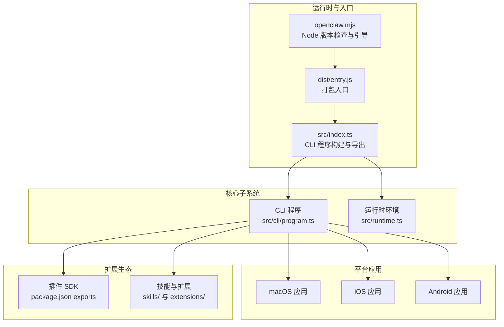
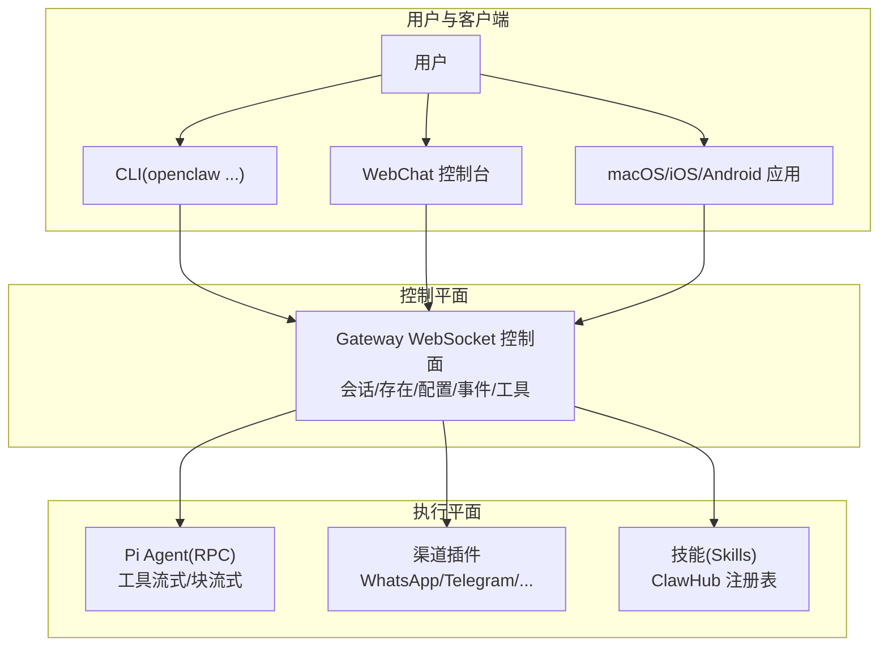
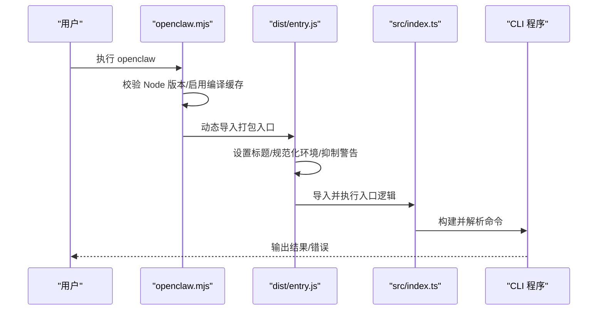
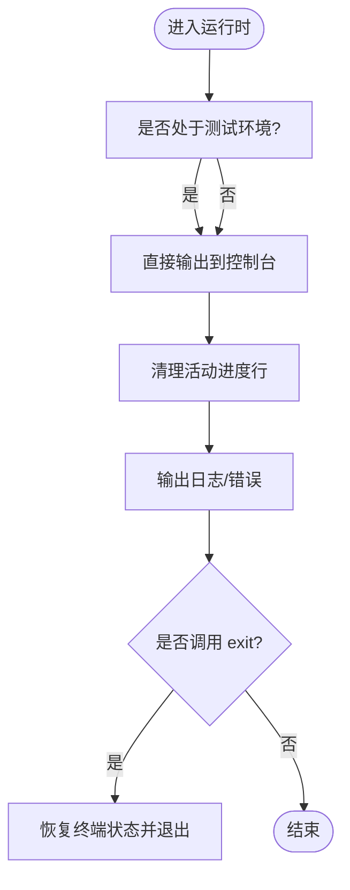
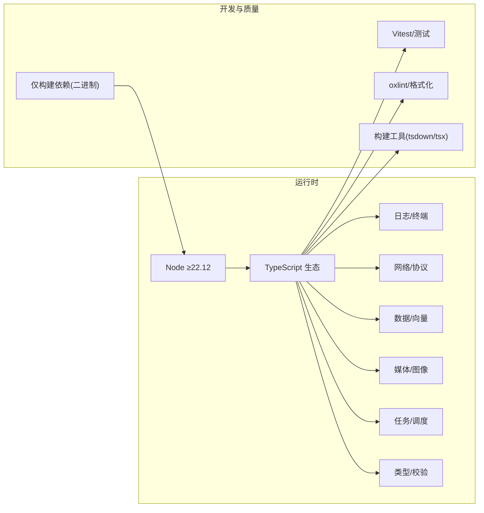

# 项目概述

<cite>
**本文引用的文件**
- [README.md](file://README.md)
- [VISION.md](file://VISION.md)
- [package.json](file://package.json)
- [src/index.ts](file://src/index.ts)
- [src/entry.ts](file://src/entry.ts)
- [openclaw.mjs](file://openclaw.mjs)
- [src/runtime.ts](file://src/runtime.ts)
- [src/cli/program.ts](file://src/cli/program.ts)
</cite>

## 目录
1. [引言](#引言)
2. [项目结构](#项目结构)
3. [核心组件](#核心组件)
4. [架构总览](#架构总览)
5. [详细组件分析](#详细组件分析)
6. [依赖关系分析](#依赖关系分析)
7. [性能考量](#性能考量)
8. [故障排查指南](#故障排查指南)
9. [结论](#结论)
10. [附录](#附录)

## 引言
OpenClaw 是一个“本地运行”的个人 AI 助手系统，强调隐私、安全与可操作性：它在你的设备上运行，在你常用的即时通讯渠道中工作，并由你制定规则。其核心价值主张是：
- 本地优先：数据与执行尽可能留在本地，降低外泄风险
- 多渠道集成：覆盖主流 IM 渠道（如 WhatsApp、Telegram、Discord、Slack、Google Chat、Signal、iMessage/BlueBubbles、IRC、Microsoft Teams、Matrix、Feishu、LINE、Mattermost、Nextcloud Talk、Nostr、Synology Chat、Tlon、Twitch、Zalo、Zalo Personal 等），并支持 WebChat
- 本地代理运行时：通过“Pi agent”以 RPC 模式运行，具备工具流式输出与块流式输出能力
- 跨平台支持：终端驱动（CLI）+ 守护进程（Gateway）+ 多端应用（macOS/iOS/Android 节点）
- 可扩展生态：插件 SDK、技能（Skills）与 ClawHub 注册表

使命与愿景：OpenClaw 致力于成为“真正能做事”的 AI 助手，既尊重隐私与安全，又保持强大与灵活。当前优先级聚焦在安全与稳定、首次体验与安装可靠性；后续将逐步完善模型提供商支持、消息渠道覆盖、性能与测试基础设施、计算机操作与代理能力、以及前端与 CLI 的工程化体验。

目标用户与场景：
- 希望在本地掌控 AI 助手的个人用户
- 需要跨渠道统一入口的团队或个人
- 对隐私与安全有高要求的开发者与企业用户
- 希望在多平台上进行“节点式”本地操作（如屏幕录制、相机拍照、通知、系统命令等）的用户

## 项目结构
从仓库组织看，OpenClaw 采用多模块、多语言混合的结构：
- 核心 CLI 与运行时：TypeScript 实现，入口位于 openclaw.mjs → dist/entry → src/index.ts
- 平台应用：macOS/iOS/Android 通过 Swift/ObjC/SwiftUI 与原生能力集成
- 插件与技能：TypeScript 扩展（extensions 与 skills）
- 文档与国际化：docs 下大量概念、安装、平台与工具文档
- 测试与脚本：Vitest、脚本工具链与 CI 工作流

图表来源
- [openclaw.mjs:1-90](file://openclaw.mjs#L1-L90)
- [src/entry.ts:1-195](file://src/entry.ts#L1-L195)
- [src/index.ts:1-94](file://src/index.ts#L1-L94)
- [src/cli/program.ts:1-3](file://src/cli/program.ts#L1-L3)
- [src/runtime.ts:1-54](file://src/runtime.ts#L1-L54)
- [package.json:37-216](file://package.json#L37-L216)

章节来源
- [README.md:21-27](file://README.md#L21-L27)
- [package.json:16-34](file://package.json#L16-L34)

## 核心组件
- CLI 与程序入口
  - openclaw.mjs：Node 版本校验、编译缓存启用、动态导入 dist/entry
  - src/entry.ts：进程标题设置、环境规范化、实验性警告抑制、帮助/版本快速路径、运行 CLI 主流程
  - src/index.ts：加载 dotenv、环境标准化、路径与端口检查、构建 CLI 程序并解析参数
- 运行时与日志
  - src/runtime.ts：统一的日志/错误输出与退出处理，支持测试场景下的非退出模式
- 插件与扩展
  - package.json 的 exports 字段导出各渠道插件 SDK，便于按需引入与类型提示
- 平台应用
  - macOS/iOS/Android 通过节点模式与 Gateway 通信，实现本地能力调用（如系统命令、通知、Canvas、相机、屏幕录制等）

章节来源
- [openclaw.mjs:1-90](file://openclaw.mjs#L1-L90)
- [src/entry.ts:1-195](file://src/entry.ts#L1-L195)
- [src/index.ts:1-94](file://src/index.ts#L1-L94)
- [src/runtime.ts:1-54](file://src/runtime.ts#L1-L54)
- [package.json:37-216](file://package.json#L37-L216)

## 架构总览
OpenClaw 的核心是“网关（Gateway）+ 代理（Pi Agent）+ 多端节点（Nodes）+ 渠道插件（Plugins）+ 技能（Skills）”。其典型交互如下：

图表来源
- [README.md:185-202](file://README.md#L185-L202)
- [README.md:144-176](file://README.md#L144-L176)

章节来源
- [README.md:185-202](file://README.md#L185-L202)
- [README.md:144-176](file://README.md#L144-L176)

## 详细组件分析

### CLI 入口与启动流程
- openclaw.mjs：确保 Node 版本满足最低要求，启用模块编译缓存，尝试导入 dist/entry
- src/entry.ts：设置进程标题、规范化环境、抑制实验性警告、处理帮助/版本快速路径、解析 CLI 参数并运行主流程
- src/index.ts：加载 dotenv、环境标准化、路径与端口检查、构建 CLI 程序并解析参数

图表来源
- [openclaw.mjs:1-90](file://openclaw.mjs#L1-L90)
- [src/entry.ts:1-195](file://src/entry.ts#L1-L195)
- [src/index.ts:1-94](file://src/index.ts#L1-L94)

章节来源
- [openclaw.mjs:1-90](file://openclaw.mjs#L1-L90)
- [src/entry.ts:1-195](file://src/entry.ts#L1-L195)
- [src/index.ts:1-94](file://src/index.ts#L1-L94)

### 运行时与日志
- 统一日志/错误输出：在运行时环境中封装 console.log/error，避免进度条状态干扰
- 优雅退出：默认运行时在 exit 时恢复终端状态；测试场景可切换为抛错而非退出，便于断言

图表来源
- [src/runtime.ts:21-44](file://src/runtime.ts#L21-L44)

章节来源
- [src/runtime.ts:1-54](file://src/runtime.ts#L1-L54)

### 插件 SDK 与导出
- package.json 的 exports 字段为各渠道插件 SDK 提供命名导出，便于在 TypeScript 中按需引入与获得类型提示
- 典型导出包括：plugin-sdk、plugin-sdk/core、plugin-sdk/telegram、plugin-sdk/discord、plugin-sdk/slack、plugin-sdk/signal、plugin-sdk/imessage、plugin-sdk/whatsapp、plugin-sdk/line、plugin-sdk/msteams、plugin-sdk/acpx、plugin-sdk/bluebubbles、plugin-sdk/copilot-proxy、plugin-sdk/device-pair、plugin-sdk/diagnostics-otel、plugin-sdk/diffs、plugin-sdk/feishu、plugin-sdk/google-gemini-cli-auth、plugin-sdk/googlechat、plugin-sdk/irc、plugin-sdk/llm-task、plugin-sdk/lobster、plugin-sdk/matrix、plugin-sdk/mattermost、plugin-sdk/memory-core、plugin-sdk/memory-lancedb、plugin-sdk/minimax-portal-auth、plugin-sdk/nextcloud-talk、plugin-sdk/nostr、plugin-sdk/open-prose、plugin-sdk/phone-control、plugin-sdk/qwen-portal-auth、plugin-sdk/synology-chat、plugin-sdk/talk-voice、plugin-sdk/test-utils、plugin-sdk/thread-ownership、plugin-sdk/tlon、plugin-sdk/twitch、plugin-sdk/voice-call、plugin-sdk/zalo、plugin-sdk/zalouser、plugin-sdk/account-id、plugin-sdk/keyed-async-queue、cli-entry

章节来源
- [package.json:37-216](file://package.json#L37-L216)

## 依赖关系分析
- 运行时与工具
  - Node ≥ 22.12（引擎声明）
  - TypeScript 生态：Vitest、oxlint、tsdown、tsx
  - 日志与终端：chalk、tslog、osc-progress
  - 网络与协议：ws、hono、undici、@agentclientprotocol/sdk
  - 数据与向量：sqlite-vec
  - 媒体与图像：sharp、pdfjs-dist、@mozilla/readability
  - 任务与调度：croner
  - 类型与校验：@sinclair/typebox、ajv、zod
  - 平台与原生：@napi-rs/canvas、node-llama-cpp（peer）
- 开发与质量
  - 仅构建依赖：@mariozechner/pi-agent-core、@mariozechner/pi-ai、@mariozechner/pi-coding-agent、@mariozechner/pi-tui 等
  - 依赖覆盖与最小发布年龄策略：通过 pnpm overrides 与 onlyBuiltDependencies 管理二进制依赖

图表来源
- [package.json:422-464](file://package.json#L422-L464)
- [package.json:340-395](file://package.json#L340-L395)
- [package.json:396-417](file://package.json#L396-L417)

章节来源
- [package.json:422-464](file://package.json#L422-L464)
- [package.json:340-395](file://package.json#L340-L395)
- [package.json:396-417](file://package.json#L396-L417)

## 性能考量
- 启动与编译缓存：入口阶段启用模块编译缓存，减少重复编译开销
- 快速路径：帮助与版本查询走快速路径，避免完整 CLI 初始化
- 进程与终端：运行时在输出前清理进度行，避免终端状态异常；退出时恢复终端状态
- 二进制依赖：通过 onlyBuiltDependencies 与 overrides 精准管理二进制依赖，降低安装与运行成本

章节来源
- [openclaw.mjs:38-45](file://openclaw.mjs#L38-L45)
- [src/entry.ts:168-193](file://src/entry.ts#L168-L193)
- [src/runtime.ts:10-44](file://src/runtime.ts#L10-L44)
- [package.json:443-455](file://package.json#L443-L455)

## 故障排查指南
- 端口占用与权限
  - 确保端口可用，必要时强制释放或更换端口
  - 端口被占用时的错误描述与处理流程
- 环境与路径
  - 确保 CLI 在 PATH 中，环境变量已规范化
  - 使用 dotenv 加载环境变量，避免敏感信息泄露
- 运行时异常
  - 未捕获异常与未处理拒绝会被统一捕获并记录，随后优雅退出
- 安全与权限
  - 默认对未知发送者采用配对策略，避免未经允许的消息触发
  - macOS 节点能力通过 Gateway 协议暴露，需要用户授权（如屏幕录制、通知等）

章节来源
- [src/index.ts:24-29](file://src/index.ts#L24-L29)
- [src/index.ts:36-38](file://src/index.ts#L36-L38)
- [src/index.ts:84-92](file://src/index.ts#L84-L92)
- [README.md:112-125](file://README.md#L112-L125)
- [README.md:240-254](file://README.md#L240-L254)

## 结论
OpenClaw 以“本地优先、隐私安全、多渠道集成、跨平台协同”为核心，通过 CLI + Gateway + Pi Agent + Nodes + 插件/技能的分层架构，提供了从个人到团队均可落地的智能助手方案。当前重点在于安全与稳定性、首次体验与安装可靠性，未来将持续扩展模型与渠道支持、提升性能与测试体系，并优化工程化体验与跨平台应用。

## 附录
- 快速开始与升级参考：README 中的“Quick start”“Updating”“Getting started”
- 安装与开发通道：README 中的“Install”“Development channels”“From source”
- 安全与合规：README 中的“Security defaults”“Security”“Gateway security”
- 平台与生态：README 中的“Platforms”“Plugins”“Skills registry (ClawHub)”
- 视野与路线：VISION.md 中的“Vision”“Security”“Plugins & Memory”“Setup”“Why TypeScript?”“What We Will Not Merge”

章节来源
- [README.md:50-111](file://README.md#L50-L111)
- [README.md:112-184](file://README.md#L112-L184)
- [README.md:185-492](file://README.md#L185-L492)
- [VISION.md:11-111](file://VISION.md#L11-L111)